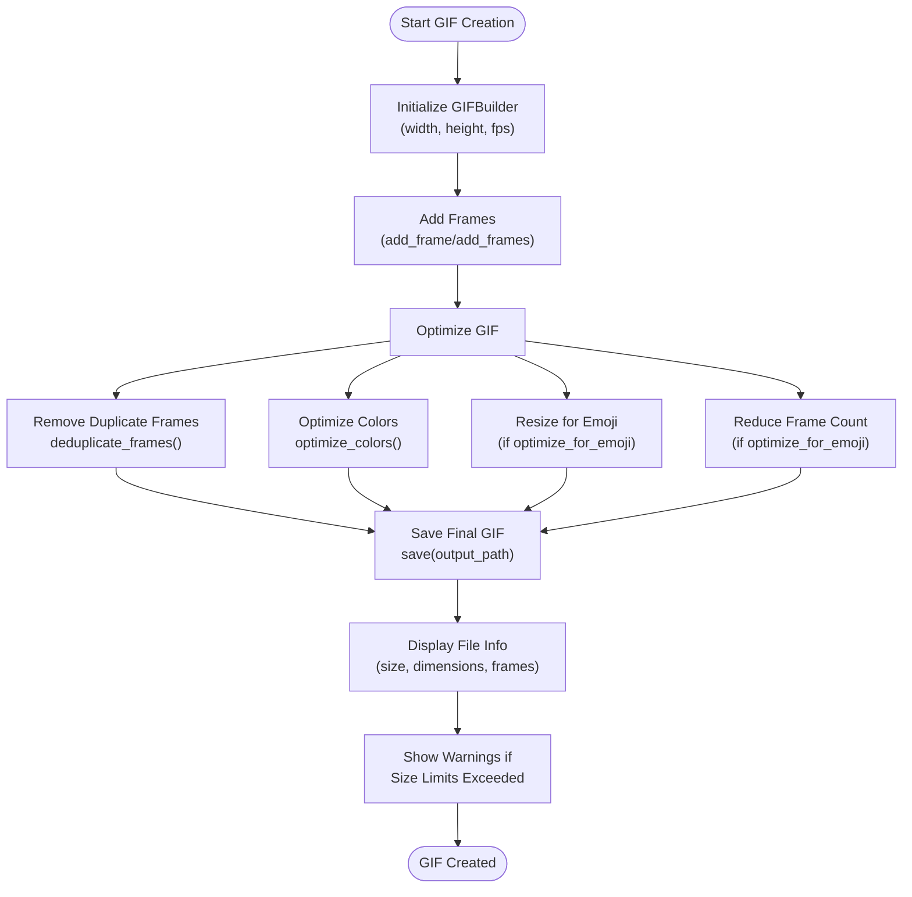
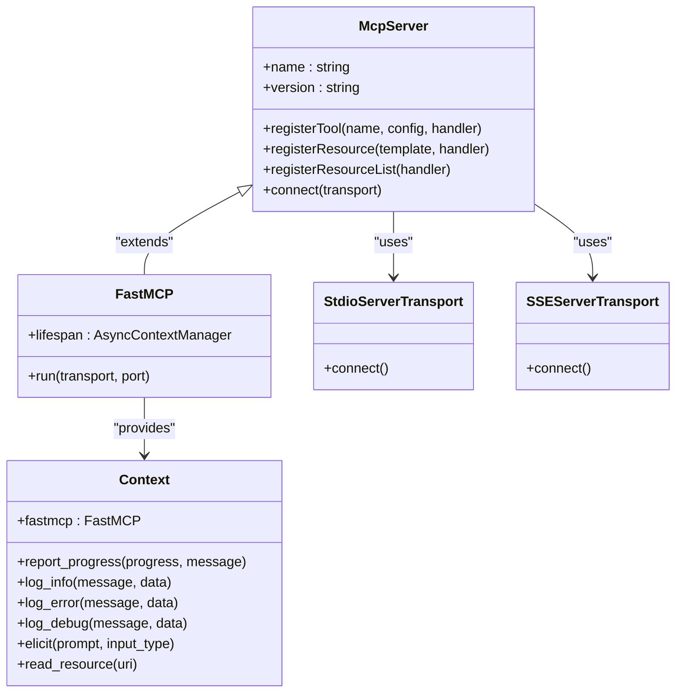
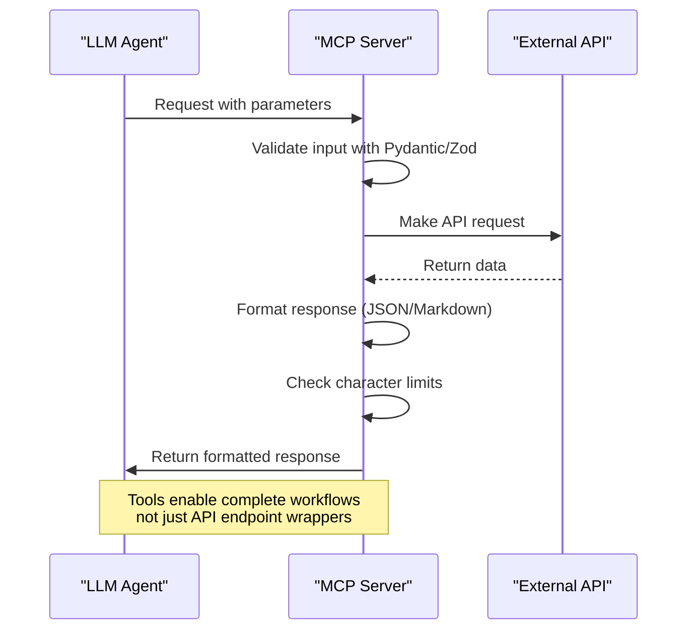
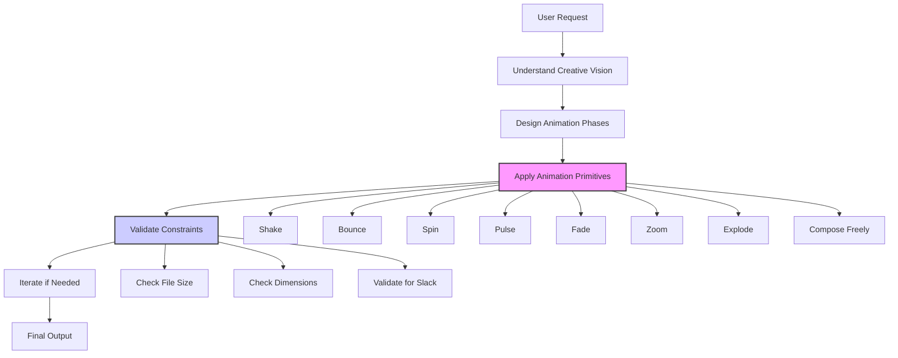

# Advanced Topics

<cite>
**Referenced Files in This Document**   
- [README.md](file://README.md)
- [agent_skills_spec.md](file://agent_skills_spec.md)
- [algorithmic-art/SKILL.md](file://algorithmic-art/SKILL.md)
- [slack-gif-creator/SKILL.md](file://slack-gif-creator/SKILL.md)
- [mcp-builder/SKILL.md](file://mcp-builder/SKILL.md)
- [document-skills/pdf/SKILL.md](file://document-skills/pdf/SKILL.md)
- [document-skills/docx/SKILL.md](file://document-skills/docx/SKILL.md)
- [mcp-builder/reference/python_mcp_server.md](file://mcp-builder/reference/python_mcp_server.md)
- [mcp-builder/reference/node_mcp_server.md](file://mcp-builder/reference/node_mcp_server.md)
- [slack-gif-creator/core/gif_builder.py](file://slack-gif-creator/core/gif_builder.py)
- [slack-gif-creator/core/validators.py](file://slack-gif-creator/core/validators.py)
- [slack-gif-creator/templates/bounce.py](file://slack-gif-creator/templates/bounce.py)
</cite>

## Table of Contents
1. [Introduction](#introduction)
2. [Custom Skill Development Beyond Templates](#custom-skill-development-beyond-templates)
3. [Performance Optimization for Computationally Intensive Skills](#performance-optimization-for-computationally-intensive-skills)
4. [Robust Error Handling Patterns](#robust-error-handling-patterns)
5. [Security Considerations for Sensitive Data](#security-considerations-for-sensitive-data)
6. [Advanced Configuration and Extension Points](#advanced-configuration-and-extension-points)
7. [Scalability and Organization of Large Skill Sets](#scalability-and-organization-of-large-skill-sets)
8. [Integration with External Systems via MCP Servers](#integration-with-external-systems-via-mcp-servers)
9. [Backward Compatibility and Versioning](#backward-compatibility-and-versioning)
10. [Real-World Examples from Complex Skills](#real-world-examples-from-complex-skills)

## Introduction
This document provides comprehensive guidance on advanced topics in skill development and deployment within the Agent Skills framework. It covers sophisticated development techniques, performance optimization, error handling, security, configuration, scalability, and integration patterns. The content is based on real-world examples from the skills repository, showcasing how to build robust, efficient, and secure skills that extend Claude's capabilities for specialized tasks. The document addresses both the technical implementation details and strategic considerations for creating high-quality skills that can handle complex workflows and integrate with external systems.

## Custom Skill Development Beyond Templates
Developing custom skills beyond basic templates requires a deep understanding of the underlying architecture and creative application of available tools. The `algorithmic-art` skill demonstrates this by implementing a two-phase process: first creating an algorithmic philosophy that defines the computational aesthetic, then expressing it through code. This approach emphasizes process over product, where beauty emerges from the algorithm's execution rather than static composition. The skill uses a template-based approach with `templates/viewer.html` as a fixed foundation, ensuring consistent UI/UX while allowing complete freedom in the algorithmic implementation. This pattern enables developers to focus on the creative aspects of generative art while maintaining professional presentation standards. The philosophy creation phase involves writing a manifesto for a generative art movement that emphasizes computational processes, emergent behavior, and mathematical beauty, guiding the subsequent implementation.

**Section sources**
- [algorithmic-art/SKILL.md](file://algorithmic-art/SKILL.md)

## Performance Optimization for Computationally Intensive Skills
Performance optimization is critical for computationally intensive skills, particularly those involving media processing or complex algorithms. The `slack-gif-creator` skill implements several optimization strategies to ensure GIFs meet Slack's strict size constraints. The `GIFBuilder` class includes methods for color optimization, frame deduplication, and aggressive compression for emoji-sized GIFs. The `optimize_colors` method reduces colors in all frames using quantization with a global palette for better compression. The `deduplicate_frames` method removes duplicate or near-duplicate consecutive frames, significantly reducing file size. For emoji optimization, the system automatically resizes frames to 128x128 pixels and reduces frame count to approximately 12 frames. These optimizations are applied during the `save` method, which also provides detailed feedback on file size, dimensions, and other metrics, helping developers understand the impact of their optimizations.

**Diagram sources **
- [slack-gif-creator/core/gif_builder.py](file://slack-gif-creator/core/gif_builder.py)

## Robust Error Handling Patterns
Robust error handling is essential for creating reliable skills that can gracefully handle unexpected conditions. The MCP server framework emphasizes designing actionable error messages that guide agents toward correct usage patterns. Error messages should be educational, suggesting specific next steps rather than just being diagnostic. For example, instead of simply stating "Invalid parameters," an error message might suggest "Try using filter='active_only' to reduce results." The framework also recommends implementing comprehensive error handling for all external calls, with specific exception types for different error scenarios. The Python MCP server implementation uses a centralized `_handle_api_error` function that provides consistent error formatting across all tools, handling HTTP status errors, timeout exceptions, and other common issues. This approach ensures that error messages are clear, actionable, and help agents learn proper tool usage through feedback.

**Section sources**
- [mcp-builder/SKILL.md](file://mcp-builder/SKILL.md)
- [mcp-builder/reference/python_mcp_server.md](file://mcp-builder/reference/python_mcp_server.md)

## Security Considerations for Sensitive Data
Security considerations are paramount when handling sensitive data in skills, particularly when integrating with external systems. The MCP server framework addresses security through several mechanisms, including secure authentication, input validation, and context-aware operations. When implementing tools that require sensitive information, the framework supports context parameter injection, allowing tools to request additional input from users through the `ctx.elicit` method. This enables secure handling of credentials and other sensitive data without exposing them in the tool's parameters. The framework also emphasizes the importance of proper input validation using Pydantic models (Python) or Zod schemas (TypeScript), which automatically handle input validation with constraints like min/max length, regex patterns, and value ranges. Additionally, the framework recommends implementing rate limiting and proper authentication/authorization checks to prevent abuse and unauthorized access.

**Section sources**
- [mcp-builder/reference/python_mcp_server.md](file://mcp-builder/reference/python_mcp_server.md)
- [mcp-builder/reference/node_mcp_server.md](file://mcp-builder/reference/node_mcp_server.md)

## Advanced Configuration and Extension Points
The skills framework provides several advanced configuration options and extension points that enable developers to create sophisticated, flexible skills. The MCP server framework supports multiple transport options, including stdio, HTTP, and SSE (Server-Sent Events), allowing servers to be deployed in different environments and support various client types. The framework also supports resource registration, which exposes data as resources for efficient, template-based access. This is particularly useful for static or semi-static data that doesn't require complex parameters. The Python FastMCP framework supports context parameter injection, enabling tools to access advanced capabilities like logging, progress reporting, resource reading, and user interaction. Additionally, the framework supports lifespan management through async context managers, allowing initialization of resources that persist across requests, such as database connections or configuration loading.

**Diagram sources **
- [mcp-builder/reference/python_mcp_server.md](file://mcp-builder/reference/python_mcp_server.md)
- [mcp-builder/reference/node_mcp_server.md](file://mcp-builder/reference/node_mcp_server.md)

## Scalability and Organization of Large Skill Sets
Managing large numbers of skills requires thoughtful organization and discovery strategies to maintain scalability and usability. The skills repository demonstrates a modular approach, with each skill contained in its own directory and following a consistent structure. This organization enables easy discovery and management of skills, with clear separation of concerns between different capabilities. The framework supports meta-skills like `skill-creator` and `template-skill` that help developers create new skills consistently. For large organizations, skills can be grouped by domain (e.g., creative, technical, enterprise) or by function, making them easier to discover and use. The repository also includes a `THIRD_PARTY_NOTICES.md` file to manage dependencies and licensing information, which is essential for maintaining compliance when scaling to many skills. Additionally, the use of standardized naming conventions and metadata helps with skill discovery and integration.

**Section sources**
- [README.md](file://README.md)
- [agent_skills_spec.md](file://agent_skills_spec.md)

## Integration with External Systems via MCP Servers
Integration with external systems via MCP servers is a powerful capability that enables LLMs to interact with APIs and services. The MCP server framework provides a structured approach to building high-quality servers that enable LLMs to accomplish real-world tasks. The process involves four main phases: deep research and planning, implementation, review and refinement, and evaluation creation. During the planning phase, developers must understand agent-centric design principles, study the MCP protocol documentation, and exhaustively research the target API. The implementation phase follows language-specific best practices, with Python using FastMCP and Pydantic models, and Node/TypeScript using the MCP SDK with Zod schemas. The framework emphasizes building for workflows rather than just API endpoints, consolidating related operations into high-impact tools that enable complete tasks. This approach ensures that the resulting MCP server provides maximum value to the LLM by enabling it to accomplish meaningful workflows.

**Diagram sources **
- [mcp-builder/SKILL.md](file://mcp-builder/SKILL.md)
- [mcp-builder/reference/python_mcp_server.md](file://mcp-builder/reference/python_mcp_server.md)

## Backward Compatibility and Versioning
Maintaining backward compatibility and proper versioning is essential for ensuring that skills continue to work as they evolve. The MCP server framework addresses this through several mechanisms, including careful tool naming conventions, consistent response formats, and deprecation strategies. Tool names should be stable and descriptive, avoiding version numbers or dates that could become outdated. When changes are necessary, the framework recommends adding new tools rather than modifying existing ones, preserving backward compatibility. The framework also supports multiple response formats (JSON and Markdown), allowing developers to evolve the machine-readable format without breaking existing integrations that rely on the human-readable format. Additionally, the use of standardized input validation models (Pydantic for Python, Zod for TypeScript) ensures that changes to input parameters are handled gracefully, with clear error messages when invalid parameters are provided.

**Section sources**
- [mcp-builder/reference/python_mcp_server.md](file://mcp-builder/reference/python_mcp_server.md)
- [mcp-builder/reference/node_mcp_server.md](file://mcp-builder/reference/node_mcp_server.md)

## Real-World Examples from Complex Skills
Real-world examples from complex skills in the repository illustrate the application of advanced concepts in practice. The `slack-gif-creator` skill demonstrates a toolkit approach, providing validators for Slack's constraints, composable animation primitives, and helper utilities. This modular design allows developers to apply these tools creatively to achieve their vision while ensuring technical compliance. The skill includes a comprehensive set of animation primitives like shake, bounce, spin, pulse, fade, zoom, and explode, which can be freely composed to create complex animations. The `document-skills` demonstrate advanced patterns for working with complex file formats and binary data, with specialized skills for DOCX, PDF, PPTX, and XLSX files. These skills show how to handle document structure, formatting preservation, tracked changes, and text extraction, providing a reference for developing skills that work with binary file formats.

**Diagram sources **
- [slack-gif-creator/SKILL.md](file://slack-gif-creator/SKILL.md)
- [slack-gif-creator/core/validators.py](file://slack-gif-creator/core/validators.py)