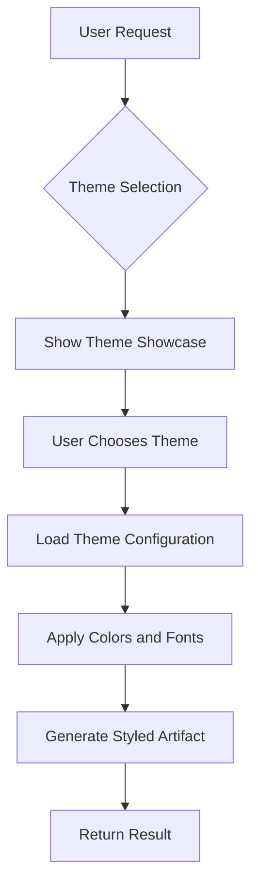
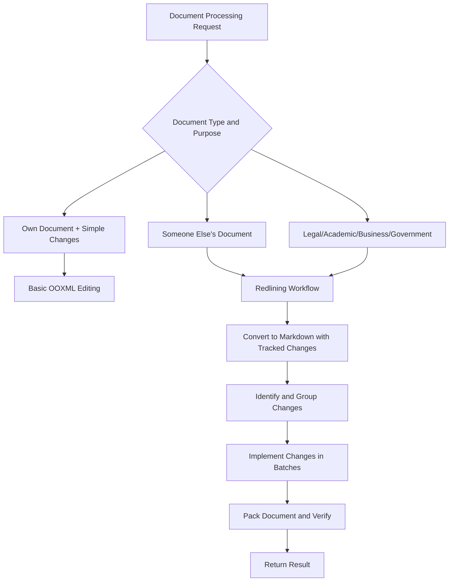
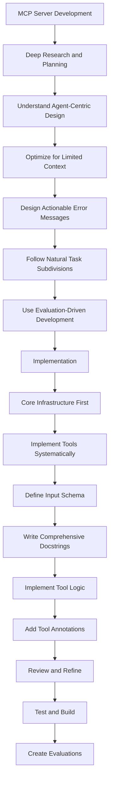

# Configuration-Driven Behavior

<cite>
**Referenced Files in This Document**   
- [theme-factory/SKILL.md](file://theme-factory/SKILL.md)
- [theme-factory/themes/arctic-frost.md](file://theme-factory/themes/arctic-frost.md)
- [theme-factory/themes/ocean-depths.md](file://theme-factory/themes/ocean-depths.md)
- [document-skills/docx/SKILL.md](file://document-skills/docx/SKILL.md)
- [document-skills/pptx/SKILL.md](file://document-skills/pptx/SKILL.md)
- [mcp-builder/SKILL.md](file://mcp-builder/SKILL.md)
- [skill-creator/SKILL.md](file://skill-creator/SKILL.md)
- [canvas-design/SKILL.md](file://canvas-design/SKILL.md)
</cite>

## Table of Contents
1. [Introduction](#introduction)
2. [Core Configuration Mechanism](#core-configuration-mechanism)
3. [Theme Factory: Declarative Theme Selection](#theme-factory-declarative-theme-selection)
4. [Document Skills: Format Preservation Configuration](#document-skills-format-preservation-configuration)
5. [MCP Builder: Advanced Configuration Patterns](#mcp-builder-advanced-configuration-patterns)
6. [Execution Flow and Resource Selection](#execution-flow-and-resource-selection)
7. [Output Generation and Behavior Control](#output-generation-and-behavior-control)
8. [Common Configuration Issues](#common-configuration-issues)
9. [Best Practices for Configuration Design](#best-practices-for-configuration-design)
10. [Conclusion](#conclusion)

## Introduction

Configuration-driven behavior is a fundamental architectural pattern in the skills ecosystem, enabling flexible, maintainable, and user-friendly functionality without requiring code changes. This approach leverages declarative configuration, primarily through YAML frontmatter in SKILL.md files and associated configuration files, to control skill behavior, parameters, and constraints. By separating configuration from implementation, skills can adapt to different use cases and requirements through simple configuration updates rather than complex code modifications.

This document explores how configuration-driven behavior works across various skills, focusing on specific examples like the theme-factory's theme selection system and document-skills' format preservation settings. We'll examine how configuration affects execution flow, resource selection, and output generation, providing insights into designing effective configuration schemas and handling common configuration issues.

**Section sources**
- [theme-factory/SKILL.md](file://theme-factory/SKILL.md#L1-L60)
- [document-skills/docx/SKILL.md](file://document-skills/docx/SKILL.md#L1-L197)

## Core Configuration Mechanism

The foundation of configuration-driven behavior in this ecosystem is the YAML frontmatter in SKILL.md files. This frontmatter contains essential metadata that defines the skill's identity and behavior parameters. The configuration mechanism enables skills to be self-contained units of functionality that can be easily understood, discovered, and used by the system.

The YAML frontmatter typically includes required fields such as `name` and `description`, which determine when and how the skill should be used. The `name` field provides a unique identifier for the skill, while the `description` offers a concise explanation of the skill's purpose and appropriate use cases. This metadata-driven approach allows the system to intelligently select and apply skills based on the user's request and context.

Beyond the basic metadata, configuration can extend to detailed behavior parameters and constraints defined within the SKILL.md body or in associated configuration files. This hierarchical configuration approach enables both high-level skill selection and fine-grained behavior control, creating a flexible system that can adapt to diverse requirements without code changes.

**Section sources**
- [skill-creator/SKILL.md](file://skill-creator/SKILL.md#L1-L210)
- [mcp-builder/SKILL.md](file://mcp-builder/SKILL.md#L1-L329)

## Theme Factory: Declarative Theme Selection

The theme-factory skill exemplifies configuration-driven behavior through its theme selection system. This skill provides a curated collection of professional themes, each defined by a declarative configuration that specifies color palettes, typography, and usage guidelines. The configuration approach enables users to apply consistent, professional styling to various artifacts without requiring design expertise or code modifications.

Each theme is defined in a separate Markdown file within the `themes/` directory, following a standardized configuration structure. The configuration includes a color palette with named colors and hex codes, typography specifications for headers and body text, and guidance on appropriate use cases. For example, the Arctic Frost theme configuration specifies a cool, winter-inspired palette with Ice Blue (#d4e4f7), Steel Blue (#4a6fa5), Silver (#c0c0c0), and Crisp White (#fafafa), paired with DejaVu Sans typography.

The execution flow begins with the user selecting a theme from the available options, which are presented in a visual showcase. Once a theme is selected, the system reads the corresponding theme configuration file and applies the specified styling parameters to the target artifact. This declarative approach ensures consistency across applications and allows for easy updates or additions to the theme library without modifying the core theme-factory implementation.

**Diagram sources**
- [theme-factory/SKILL.md](file://theme-factory/SKILL.md#L1-L60)
- [theme-factory/themes/arctic-frost.md](file://theme-factory/themes/arctic-frost.md#L1-L20)

**Section sources**
- [theme-factory/SKILL.md](file://theme-factory/SKILL.md#L1-L60)
- [theme-factory/themes/arctic-frost.md](file://theme-factory/themes/arctic-frost.md#L1-L20)
- [theme-factory/themes/ocean-depths.md](file://theme-factory/themes/ocean-depths.md#L1-L20)

## Document Skills: Format Preservation Configuration

The document-skills module demonstrates sophisticated configuration-driven behavior for document processing, particularly in preserving formatting and structure during editing operations. This approach ensures that document modifications maintain professional quality and consistency, which is critical for legal, academic, and business contexts.

The configuration system in document-skills controls various aspects of document processing, including tracked changes, comments, and formatting preservation. For example, the DOCX skill uses configuration to determine whether to use basic OOXML editing or the more sophisticated redlining workflow. The redlining workflow is recommended for documents from others and required for legal, academic, business, or government documents, ensuring proper change tracking and review processes.

The configuration also governs the implementation of tracked changes, emphasizing minimal and precise edits. When implementing changes, the system only marks text that actually changes, preserving unchanged text and its original formatting. This approach maintains document integrity and makes edits easier to review. The configuration specifies that replacements should be broken into: [unchanged text] + [deletion] + [insertion] + [unchanged text], with the original run's RSID preserved for unchanged text.

**Diagram sources**
- [document-skills/docx/SKILL.md](file://document-skills/docx/SKILL.md#L1-L197)

**Section sources**
- [document-skills/docx/SKILL.md](file://document-skills/docx/SKILL.md#L1-L197)

## MCP Builder: Advanced Configuration Patterns

The mcp-builder skill showcases advanced configuration patterns for creating high-quality MCP (Model Context Protocol) servers that enable LLMs to interact with external services. This skill uses configuration to guide the development process, ensuring that MCP servers are designed with agent-centric principles and follow best practices for tool development.

The configuration-driven approach in mcp-builder spans multiple phases of MCP server development, from research and planning to implementation and evaluation. During the planning phase, the configuration guides developers to understand agent-centric design principles, optimize for limited context, design actionable error messages, and follow natural task subdivisions. These principles are encoded in the skill's configuration to ensure consistent application across different MCP server implementations.

For implementation, the configuration specifies language-specific best practices and requirements. Python implementations are guided to use Pydantic models for input validation, type hints throughout, and async/await patterns for I/O operations. Node/TypeScript implementations are directed to use Zod schemas, enable strict mode, avoid any types, and configure proper build processes. The configuration also includes annotations for tool characteristics such as readOnlyHint, destructiveHint, idempotentHint, and openWorldHint, which help agents understand how to use the tools appropriately.

**Diagram sources**
- [mcp-builder/SKILL.md](file://mcp-builder/SKILL.md#L1-L329)

**Section sources**
- [mcp-builder/SKILL.md](file://mcp-builder/SKILL.md#L1-L329)

## Execution Flow and Resource Selection

Configuration-driven behavior significantly influences execution flow and resource selection across skills. The declarative nature of configuration allows the system to make intelligent decisions about which resources to use and how to structure the execution process based on the specific requirements of each task.

In the theme-factory skill, configuration determines the execution flow by specifying which theme to apply and how to apply it. The system follows a consistent process: show the theme showcase, get user selection, read the theme configuration, and apply the specified styling. The configuration also selects the appropriate resources, such as color palettes and fonts, based on the chosen theme.

For document-skills, configuration controls the selection between different processing workflows. The system evaluates the document type, ownership, and purpose to determine whether to use basic editing or the redlining workflow. This decision affects the entire execution flow, including how changes are implemented and verified. The configuration also guides resource selection, such as choosing between pandoc for text extraction or direct XML manipulation for complex formatting.

The mcp-builder skill uses configuration to orchestrate a multi-phase development process, selecting appropriate resources and tools at each stage. During research, it directs developers to specific documentation and reference materials. During implementation, it specifies language-specific tools and libraries. This configuration-driven resource selection ensures that developers have the right tools and information at each step of the process.

**Section sources**
- [theme-factory/SKILL.md](file://theme-factory/SKILL.md#L1-L60)
- [document-skills/docx/SKILL.md](file://document-skills/docx/SKILL.md#L1-L197)
- [mcp-builder/SKILL.md](file://mcp-builder/SKILL.md#L1-L329)

## Output Generation and Behavior Control

Configuration plays a crucial role in controlling output generation and overall behavior across skills. By defining parameters and constraints in configuration files, skills can produce consistent, high-quality outputs that meet specific requirements without hardcoding these behaviors in the implementation.

In the theme-factory skill, configuration directly controls the visual characteristics of the output. The color palette and typography specifications in each theme file determine the appearance of the styled artifacts. This ensures that all outputs using a particular theme maintain a consistent visual identity, which is essential for professional presentations and documents.

For document-skills, configuration governs the preservation of formatting and structure in the output. The redlining workflow configuration ensures that tracked changes are implemented with minimal edits, preserving the original document's integrity. The configuration also controls the batching strategy for changes, grouping related modifications into manageable batches of 3-10 changes to facilitate debugging and verification.

The mcp-builder skill uses configuration to control the quality and characteristics of the generated MCP servers. Configuration specifies requirements for input validation, error handling, response formats, and tool annotations, ensuring that the resulting servers are robust, user-friendly, and effective for LLM interaction. The evaluation configuration ensures that MCP servers are tested with realistic, complex questions that verify their effectiveness.

**Section sources**
- [theme-factory/SKILL.md](file://theme-factory/SKILL.md#L1-L60)
- [document-skills/docx/SKILL.md](file://document-skills/docx/SKILL.md#L1-L197)
- [mcp-builder/SKILL.md](file://mcp-builder/SKILL.md#L1-L329)

## Common Configuration Issues

Despite the benefits of configuration-driven behavior, several common issues can arise when working with declarative configurations. Understanding these issues and their solutions is essential for maintaining reliable and effective skills.

One common issue is invalid configuration values, such as incorrect color codes, unsupported font names, or malformed YAML syntax. These errors can prevent skills from functioning correctly or produce unexpected results. To address this, skills should implement robust validation mechanisms that check configuration values before use and provide clear error messages when invalid values are detected.

Missing required fields is another frequent problem. When essential configuration parameters are omitted, skills may fail to execute or produce incomplete results. The skill-creator skill addresses this by including validation in the packaging process, checking for required fields in the YAML frontmatter and reporting errors before creating a distributable package.

Configuration drift can occur when multiple versions of a skill have inconsistent configurations, leading to unpredictable behavior. This can be mitigated by maintaining clear documentation of configuration requirements and using version control to track changes to configuration files.

Another issue is configuration complexity, where overly complex configurations become difficult to understand and maintain. This can be addressed by following the progressive disclosure design principle, keeping essential procedural instructions in the main SKILL.md file while moving detailed reference material to separate files that are loaded only when needed.

**Section sources**
- [skill-creator/SKILL.md](file://skill-creator/SKILL.md#L1-L210)
- [mcp-builder/SKILL.md](file://mcp-builder/SKILL.md#L1-L329)

## Best Practices for Configuration Design

Designing effective configuration schemas requires careful consideration of usability, maintainability, and flexibility. The following best practices can help create intuitive and robust configuration systems.

First, use clear and descriptive field names that accurately reflect their purpose. The configuration should be self-documenting as much as possible, with field names that make their function obvious to users. For example, using `color_palette` instead of `colors` provides more context about the expected content.

Second, provide comprehensive examples and documentation for configuration options. The theme-factory skill demonstrates this well by including detailed descriptions of each theme's color palette and typography, along with guidance on appropriate use cases. Examples help users understand how to use configuration options correctly and avoid common mistakes.

Third, implement validation to ensure configuration integrity. The skill-creator packaging script validates YAML frontmatter format, required fields, and description quality before creating a distributable package. This proactive validation helps catch errors early and ensures that skills meet quality standards.

Fourth, follow the principle of progressive disclosure by organizing configuration information hierarchically. Keep essential information in the main configuration file while moving detailed reference material to separate files. This approach keeps the main configuration lean and focused while making detailed information available when needed.

Fifth, design configurations to be extensible and forward-compatible. Use flexible data structures that can accommodate future additions without breaking existing configurations. For example, using arrays for color palettes allows for easy addition of new colors without changing the configuration structure.

Finally, consider the user experience when designing configuration interfaces. Use consistent patterns across similar skills and provide clear guidance on when and how to use different configuration options. The mcp-builder skill exemplifies this by providing detailed, step-by-step guidance for each phase of MCP server development.

**Section sources**
- [skill-creator/SKILL.md](file://skill-creator/SKILL.md#L1-L210)
- [mcp-builder/SKILL.md](file://mcp-builder/SKILL.md#L1-L329)

## Conclusion

Configuration-driven behavior is a powerful architectural pattern that enables flexibility, maintainability, and user-friendliness in the skills ecosystem. By leveraging declarative configuration through YAML frontmatter and associated configuration files, skills can adapt to diverse requirements and use cases without requiring code changes.

The examples examined in this document—theme-factory's theme selection, document-skills' format preservation, and mcp-builder's MCP server development—demonstrate how configuration can control execution flow, resource selection, and output generation. This approach allows for sophisticated functionality while maintaining simplicity and ease of use.

To maximize the benefits of configuration-driven behavior, it is essential to follow best practices for configuration design, including using clear field names, providing comprehensive examples, implementing validation, and following the principle of progressive disclosure. Addressing common issues like invalid values and missing fields through robust validation and error handling ensures reliable skill operation.

As the skills ecosystem continues to evolve, configuration-driven behavior will remain a cornerstone of its architecture, enabling rapid development, easy customization, and consistent quality across diverse applications.