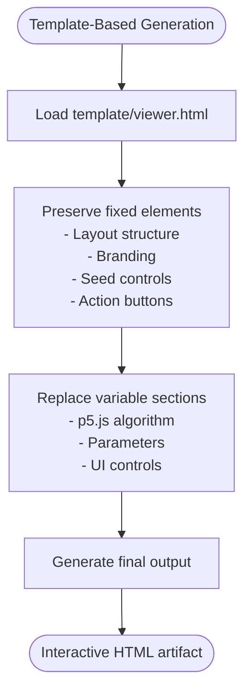
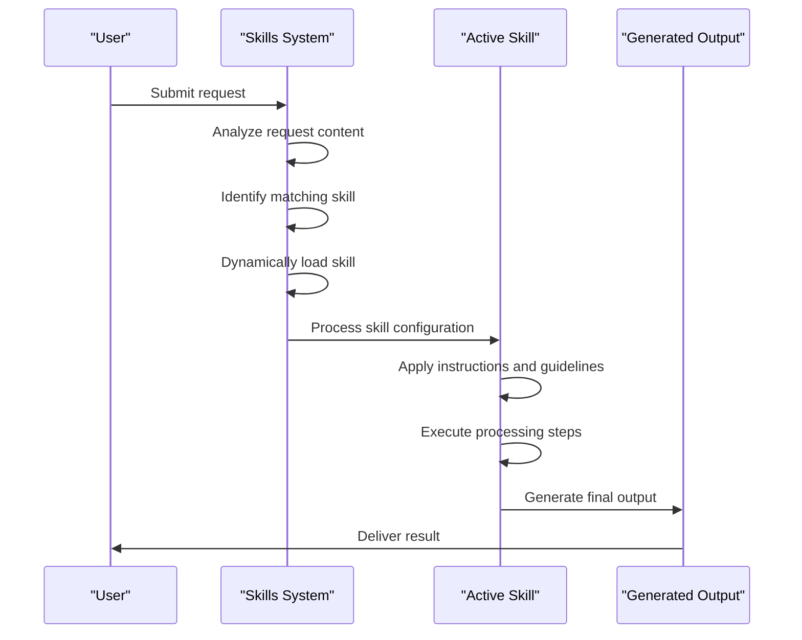
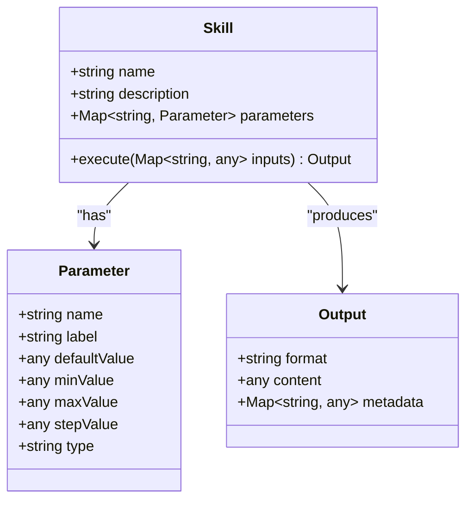

# Core Concepts

<cite>
**Referenced Files in This Document**   
- [README.md](file://README.md)
- [agent_skills_spec.md](file://agent_skills_spec.md)
- [algorithmic-art/SKILL.md](file://algorithmic-art/SKILL.md)
- [algorithmic-art/templates/viewer.html](file://algorithmic-art/templates/viewer.html)
- [algorithmic-art/templates/generator_template.js](file://algorithmic-art/templates/generator_template.js)
- [slack-gif-creator/SKILL.md](file://slack-gif-creator/SKILL.md)
- [theme-factory/SKILL.md](file://theme-factory/SKILL.md)
- [internal-comms/SKILL.md](file://internal-comms/SKILL.md)
- [document-skills/docx/SKILL.md](file://document-skills/docx/SKILL.md)
- [document-skills/pdf/SKILL.md](file://document-skills/pdf/SKILL.md)
- [document-skills/pptx/SKILL.md](file://document-skills/pptx/SKILL.md)
</cite>

## Table of Contents
1. [Introduction](#introduction)
2. [Plugin Architecture](#plugin-architecture)
3. [Dynamic Skill Loading](#dynamic-skill-loading)
4. [Template-Based Generation](#template-based-generation)
5. [Configuration-Driven Behavior](#configuration-driven-behavior)
6. [Data Flow from Request to Execution](#data-flow-from-request-to-execution)
7. [Parameterized Skills Usage Patterns](#parameterized-skills-usage-patterns)
8. [Common Issues and Troubleshooting](#common-issues-and-troubleshooting)
9. [Best Practices for Skill Development](#best-practices-for-skill-development)
10. [Conclusion](#conclusion)

## Introduction

The skills framework is built on several core architectural patterns that enable flexible, reusable, and maintainable AI capabilities. This document explores the fundamental concepts that underpin the entire system, including plugin architecture, dynamic skill loading, template-based generation, and configuration-driven behavior. These patterns work together to create a powerful ecosystem where skills can be developed, shared, and executed consistently across different contexts and use cases.

Each skill in this framework is a self-contained unit of functionality that can be dynamically loaded and executed when needed. The architecture emphasizes separation of concerns, with clear boundaries between skill definition, implementation, and execution. This design enables both rapid development of new skills and reliable execution of existing ones.

**Section sources**
- [README.md](file://README.md#L1-L123)

## Plugin Architecture

The skills framework implements a plugin architecture where each skill operates as an independent module that can be discovered and loaded dynamically. A skill is defined as a folder containing a `SKILL.md` file, which serves as the entry point and configuration for that skill. This simple structure enables easy creation and distribution of skills while maintaining consistency across the ecosystem.

The plugin architecture follows a standardized pattern defined in the Agent Skills Specification. Each skill must contain a `SKILL.md` file with YAML frontmatter that includes required fields such as `name` and `description`, along with optional fields like `license`, `allowed-tools`, and `metadata`. This standardization ensures that all skills can be processed uniformly by the system, regardless of their specific functionality.

Skills can range from simple to complex implementations. Minimal skills contain only the `SKILL.md` file, while more sophisticated skills include additional directories and files such as scripts, templates, and resources. This flexibility allows skills to encapsulate everything needed for their operation, from instructions and examples to executable code and supporting assets.

The plugin architecture enables several key benefits:
- **Discoverability**: Skills can be easily identified and cataloged based on their directory structure and metadata
- **Isolation**: Each skill operates in its own namespace, preventing conflicts between different skills
- **Reusability**: Skills can be shared and reused across different projects and contexts
- **Extensibility**: New skills can be added without modifying existing code or infrastructure

This architecture supports both official and custom skills, creating an open ecosystem where developers can extend the capabilities of the system in a standardized way.

**Section sources**
- [agent_skills_spec.md](file://agent_skills_spec.md#L1-L56)
- [README.md](file://README.md#L1-L123)

## Dynamic Skill Loading

Dynamic skill loading is a core capability of the framework, allowing skills to be discovered and activated at runtime based on user requests. When a user makes a request that matches a skill's description or functionality, the system automatically loads and applies that skill without requiring explicit configuration or deployment.

The dynamic loading process begins with skill discovery, where the system scans designated directories for folders containing `SKILL.md` files. Each discovered skill is parsed to extract its metadata and instructions, creating an in-memory representation that can be quickly accessed when needed. This discovery process supports both local and remote skill repositories, enabling skills to be shared across teams and organizations.

When a user request is received, the system analyzes the request content to determine which skills might be relevant. This analysis considers the skill's description, name, and any provided examples to find the best match. Once a matching skill is identified, it is dynamically loaded into the current context, making its instructions and resources available for execution.

The dynamic nature of this system provides several advantages:
- **Contextual activation**: Skills are only loaded when needed, reducing overhead and potential conflicts
- **On-demand functionality**: Users can access specialized capabilities without pre-installing or configuring them
- **Version flexibility**: Different versions of skills can coexist and be selected based on context
- **Easy updates**: Skills can be updated or replaced without affecting the core system

This approach enables a just-in-time model of capability delivery, where specialized functionality is available exactly when and where it's needed, without requiring users to manage complex configurations or dependencies.

**Section sources**
- [README.md](file://README.md#L1-L123)
- [agent_skills_spec.md](file://agent_skills_spec.md#L1-L56)

## Template-Based Generation

Template-based generation is a key pattern used across multiple skills in the framework, providing a consistent structure while allowing for creative variation. This approach separates the fixed elements of a skill's output from the variable components that are generated dynamically based on user input and context.

The algorithmic-art skill exemplifies this pattern through its use of templates for generative art creation. The skill includes a `viewer.html` template that defines the fixed structure, styling, and interactive controls for all generated artworks. This template includes the header, sidebar organization, Anthropic branding (colors and fonts), seed controls, and action buttons that remain consistent across all outputs.

When generating a new artwork, the system uses this template as a starting point, preserving all fixed elements while replacing the variable sections with newly generated content. The p5.js algorithm, parameter definitions, and UI controls in the Parameters section are customized for each unique artwork, while the overall structure and branding remain unchanged.

This template-based approach offers several benefits:
- **Consistency**: All outputs maintain a uniform look and feel, enhancing user experience
- **Efficiency**: Developers don't need to recreate common UI elements for each implementation
- **Brand integrity**: Organizational branding is preserved across all generated content
- **User familiarity**: Users encounter a consistent interface regardless of the specific content

The template system also supports optional sections like Colors, which can be included or omitted based on the specific needs of each artwork. This flexibility allows for variation where appropriate while maintaining consistency in core elements.

**Diagram sources **
- [algorithmic-art/templates/viewer.html](file://algorithmic-art/templates/viewer.html#L1-L599)
- [algorithmic-art/SKILL.md](file://algorithmic-art/SKILL.md#L1-L405)

**Section sources**
- [algorithmic-art/SKILL.md](file://algorithmic-art/SKILL.md#L1-L405)
- [algorithmic-art/templates/viewer.html](file://algorithmic-art/templates/viewer.html#L1-L599)

## Configuration-Driven Behavior

Configuration-driven behavior is a fundamental principle in the skills framework, where the functionality and output of skills are determined by their configuration rather than hardcoded logic. This approach enables flexible, adaptable skills that can be easily customized for different use cases without modifying their core implementation.

The framework uses YAML frontmatter in the `SKILL.md` file as the primary configuration mechanism. This configuration includes required fields like `name` and `description` that define the skill's identity and purpose, as well as optional fields that control its behavior. For example, the `allowed-tools` field can specify which external tools a skill is permitted to use, while the `metadata` field can store additional properties for client-specific use.

Skills like theme-factory demonstrate configuration-driven behavior through their use of predefined themes stored in the `themes/` directory. Each theme is defined as a separate file containing a cohesive color palette and font pairing. When a user selects a theme, the skill applies the configuration from the corresponding file to style the output artifact, ensuring consistent application of the selected visual identity.

The internal-comms skill further illustrates this concept by using configuration files in the `examples/` directory to define different communication formats. When creating internal communications, the skill loads the appropriate guideline file based on the requested format (e.g., `3p-updates.md`, `company-newsletter.md`), applying the specific instructions and formatting rules contained in that configuration.

This configuration-driven approach provides several advantages:
- **Separation of concerns**: Logic is separated from presentation and styling
- **Easy customization**: Behavior can be modified without code changes
- **Reusability**: The same skill implementation can produce different outputs based on configuration
- **Maintainability**: Changes can be made by updating configuration files rather than modifying code

By relying on configuration rather than hardcoded logic, skills become more flexible and adaptable to different contexts and requirements.

**Section sources**
- [theme-factory/SKILL.md](file://theme-factory/SKILL.md#L1-L60)
- [internal-comms/SKILL.md](file://internal-comms/SKILL.md#L1-L33)

## Data Flow from Request to Execution

The data flow from user request to skill execution follows a well-defined process that ensures consistent and reliable operation across all skills in the framework. This flow begins with a user request and progresses through several stages of processing, configuration, and execution to produce the final output.

When a user makes a request, the system first analyzes the content to determine which skill should be applied. This analysis considers the request's context, keywords, and intent to identify the most appropriate skill from the available collection. Once a matching skill is identified, it is dynamically loaded into the current context.

The loaded skill's configuration is then processed to extract its instructions, examples, and guidelines. This information is used to guide the execution process, ensuring that the output adheres to the skill's defined purpose and constraints. For example, when using the algorithmic-art skill, the system first creates an algorithmic philosophy based on the user's request before proceeding to implement it in code.

During execution, the skill may generate intermediate artifacts or perform multiple processing steps. The algorithmic-art skill, for instance, creates an algorithmic philosophy document before generating the final interactive HTML artifact. Similarly, document skills like docx and pptx may unpack, modify, and repack files as part of their processing workflow.

The final output is then delivered to the user in the appropriate format. For interactive artifacts like those created by algorithmic-art, this means generating a self-contained HTML file that works immediately in the user interface. For document skills, it means producing a properly formatted file that can be downloaded or shared.

This standardized data flow ensures that all skills operate consistently, regardless of their specific functionality. It also provides clear points for validation, error handling, and user feedback throughout the process.

**Diagram sources **
- [algorithmic-art/SKILL.md](file://algorithmic-art/SKILL.md#L1-L405)
- [document-skills/docx/SKILL.md](file://document-skills/docx/SKILL.md#L1-L197)
- [document-skills/pptx/SKILL.md](file://document-skills/pptx/SKILL.md#L1-L484)

**Section sources**
- [algorithmic-art/SKILL.md](file://algorithmic-art/SKILL.md#L1-L405)
- [document-skills/docx/SKILL.md](file://document-skills/docx/SKILL.md#L1-L197)
- [document-skills/pptx/SKILL.md](file://document-skills/pptx/SKILL.md#L1-L484)

## Parameterized Skills Usage Patterns

Parameterized skills are a key feature of the framework, allowing users to customize the behavior and output of skills through adjustable parameters. This approach enables fine-grained control over skill execution while maintaining ease of use and consistency across different applications.

The algorithmic-art skill demonstrates sophisticated parameterization through its use of tunable variables that control various aspects of the generative art. Parameters such as particle count, flow speed, noise scale, and trail length allow users to explore different variations of the artwork by adjusting these values. These parameters are exposed through intuitive UI controls in the generated HTML artifact, enabling real-time exploration and refinement.

The slack-gif-creator skill also employs parameterization through its composable animation primitives. Users can adjust parameters like shake intensity, bounce height, rotation type, and pulse scale to customize the animation effects. These parameters are designed to be intuitive and directly related to the visual outcome, making it easy for users to achieve their desired results.

Effective parameterization follows several key patterns:
- **Relevance**: Parameters should control meaningful aspects of the output that users might want to adjust
- **Intuitiveness**: Parameter names and ranges should be understandable without extensive documentation
- **Independence**: Parameters should be as independent as possible to avoid unexpected interactions
- **Constraints**: Parameters should have appropriate min/max values to prevent invalid or undesirable outputs

The framework supports both direct parameter adjustment through UI controls and programmatic parameter setting through configuration. This flexibility allows skills to be used in both interactive and automated contexts, adapting to different user needs and integration scenarios.

**Diagram sources **
- [algorithmic-art/SKILL.md](file://algorithmic-art/SKILL.md#L1-L405)
- [slack-gif-creator/SKILL.md](file://slack-gif-creator/SKILL.md#L1-L647)

**Section sources**
- [algorithmic-art/SKILL.md](file://algorithmic-art/SKILL.md#L1-L405)
- [slack-gif-creator/SKILL.md](file://slack-gif-creator/SKILL.md#L1-L647)

## Common Issues and Troubleshooting

Despite the robust design of the skills framework, certain common issues can arise during skill development and usage. Understanding these issues and their solutions is essential for maintaining reliable operation and delivering high-quality results.

Configuration errors are among the most frequent issues encountered. These can include missing or invalid YAML frontmatter in `SKILL.md` files, incorrect skill names that don't match their directory names, or improperly formatted configuration values. To prevent these issues, it's important to validate skill configurations against the Agent Skills Specification and use consistent naming conventions.

Template resolution failures can occur when a skill references a template that doesn't exist or is located in the wrong path. For example, the algorithmic-art skill requires the `templates/viewer.html` file to be present and correctly structured. To avoid these issues, skills should include clear documentation of their template requirements and implement proper error handling when templates cannot be loaded.

For document skills like docx, pptx, and pdf, common issues include XML validation errors after modifications, incorrect handling of tracked changes, and formatting inconsistencies when converting between formats. These issues can be mitigated by following the specific workflows outlined in each skill's documentation and using the provided validation tools.

Performance issues can arise with skills that process large files or perform complex computations. The document skills, for instance, may encounter memory or processing time limitations when working with large presentations or PDFs. Optimizing code, using efficient algorithms, and implementing proper resource management can help address these challenges.

Security considerations are also important, particularly when skills process user-provided content or interact with external systems. Skills should validate all inputs, sanitize content when necessary, and follow secure coding practices to prevent vulnerabilities.

By understanding these common issues and implementing appropriate safeguards, developers can create more reliable and robust skills that deliver consistent results across different scenarios.

**Section sources**
- [agent_skills_spec.md](file://agent_skills_spec.md#L1-L56)
- [algorithmic-art/SKILL.md](file://algorithmic-art/SKILL.md#L1-L405)
- [document-skills/docx/SKILL.md](file://document-skills/docx/SKILL.md#L1-L197)
- [document-skills/pptx/SKILL.md](file://document-skills/pptx/SKILL.md#L1-L484)
- [document-skills/pdf/SKILL.md](file://document-skills/pdf/SKILL.md#L1-L295)

## Best Practices for Skill Development

Developing effective skills within this framework requires adherence to several best practices that ensure consistency, reliability, and usability. These practices cover the entire skill development lifecycle, from initial design to implementation and maintenance.

Start with a clear and descriptive name that accurately reflects the skill's purpose. The name should be in lowercase with hyphens for spaces, following the pattern defined in the Agent Skills Specification. The description should provide a complete explanation of what the skill does and when it should be used, helping users understand its appropriate context.

Structure your skill folder logically, with a clear separation between configuration, instructions, and implementation resources. Use the `SKILL.md` file for high-level instructions and guidelines, while placing executable code and assets in appropriately named subdirectories. This organization makes skills easier to understand and maintain.

When implementing template-based generation, follow the principle of preserving fixed elements while customizing variable sections. Study existing templates thoroughly before making modifications, and ensure that your implementation maintains the intended structure and branding. This approach ensures consistency across all outputs while allowing for creative variation.

For configuration-driven behavior, design your configuration to be intuitive and comprehensive. Include clear documentation of all configuration options and their effects, and provide sensible defaults that work well in most scenarios. Consider using validation to ensure that configuration values are within acceptable ranges.

Implement thorough error handling and validation throughout your skill. Check for missing files, invalid inputs, and other potential issues, providing clear error messages that help users understand and resolve problems. Include validation steps in your workflow, particularly for skills that modify complex file formats.

Document your skill extensively, including examples of usage, guidelines for best practices, and troubleshooting information. The examples should cover common use cases and demonstrate the full range of the skill's capabilities. Guidelines should help users understand how to get the best results from the skill.

Finally, test your skill thoroughly in different scenarios and with various inputs to ensure reliable operation. Verify that it produces consistent results, handles edge cases appropriately, and integrates well with the overall framework. Regular testing and refinement will help maintain the quality and effectiveness of your skill over time.

**Section sources**
- [agent_skills_spec.md](file://agent_skills_spec.md#L1-L56)
- [algorithmic-art/SKILL.md](file://algorithmic-art/SKILL.md#L1-L405)
- [slack-gif-creator/SKILL.md](file://slack-gif-creator/SKILL.md#L1-L647)
- [theme-factory/SKILL.md](file://theme-factory/SKILL.md#L1-L60)

## Conclusion

The skills framework is built on a foundation of well-designed architectural patterns that enable flexible, reusable, and maintainable AI capabilities. Through its plugin architecture, dynamic skill loading, template-based generation, and configuration-driven behavior, the framework provides a powerful ecosystem for developing and deploying specialized functionality.

These core concepts work together to create a system that is both consistent and adaptable, allowing skills to be easily created, shared, and executed across different contexts. The standardized structure and processes ensure reliability and predictability, while the flexibility in implementation enables innovation and creativity.

By understanding and applying these core concepts, developers can create high-quality skills that deliver value to users and integrate seamlessly with the broader ecosystem. The patterns described in this document provide a solid foundation for skill development, ensuring that new skills are consistent with existing ones and follow best practices for design and implementation.

As the framework continues to evolve, these core concepts will remain central to its operation, providing a stable foundation for future enhancements and innovations. By building on this foundation, developers can create increasingly sophisticated and valuable skills that extend the capabilities of the system in meaningful ways.