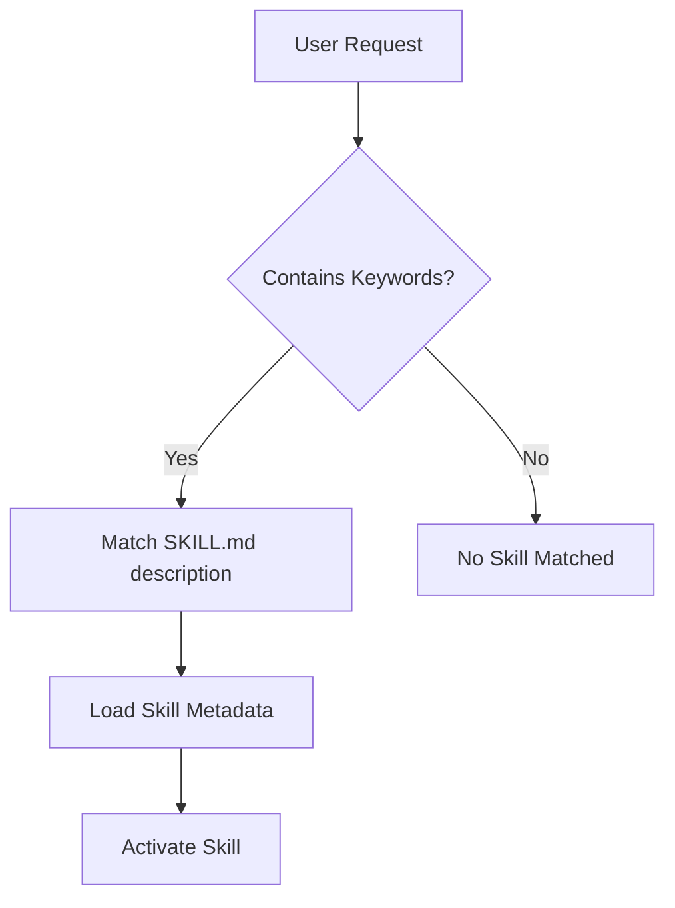
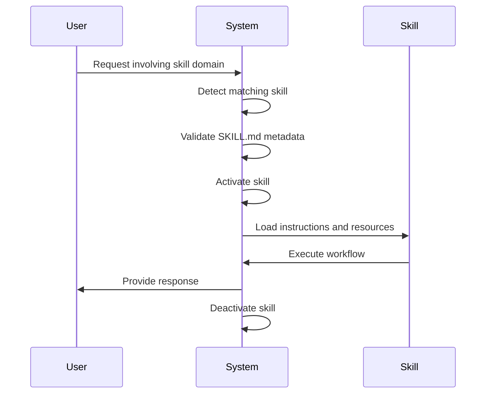

# Dynamic Skill Loading

<cite>
**Referenced Files in This Document**   
- [README.md](file://README.md)
- [agent_skills_spec.md](file://agent_skills_spec.md)
- [template-skill/SKILL.md](file://template-skill/SKILL.md)
- [document-skills/docx/SKILL.md](file://document-skills/docx/SKILL.md)
- [document-skills/pdf/SKILL.md](file://document-skills/pdf/SKILL.md)
- [document-skills/pptx/SKILL.md](file://document-skills/pptx/SKILL.md)
- [document-skills/xlsx/SKILL.md](file://document-skills/xlsx/SKILL.md)
- [skill-creator/SKILL.md](file://skill-creator/SKILL.md)
- [algorithmic-art/SKILL.md](file://algorithmic-art/SKILL.md)
- [canvas-design/SKILL.md](file://canvas-design/SKILL.md)
- [internal-comms/SKILL.md](file://internal-comms/SKILL.md)
- [brand-guidelines/SKILL.md](file://brand-guidelines/SKILL.md)
</cite>

## Table of Contents
1. [Introduction](#introduction)
2. [Skill Discovery and Detection](#skill-discovery-and-detection)
3. [The SKILL.md File and Metadata](#the-skillmd-file-and-metadata)
4. [Skill Loading Lifecycle](#skill-loading-lifecycle)
5. [Integration with Claude Code, Claude.ai, and API](#integration-with-claude-code-claudeai-and-api)
6. [Common Issues and Troubleshooting](#common-issues-and-troubleshooting)
7. [Performance Considerations](#performance-considerations)
8. [Conclusion](#conclusion)

## Introduction

Dynamic skill loading is a core mechanism that enables Claude to extend its capabilities by discovering and loading specialized skills at runtime based on user requests. Skills are self-contained packages that provide Claude with procedural knowledge, workflows, and tools for specific domains or tasks, transforming it from a general-purpose agent into a specialized one. This document explains the complete lifecycle of skill loading—from detection and activation to deactivation—with examples from the repository such as how installing document-skills via the plugin marketplace triggers dynamic loading. It also covers the role of the SKILL.md file in enabling this behavior, how metadata influences loading decisions, integration points with Claude Code, Claude.ai, and the API, common issues like failed loading due to malformed YAML or network errors, and performance considerations for minimizing latency during skill activation.

**Section sources**
- [README.md](file://README.md#L1-L123)

## Skill Discovery and Detection

Skill discovery begins when a user request matches keywords or contextual cues associated with a specific skill. Each skill is stored as a self-contained directory containing a `SKILL.md` file, which serves as the entry point for detection. The system scans available skill directories to identify potential matches based on the skill's `name` and `description` fields in the YAML frontmatter. For example, when a user asks to "extract form fields from a PDF," the system detects that the `pdf` skill's description includes "fill in a PDF form or programmatically process, generate, or analyze PDF documents," triggering the loading process.

Skills can be discovered from local repositories or remote sources such as the plugin marketplace. In Claude Code, users can register a repository as a plugin marketplace using the `/plugin marketplace add` command, making all skills within it available for installation. Once registered, individual skills like `document-skills` or `example-skills` can be installed via the `/plugin install` command, which downloads and activates the corresponding skill directories. The detection mechanism relies on exact directory names matching the skill name specified in the `SKILL.md` file, ensuring consistency between the file system structure and metadata.

**Section sources**
- [README.md](file://README.md#L58-L76)
- [agent_skills_spec.md](file://agent_skills_spec.md#L3-L29)

## The SKILL.md File and Metadata

The `SKILL.md` file is the cornerstone of dynamic skill loading, serving as both the entry point and configuration manifest for each skill. It must begin with YAML frontmatter containing required metadata fields: `name` and `description`. The `name` field uniquely identifies the skill using lowercase alphanumeric characters and hyphens, while the `description` provides a comprehensive explanation of the skill's purpose and usage context. This metadata determines when Claude should activate the skill, acting as a decision-making guide for runtime selection.

In addition to required fields, optional metadata includes `license`, `allowed-tools`, and `metadata`. The `license` field specifies licensing terms, often referencing an external `LICENSE.txt` file. The `allowed-tools` field, currently supported in Claude Code, pre-approves specific tools for execution within the skill's context. The `metadata` field allows clients to store custom key-value pairs for extended functionality. Following the YAML frontmatter, the Markdown body contains detailed instructions, workflows, examples, and guidelines that Claude follows when the skill is active.

For instance, the `docx` skill's `SKILL.md` file specifies its name as "docx" and describes its function as comprehensive document creation, editing, and analysis with support for tracked changes and comments. This metadata enables the system to match user requests involving Word documents to the appropriate skill. Similarly, the `pdf` skill uses its description to indicate applicability for PDF manipulation tasks such as form filling and text extraction.

**Diagram sources**
- [agent_skills_spec.md](file://agent_skills_spec.md#L19-L44)
- [document-skills/docx/SKILL.md](file://document-skills/docx/SKILL.md#L1-L197)

**Section sources**
- [agent_skills_spec.md](file://agent_skills_spec.md#L19-L44)
- [document-skills/docx/SKILL.md](file://document-skills/docx/SKILL.md#L1-L197)
- [document-skills/pdf/SKILL.md](file://document-skills/pdf/SKILL.md#L1-L295)

## Skill Loading Lifecycle

The skill loading lifecycle consists of four phases: detection, activation, execution, and deactivation. Detection occurs when a user request matches keywords or patterns defined in a skill's metadata. Upon detection, the system verifies the presence of a valid `SKILL.md` file in the corresponding directory and validates its YAML frontmatter for required fields. If validation passes, the skill enters the activation phase, where its metadata is loaded into Claude's context, making it available for use.

During activation, the system may also load additional resources such as scripts, references, or assets specified in the skill directory. For example, the `document-skills` package includes Python scripts for unpacking and packing OOXML files, which are made available for execution when needed. The execution phase involves following the instructions in the `SKILL.md` file's Markdown body, potentially invoking bundled scripts or accessing reference materials. Throughout execution, Claude maintains awareness of the active skill's scope and boundaries.

Deactivation occurs automatically when the task is completed or when user context shifts away from the skill's domain. This ensures that skills do not persist beyond their intended use, preventing interference with unrelated tasks. The lifecycle is designed to be seamless, with minimal latency between detection and activation, allowing Claude to respond quickly to user requests while maintaining contextual accuracy.

**Diagram sources**
- [agent_skills_spec.md](file://agent_skills_spec.md#L3-L44)
- [skill-creator/SKILL.md](file://skill-creator/SKILL.md#L27-L40)

**Section sources**
- [agent_skills_spec.md](file://agent_skills_spec.md#L3-L44)
- [skill-creator/SKILL.md](file://skill-creator/SKILL.md#L27-L40)

## Integration with Claude Code, Claude.ai, and API

Skills integrate seamlessly across Claude Code, Claude.ai, and the API, providing consistent functionality regardless of the interface. In Claude Code, users can add a plugin marketplace using the `/plugin marketplace add` command, followed by installing specific skills via `/plugin install`. This process downloads the skill repository and makes its contents available for dynamic loading. Once installed, skills like `document-skills` can be invoked directly through natural language requests, such as "Use the PDF skill to extract form fields."

In Claude.ai, pre-built skills are automatically available to paid plans, eliminating the need for manual installation. Users can leverage these skills by simply mentioning the desired capability in their prompts. Custom skills can also be uploaded through the interface, following the same directory structure and `SKILL.md` requirements as the open-source examples.

The Claude API supports both pre-built and custom skills through programmatic access. Developers can upload skills via the API and reference them in requests, enabling automation and integration into external applications. The API handles skill loading transparently, ensuring that the appropriate skill is activated based on the request content. This unified approach across platforms ensures that skills function consistently whether accessed through chat, code, or programmatic interfaces.

**Section sources**
- [README.md](file://README.md#L58-L88)

## Common Issues and Troubleshooting

Several common issues can disrupt the dynamic skill loading process, primarily related to configuration errors or environmental constraints. Malformed YAML in the `SKILL.md` file is a frequent cause of loading failures, often due to incorrect indentation, missing colons, or invalid characters. To troubleshoot this, validate the YAML syntax using standard tools or online validators before deployment.

Network errors can occur when loading skills from remote repositories, particularly if the source is unavailable or rate-limited. Ensure stable connectivity and verify repository accessibility before attempting installation. For local development, confirm that file paths are correct and permissions allow read access to skill directories.

Another common issue involves mismatched directory names and skill names. The directory containing the `SKILL.md` file must exactly match the `name` field in the YAML frontmatter, including case sensitivity. A discrepancy here will prevent proper detection and loading.

When using bundled scripts, ensure all dependencies are installed and accessible. For example, the `recalc.py` script for Excel formula recalculation requires LibreOffice to be installed. Missing dependencies can cause execution failures even if the skill loads successfully.

To diagnose loading issues:
1. Verify the presence and correctness of the `SKILL.md` file
2. Check YAML syntax validity
3. Confirm directory name matches skill name
4. Validate network connectivity for remote repositories
5. Ensure all required dependencies are installed
6. Test with minimal examples before scaling to complex use cases

**Section sources**
- [agent_skills_spec.md](file://agent_skills_spec.md#L28-L29)
- [document-skills/xlsx/SKILL.md](file://document-skills/xlsx/SKILL.md#L71-L72)

## Performance Considerations

Minimizing latency during skill activation is critical for maintaining responsive interactions. Several performance considerations help optimize the dynamic loading process. First, keep the `SKILL.md` file size reasonable—while there is no strict limit, excessively large files can slow down parsing and context loading. For extensive documentation, use the `references/` directory to store supplementary materials that are loaded only when needed.

Leverage the progressive disclosure design principle by organizing skills into three levels: metadata (always in context), `SKILL.md` body (loaded when triggered), and bundled resources (accessed as needed). This approach reduces initial loading overhead by deferring resource-intensive components until they are required.

Cache frequently used skills locally to avoid repeated downloads from remote repositories. In environments with limited bandwidth or high-latency connections, pre-installing essential skills ensures faster activation times. Additionally, optimize bundled scripts for efficiency, avoiding redundant operations or verbose logging that could impact execution speed.

For skills involving external tool execution, such as the `unpack.py` and `pack.py` scripts for OOXML manipulation, ensure these tools are pre-installed and readily available. Minimize subprocess invocation overhead by batching operations where possible and reusing processes across multiple invocations.

Finally, monitor skill usage patterns to identify opportunities for optimization. Skills that are frequently activated but rarely used beyond basic functionality may benefit from modularization, splitting them into smaller, more focused components that load faster and consume fewer resources.

**Section sources**
- [skill-creator/SKILL.md](file://skill-creator/SKILL.md#L77-L85)
- [document-skills/docx/ooxml/scripts/unpack.py](file://document-skills/docx/ooxml/scripts/unpack.py#L1-L30)

## Conclusion

Dynamic skill loading enables Claude to adapt and extend its capabilities on-demand, providing specialized knowledge and tools precisely when needed. By leveraging the `SKILL.md` file as a metadata manifest and entry point, the system can detect, load, and execute skills based on user requests, integrating seamlessly across Claude Code, Claude.ai, and the API. Understanding the lifecycle from detection to deactivation, along with proper configuration and performance optimization, ensures reliable and efficient skill usage. With careful implementation and attention to common issues, dynamic skill loading becomes a powerful mechanism for enhancing Claude's functionality in diverse domains.