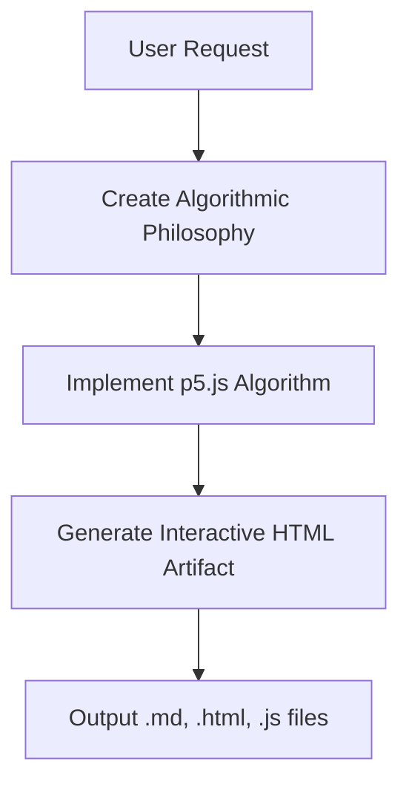
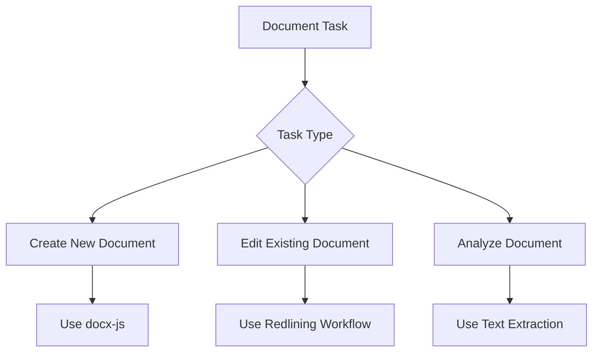
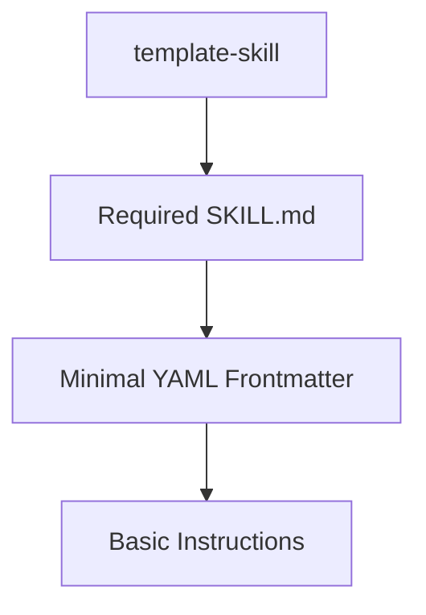
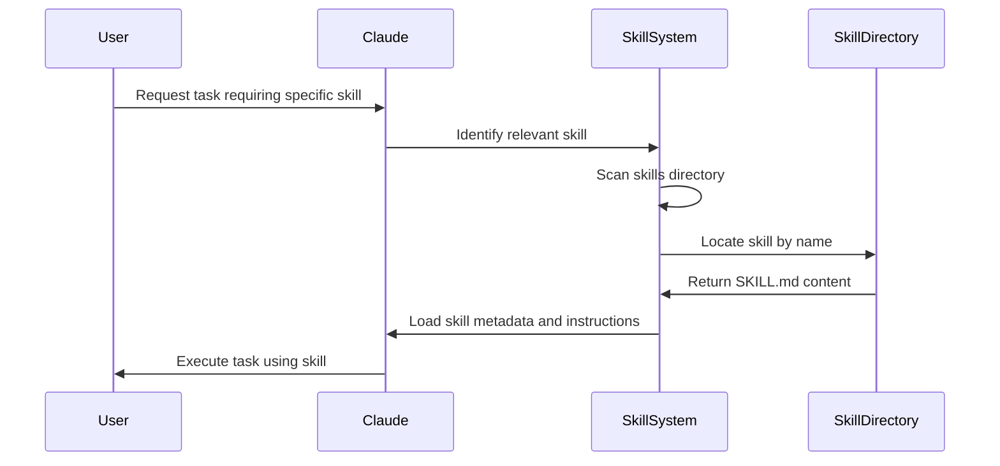
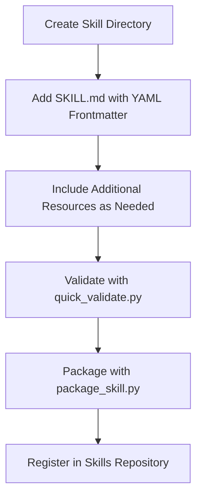
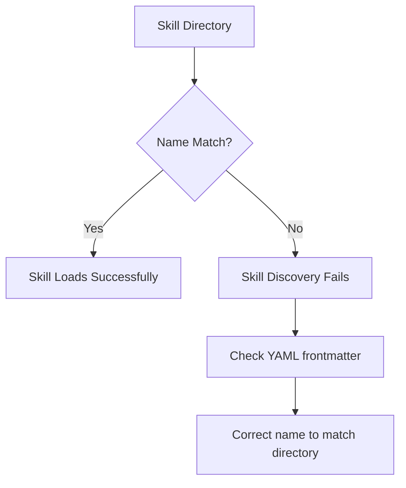
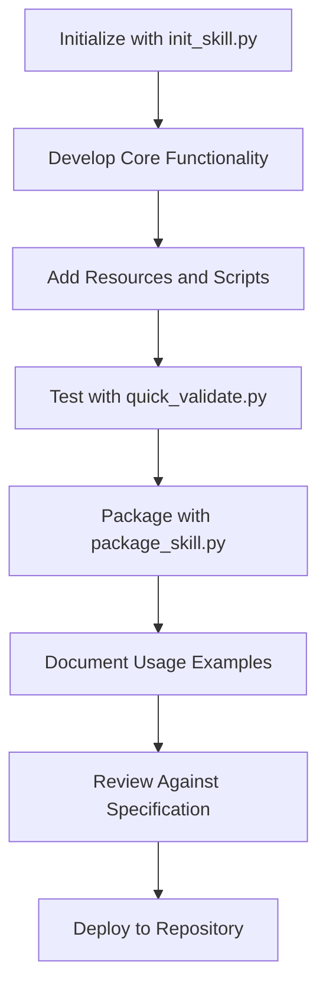

# Plugin Architecture

<cite>
**Referenced Files in This Document**   
- [agent_skills_spec.md](file://agent_skills_spec.md)
- [README.md](file://README.md)
- [algorithmic-art/SKILL.md](file://algorithmic-art/SKILL.md)
- [document-skills/docx/SKILL.md](file://document-skills/docx/SKILL.md)
- [template-skill/SKILL.md](file://template-skill/SKILL.md)
- [artifacts-builder/SKILL.md](file://artifacts-builder/SKILL.md)
- [brand-guidelines/SKILL.md](file://brand-guidelines/SKILL.md)
- [skill-creator/scripts/init_skill.py](file://skill-creator/scripts/init_skill.py)
- [skill-creator/scripts/package_skill.py](file://skill-creator/scripts/package_skill.py)
- [skill-creator/scripts/quick_validate.py](file://skill-creator/scripts/quick_validate.py)
- [skill-creator/SKILL.md](file://skill-creator/SKILL.md)
</cite>

## Table of Contents
1. [Introduction](#introduction)
2. [Core Architecture](#core-architecture)
3. [Skill Directory Structure](#skill-directory-structure)
4. [SKILL.md File Format](#skillmd-file-format)
5. [YAML Frontmatter Specification](#yaml-frontmatter-specification)
6. [Example Skill Implementations](#example-skill-implementations)
7. [Discovery and Loading Mechanism](#discovery-and-loading-mechanism)
8. [Registration and Activation Process](#registration-and-activation-process)
9. [Common Issues and Troubleshooting](#common-issues-and-troubleshooting)
10. [Best Practices](#best-practices)

## Introduction

The plugin architecture for Claude enables modular skill loading through a standardized directory structure and specification. Each skill functions as a self-contained plugin that extends Claude's capabilities for specific tasks. The architecture is designed to be simple yet powerful, allowing for dynamic discovery and loading of skills while maintaining consistency across implementations.

Skills are organized as independent directories containing all necessary instructions, scripts, and resources. The system relies on a clear specification (agent_skills_spec.md) that defines the requirements for a valid skill, with the SKILL.md file serving as the entrypoint. This documentation provides a comprehensive overview of the plugin architecture, detailing the structure, metadata requirements, discovery mechanisms, and best practices for creating and maintaining skills.

**Section sources**
- [README.md](file://README.md#L1-L24)
- [agent_skills_spec.md](file://agent_skills_spec.md#L1-L56)

## Core Architecture

The plugin architecture follows a decentralized model where each skill operates as an independent module with well-defined interfaces. The core components of this architecture include the skill specification, the entrypoint file (SKILL.md), and the discovery mechanism that identifies valid skills within a repository.

Skills are designed to be discovered and loaded dynamically, allowing Claude to extend its capabilities based on the available skill set. The architecture emphasizes simplicity by requiring only a single mandatory file (SKILL.md) while allowing for arbitrary additional resources and scripts as needed for complex implementations.

The system is built around the principle of self-containment, where each skill directory includes everything necessary for its operation. This approach enables easy distribution, versioning, and management of skills as independent units. The architecture also supports hierarchical organization, allowing skills to be grouped by category or functionality within the repository structure.

**Section sources**
- [agent_skills_spec.md](file://agent_skills_spec.md#L1-L56)
- [README.md](file://README.md#L1-L24)

## Skill Directory Structure

The skill directory structure follows a minimalistic approach with flexible extension points. At its core, a skill requires only a single file, but can include additional directories and files as needed for complex implementations.

### Minimal Structure

The minimal skill structure consists of:
```
my-skill/
  - SKILL.md
```

This basic structure is sufficient for simple skills that primarily rely on textual instructions and guidelines.

### Extended Structure

More complex skills can incorporate additional components:
```
complex-skill/
  - SKILL.md
  - scripts/
  - templates/
  - resources/
  - LICENSE.txt
```

The `scripts/` directory typically contains executable code for automation, while `templates/` holds reusable templates for generating artifacts. The `resources/` directory (or similarly named directories) stores additional assets such as images, fonts, or data files.

Examples from the codebase demonstrate various structural patterns:
- **algorithmic-art**: Includes templates for generative art
- **document-skills**: Contains schemas and validation scripts for document formats
- **artifacts-builder**: Features scripts for building complex HTML artifacts

The architecture allows for domain-specific organization while maintaining the core requirement of the SKILL.md entrypoint.

**Section sources**
- [agent_skills_spec.md](file://agent_skills_spec.md#L5-L14)
- [README.md](file://README.md#L26-L57)
- [algorithmic-art/SKILL.md](file://algorithmic-art/SKILL.md#L1-L405)
- [document-skills/docx/SKILL.md](file://document-skills/docx/SKILL.md#L1-L197)

## SKILL.md File Format

The SKILL.md file serves as the entrypoint and metadata container for each skill. It follows a specific format that combines structured metadata with flexible instructional content.

### File Structure

The SKILL.md file must start with YAML frontmatter followed by regular Markdown content:

```markdown
---
name: skill-name
description: Skill description
---
# Skill Title

[Markdown content with instructions, examples, and guidelines]
```

The YAML frontmatter contains essential metadata that the system uses for discovery and categorization, while the Markdown body provides the detailed instructions that Claude follows when the skill is active.

### Content Organization

The Markdown body has no restrictions on content organization, allowing skill creators to structure their instructions appropriately. Common patterns include:
- Overview and purpose
- Usage guidelines
- Examples of application
- Technical details and implementation notes
- References to additional resources

The file acts as both a machine-readable metadata source and a human-readable instruction manual, serving dual purposes in the ecosystem.

**Section sources**
- [agent_skills_spec.md](file://agent_skills_spec.md#L16-L48)
- [template-skill/SKILL.md](file://template-skill/SKILL.md#L1-L7)

## YAML Frontmatter Specification

The YAML frontmatter in the SKILL.md file contains structured metadata that defines the skill's identity and properties. This metadata is critical for the discovery and loading mechanism.

### Required Properties

#### name
- **Description**: The unique identifier for the skill
- **Format**: Hyphen-case (lowercase alphanumeric characters separated by hyphens)
- **Requirement**: Must match the directory name containing the SKILL.md file
- **Purpose**: Used for skill identification and activation

#### description
- **Description**: Comprehensive explanation of the skill's purpose and usage
- **Content**: What the skill does and when Claude should use it
- **Purpose**: Guides Claude's decision-making about when to activate the skill

### Optional Properties

#### license
- **Description**: License information for the skill
- **Format**: Short name of the license or reference to a bundled license file
- **Recommendation**: Keep concise while providing sufficient legal information

#### allowed-tools
- **Description**: List of pre-approved tools that can be executed
- **Current Support**: Primarily supported in Claude Code
- **Purpose**: Security and capability management

#### metadata
- **Description**: Key-value map for additional properties
- **Usage**: Client-specific extensions and custom attributes
- **Recommendation**: Use unique key names to avoid conflicts

The YAML frontmatter provides a standardized way to describe skills while allowing for extensibility through optional fields.

**Section sources**
- [agent_skills_spec.md](file://agent_skills_spec.md#L21-L44)
- [algorithmic-art/SKILL.md](file://algorithmic-art/SKILL.md#L1-L5)
- [document-skills/docx/SKILL.md](file://document-skills/docx/SKILL.md#L1-L5)

## Example Skill Implementations

The repository contains several example skills that demonstrate different patterns and approaches to implementing the plugin architecture.

### algorithmic-art Skill

The algorithmic-art skill demonstrates a creative application of the architecture:



**Diagram sources**
- [algorithmic-art/SKILL.md](file://algorithmic-art/SKILL.md#L1-L405)

This skill follows a two-step process: first creating an algorithmic philosophy, then implementing it through code. It includes templates for consistent output formatting and emphasizes seeded randomness for reproducible results.

### document-skills Implementation

The document-skills collection demonstrates complex technical capabilities:



**Diagram sources**
- [document-skills/docx/SKILL.md](file://document-skills/docx/SKILL.md#L1-L197)

These skills handle various document formats (DOCX, PDF, PPTX, XLSX) and include sophisticated workflows for editing with tracked changes, preserving formatting, and extracting content.

### template-skill Pattern

The template-skill provides a minimal starting point:



**Diagram sources**
- [template-skill/SKILL.md](file://template-skill/SKILL.md#L1-L7)

This pattern serves as a foundation for creating new skills, demonstrating the absolute minimum requirements while providing placeholders for expansion.

**Section sources**
- [algorithmic-art/SKILL.md](file://algorithmic-art/SKILL.md#L1-L405)
- [document-skills/docx/SKILL.md](file://document-skills/docx/SKILL.md#L1-L197)
- [template-skill/SKILL.md](file://template-skill/SKILL.md#L1-L7)

## Discovery and Loading Mechanism

The discovery and loading mechanism identifies valid skills by scanning directories for the required SKILL.md file and validating its contents against the specification.

### Discovery Process

The system follows these steps to discover skills:
1. Scan the skills directory for subdirectories
2. Check each subdirectory for the presence of SKILL.md
3. Parse the YAML frontmatter to extract metadata
4. Validate that required fields (name, description) are present
5. Confirm that the skill name matches the directory name

This process enables dynamic discovery of skills without requiring explicit registration or configuration files.

### Loading Workflow

When a skill is needed, the loading process follows this sequence:



**Diagram sources**
- [agent_skills_spec.md](file://agent_skills_spec.md#L1-L56)
- [skill-creator/scripts/quick_validate.py](file://skill-creator/scripts/quick_validate.py#L14-L17)

The loading mechanism ensures that skills are only loaded when needed, optimizing resource usage and context management.

### Validation Checks

The system performs several validation checks to ensure skill integrity:
- Presence of SKILL.md file
- Valid YAML frontmatter syntax
- Required fields (name, description)
- Name-directory correspondence
- Proper file encoding and format

These checks prevent malformed or incomplete skills from being loaded and used.

**Section sources**
- [agent_skills_spec.md](file://agent_skills_spec.md#L1-L56)
- [skill-creator/scripts/quick_validate.py](file://skill-creator/scripts/quick_validate.py#L14-L17)
- [skill-creator/scripts/package_skill.py](file://skill-creator/scripts/package_skill.py#L40-L43)

## Registration and Activation Process

The registration and activation process enables skills to be made available and used within the Claude system.

### Registration Workflow

Skills are registered through a straightforward process:



**Diagram sources**
- [skill-creator/scripts/init_skill.py](file://skill-creator/scripts/init_skill.py#L195-L232)
- [skill-creator/scripts/package_skill.py](file://skill-creator/scripts/package_skill.py#L40-L43)

The skill-creator tools provide automation for this process, including initialization, validation, and packaging.

### Activation Triggers

Skills are activated based on contextual analysis of user requests:

1. **Keyword Matching**: Identifying terms related to specific skills
2. **Task Analysis**: Determining the nature of the requested task
3. **Content Requirements**: Assessing the output format needs
4. **Tool Requirements**: Identifying necessary execution capabilities

For example, requests involving "generative art" or "p5.js" would trigger the algorithmic-art skill, while document editing tasks would activate the appropriate document-skill.

### Context Management

The activation process considers context limitations:
- Loading only essential parts of SKILL.md when triggered
- Prioritizing skills based on relevance to the current task
- Managing context window usage for large skill instructions
- Caching frequently used skills for efficiency

This ensures optimal performance while maintaining access to necessary capabilities.

**Section sources**
- [skill-creator/scripts/init_skill.py](file://skill-creator/scripts/init_skill.py#L195-L232)
- [skill-creator/scripts/package_skill.py](file://skill-creator/scripts/package_skill.py#L40-L43)
- [skill-creator/scripts/quick_validate.py](file://skill-creator/scripts/quick_validate.py#L14-L17)

## Common Issues and Troubleshooting

Several common issues can occur when creating or using skills, along with established troubleshooting approaches.

### Naming Convention Errors

The most frequent issue involves incorrect naming:

**Problem**: Directory name does not match the skill name in YAML frontmatter
**Symptoms**: Skill not discovered or loaded
**Solution**: Ensure exact match between directory name and `name` field



**Diagram sources**
- [agent_skills_spec.md](file://agent_skills_spec.md#L28)
- [skill-creator/scripts/init_skill.py](file://skill-creator/scripts/init_skill.py#L220-L232)

### Missing SKILL.md File

**Problem**: SKILL.md file is absent from the skill directory
**Symptoms**: Directory not recognized as a valid skill
**Solution**: Create SKILL.md with proper YAML frontmatter

The validation scripts (quick_validate.py) can detect this issue and provide specific error messages.

### YAML Parsing Errors

**Problem**: Invalid YAML syntax in frontmatter
**Symptoms**: Metadata not properly extracted
**Common Causes**:
- Improper indentation
- Missing colons after keys
- Unquoted special characters
- Incorrect boolean values

**Prevention**: Use YAML validation tools during development

### Content Organization Issues

**Problem**: Overly large SKILL.md files that exceed context limits
**Solution**: Follow the best practice of keeping SKILL.md lean:
- Move detailed reference material to separate files
- Include grep search patterns for locating information
- Use modular organization with linked resources

The skill-creator documentation specifically addresses this issue, recommending that information should live in either SKILL.md or reference files, not both.

**Section sources**
- [agent_skills_spec.md](file://agent_skills_spec.md#L28)
- [skill-creator/SKILL.md](file://skill-creator/SKILL.md#L63-L65)
- [skill-creator/scripts/quick_validate.py](file://skill-creator/scripts/quick_validate.py#L14-L17)

## Best Practices

Following established best practices ensures skills are effective, maintainable, and compatible with the core system.

### Organizational Principles

#### Keep SKILL.md Focused
- Include only essential procedural instructions in SKILL.md
- Move detailed reference material to separate files
- Use the SKILL.md file primarily for workflow guidance

#### Modular Resource Management
- Group related scripts in dedicated directories
- Organize templates by type or purpose
- Separate large resources to avoid bloating the main directory

#### Documentation Strategy
- Provide clear examples of usage
- Include troubleshooting guidance
- Document dependencies and requirements
- Specify version compatibility

### Compatibility Guidelines

#### Follow Specification Strictly
- Adhere to the agent_skills_spec.md requirements
- Ensure name-directory correspondence
- Validate YAML frontmatter syntax
- Include required fields (name, description)

#### Maintain Backward Compatibility
- Avoid breaking changes in established skills
- Use versioning for significant updates
- Provide migration guidance when necessary

#### Test Thoroughly
- Validate with the provided quick_validate.py script
- Test in multiple contexts and use cases
- Verify integration with related skills
- Check edge cases and error conditions

### Development Workflow

The recommended development workflow incorporates several key steps:



**Diagram sources**
- [skill-creator/scripts/init_skill.py](file://skill-creator/scripts/init_skill.py#L195-L232)
- [skill-creator/scripts/package_skill.py](file://skill-creator/scripts/package_skill.py#L40-L43)
- [skill-creator/scripts/quick_validate.py](file://skill-creator/scripts/quick_validate.py#L14-L17)

This workflow ensures skills are properly structured, validated, and documented before deployment.

**Section sources**
- [skill-creator/SKILL.md](file://skill-creator/SKILL.md#L63-L65)
- [skill-creator/scripts/init_skill.py](file://skill-creator/scripts/init_skill.py#L195-L232)
- [skill-creator/scripts/package_skill.py](file://skill-creator/scripts/package_skill.py#L40-L43)