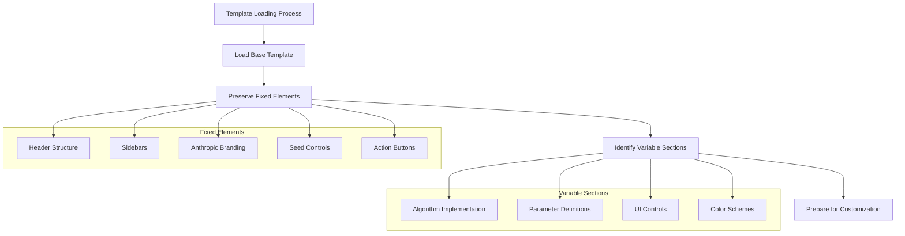
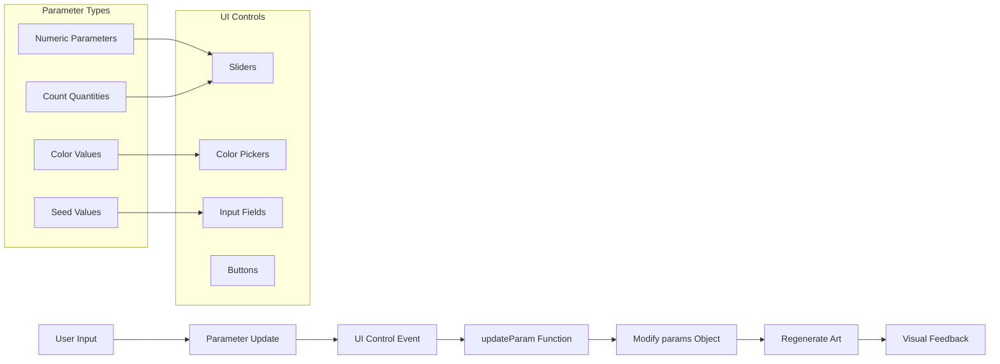
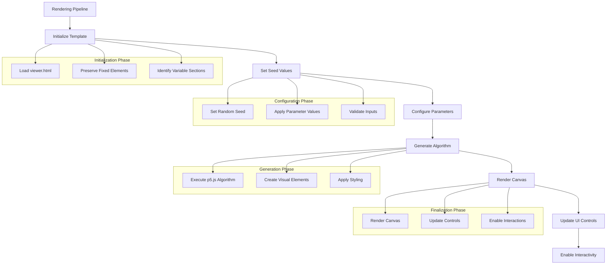
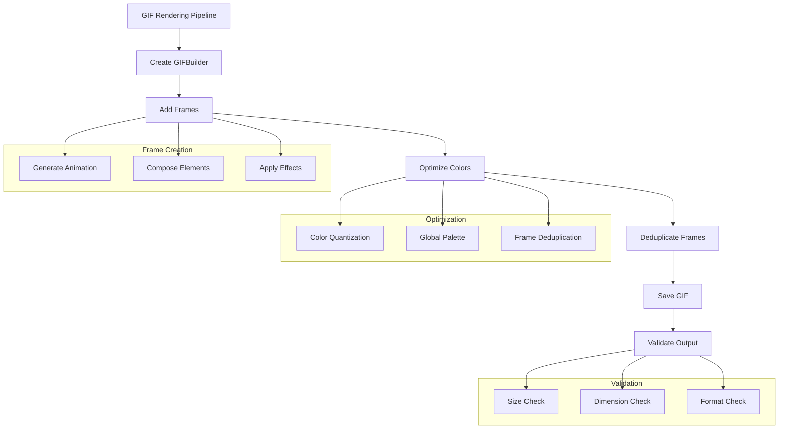
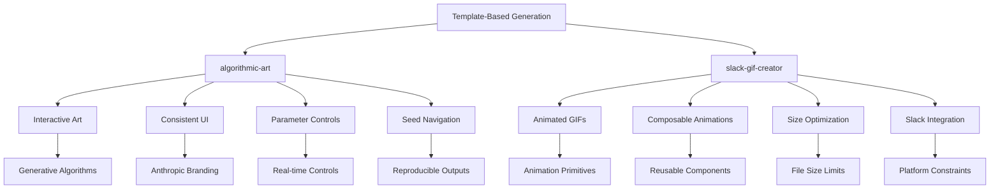
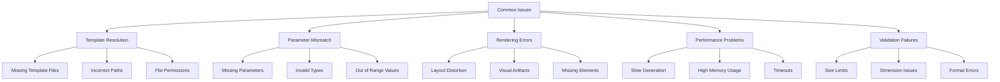
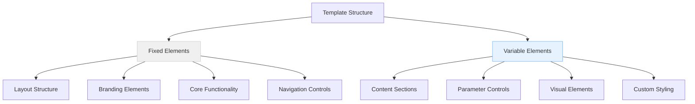
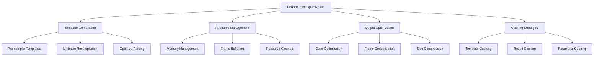

# Template-Based Generation

<cite>
**Referenced Files in This Document**   
- [algorithmic-art/templates/viewer.html](file://algorithmic-art/templates/viewer.html)
- [algorithmic-art/templates/generator_template.js](file://algorithmic-art/templates/generator_template.js)
- [algorithmic-art/SKILL.md](file://algorithmic-art/SKILL.md)
- [slack-gif-creator/SKILL.md](file://slack-gif-creator/SKILL.md)
- [slack-gif-creator/core/gif_builder.py](file://slack-gif-creator/core/gif_builder.py)
- [slack-gif-creator/core/validators.py](file://slack-gif-creator/core/validators.py)
- [slack-gif-creator/templates/bounce.py](file://slack-gif-creator/templates/bounce.py)
- [slack-gif-creator/templates/move.py](file://slack-gif-creator/templates/move.py)
- [slack-gif-creator/core/frame_composer.py](file://slack-gif-creator/core/frame_composer.py)
- [slack-gif-creator/core/easing.py](file://slack-gif-creator/core/easing.py)
</cite>

## Table of Contents
1. [Introduction](#introduction)
2. [Template Loading Process](#template-loading-process)
3. [Variable Injection Mechanism](#variable-injection-mechanism)
4. [Rendering Pipeline](#rendering-pipeline)
5. [Template-Based Generation in Practice](#template-based-generation-in-practice)
6. [Common Issues and Troubleshooting](#common-issues-and-troubleshooting)
7. [Best Practices for Template Design](#best-practices-for-template-design)
8. [Performance Optimization](#performance-optimization)
9. [Conclusion](#conclusion)

## Introduction

Template-based generation is a core pattern used across multiple skills in the repository, enabling consistent output structures while allowing for parameterization. This approach allows for rapid generation of artifacts while maintaining brand or structural consistency. The pattern is exemplified in skills like algorithmic-art and slack-gif-creator, where templates provide the foundation for generating complex outputs like interactive p5.js art and animated GIFs.

The template-based generation pattern follows a consistent workflow:
1. **Template Loading**: Loading a base template with fixed structural elements
2. **Variable Injection**: Injecting dynamic parameters and content into the template
3. **Rendering Pipeline**: Processing the template with injected variables to produce the final output

This documentation will explore each aspect of this pattern in detail, using concrete examples from the codebase to illustrate how templates enable efficient and consistent artifact generation.

**Section sources**
- [algorithmic-art/SKILL.md](file://algorithmic-art/SKILL.md#L1-L405)
- [slack-gif-creator/SKILL.md](file://slack-gif-creator/SKILL.md#L1-L647)

## Template Loading Process

The template loading process establishes a consistent foundation for generated artifacts while allowing for customization. This process ensures that all outputs maintain a uniform structure and branding while enabling specific content to be dynamically generated.

In the algorithmic-art skill, the template loading process begins with the `templates/viewer.html` file, which serves as the foundation for all generated interactive art. This template contains fixed structural elements that must be preserved across all artifacts:



**Diagram sources**
- [algorithmic-art/templates/viewer.html](file://algorithmic-art/templates/viewer.html#L1-L599)

The template loading process follows these key principles:

1. **Fixed vs. Variable Elements**: The template clearly distinguishes between elements that must remain unchanged and those that should be customized for each artifact.
2. **Structural Consistency**: Layout structure, sidebar organization, and Anthropic branding are preserved across all generated artifacts.
3. **Interactive Controls**: Seed navigation controls (Previous/Next/Random/Go) and action buttons (Regenerate/Reset) are maintained in all outputs.

For the slack-gif-creator skill, the template loading process is implemented through Python modules in the `templates/` directory. Each animation type (bounce, move, fade, etc.) is defined as a reusable template that can be imported and customized:

```python
from templates.bounce import create_bounce_animation
from templates.move import create_move_animation
```

This modular approach allows for composable animation primitives that can be combined to create complex effects while maintaining consistency in the underlying implementation.

**Section sources**
- [algorithmic-art/templates/viewer.html](file://algorithmic-art/templates/viewer.html#L1-L599)
- [algorithmic-art/SKILL.md](file://algorithmic-art/SKILL.md#L105-L127)
- [slack-gif-creator/SKILL.md](file://slack-gif-creator/SKILL.md#L95-L97)

## Variable Injection Mechanism

The variable injection mechanism enables customization of templates while preserving their structural integrity. This process allows for dynamic content generation based on parameters and user input, making templates flexible and reusable across different contexts.

In the algorithmic-art skill, variable injection occurs through JavaScript parameter objects and UI controls. The `params` object in the template serves as the central mechanism for injecting variables:

```javascript
let params = {
    seed: 12345,
    particleCount: 5000,
    flowSpeed: 0.5,
    noiseScale: 0.005,
    trailLength: 8,
    colorPalette: ['#d97757', '#6a9bcc', '#788c5d']
};
```

These parameters are then connected to UI controls in the sidebar, allowing users to interactively modify the generated art:



**Diagram sources**
- [algorithmic-art/templates/viewer.html](file://algorithmic-art/templates/viewer.html#L354-L388)
- [algorithmic-art/templates/generator_template.js](file://algorithmic-art/templates/generator_template.js#L24-L36)

For the slack-gif-creator skill, variable injection is implemented through function parameters in the animation templates. Each template function accepts a comprehensive set of parameters that control the animation behavior:

```python
def create_bounce_animation(
    object_type: str = 'circle',
    object_data: dict = None,
    num_frames: int = 30,
    bounce_height: int = 150,
    ground_y: int = 350,
    start_x: int = 240,
    frame_width: int = 480,
    frame_height: int = 480,
    bg_color: tuple[int, int, int] = (255, 255, 255)
) -> list:
```

This approach allows for fine-grained control over animation properties while maintaining a consistent interface across different animation types. The parameters cover essential aspects of the animation:

- **Object Properties**: Type, size, color, and other visual characteristics
- **Motion Parameters**: Duration, speed, height, and other movement properties
- **Frame Properties**: Dimensions, background, and other canvas settings

The variable injection mechanism also includes default values for all parameters, ensuring that templates can be used with minimal configuration while still allowing for extensive customization when needed.

**Section sources**
- [algorithmic-art/templates/viewer.html](file://algorithmic-art/templates/viewer.html#L445-L452)
- [algorithmic-art/templates/generator_template.js](file://algorithmic-art/templates/generator_template.js#L24-L36)
- [slack-gif-creator/templates/bounce.py](file://slack-gif-creator/templates/bounce.py#L19-L29)
- [slack-gif-creator/templates/move.py](file://slack-gif-creator/templates/move.py#L19-L31)

## Rendering Pipeline

The rendering pipeline transforms templates with injected variables into final artifacts, processing each component in a systematic sequence to ensure consistent and high-quality outputs. This pipeline orchestrates the integration of dynamic content with the template structure to produce the final result.

In the algorithmic-art skill, the rendering pipeline follows a well-defined sequence that begins with template initialization and ends with interactive artifact generation:



**Diagram sources**
- [algorithmic-art/SKILL.md](file://algorithmic-art/SKILL.md#L189-L198)
- [algorithmic-art/templates/viewer.html](file://algorithmic-art/templates/viewer.html#L465-L473)

The pipeline begins with the `setup()` function, which initializes the canvas and system state:

```javascript
function setup() {
    let canvas = createCanvas(1200, 1200);
    canvas.parent('canvas-container');
    
    initializeSystem();
    
    // Remove loading message
    document.querySelector('.loading').style.display = 'none';
}
```

This is followed by the `initializeSystem()` function, which seeds the randomness and generates the visual elements:

```javascript
function initializeSystem() {
    // Seed the randomness for reproducibility
    randomSeed(params.seed);
    noiseSeed(params.seed);
    
    // Clear particles and recreate
    particles = [];
    
    // Initialize particles
    for (let i = 0; i < params.particleCount; i++) {
        particles.push(new Particle());
    }
    
    // Calculate flow field dimensions
    cols = floor(width / scl);
    rows = floor(height / scl);
    
    // Generate flow field
    generateFlowField();
    
    // Clear background
    background(250, 249, 245); // Anthropic light background
}
```

For the slack-gif-creator skill, the rendering pipeline is implemented through the `GIFBuilder` class, which orchestrates the creation of animated GIFs:



**Diagram sources**
- [slack-gif-creator/core/gif_builder.py](file://slack-gif-creator/core/gif_builder.py#L16-L246)
- [slack-gif-creator/core/validators.py](file://slack-gif-creator/core/validators.py#L1-L265)

The `GIFBuilder` class provides a comprehensive pipeline for creating optimized GIFs:

```python
class GIFBuilder:
    def __init__(self, width: int = 480, height: int = 480, fps: int = 15):
        self.width = width
        self.height = height
        self.fps = fps
        self.frames: list[np.ndarray] = []

    def add_frame(self, frame: np.ndarray | Image.Image):
        # Add frame to the sequence
        pass

    def optimize_colors(self, num_colors: int = 128, use_global_palette: bool = True):
        # Reduce colors for better compression
        pass

    def deduplicate_frames(self, threshold: float = 0.995):
        # Remove duplicate consecutive frames
        pass

    def save(self, output_path: str | Path, num_colors: int = 128,
             optimize_for_emoji: bool = False, remove_duplicates: bool = True):
        # Save optimized GIF with validation
        pass
```

This pipeline ensures that all generated GIFs meet Slack's requirements while maintaining visual quality and file size efficiency.

**Section sources**
- [algorithmic-art/templates/viewer.html](file://algorithmic-art/templates/viewer.html#L465-L497)
- [slack-gif-creator/core/gif_builder.py](file://slack-gif-creator/core/gif_builder.py#L16-L246)

## Template-Based Generation in Practice

Template-based generation is implemented across multiple skills in the repository, demonstrating its versatility and effectiveness in creating consistent, high-quality artifacts. The pattern is applied in different contexts, from interactive generative art to animated GIFs, showcasing its adaptability to various output formats.

In the algorithmic-art skill, template-based generation enables the creation of interactive p5.js art with consistent branding and user interface elements. The template ensures that all generated artifacts share the same structural foundation while allowing for unique algorithmic expressions:



**Diagram sources**
- [algorithmic-art/SKILL.md](file://algorithmic-art/SKILL.md#L1-L405)
- [slack-gif-creator/SKILL.md](file://slack-gif-creator/SKILL.md#L1-L647)

For algorithmic-art, the template-based approach ensures that all generated artifacts maintain Anthropic's branding and user experience standards. The `templates/viewer.html` file provides a consistent foundation with:

- Fixed header and sidebar structure
- Standardized color scheme and typography
- Preserved seed navigation controls
- Consistent action buttons (Regenerate, Reset, Download)

At the same time, the template allows for extensive customization through:

- Algorithm-specific parameters
- Dynamic UI controls for parameter adjustment
- Flexible color palette options
- Configurable canvas dimensions

In the slack-gif-creator skill, template-based generation enables the creation of animated GIFs optimized for Slack's platform requirements. The templates in the `templates/` directory provide composable animation primitives that can be combined to create complex effects:

```python
# Example: Combining bounce and shake animations
frames = create_bounce_animation(
    object_type='circle',
    object_data={'radius': 40, 'color': (255, 100, 100)},
    num_frames=30,
    bounce_height=150
)

# Add shake effect on impact
for i in range(len(frames)):
    if i >= len(frames) * 0.7:  # Last 30% of animation
        frames[i] = apply_shake_effect(frames[i], intensity=5)
```

The template system in slack-gif-creator supports:

- **Composable Animations**: Multiple animation primitives can be combined
- **Parameterized Effects**: Each template accepts parameters to customize behavior
- **Platform Optimization**: Built-in optimization for Slack's size and dimension constraints
- **Validation Integration**: Automatic validation against Slack's requirements

Both implementations demonstrate how template-based generation enables rapid creation of artifacts while maintaining consistency and quality. The pattern allows for:

- **Rapid Prototyping**: New artifacts can be created quickly by customizing existing templates
- **Brand Consistency**: All outputs maintain a consistent look and feel
- **User Experience**: Standardized interfaces make artifacts easy to use and understand
- **Quality Control**: Built-in validation ensures outputs meet technical requirements

**Section sources**
- [algorithmic-art/SKILL.md](file://algorithmic-art/SKILL.md#L1-L405)
- [slack-gif-creator/SKILL.md](file://slack-gif-creator/SKILL.md#L1-L647)

## Common Issues and Troubleshooting

Template-based generation systems can encounter various issues that affect the quality and functionality of generated artifacts. Understanding these common problems and their solutions is essential for maintaining reliable and high-quality outputs.

The most frequent issues in template-based generation fall into several categories:



**Diagram sources**
- [slack-gif-creator/core/validators.py](file://slack-gif-creator/core/validators.py#L1-L265)
- [algorithmic-art/SKILL.md](file://algorithmic-art/SKILL.md#L135-L141)

### Template Resolution Failures

Template resolution failures occur when the system cannot locate or load the required template files. In the algorithmic-art skill, this typically happens when the `templates/viewer.html` file is missing or inaccessible:

```python
# Check if template file exists
import os
if not os.path.exists('templates/viewer.html'):
    raise FileNotFoundError("Template file not found. Please ensure templates/viewer.html exists.")
```

Solutions include:
- Verifying file paths and permissions
- Ensuring the template directory is properly structured
- Implementing fallback mechanisms for missing templates

### Parameter Mismatches

Parameter mismatches occur when the expected parameters do not match what is provided. In the slack-gif-creator templates, this can happen when required parameters are missing or have incorrect types:

```python
def create_bounce_animation(
    object_type: str = 'circle',
    object_data: dict = None,
    num_frames: int = 30,
    # ... other parameters
):
    # Validate parameters
    if num_frames <= 0:
        raise ValueError("num_frames must be positive")
    
    if object_data is None:
        # Set default object data based on object_type
        object_data = get_default_object_data(object_type)
```

Prevention strategies include:
- Comprehensive parameter validation
- Default values for optional parameters
- Type checking and conversion
- Clear documentation of expected parameters

### Rendering Pipeline Issues

Rendering pipeline issues can manifest as visual artifacts, layout problems, or incomplete outputs. In the algorithmic-art skill, common rendering issues include:

- Canvas sizing problems
- Incorrect parameter updates
- Missing visual elements
- Performance bottlenecks

The system includes built-in safeguards to detect and report these issues:

```javascript
// Check for rendering issues
function validateRendering() {
    if (particles.length === 0) {
        console.warn("No particles generated. Check particleCount parameter.");
    }
    
    if (params.trailLength > 20) {
        console.warn("High trailLength may impact performance.");
    }
}
```

### Validation Failures

Validation failures are particularly important in the slack-gif-creator skill, where generated GIFs must meet Slack's strict requirements. The system includes comprehensive validation functions:

```python
def check_slack_size(gif_path: str | Path, is_emoji: bool = True) -> tuple[bool, dict]:
    """
    Check if GIF meets Slack size limits.
    Returns: (passes: bool, info: dict with details)
    """
    size_kb = get_file_size_kb(gif_path)
    limit_kb = 64 if is_emoji else 2048
    
    passes = size_kb <= limit_kb
    
    if not passes:
        print(f"✗ {size_kb:.1f} KB - exceeds {limit_kb} KB limit")
        print(f"  Over by: {size_kb - limit_kb:.1f} KB")
    
    return passes, {'size_kb': size_kb, 'limit_kb': limit_kb, 'passes': passes}
```

When validation fails, the system provides specific guidance for resolution:
- For oversized emoji GIFs: reduce frame count, colors, or simplify design
- For incorrect dimensions: resize to recommended 128x128 for emojis
- For format issues: ensure proper color quantization and compression

### Troubleshooting Guide

When encountering issues with template-based generation, follow this systematic approach:

1. **Verify Template Availability**: Ensure all required template files are present and accessible
2. **Check Parameter Values**: Validate that all parameters are within expected ranges and types
3. **Review Error Messages**: Pay attention to specific warnings and error messages
4. **Test Incrementally**: Build and test components separately before combining them
5. **Validate Outputs**: Use built-in validation tools to check if outputs meet requirements

By following these troubleshooting steps and understanding the common issues, users can effectively resolve problems and ensure successful template-based generation.

**Section sources**
- [slack-gif-creator/core/validators.py](file://slack-gif-creator/core/validators.py#L1-L265)
- [algorithmic-art/SKILL.md](file://algorithmic-art/SKILL.md#L135-L141)
- [slack-gif-creator/SKILL.md](file://slack-gif-creator/SKILL.md#L64-L92)

## Best Practices for Template Design

Effective template design is crucial for successful template-based generation. Well-designed templates balance consistency with flexibility, making them reusable across different contexts while allowing for meaningful customization. The following best practices are derived from the implementation patterns observed in the codebase.

### Template Structure Principles

A well-structured template clearly separates fixed and variable elements, making it easy to understand what can be customized and what must remain unchanged:



**Diagram sources**
- [algorithmic-art/templates/viewer.html](file://algorithmic-art/templates/viewer.html#L1-L599)

Key structural principles include:
- **Clear Separation**: Explicitly distinguish between fixed and variable sections
- **Consistent Organization**: Maintain a logical structure across all templates
- **Comprehensive Documentation**: Include comments that explain the purpose of each section
- **Error Prevention**: Design templates to minimize the risk of breaking changes

### Parameter Design Guidelines

Well-designed parameters make templates flexible and easy to use. The parameter system should follow these guidelines:

1. **Comprehensive Coverage**: Include parameters for all customizable aspects of the template
2. **Intuitive Naming**: Use clear, descriptive names that indicate the parameter's purpose
3. **Appropriate Defaults**: Provide sensible default values that work well in most cases
4. **Type Safety**: Specify expected types and validate inputs
5. **Range Constraints**: Define valid ranges for numeric parameters

In the algorithmic-art skill, the parameter design follows these principles:

```javascript
let params = {
    // Core parameters
    seed: 12345,  // Always include seed for reproducibility
    
    // Visual parameters
    particleCount: 5000,  // Quantity controls
    flowSpeed: 0.5,       // Scale controls
    noiseScale: 0.005,    // Scale controls
    trailLength: 8,       // Threshold controls
    
    // Color parameters
    colorPalette: ['#d97757', '#6a9bcc', '#788c5d']  // Array for multiple values
};
```

### Template Hierarchy Organization

Organizing templates in a logical hierarchy improves discoverability and maintainability. The slack-gif-creator skill demonstrates effective template organization:

```
templates/
├── bounce.py
├── explode.py
├── fade.py
├── flip.py
├── kaleidoscope.py
├── morph.py
├── move.py
├── pulse.py
├── shake.py
├── slide.py
├── spin.py
├── wiggle.py
└── zoom.py
```

This flat structure works well for a moderate number of templates. For larger template collections, consider organizing by category:

```
templates/
├── animations/
│   ├── basic/
│   │   ├── bounce.py
│   │   ├── fade.py
│   │   └── pulse.py
│   └── complex/
│       ├── kaleidoscope.py
│       └── morph.py
├── layouts/
│   ├── grid.py
│   └── carousel.py
└── effects/
    ├── shadow.py
    └── blur.py
```

### Reusability Patterns

Design templates to be maximally reusable by following these patterns:

1. **Single Responsibility**: Each template should have a clear, focused purpose
2. **Composability**: Design templates to work well together
3. **Extensibility**: Allow for easy extension and customization
4. **Backward Compatibility**: Maintain compatibility with existing implementations

The animation templates in slack-gif-creator exemplify these patterns by providing composable primitives that can be combined:

```python
# Compose multiple animations
frames = create_bounce_animation(...)
shake_frames = create_shake_animation(...)

# Combine animations
combined_frames = []
for i in range(max(len(frames), len(shake_frames))):
    frame = overlay_frames(
        get_frame(frames, i),
        get_frame(shake_frames, i)
    )
    combined_frames.append(frame)
```

### Documentation Standards

Comprehensive documentation is essential for template usability. Each template should include:

- **Purpose**: Clear explanation of what the template does
- **Parameters**: Complete list of parameters with descriptions, types, and defaults
- **Usage Examples**: Practical examples showing how to use the template
- **Integration Notes**: Information about how the template fits into the larger system

The templates in the codebase follow these documentation standards:

```python
def create_bounce_animation(
    object_type: str = 'circle',
    object_data: dict = None,
    num_frames: int = 30,
    bounce_height: int = 150,
    ground_y: int = 350,
    start_x: int = 240,
    frame_width: int = 480,
    frame_height: int = 480,
    bg_color: tuple[int, int, int] = (255, 255, 255)
) -> list:
    """
    Create frames for a bouncing animation.
    
    Args:
        object_type: 'circle', 'emoji', or 'custom'
        object_data: Data for the object (e.g., {'radius': 30, 'color': (255, 0, 0)})
        num_frames: Number of frames in the animation
        bounce_height: Maximum height of bounce
        ground_y: Y position of ground
        start_x: X position (or starting X if moving horizontally)
        frame_width: Frame width
        frame_height: Frame height
        bg_color: Background color
    
    Returns:
        List of frames
    """
```

By following these best practices, template designers can create robust, reusable, and user-friendly templates that enhance the effectiveness of template-based generation systems.

**Section sources**
- [algorithmic-art/templates/viewer.html](file://algorithmic-art/templates/viewer.html#L1-L599)
- [slack-gif-creator/templates/bounce.py](file://slack-gif-creator/templates/bounce.py#L1-L106)
- [slack-gif-creator/templates/move.py](file://slack-gif-creator/templates/move.py#L1-L294)

## Performance Optimization

Performance optimization is critical in template-based generation systems, especially when dealing with resource-intensive outputs like interactive art and animated GIFs. The following strategies ensure efficient processing and optimal output quality.

### Template Compilation Optimization

Template compilation can be a significant performance bottleneck, particularly when templates are processed repeatedly. The following strategies optimize compilation performance:



**Diagram sources**
- [slack-gif-creator/core/gif_builder.py](file://slack-gif-creator/core/gif_builder.py#L16-L246)
- [algorithmic-art/templates/generator_template.js](file://algorithmic-art/templates/generator_template.js#L116-L126)

In the algorithmic-art skill, performance is optimized through efficient p5.js implementation:

```javascript
// Performance considerations for large numbers of elements
// - Pre-calculate what you can
// - Use simple collision detection (spatial hashing if needed)
// - Limit expensive operations (sqrt, trig) when possible
// - Consider using p5 vectors efficiently
```

### Caching Strategies

Caching is one of the most effective performance optimizations for template-based generation. The system should implement multiple levels of caching:

1. **Template Caching**: Store compiled templates in memory to avoid reprocessing
2. **Result Caching**: Cache previously generated outputs when parameters are identical
3. **Resource Caching**: Cache frequently used assets like fonts and images

The slack-gif-creator skill implements caching through the `GIFBuilder` class:

```python
class GIFBuilder:
    def __init__(self, width: int = 480, height: int = 480, fps: int = 15):
        self.width = width
        self.height = height
        self.fps = fps
        self.frames: list[np.ndarray] = []
        self._cache = {}  # Cache for optimized frames
```

### Memory Management

Efficient memory management is crucial when generating large artifacts like animated GIFs. The following practices help minimize memory usage:

- **Frame Buffering**: Process frames in batches rather than loading all frames into memory
- **Resource Cleanup**: Clear frames and temporary data after processing
- **Stream Processing**: Process data as a stream rather than loading everything at once

The `GIFBuilder` class includes a `clear()` method for resource cleanup:

```python
def clear(self):
    """Clear all frames (useful for creating multiple GIFs)."""
    self.frames = []
```

### Output Optimization

Optimizing the final output reduces file size and improves loading performance. The slack-gif-creator skill includes several output optimization techniques:

```python
def optimize_colors(self, num_colors: int = 128, use_global_palette: bool = True) -> list[np.ndarray]:
    """
    Reduce colors in all frames using quantization.
    """
    # Implementation details
    pass

def deduplicate_frames(self, threshold: float = 0.995) -> int:
    """
    Remove duplicate or near-duplicate consecutive frames.
    """
    # Implementation details
    pass
```

These optimizations significantly reduce file size while maintaining visual quality.

### Performance Monitoring

Monitoring performance metrics helps identify bottlenecks and optimize the system:

```python
def save(self, output_path: str | Path, num_colors: int = 128,
         optimize_for_emoji: bool = False, remove_duplicates: bool = True) -> dict:
    """
    Save frames as optimized GIF for Slack.
    
    Returns:
        Dictionary with file info (path, size, dimensions, frame_count)
    """
    # Performance metrics
    info = {
        'path': str(output_path),
        'size_kb': file_size_kb,
        'size_mb': file_size_mb,
        'dimensions': f'{self.width}x{self.height}',
        'frame_count': len(optimized_frames),
        'fps': self.fps,
        'duration_seconds': len(optimized_frames) / self.fps,
        'colors': num_colors
    }
    
    return info
```

### Best Practices for Performance

To achieve optimal performance in template-based generation systems:

1. **Profile Regularly**: Identify performance bottlenecks through systematic profiling
2. **Optimize Critical Paths**: Focus optimization efforts on the most frequently executed code
3. **Use Efficient Data Structures**: Choose data structures that minimize memory and processing overhead
4. **Implement Lazy Loading**: Load resources only when needed
5. **Monitor Resource Usage**: Track memory, CPU, and disk usage during generation

By following these performance optimization strategies, template-based generation systems can produce high-quality outputs efficiently and reliably.

**Section sources**
- [slack-gif-creator/core/gif_builder.py](file://slack-gif-creator/core/gif_builder.py#L56-L146)
- [algorithmic-art/templates/generator_template.js](file://algorithmic-art/templates/generator_template.js#L116-L126)

## Conclusion

Template-based generation is a powerful pattern that enables consistent, high-quality artifact creation while allowing for extensive customization. By leveraging templates, the system can rapidly generate outputs that maintain brand consistency and structural integrity across different contexts.

The key benefits of template-based generation include:

- **Consistency**: All outputs maintain a uniform structure and branding
- **Efficiency**: Templates reduce development time by providing reusable foundations
- **Flexibility**: Variable injection mechanisms allow for extensive customization
- **Quality Control**: Built-in validation ensures outputs meet technical requirements
- **User Experience**: Standardized interfaces make artifacts easy to use and understand

The implementation patterns observed in the codebase demonstrate best practices for template design and usage:

1. **Clear Separation**: Templates clearly distinguish between fixed and variable elements
2. **Comprehensive Parameters**: Templates provide extensive parameterization options
3. **Robust Validation**: Built-in validation ensures outputs meet requirements
4. **Performance Optimization**: Caching and optimization techniques ensure efficient processing
5. **Comprehensive Documentation**: Templates include detailed documentation and examples

To maximize the effectiveness of template-based generation systems:

- Design templates with a clear purpose and focused functionality
- Organize templates in a logical hierarchy for easy discovery
- Implement comprehensive parameter validation and default values
- Optimize performance through caching and efficient processing
- Provide clear documentation and usage examples

By following these principles, template-based generation systems can become powerful tools for creating high-quality, consistent artifacts at scale.

**Section sources**
- [algorithmic-art/SKILL.md](file://algorithmic-art/SKILL.md#L1-L405)
- [slack-gif-creator/SKILL.md](file://slack-gif-creator/SKILL.md#L1-L647)