# Algorithmic Art

<cite>
**Referenced Files in This Document**
- [generator_template.js](file://algorithmic-art/templates/generator_template.js)
- [viewer.html](file://algorithmic-art/templates/viewer.html)
- [SKILL.md](file://algorithmic-art/SKILL.md)
- [LICENSE.txt](file://algorithmic-art/LICENSE.txt)
</cite>

## Table of Contents
1. [Introduction](#introduction)
2. [Project Structure](#project-structure)
3. [Core Components](#core-components)
4. [Architecture Overview](#architecture-overview)
5. [Detailed Component Analysis](#detailed-component-analysis)
6. [Dependency Analysis](#dependency-analysis)
7. [Performance Considerations](#performance-considerations)
8. [Troubleshooting Guide](#troubleshooting-guide)
9. [Conclusion](#conclusion)
10. [Appendices](#appendices)

## Introduction
This document explains the algorithmic-art skill and how to implement generative art using p5.js. It focuses on reproducible outputs via seeded randomness, interactive parameter controls, and real-time rendering. It documents the structure and functionality of the provided template files and shows how to extend them to create flow fields, particle systems, and geometric patterns. It also describes how to integrate with the core skill system and pass parameters from the SKILL.md configuration.

## Project Structure
The algorithmic-art skill provides:
- A viewer template that defines the UI layout, styling, and interactive controls
- A generator template that outlines best practices for parameter organization, seeded randomness, lifecycle, classes, utilities, and exports
- A skill specification that defines the end-to-end workflow, requirements, and output format

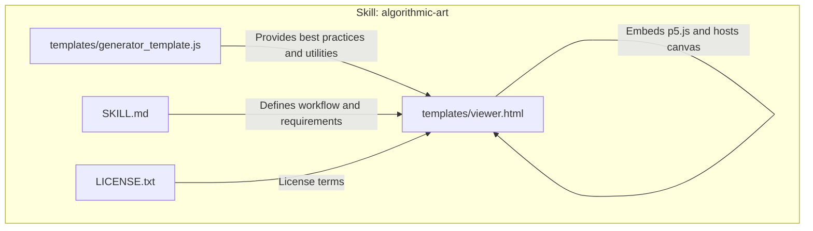

**Diagram sources**
- [viewer.html](file://algorithmic-art/templates/viewer.html#L1-L60)
- [generator_template.js](file://algorithmic-art/templates/generator_template.js#L1-L40)
- [SKILL.md](file://algorithmic-art/SKILL.md#L1-L40)

**Section sources**
- [viewer.html](file://algorithmic-art/templates/viewer.html#L1-L60)
- [generator_template.js](file://algorithmic-art/templates/generator_template.js#L1-L40)
- [SKILL.md](file://algorithmic-art/SKILL.md#L1-L40)

## Core Components
- Seeded randomness: Ensures deterministic outputs for reproducibility
- Parameter object: Centralized configuration for tunable aspects of the algorithm
- Lifecycle functions: setup(), draw(), and optional noLoop() for static art
- Utility functions: color helpers, mapping/easing, bounds handling, noise sampling, vector creation
- Export capability: Saving the current canvas as an image
- Interactive viewer: HTML template with Anthropic branding, seed controls, parameter sliders, color pickers, and actions

Key implementation anchors:
- Seeded randomness initialization and usage
- Parameter structure and update handlers
- Lifecycle and rendering patterns
- Utility functions for performance and visual quality

**Section sources**
- [generator_template.js](file://algorithmic-art/templates/generator_template.js#L33-L80)
- [generator_template.js](file://algorithmic-art/templates/generator_template.js#L127-L177)
- [generator_template.js](file://algorithmic-art/templates/generator_template.js#L180-L206)
- [viewer.html](file://algorithmic-art/templates/viewer.html#L440-L599)

## Architecture Overview
The viewer template orchestrates the UI and delegates algorithmic logic to the p5.js runtime. The algorithmic philosophy drives parameter selection and behavior, while the viewer ensures consistent interaction and reproducibility.

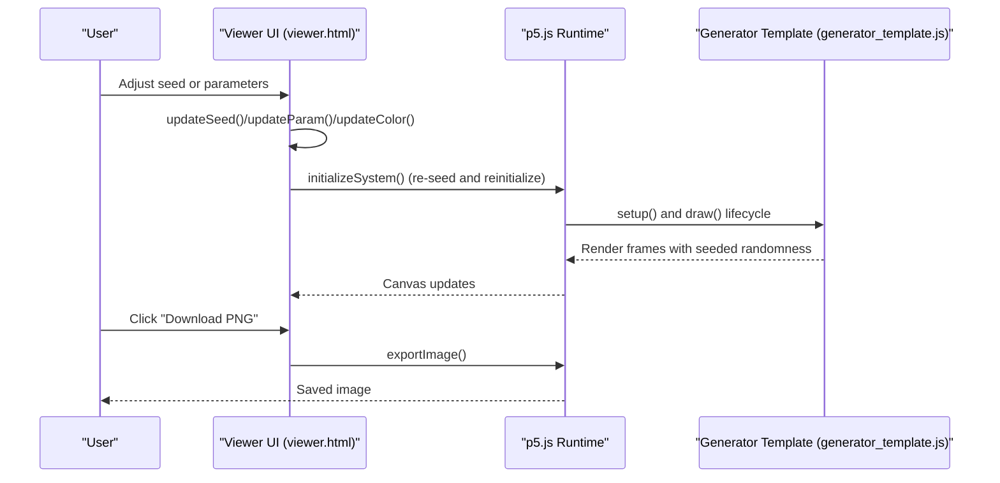

**Diagram sources**
- [viewer.html](file://algorithmic-art/templates/viewer.html#L440-L599)
- [generator_template.js](file://algorithmic-art/templates/generator_template.js#L53-L84)
- [generator_template.js](file://algorithmic-art/templates/generator_template.js#L203-L206)

## Detailed Component Analysis

### Seeded Randomness and Reproducibility
- Initialize both random and noise seeds with the same seed value
- Use seeded randomness for all stochastic decisions in setup and draw
- Regenerate the system when the seed changes to ensure identical outputs

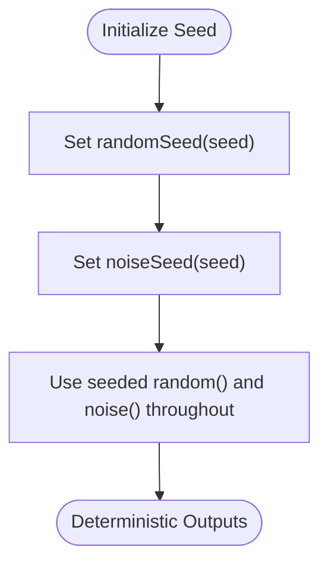

**Diagram sources**
- [generator_template.js](file://algorithmic-art/templates/generator_template.js#L43-L47)
- [viewer.html](file://algorithmic-art/templates/viewer.html#L476-L478)

**Section sources**
- [generator_template.js](file://algorithmic-art/templates/generator_template.js#L43-L47)
- [viewer.html](file://algorithmic-art/templates/viewer.html#L476-L478)

### Parameter Organization and Updates
- Centralize parameters in a single object
- Provide update handlers for parameters and colors
- Reset to defaults and regenerate when needed

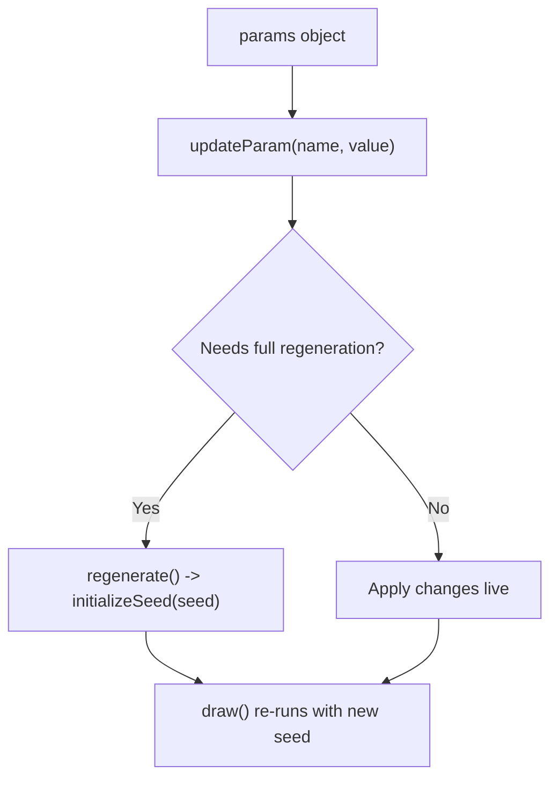

**Diagram sources**
- [generator_template.js](file://algorithmic-art/templates/generator_template.js#L165-L177)
- [viewer.html](file://algorithmic-art/templates/viewer.html#L522-L531)

**Section sources**
- [generator_template.js](file://algorithmic-art/templates/generator_template.js#L24-L36)
- [generator_template.js](file://algorithmic-art/templates/generator_template.js#L165-L177)
- [viewer.html](file://algorithmic-art/templates/viewer.html#L445-L452)
- [viewer.html](file://algorithmic-art/templates/viewer.html#L522-L531)

### Lifecycle and Rendering Patterns
- setup(): create canvas, initialize seed, set up data structures, and optionally call noLoop() for static art
- draw(): animate or evolve the system; can call noLoop() after a condition
- Utilities for fading backgrounds, noise-based values, and vector creation

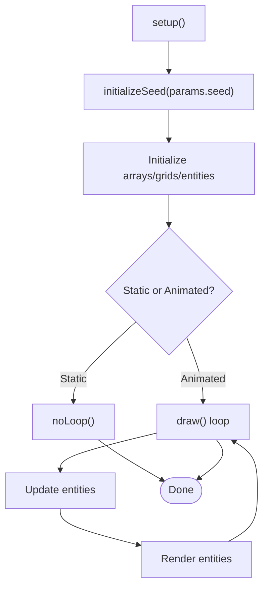

**Diagram sources**
- [generator_template.js](file://algorithmic-art/templates/generator_template.js#L53-L84)
- [generator_template.js](file://algorithmic-art/templates/generator_template.js#L182-L198)

**Section sources**
- [generator_template.js](file://algorithmic-art/templates/generator_template.js#L53-L84)
- [generator_template.js](file://algorithmic-art/templates/generator_template.js#L182-L198)

### Class-Based Entities (Optional)
- Encapsulate entities with constructors, update, and display methods
- Use seeded randomness inside constructors for reproducible initial states

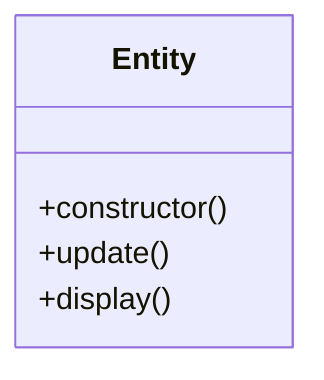

**Diagram sources**
- [generator_template.js](file://algorithmic-art/templates/generator_template.js#L92-L111)

**Section sources**
- [generator_template.js](file://algorithmic-art/templates/generator_template.js#L92-L111)

### Practical Examples

#### Flow Fields
- Create a grid of vectors based on noise or mathematical functions
- Particles move according to the field, optionally with trails
- Example references:
  - Field generation placeholder and particle class placeholders in the viewer template
  - Utility functions for noise sampling and vector creation

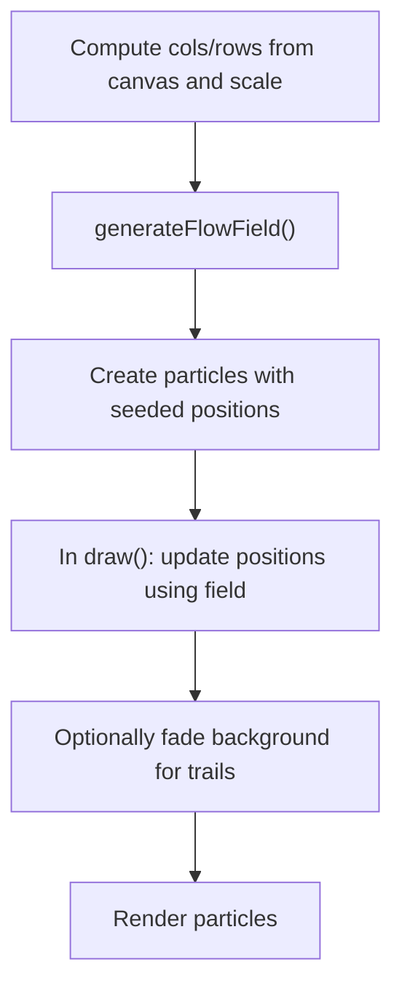

**Diagram sources**
- [viewer.html](file://algorithmic-art/templates/viewer.html#L489-L497)
- [viewer.html](file://algorithmic-art/templates/viewer.html#L499-L506)
- [viewer.html](file://algorithmic-art/templates/viewer.html#L511-L517)
- [generator_template.js](file://algorithmic-art/templates/generator_template.js#L189-L198)

**Section sources**
- [viewer.html](file://algorithmic-art/templates/viewer.html#L489-L506)
- [viewer.html](file://algorithmic-art/templates/viewer.html#L511-L517)
- [generator_template.js](file://algorithmic-art/templates/generator_template.js#L189-L198)

#### Particle Systems
- Initialize a population of particles with seeded randomness
- Update positions each frame using velocities derived from noise or fields
- Optionally render trails by drawing a semi-transparent overlay each frame

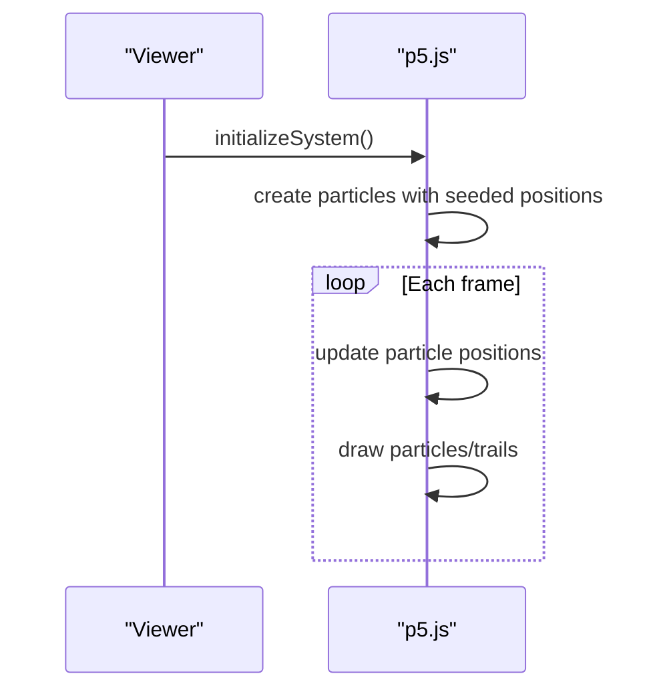

**Diagram sources**
- [viewer.html](file://algorithmic-art/templates/viewer.html#L475-L497)
- [viewer.html](file://algorithmic-art/templates/viewer.html#L503-L506)
- [generator_template.js](file://algorithmic-art/templates/generator_template.js#L182-L188)

**Section sources**
- [viewer.html](file://algorithmic-art/templates/viewer.html#L475-L497)
- [viewer.html](file://algorithmic-art/templates/viewer.html#L503-L506)
- [generator_template.js](file://algorithmic-art/templates/generator_template.js#L182-L188)

#### Geometric Patterns
- Use mathematical relationships and seeded randomness to place shapes
- Apply color palettes and easing for smooth transitions
- Keep performance in mind by minimizing expensive operations

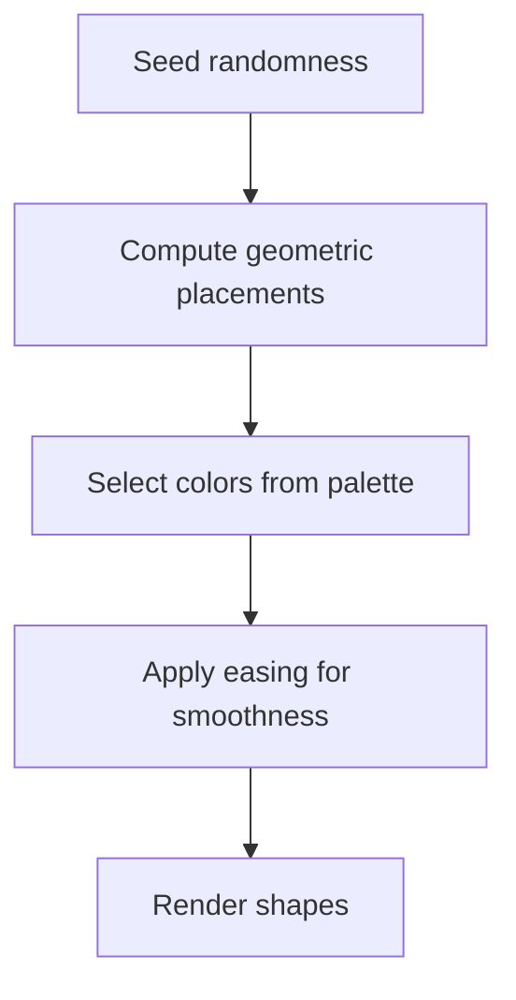

**Diagram sources**
- [generator_template.js](file://algorithmic-art/templates/generator_template.js#L131-L153)
- [generator_template.js](file://algorithmic-art/templates/generator_template.js#L141-L144)

**Section sources**
- [generator_template.js](file://algorithmic-art/templates/generator_template.js#L131-L153)
- [generator_template.js](file://algorithmic-art/templates/generator_template.js#L141-L144)

### Viewer Template: Structure and Controls
The viewer template provides:
- Anthropic-branded UI with sidebar and canvas area
- Seed controls: display, previous/next, random, and jump-to-seed
- Parameter controls: sliders with live updates
- Color pickers: optional palette controls
- Actions: reset and download PNG

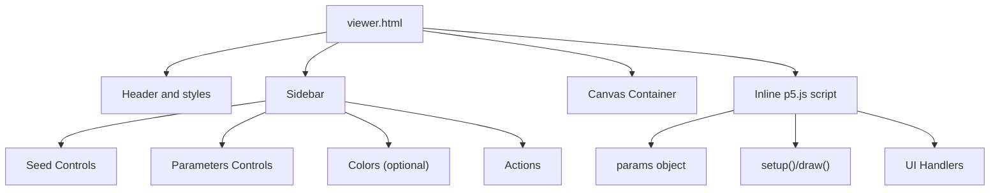

**Diagram sources**
- [viewer.html](file://algorithmic-art/templates/viewer.html#L1-L120)
- [viewer.html](file://algorithmic-art/templates/viewer.html#L331-L599)

**Section sources**
- [viewer.html](file://algorithmic-art/templates/viewer.html#L1-L120)
- [viewer.html](file://algorithmic-art/templates/viewer.html#L331-L599)

### Generator Template: Best Practices
The generator template demonstrates:
- Parameter organization and naming conventions
- Seeded randomness initialization
- Lifecycle and class patterns
- Utility functions for color, mapping, easing, bounds, noise, and vectors
- Export capabilities

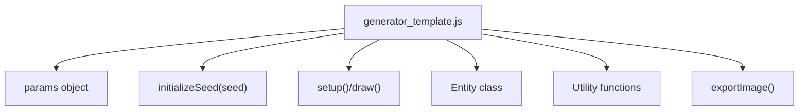

**Diagram sources**
- [generator_template.js](file://algorithmic-art/templates/generator_template.js#L24-L36)
- [generator_template.js](file://algorithmic-art/templates/generator_template.js#L43-L47)
- [generator_template.js](file://algorithmic-art/templates/generator_template.js#L53-L84)
- [generator_template.js](file://algorithmic-art/templates/generator_template.js#L92-L111)
- [generator_template.js](file://algorithmic-art/templates/generator_template.js#L127-L206)

**Section sources**
- [generator_template.js](file://algorithmic-art/templates/generator_template.js#L24-L36)
- [generator_template.js](file://algorithmic-art/templates/generator_template.js#L43-L47)
- [generator_template.js](file://algorithmic-art/templates/generator_template.js#L53-L84)
- [generator_template.js](file://algorithmic-art/templates/generator_template.js#L92-L111)
- [generator_template.js](file://algorithmic-art/templates/generator_template.js#L127-L206)

## Dependency Analysis
- The viewer template depends on p5.js (CDN) and the inline script that implements the algorithm
- The algorithm relies on seeded randomness and utilities from the generator template
- The skill specification defines how parameters are passed from configuration to the viewer’s params object

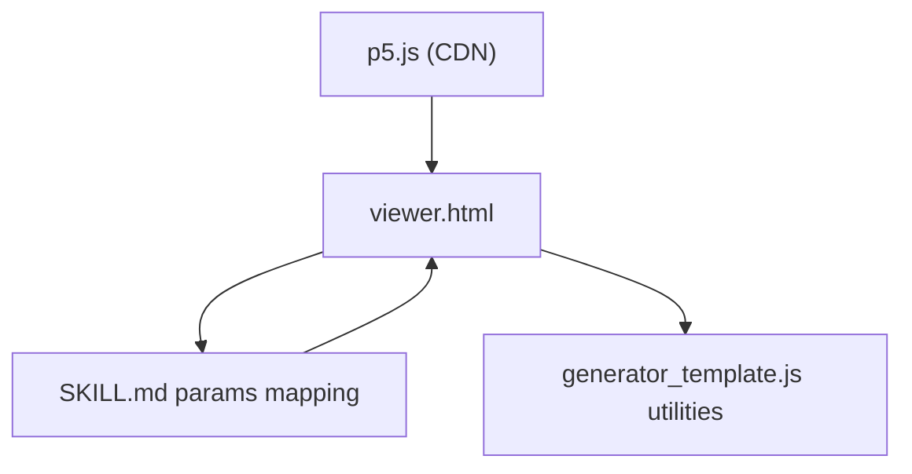

**Diagram sources**
- [viewer.html](file://algorithmic-art/templates/viewer.html#L20-L27)
- [SKILL.md](file://algorithmic-art/SKILL.md#L134-L160)
- [generator_template.js](file://algorithmic-art/templates/generator_template.js#L127-L206)

**Section sources**
- [viewer.html](file://algorithmic-art/templates/viewer.html#L20-L27)
- [SKILL.md](file://algorithmic-art/SKILL.md#L134-L160)
- [generator_template.js](file://algorithmic-art/templates/generator_template.js#L127-L206)

## Performance Considerations
- Prefer pre-calculations and avoid expensive operations per frame
- Use spatial partitioning or simple checks for large particle counts
- Limit trigonometric and square-root operations when possible
- Aim for smooth animation by profiling and reducing complexity if needed
- Keep rendering logic separate from update logic for clarity and performance

[No sources needed since this section provides general guidance]

## Troubleshooting Guide
Common issues and strategies:
- Canvas rendering failures
  - Ensure the canvas container exists and is appended to
  - Verify the script runs after DOM is ready
  - Confirm the p5.js library loads from the CDN
- Inconsistent randomness
  - Always call both randomSeed(seed) and noiseSeed(seed) with the same seed
  - Re-seed before recreating entities or reinitializing systems
- Parameter updates not taking effect
  - Implement updateParam() to update params and decide whether to regenerate or update live
  - Ensure UI handlers call updateParam() and trigger redraw or regenerate
- Export failures
  - Use the provided exportImage() function and ensure the canvas is fully rendered

**Section sources**
- [viewer.html](file://algorithmic-art/templates/viewer.html#L460-L474)
- [viewer.html](file://algorithmic-art/templates/viewer.html#L475-L497)
- [generator_template.js](file://algorithmic-art/templates/generator_template.js#L43-L47)
- [generator_template.js](file://algorithmic-art/templates/generator_template.js#L165-L177)
- [generator_template.js](file://algorithmic-art/templates/generator_template.js#L203-L206)

## Conclusion
The algorithmic-art skill provides a robust foundation for creating reproducible, interactive generative art with p5.js. By centralizing parameters, seeding randomness, and structuring lifecycle and utility functions, creators can build complex animations and patterns that are both visually compelling and technically sound. The viewer template ensures consistent user interaction, while the generator template offers best practices for performance and clarity.

[No sources needed since this section summarizes without analyzing specific files]

## Appendices

### Integration with the Core Skill System
- The SKILL.md defines how to derive parameters from the configuration and map them into the viewer’s params object
- The viewer template embeds the algorithm inline and exposes controls for exploration
- The generator template supplies reusable utilities and patterns

**Section sources**
- [SKILL.md](file://algorithmic-art/SKILL.md#L134-L160)
- [viewer.html](file://algorithmic-art/templates/viewer.html#L440-L599)
- [generator_template.js](file://algorithmic-art/templates/generator_template.js#L127-L206)

### Extending the Template with Custom Effects
- Add new parameters to the params object and corresponding UI controls
- Implement updateParam() to handle new parameter types
- Integrate new rendering logic into draw() or introduce new classes
- Maintain seeded randomness and consider performance implications

**Section sources**
- [viewer.html](file://algorithmic-art/templates/viewer.html#L445-L452)
- [viewer.html](file://algorithmic-art/templates/viewer.html#L522-L531)
- [generator_template.js](file://algorithmic-art/templates/generator_template.js#L127-L177)

### License
The algorithmic-art skill is licensed under the Apache License, Version 2.0. See the license file for details.

**Section sources**
- [LICENSE.txt](file://algorithmic-art/LICENSE.txt#L1-L40)