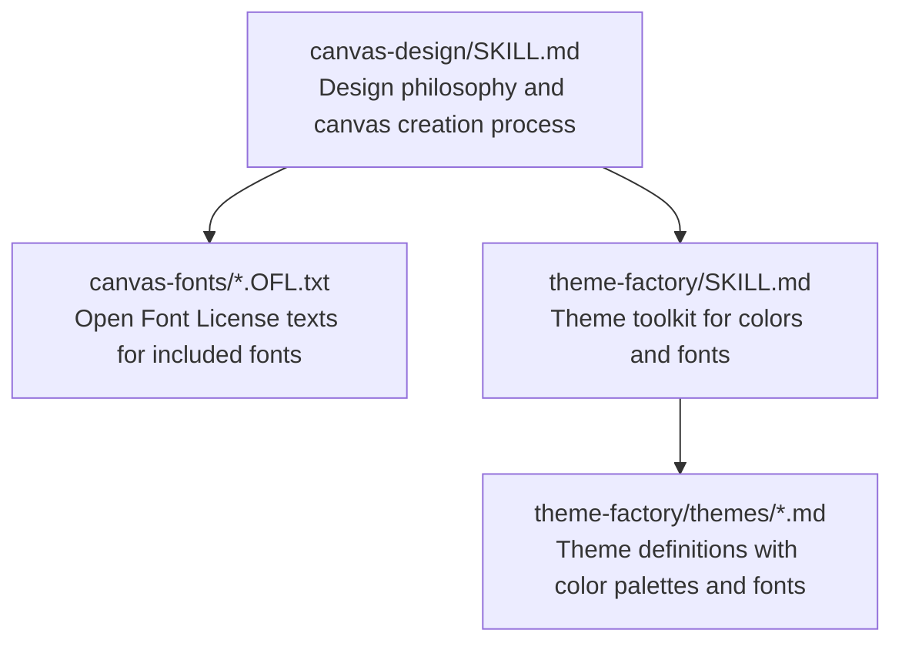
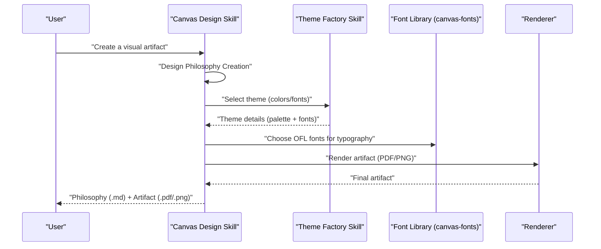
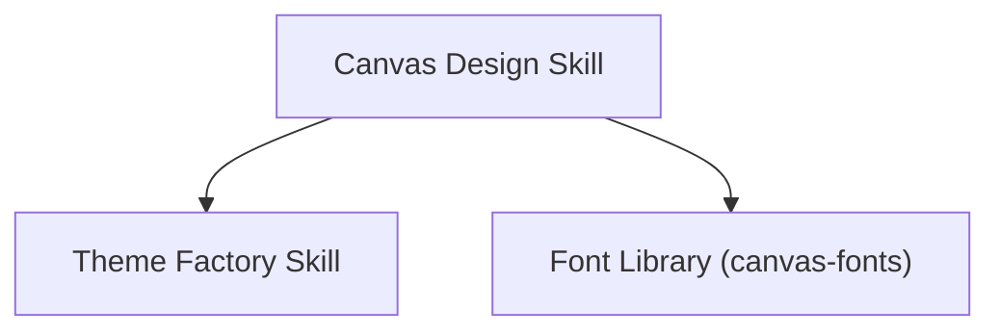

# Canvas Design

<cite>
**Referenced Files in This Document**
- [canvas-design/SKILL.md](file://canvas-design/SKILL.md)
- [canvas-design/LICENSE.txt](file://canvas-design/LICENSE.txt)
- [canvas-design/canvas-fonts/ArsenalSC-OFL.txt](file://canvas-design/canvas-fonts/ArsenalSC-OFL.txt)
- [canvas-design/canvas-fonts/BigShoulders-OFL.txt](file://canvas-design/canvas-fonts/BigShoulders-OFL.txt)
- [canvas-design/canvas-fonts/CrimsonPro-OFL.txt](file://canvas-design/canvas-fonts/CrimsonPro-OFL.txt)
- [canvas-design/canvas-fonts/Lora-OFL.txt](file://canvas-design/canvas-fonts/Lora-OFL.txt)
- [canvas-design/canvas-fonts/WorkSans-OFL.txt](file://canvas-design/canvas-fonts/WorkSans-OFL.txt)
- [theme-factory/SKILL.md](file://theme-factory/SKILL.md)
- [theme-factory/themes/arctic-frost.md](file://theme-factory/themes/arctic-frost.md)
- [theme-factory/themes/modern-minimalist.md](file://theme-factory/themes/modern-minimalist.md)
</cite>

## Table of Contents
1. [Introduction](#introduction)
2. [Project Structure](#project-structure)
3. [Core Components](#core-components)
4. [Architecture Overview](#architecture-overview)
5. [Detailed Component Analysis](#detailed-component-analysis)
6. [Dependency Analysis](#dependency-analysis)
7. [Performance Considerations](#performance-considerations)
8. [Troubleshooting Guide](#troubleshooting-guide)
9. [Conclusion](#conclusion)
10. [Appendices](#appendices)

## Introduction
This document explains the canvas-design skill and how it creates styled visual artifacts in PNG and PDF formats. It focuses on typography management through the included font library, licensing and usage of each Open Font License (OFL) font, practical examples of typographic hierarchy and layout design, and how font selection integrates with theme-based styling from the theme-factory skill. It also addresses common font rendering issues and provides best practices for optimizing text legibility and visual impact in static designs.

## Project Structure
The canvas-design skill provides:
- A design philosophy process that guides creation of a visual movement and its visual expression
- A canvas creation process that produces a single-page, highly visual PDF or PNG artifact
- A curated font library under canvas-fonts, each with an OFL license file
- Licensing guidance for reuse and redistribution

Key elements:
- The design philosophy emphasizes minimal text, spatial expression, and expert craftsmanship
- The canvas creation process prioritizes typography as a visual element, with careful attention to layout, composition, and legibility
- The font library contains multiple OFL-licensed fonts intended for embedding and redistribution with artifacts

**Diagram sources**
- [canvas-design/SKILL.md](file://canvas-design/SKILL.md#L1-L130)
- [canvas-design/canvas-fonts/ArsenalSC-OFL.txt](file://canvas-design/canvas-fonts/ArsenalSC-OFL.txt#L1-L94)
- [theme-factory/SKILL.md](file://theme-factory/SKILL.md#L1-L60)
- [theme-factory/themes/arctic-frost.md](file://theme-factory/themes/arctic-frost.md#L1-L20)

**Section sources**
- [canvas-design/SKILL.md](file://canvas-design/SKILL.md#L1-L130)

## Core Components
- Design Philosophy Creation: Establishes a visual movement and aesthetic direction that guides the visual artifact
- Canvas Creation: Produces a single-page, highly visual PDF or PNG artifact with minimal text and expert-level composition
- Typography Management: Uses the included font library to align typography with the design philosophy and theme
- Licensing Compliance: Ensures fonts are used and redistributed according to OFL terms

Practical outcomes:
- A philosophy document (.md)
- A final artifact (.pdf or .png) aligned with the philosophy and theme
- Fonts embedded or redistributed per OFL terms

**Section sources**
- [canvas-design/SKILL.md](file://canvas-design/SKILL.md#L1-L130)

## Architecture Overview
The canvas-design skill orchestrates two major phases:
1. Design Philosophy Creation: Define the visual movement and its expression
2. Canvas Creation: Render the philosophy into a single-page visual artifact

Typography and theming integrate as follows:
- Typography is treated as a visual element and aligned with the design philosophy
- Theme-based styling (colors and fonts) from theme-factory informs the visual identity
- Fonts from canvas-fonts are used to support the theme and maintain legibility

**Diagram sources**
- [canvas-design/SKILL.md](file://canvas-design/SKILL.md#L1-L130)
- [theme-factory/SKILL.md](file://theme-factory/SKILL.md#L1-L60)

## Detailed Component Analysis

### Design Philosophy Creation
- Establishes a movement name and concise, poetic philosophy
- Emphasizes visual expression, spatial communication, and expert craftsmanship
- Guides the next phase to express ideas visually, not through text

Typographic role:
- Typography is minimal and visual-first; text is sparse and integrated into the visual architecture
- Fonts are used to reinforce the design philosophy and enhance legibility

**Section sources**
- [canvas-design/SKILL.md](file://canvas-design/SKILL.md#L1-L130)

### Canvas Creation
- Single-page, highly visual output (PDF or PNG)
- Typography is part of the artwork; careful attention to layout, composition, and margins
- Minimal text with strong visual hierarchy and expert-level craftsmanship

Font usage guidance:
- Use different fonts for text when needed
- Ensure typography is design-forward and prioritizes visual communication
- Maintain proper margins and avoid overlap or text falling off the page

**Section sources**
- [canvas-design/SKILL.md](file://canvas-design/SKILL.md#L100-L130)

### Typography Management and Layout Design
- Typography is a visual element; treat it as part of the composition
- Use font pairing to support the design philosophy (e.g., serif for gravitas, sans-serif for clarity)
- Maintain visual hierarchy: headers, labels, and accents should reflect the philosophy’s emphasis on space and form

Practical examples:
- Typographic hierarchy: Large, sculptural headings with small, restrained labels
- Font pairing: A geometric sans-serif for headers and a humanist serif for accents
- Layout design: Grid-based precision with dramatic negative space and systematic reference markers

**Section sources**
- [canvas-design/SKILL.md](file://canvas-design/SKILL.md#L100-L130)

### Integration with Theme-Based Styling
- Themes define color palettes and complementary font pairings
- Apply theme colors and fonts consistently throughout the artifact
- Maintain contrast and readability while preserving the theme’s visual identity

Examples:
- Arctic Frost theme: Cool and crisp palette with DejaVu Sans Bold for headers and DejaVu Sans for body text
- Modern Minimalist theme: Sophisticated grayscale palette with the same header/body font pairing

**Section sources**
- [theme-factory/SKILL.md](file://theme-factory/SKILL.md#L1-L60)
- [theme-factory/themes/arctic-frost.md](file://theme-factory/themes/arctic-frost.md#L1-L20)
- [theme-factory/themes/modern-minimalist.md](file://theme-factory/themes/modern-minimalist.md#L1-L20)

### Licensing and Usage of OFL Fonts
Each font in the canvas-fonts directory is licensed under the SIL Open Font License (OFL). Key points:
- Free to use, study, copy, merge, embed, modify, redistribute, and sell (unmodified or modified) under the license
- Cannot sell the font software by itself
- Modified versions must remain under the OFL and must not use reserved font names without permission
- Documents created using the fonts are not required to be under the OFL

Practical guidance:
- Embed fonts with artifacts to ensure consistent rendering
- Include required copyright and license notices when distributing artifacts
- Respect reserved font names and attributions

Examples of included fonts and their license files:
- ArsenalSC-OFL.txt
- BigShoulders-OFL.txt
- CrimsonPro-OFL.txt
- Lora-OFL.txt
- WorkSans-OFL.txt

**Section sources**
- [canvas-design/canvas-fonts/ArsenalSC-OFL.txt](file://canvas-design/canvas-fonts/ArsenalSC-OFL.txt#L1-L94)
- [canvas-design/canvas-fonts/BigShoulders-OFL.txt](file://canvas-design/canvas-fonts/BigShoulders-OFL.txt#L1-L94)
- [canvas-design/canvas-fonts/CrimsonPro-OFL.txt](file://canvas-design/canvas-fonts/CrimsonPro-OFL.txt#L1-L94)
- [canvas-design/canvas-fonts/Lora-OFL.txt](file://canvas-design/canvas-fonts/Lora-OFL.txt#L1-L94)
- [canvas-design/canvas-fonts/WorkSans-OFL.txt](file://canvas-design/canvas-fonts/WorkSans-OFL.txt#L1-L94)

### Practical Examples of Applying Typography and Layout
- Typographic hierarchy: Use a bold, geometric sans-serif for headers and a lighter, humanist serif for labels to convey strength and readability
- Font pairing: Combine a slab-serif for emphasis with a clean sans-serif for body text to balance formality and accessibility
- Layout design: Employ grid-based precision with generous negative space; place essential text as visual anchors that complement the composition

These examples align with the canvas-design philosophy of minimal text and expert craftsmanship.

**Section sources**
- [canvas-design/SKILL.md](file://canvas-design/SKILL.md#L100-L130)

### Common Issues and Solutions
- Font rendering inconsistencies across platforms:
  - Embed fonts with the artifact to ensure consistent rendering
  - Test across environments and adjust weights or sizes if needed
- Missing glyph errors:
  - Verify the font covers the required Unicode ranges for the content
  - Choose fonts with broader glyph sets or combine fonts for specialized characters
- Overlapping or clipped text:
  - Increase margins and enforce strict bounds
  - Use careful typographic scaling and avoid placing text near edges

Best practices:
- Prioritize legibility: choose fonts and weights appropriate for the intended audience and medium
- Maintain visual hierarchy: ensure headers, labels, and accents are clearly distinguishable
- Preserve margins: keep adequate breathing room around all elements

**Section sources**
- [canvas-design/SKILL.md](file://canvas-design/SKILL.md#L100-L130)

### Best Practices for Optimizing Text Legibility and Visual Impact
- Use thin strokes for body text and bolder weights for headers
- Ensure sufficient contrast between text and background
- Align text to a grid and maintain consistent spacing
- Treat typography as a compositional element, not just a functional one
- Keep text sparse and integrated into the visual architecture

**Section sources**
- [canvas-design/SKILL.md](file://canvas-design/SKILL.md#L100-L130)

## Dependency Analysis
The canvas-design skill depends on:
- The theme-factory skill for color palettes and font pairings
- The font library for OFL-licensed fonts embedded with artifacts

**Diagram sources**
- [canvas-design/SKILL.md](file://canvas-design/SKILL.md#L1-L130)
- [theme-factory/SKILL.md](file://theme-factory/SKILL.md#L1-L60)

**Section sources**
- [canvas-design/SKILL.md](file://canvas-design/SKILL.md#L1-L130)
- [theme-factory/SKILL.md](file://theme-factory/SKILL.md#L1-L60)

## Performance Considerations
- Keep artifacts single-page to minimize complexity and rendering overhead
- Use vector fonts to maintain crispness at various scales
- Optimize image assets and avoid unnecessary rasterization of text
- Validate layout and typography at multiple resolutions to ensure consistent appearance

[No sources needed since this section provides general guidance]

## Troubleshooting Guide
- If fonts do not render as expected:
  - Confirm fonts are embedded with the artifact
  - Verify the correct font family names and weights are used
- If text appears clipped or overlapping:
  - Adjust margins and enforce strict canvas boundaries
  - Reduce text size or increase spacing
- If glyphs are missing:
  - Select a font with broader coverage or combine fonts for specialized characters
- If licensing concerns arise:
  - Ensure required notices accompany redistributed artifacts
  - Do not sell the font software by itself; follow OFL restrictions

**Section sources**
- [canvas-design/SKILL.md](file://canvas-design/SKILL.md#L100-L130)
- [canvas-design/canvas-fonts/ArsenalSC-OFL.txt](file://canvas-design/canvas-fonts/ArsenalSC-OFL.txt#L1-L94)

## Conclusion
The canvas-design skill enables the creation of museum-quality, single-page visual artifacts in PNG and PDF formats. By combining a strong design philosophy with careful typography and layout, and by integrating theme-based styling and OFL-compliant fonts, creators can produce expert-level compositions that prioritize visual communication and legibility. Following the licensing guidelines and best practices ensures consistent rendering and respectful distribution of the fonts and artifacts.

[No sources needed since this section summarizes without analyzing specific files]

## Appendices

### Appendix A: Licensing Overview
- The canvas-design skill is licensed under the Apache License, Version 2.0
- Fonts in the canvas-fonts directory are licensed under the SIL Open Font License (OFL)

**Section sources**
- [canvas-design/LICENSE.txt](file://canvas-design/LICENSE.txt#L1-L202)
- [canvas-design/canvas-fonts/ArsenalSC-OFL.txt](file://canvas-design/canvas-fonts/ArsenalSC-OFL.txt#L1-L94)