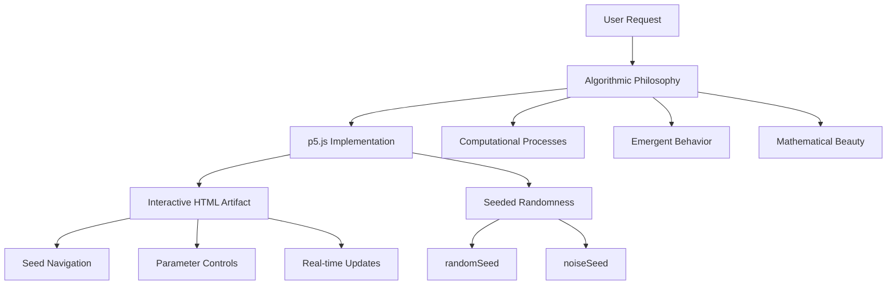
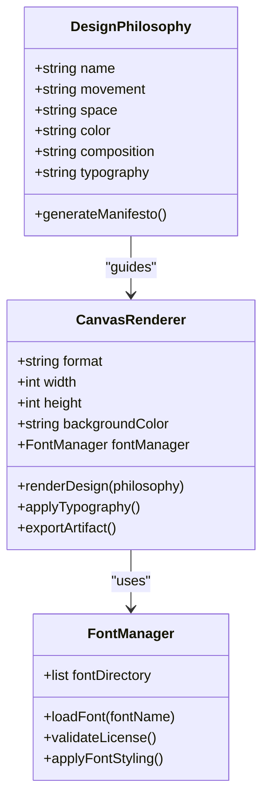
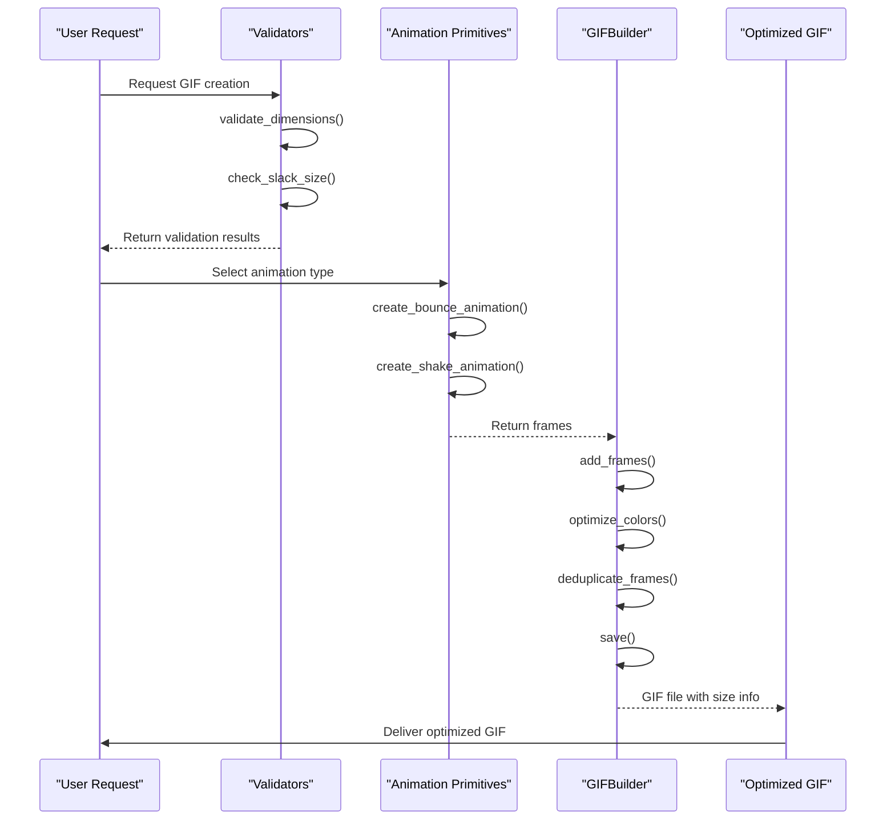
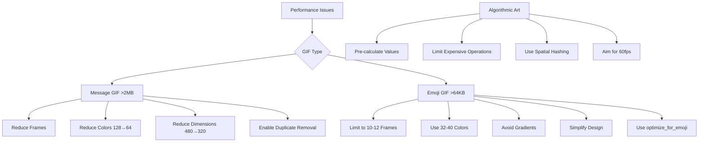
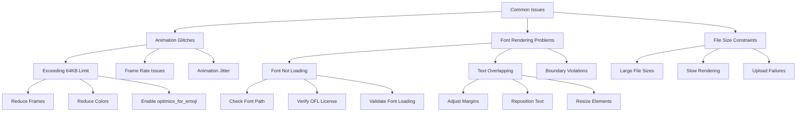

# Creative & Design Skills

<cite>
**Referenced Files in This Document**   
- [algorithmic-art/SKILL.md](file://algorithmic-art/SKILL.md)
- [algorithmic-art/templates/viewer.html](file://algorithmic-art/templates/viewer.html)
- [algorithmic-art/templates/generator_template.js](file://algorithmic-art/templates/generator_template.js)
- [canvas-design/SKILL.md](file://canvas-design/SKILL.md)
- [slack-gif-creator/SKILL.md](file://slack-gif-creator/SKILL.md)
- [slack-gif-creator/core/gif_builder.py](file://slack-gif-creator/core/gif_builder.py)
- [slack-gif-creator/core/easing.py](file://slack-gif-creator/core/easing.py)
- [slack-gif-creator/core/validators.py](file://slack-gif-creator/core/validators.py)
- [slack-gif-creator/templates/bounce.py](file://slack-gif-creator/templates/bounce.py)
- [README.md](file://README.md)
</cite>

## Table of Contents
1. [Introduction](#introduction)
2. [Algorithmic Art with p5.js](#algorithmic-art-with-p5js)
3. [Canvas Design & Visual Styling](#canvas-design--visual-styling)
4. [Slack GIF Creation](#slack-gif-creation)
5. [Performance Considerations](#performance-considerations)
6. [Troubleshooting Guide](#troubleshooting-guide)
7. [Conclusion](#conclusion)

## Introduction

The creative and design skills category encompasses tools for generating visual content through algorithmic processes, visual design philosophies, and animated formats. These skills enable the creation of generative art, styled static designs, and optimized animated GIFs for platforms like Slack. Each skill follows a structured approach that combines artistic vision with technical implementation, ensuring high-quality outputs that balance aesthetic expression with technical constraints. This document explains the purpose, implementation details, practical usage, and optimization strategies for these skills.

## Algorithmic Art with p5.js

The algorithmic-art skill enables the creation of generative art using p5.js, a JavaScript library for creative coding. This skill follows a two-phase process: first creating an algorithmic philosophy that defines the computational aesthetic, then implementing it through code with seeded randomness. The philosophy emphasizes emergent behavior, mathematical beauty, and parametric variation, guiding the development of dynamic, reproducible artworks.

The implementation uses p5.js to create interactive HTML artifacts that allow users to explore variations through seed navigation and parameter adjustments. The template `viewer.html` provides a consistent UI structure with fixed elements like seed controls and action buttons, while allowing customization of the generative algorithm and parameter controls. Seeded randomness ensures reproducibility, with `randomSeed()` and `noiseSeed()` functions synchronizing the random number generators based on a user-defined seed value.

The skill emphasizes craftsmanship, requiring algorithms to appear meticulously crafted and refined through countless iterations. Parameters are designed to control essential qualities of the system—such as quantities, scales, probabilities, and thresholds—rather than predefined pattern types. This approach ensures that the algorithm flows naturally from the philosophical foundation, creating living algorithms rather than static compositions.

**Diagram sources**
- [algorithmic-art/SKILL.md](file://algorithmic-art/SKILL.md#L135-L141)
- [algorithmic-art/templates/viewer.html](file://algorithmic-art/templates/viewer.html#L445-L452)

**Section sources**
- [algorithmic-art/SKILL.md](file://algorithmic-art/SKILL.md#L1-L405)
- [algorithmic-art/templates/viewer.html](file://algorithmic-art/templates/viewer.html#L1-L599)

## Canvas Design & Visual Styling

The canvas-design skill focuses on creating visually compelling static designs in PNG and PDF formats. This skill follows a design philosophy approach, where users first define an aesthetic movement that guides the visual expression. The philosophy emphasizes spatial communication, form, color, and composition, with minimal text used only as a visual accent.

A key feature of this skill is its comprehensive font management system. The `canvas-fonts` directory contains a curated collection of open-source fonts with OFL licenses, including ArsenalSC, BigShoulders, CrimsonPro, JetBrainsMono, and WorkSans. These fonts are selected for their visual diversity and licensing compatibility, enabling sophisticated typographic treatments without copyright concerns. The skill encourages using typography as an integral part of the artwork itself, with text positioned thoughtfully within the composition to enhance visual hierarchy.

The implementation process begins with creating a design philosophy that articulates how the aesthetic should manifest through space, form, color, and composition. This is followed by canvas creation, where the design is expressed visually with expert craftsmanship. The output is a single-page, highly visual artifact that could be displayed in a museum or magazine, with all elements contained within proper margins and no overlapping content.

**Diagram sources**
- [canvas-design/SKILL.md](file://canvas-design/SKILL.md#L1-L130)
- [canvas-design/canvas-fonts](file://canvas-design/canvas-fonts)

**Section sources**
- [canvas-design/SKILL.md](file://canvas-design/SKILL.md#L1-L130)

## Slack GIF Creation

The slack-gif-creator skill provides a comprehensive toolkit for creating animated GIFs optimized for Slack's technical constraints. This skill addresses the specific requirements for both message GIFs (~2MB limit) and emoji GIFs (64KB strict limit), providing validators, animation primitives, and optimization utilities to ensure compliance.

The core architecture consists of three main components: validators for checking size and dimension constraints, animation primitives for creating various motion effects, and helper utilities for common tasks. The `GIFBuilder` class serves as the central assembly mechanism, handling frame creation, color optimization, duplicate frame removal, and file size management. The builder automatically applies aggressive optimizations when creating emoji GIFs, including resizing to 128x128 pixels, limiting colors to 48, and reducing frame counts to approximately 12 frames.

Animation primitives are implemented as composable building blocks, allowing developers to combine effects like bounce, shake, spin, and pulse in creative ways. Each primitive is implemented as a separate module (e.g., `bounce.py`, `shake.py`) that generates frames according to specific motion patterns. These frames can be combined with easing functions from `easing.py` to create natural-looking motion with acceleration, deceleration, and bounce effects.

**Diagram sources**
- [slack-gif-creator/SKILL.md](file://slack-gif-creator/SKILL.md#L1-L647)
- [slack-gif-creator/core/gif_builder.py](file://slack-gif-creator/core/gif_builder.py#L1-L246)
- [slack-gif-creator/core/validators.py](file://slack-gif-creator/core/validators.py#L1-L265)

**Section sources**
- [slack-gif-creator/SKILL.md](file://slack-gif-creator/SKILL.md#L1-L647)
- [slack-gif-creator/core/gif_builder.py](file://slack-gif-creator/core/gif_builder.py#L1-L246)
- [slack-gif-creator/templates/bounce.py](file://slack-gif-creator/templates/bounce.py#L1-L106)

## Performance Considerations

Creating complex visuals requires careful attention to performance optimization across all creative skills. For algorithmic art, performance considerations include maintaining smooth 60fps animation, optimizing expensive operations like trigonometric calculations, and efficiently managing large numbers of elements through spatial hashing when needed. The p5.js implementation should pre-calculate values where possible and use simple collision detection to maintain responsiveness.

For Slack GIFs, optimization strategies differ based on the target format. Message GIFs (>2MB) can be optimized by reducing frame count, lowering color depth from 128 to 64 colors, decreasing dimensions from 480x480 to 320x320, and enabling duplicate frame removal. Emoji GIFs require more aggressive optimization due to the strict 64KB limit, including limiting to 10-15 frames total, using only 32-48 colors, avoiding gradients, keeping designs simple, and using the `optimize_for_emoji=True` flag in the save method.

The `GIFBuilder` class implements several optimization techniques automatically, including duplicate frame removal with a similarity threshold of 0.98, global palette quantization for better compression, and automatic resizing for emoji GIFs. Color optimization uses a global palette generated from sample frames to ensure consistent color reduction across all frames, improving both visual quality and file size efficiency.

**Diagram sources**
- [slack-gif-creator/SKILL.md](file://slack-gif-creator/SKILL.md#L520-L536)
- [slack-gif-creator/core/gif_builder.py](file://slack-gif-creator/core/gif_builder.py#L113-L146)

**Section sources**
- [slack-gif-creator/SKILL.md](file://slack-gif-creator/SKILL.md#L520-L536)
- [algorithmic-art/templates/generator_template.js](file://algorithmic-art/templates/generator_template.js#L116-L125)

## Troubleshooting Guide

Common issues in creative and design skills typically fall into three categories: animation glitches, font rendering problems, and file size constraints. For animation glitches in Slack GIFs, the most frequent cause is exceeding size limits, particularly for emoji GIFs. When a GIF exceeds the 64KB limit, the system provides specific warnings and suggestions, such as reducing frame count, using fewer colors, or simplifying the design. The `validate_gif()` function provides detailed feedback on what aspects of the GIF need optimization.

Font rendering issues in canvas design can occur when fonts are not properly loaded or when text overlaps canvas boundaries. To resolve these issues, ensure that fonts are correctly referenced from the `canvas-fonts` directory and that all text elements have proper margins. The skill requires that no elements overlap and that all content is contained within the canvas boundaries, with careful attention to text positioning and scaling.

For algorithmic art, common issues include non-reproducible outputs and performance bottlenecks. To ensure reproducibility, always use seeded randomness with both `randomSeed()` and `noiseSeed()` functions synchronized to the same seed value. Performance issues can be addressed by optimizing the draw loop, reducing the number of elements, or implementing `noLoop()` for static compositions. The template structure ensures that all interactive artifacts include proper seed navigation controls to facilitate exploration of variations.

**Diagram sources**
- [slack-gif-creator/core/validators.py](file://slack-gif-creator/core/validators.py#L1-L265)
- [canvas-design/SKILL.md](file://canvas-design/SKILL.md#L107-L114)

**Section sources**
- [slack-gif-creator/SKILL.md](file://slack-gif-creator/SKILL.md#L520-L536)
- [canvas-design/SKILL.md](file://canvas-design/SKILL.md#L104-L114)

## Conclusion

The creative and design skills provide a comprehensive framework for generating visual content through algorithmic processes, visual design philosophies, and animated formats. These skills balance artistic expression with technical constraints, enabling the creation of high-quality generative art, sophisticated static designs, and optimized animated GIFs. By following structured approaches that emphasize craftsmanship, reproducibility, and optimization, these skills empower users to create professional-grade visual content that meets both aesthetic and technical requirements. The integration of validation tools, composable animation primitives, and performance optimization techniques ensures that outputs are not only visually compelling but also technically sound and platform-appropriate.