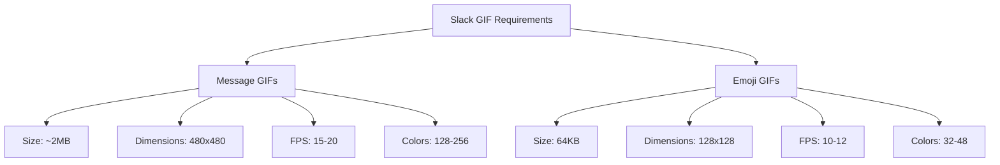
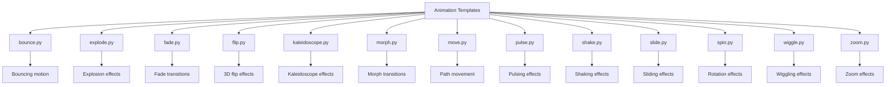
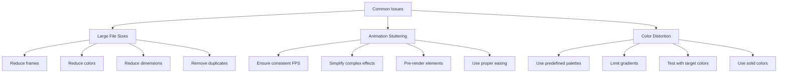

# Slack GIF Creator

<cite>
**Referenced Files in This Document**   
- [slack-gif-creator/SKILL.md](file://slack-gif-creator/SKILL.md)
- [slack-gif-creator/requirements.txt](file://slack-gif-creator/requirements.txt)
- [slack-gif-creator/core/color_palettes.py](file://slack-gif-creator/core/color_palettes.py)
- [slack-gif-creator/core/easing.py](file://slack-gif-creator/core/easing.py)
- [slack-gif-creator/core/frame_composer.py](file://slack-gif-creator/core/frame_composer.py)
- [slack-gif-creator/core/gif_builder.py](file://slack-gif-creator/core/gif_builder.py)
- [slack-gif-creator/core/typography.py](file://slack-gif-creator/core/typography.py)
- [slack-gif-creator/core/validators.py](file://slack-gif-creator/core/validators.py)
- [slack-gif-creator/core/visual_effects.py](file://slack-gif-creator/core/visual_effects.py)
- [slack-gif-creator/templates/bounce.py](file://slack-gif-creator/templates/bounce.py)
- [slack-gif-creator/templates/explode.py](file://slack-gif-creator/templates/explode.py)
- [slack-gif-creator/templates/fade.py](file://slack-gif-creator/templates/fade.py)
- [slack-gif-creator/templates/flip.py](file://slack-gif-creator/templates/flip.py)
- [slack-gif-creator/templates/kaleidoscope.py](file://slack-gif-creator/templates/kaleidoscope.py)
- [slack-gif-creator/templates/morph.py](file://slack-gif-creator/templates/morph.py)
- [slack-gif-creator/templates/move.py](file://slack-gif-creator/templates/move.py)
- [slack-gif-creator/templates/pulse.py](file://slack-gif-creator/templates/pulse.py)
- [slack-gif-creator/templates/shake.py](file://slack-gif-creator/templates/shake.py)
- [slack-gif-creator/templates/slide.py](file://slack-gif-creator/templates/slide.py)
- [slack-gif-creator/templates/spin.py](file://slack-gif-creator/templates/spin.py)
- [slack-gif-creator/templates/wiggle.py](file://slack-gif-creator/templates/wiggle.py)
- [slack-gif-creator/templates/zoom.py](file://slack-gif-creator/templates/zoom.py)
</cite>

## Table of Contents
1. [Introduction](#introduction)
2. [Slack Requirements](#slack-requirements)
3. [Core Modules](#core-modules)
4. [Animation Templates](#animation-templates)
5. [Creating Branded Animations](#creating-branded-animations)
6. [Integration with Brand Guidelines](#integration-with-brand-guidelines)
7. [Common Issues and Optimization](#common-issues-and-optimization)
8. [Extending the System](#extending-the-system)
9. [Conclusion](#conclusion)

## Introduction

The Slack GIF Creator skill provides a comprehensive toolkit for generating animated GIFs optimized for Slack messaging. This system enables the creation of attention-grabbing, branded animations that adhere to Slack's technical constraints while offering creative flexibility. The skill is designed to transform simple descriptions into engaging visual content that enhances communication in Slack channels.

The toolkit follows a modular architecture with composable animation primitives, allowing for the creation of complex sequences by combining simple effects. This approach provides maximum creative freedom while ensuring technical compliance with Slack's requirements for both message GIFs and emoji GIFs.

**Section sources**
- [slack-gif-creator/SKILL.md](file://slack-gif-creator/SKILL.md#L1-L9)

## Slack Requirements

Slack imposes specific technical constraints on GIFs that vary depending on their intended use. Understanding these requirements is essential for creating compatible animations.

### Message GIFs
Message GIFs have more relaxed constraints compared to emoji GIFs:
- Maximum size: ~2MB
- Optimal dimensions: 480x480 pixels
- Typical frame rate: 15-20 FPS
- Color limit: 128-256 colors
- Duration: 2-5 seconds

### Emoji GIFs
Emoji GIFs have much stricter limitations:
- Maximum size: 64KB (strict limit)
- Optimal dimensions: 128x128 pixels
- Typical frame rate: 10-12 FPS
- Color limit: 32-48 colors
- Duration: 1-2 seconds

Due to the 64KB limit for emoji GIFs, several optimization strategies are recommended:
- Limit to 10-15 frames total
- Use 32-48 colors maximum
- Keep designs simple
- Avoid gradients
- Validate file size frequently

The toolkit provides validators to automatically check if generated GIFs meet these requirements, with warnings issued when limits are exceeded.

**Diagram sources**
- [slack-gif-creator/SKILL.md](file://slack-gif-creator/SKILL.md#L11-L35)

## Core Modules

The Slack GIF Creator consists of seven core modules that work together to generate optimized animations. Each module serves a specific purpose in the GIF creation pipeline.

### color_palettes.py
This module provides professional, harmonious color schemes for GIFs. Using consistent color palettes ensures that animations look polished and aligned with brand identity. The module includes several predefined palettes:
- Vibrant: Bright, attention-grabbing colors
- Pastel: Soft, gentle colors
- Dark: Muted colors for dark backgrounds
- Neon: High-contrast, glowing colors
- Professional: Corporate-friendly colors
- Warm: Earthy, inviting colors
- Cool: Calming, refreshing colors
- Monochrome: Single-color variations

The module also includes functions for generating complementary colors, lightening/darkening colors, and creating gradients, enabling sophisticated color manipulation.

**Section sources**
- [slack-gif-creator/core/color_palettes.py](file://slack-gif-creator/core/color_palettes.py#L1-L302)

### easing.py
This module provides timing functions for smooth animations. Easing functions control the rate of change in animations, making motion appear more natural and less mechanical. The module includes various easing types:
- Linear: Constant speed
- Ease-in: Starts slowly, accelerates
- Ease-out: Starts fast, decelerates
- Ease-in-out: Slow start and end
- Bounce: Bouncy effect
- Elastic: Spring-like effect
- Back: Overshoot effect

These functions can be applied to any animation parameter, such as position, scale, or rotation, to create more dynamic and engaging motion.

**Section sources**
- [slack-gif-creator/core/easing.py](file://slack-gif-creator/core/easing.py#L1-L230)

### frame_composer.py
This module provides utilities for composing visual elements into frames. It includes functions for drawing basic shapes (circles, rectangles, lines), text, emojis, and combining multiple layers. Key features include:
- Creating blank frames with solid or gradient backgrounds
- Drawing shapes with optional shadows
- Compositing multiple image layers
- Adding visual effects like vignettes
- Drawing specialized elements like stars

These functions serve as building blocks for constructing individual frames in an animation sequence.

**Section sources**
- [slack-gif-creator/core/frame_composer.py](file://slack-gif-creator/core/frame_composer.py#L1-L469)

### gif_builder.py
This module is responsible for assembling frames into the final GIF file with optimization for Slack's requirements. The GIFBuilder class manages the animation creation process:
- Adding frames to the animation
- Optimizing colors through quantization
- Removing duplicate consecutive frames
- Saving the final GIF with appropriate settings

The module automatically applies optimizations and provides feedback on file size, with warnings when Slack's limits are exceeded. For emoji GIFs, it can automatically resize to 128x128 and reduce frame count to meet the 64KB limit.

**Section sources**
- [slack-gif-creator/core/gif_builder.py](file://slack-gif-creator/core/gif_builder.py#L1-L246)

### typography.py
This module provides professional text rendering with outlines, shadows, and other effects to ensure readability in GIFs. Key features include:
- Drawing text with outlines (essential for readability)
- Adding drop shadows and glow effects
- Drawing text in semi-transparent boxes
- Font size scaling based on frame dimensions
- Automatic font selection with fallbacks

The text-with-outline function is particularly important for ensuring text remains readable against various backgrounds.

**Section sources**
- [slack-gif-creator/core/typography.py](file://slack-gif-creator/core/typography.py#L1-L357)

### validators.py
This module provides functions to check if GIFs meet Slack's requirements. It includes validators for:
- File size (64KB limit for emojis, 2MB for messages)
- Dimensions (128x128 for emojis, 480x480 optimal for messages)
- Frame count and duration

The validation functions provide detailed feedback and suggestions for optimization when requirements are not met, helping users iterate toward compliant animations.

**Section sources**
- [slack-gif-creator/core/validators.py](file://slack-gif-creator/core/validators.py#L1-L265)

### visual_effects.py
This module provides particle systems, motion blur, impacts, and other effects to enhance animations. Key features include:
- Particle systems for confetti, sparkles, and explosions
- Motion blur for fast-moving objects
- Impact flashes and shockwave rings
- Speed lines for motion effects
- Screen shake for impact moments
- Glow effects for emphasis

These effects can be combined with basic animations to create more dynamic and engaging visuals.

**Section sources**
- [slack-gif-creator/core/visual_effects.py](file://slack-gif-creator/core/visual_effects.py#L1-L494)

## Animation Templates

The Slack GIF Creator includes 13 animation templates that serve as composable building blocks for motion. These templates can be used individually or combined to create complex sequences.

### bounce.py
Creates bouncing motion with realistic physics. Objects can bounce vertically or horizontally with customizable height and ground position. The animation uses bounce easing to simulate natural motion.

### explode.py
Creates explosion, shatter, and particle burst effects. The module supports various explosion types:
- Burst: Objects expand outward
- Shatter: Objects break into geometric pieces
- Dissolve: Objects fade into particles
- Implode: Particles converge inward

### fade.py
Creates smooth opacity transitions including fade in, fade out, blink, and crossfade between two objects. The module supports various easing functions for different fade characteristics.

### flip.py
Creates 3D-style card flip and rotation effects with perspective. Supports horizontal and vertical flips, with the ability to show different content on each side.

### kaleidoscope.py
Applies mirror/rotation effects to create psychedelic visuals. Supports various segment counts and rotation speeds for animated kaleidoscope effects.

### morph.py
Creates smooth transitions between different emojis or shapes. Supports various morph types:
- Crossfade: Simple opacity transition
- Scale: One object shrinks as another grows
- Spin morph: 3D flip-like transition

### move.py
Moves objects along various paths including linear, arc, circular, and wave trajectories. Supports custom easing for different motion characteristics.

### pulse.py
Scales objects rhythmically for emphasis. Supports various pulse types:
- Smooth: Sinusoidal pulsing
- Heartbeat: Double-pump effect
- Throb: Sharp pulse with quick return
- Pop: Overshoot effect

### shake.py
Creates shaking/vibrating motion for impact effects or emphasis. Supports horizontal, vertical, or combined shaking with intensity that decays over time.

### slide.py
Slides objects into or across the frame. Supports various slide types:
- In: Object enters from edge
- Across: Object moves across screen
- Multi-slide: Multiple objects slide in sequence

### spin.py
Rotates objects clockwise, counterclockwise, or with wobble effects. Includes specialized functions for loading spinners.

### wiggle.py
Creates jello wobble or wave motion effects. Useful for creating organic, fluid movement.

### zoom.py
Zooms in or out dramatically, with optional motion blur. Includes specialized functions for explosion zoom effects.

**Diagram sources**
- [slack-gif-creator/SKILL.md](file://slack-gif-creator/SKILL.md#L94-L367)
- [slack-gif-creator/templates](file://slack-gif-creator/templates)

## Creating Branded Animations

To create attention-grabbing Slack messages with branded animations, follow these steps:

1. **Define the creative vision**: Determine the mood, message, and key elements of the animation.
2. **Select appropriate animation templates**: Choose one or more templates that best convey the desired effect.
3. **Apply brand styling**: Use the color_palettes module to ensure colors align with brand guidelines.
4. **Compose the animation**: Combine animation primitives to create the desired sequence.
5. **Add text and effects**: Use typography and visual effects to enhance the message.
6. **Validate and optimize**: Check that the animation meets Slack's requirements.

For example, to create a "goal scored" animation:
- Use move.py to slide a soccer ball across the screen
- Apply shake.py when the ball hits the goal
- Add create_impact_flash from visual_effects.py for visual emphasis
- Use draw_text_with_outline to display "GOAL!" with a bold outline
- Apply a pulse.py effect to make the text throb

The animation templates are designed to be composable, allowing for creative combinations. For instance, a bouncing object can also pulse in size, or a sliding object can have a motion trail effect.

**Section sources**
- [slack-gif-creator/SKILL.md](file://slack-gif-creator/SKILL.md#L537-L627)

## Integration with Brand Guidelines

The Slack GIF Creator integrates with brand-guidelines and theme-factory skills to ensure consistent styling across all animations. This integration enables:

- **Color consistency**: The color_palettes module can be extended to include brand-specific color schemes, ensuring all animations use approved brand colors.
- **Typography standards**: The typography module can be configured to use brand-approved fonts and text styles.
- **Theme application**: The theme-factory skill can provide pre-configured themes that set default colors, fonts, and animation styles.

To integrate with brand guidelines:
1. Define brand colors in a palette format compatible with color_palettes.py
2. Register the palette with the system
3. Use get_palette('brand-name') to access brand colors in animations
4. Configure typography settings to match brand guidelines

This ensures that all generated animations maintain brand consistency while still allowing for creative variation within approved parameters.

**Section sources**
- [slack-gif-creator/core/color_palettes.py](file://slack-gif-creator/core/color_palettes.py#L1-L302)
- [slack-gif-creator/core/typography.py](file://slack-gif-creator/core/typography.py#L1-L357)

## Common Issues and Optimization

Several common issues can arise when creating Slack-optimized GIFs, along with corresponding optimization techniques.

### Large File Sizes
When GIFs exceed Slack's size limits, consider these optimizations:
- **Reduce frames**: Lower the frame count or duration
- **Reduce colors**: Use fewer colors (128 → 64 for messages, 32-40 for emojis)
- **Reduce dimensions**: Decrease frame size (480x480 → 320x320)
- **Enable duplicate frame removal**: The gif_builder automatically removes identical consecutive frames

For emoji GIFs (>64KB), be more aggressive:
- Limit to 10-12 frames total
- Use 32-40 colors maximum
- Avoid gradients (solid colors compress better)
- Simplify design (fewer elements)
- Use optimize_for_emoji=True in save method

### Animation Stuttering
Stuttering can occur due to inconsistent frame timing or excessive complexity:
- Ensure consistent frame rate throughout the animation
- Simplify complex effects that may cause rendering delays
- Pre-render complex elements when possible
- Use appropriate easing functions to create smooth motion

### Color Distortion
Color issues can arise from quantization or compression:
- Use the predefined color palettes to ensure color harmony
- Limit gradients which can cause banding when color-reduced
- Test animations with the target number of colors before finalizing
- Use solid colors where possible for better compression

The validators module provides tools to identify these issues early in the creation process, with specific suggestions for improvement when validation fails.

**Diagram sources**
- [slack-gif-creator/SKILL.md](file://slack-gif-creator/SKILL.md#L520-L536)
- [slack-gif-creator/core/validators.py](file://slack-gif-creator/core/validators.py#L1-L265)

## Extending the System

The Slack GIF Creator is designed to be extensible, allowing for the addition of custom animation templates and effects.

To create a custom animation template:
1. Create a new Python file in the templates directory
2. Import necessary modules from core
3. Define a function that generates frames according to the animation logic
4. Ensure the function returns a list of PIL Image objects
5. Include example usage code

Custom templates should follow the same pattern as existing templates, accepting parameters for customization and returning frames that can be added to a GIFBuilder instance.

Additional extensions could include:
- New visual effects in visual_effects.py
- Additional easing functions in easing.py
- Specialized frame composition functions in frame_composer.py
- Support for additional file formats in gif_builder.py

The modular design ensures that new components can be added without modifying existing code, promoting maintainability and reducing the risk of introducing bugs.

**Section sources**
- [slack-gif-creator/templates](file://slack-gif-creator/templates)
- [slack-gif-creator/core](file://slack-gif-creator/core)

## Conclusion

The Slack GIF Creator provides a powerful, flexible toolkit for generating animated GIFs optimized for Slack. By combining composable animation primitives with robust optimization and validation tools, it enables the creation of engaging, branded content that adheres to Slack's technical constraints.

The system's modular architecture allows for creative freedom while ensuring technical compliance, making it possible to produce professional-quality animations from simple descriptions. Integration with brand guidelines ensures consistency across all communications, while extensibility allows for customization to meet specific needs.

By following the principles outlined in this documentation—understanding Slack's requirements, using appropriate animation templates, applying brand styling, and optimizing for performance—users can create compelling visual content that enhances communication in Slack.

**Section sources**
- [slack-gif-creator/SKILL.md](file://slack-gif-creator/SKILL.md#L628-L638)