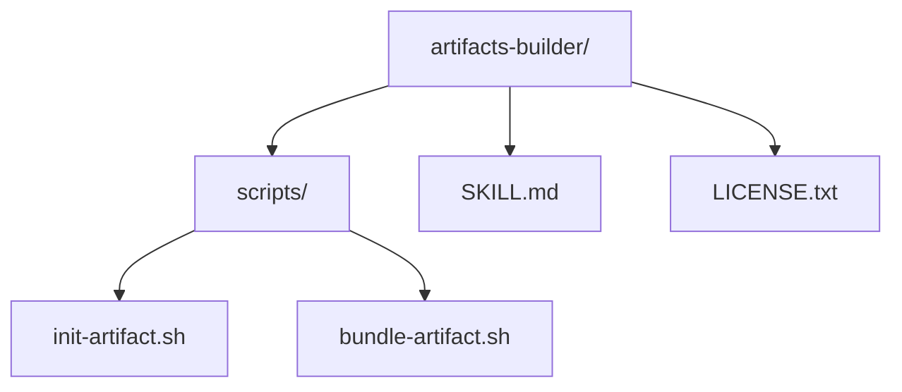
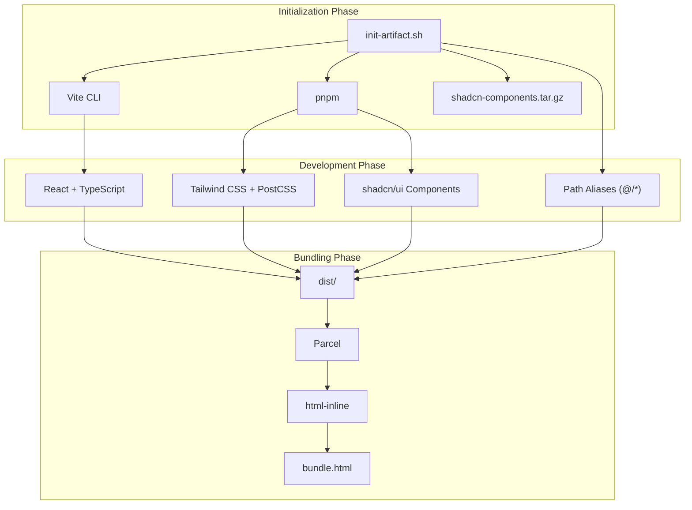
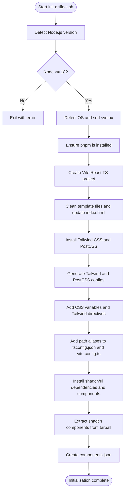
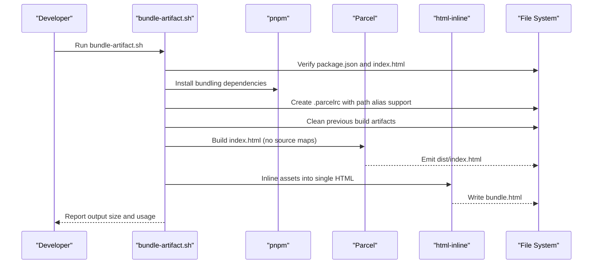

# Artifacts Builder

<cite>
**Referenced Files in This Document**
- [init-artifact.sh](file://artifacts-builder/scripts/init-artifact.sh)
- [bundle-artifact.sh](file://artifacts-builder/scripts/bundle-artifact.sh)
- [SKILL.md](file://artifacts-builder/SKILL.md)
- [LICENSE.txt](file://artifacts-builder/LICENSE.txt)
- [README.md](file://README.md)
</cite>

## Table of Contents
1. [Introduction](#introduction)
2. [Project Structure](#project-structure)
3. [Core Components](#core-components)
4. [Architecture Overview](#architecture-overview)
5. [Detailed Component Analysis](#detailed-component-analysis)
6. [Dependency Analysis](#dependency-analysis)
7. [Performance Considerations](#performance-considerations)
8. [Troubleshooting Guide](#troubleshooting-guide)
9. [Conclusion](#conclusion)
10. [Appendices](#appendices)

## Introduction
The Artifacts Builder skill enables dynamic generation of interactive HTML artifacts for Claude conversations using modern frontend technologies. It provides a complete pipeline:
- Initialization of a React + TypeScript + Vite project with Tailwind CSS and shadcn/ui components
- Development of rich, stateful UIs with 40+ pre-configured shadcn/ui components
- Bundling into a single HTML artifact using Parcel and html-inline for easy sharing

This skill is ideal for complex artifacts requiring state management, routing, or sophisticated UI components—rather than simple single-file HTML/JSX artifacts.

## Project Structure
The artifacts-builder skill consists of two primary shell scripts and documentation:
- scripts/init-artifact.sh: Initializes a React + Vite project, installs Tailwind CSS and shadcn/ui, configures path aliases, and prepares the project for development
- scripts/bundle-artifact.sh: Bundles the React app into a single HTML artifact suitable for sharing in Claude conversations
- SKILL.md: Instructions and quick start guidance
- LICENSE.txt: Licensing terms

**Diagram sources**
- [init-artifact.sh](file://artifacts-builder/scripts/init-artifact.sh#L1-L323)
- [bundle-artifact.sh](file://artifacts-builder/scripts/bundle-artifact.sh#L1-L54)
- [SKILL.md](file://artifacts-builder/SKILL.md#L1-L74)
- [LICENSE.txt](file://artifacts-builder/LICENSE.txt#L1-L202)

**Section sources**
- [init-artifact.sh](file://artifacts-builder/scripts/init-artifact.sh#L1-L323)
- [bundle-artifact.sh](file://artifacts-builder/scripts/bundle-artifact.sh#L1-L54)
- [SKILL.md](file://artifacts-builder/SKILL.md#L1-L74)
- [README.md](file://README.md#L33-L35)

## Core Components
- Initialization script (init-artifact.sh)
  - Validates Node.js version (requires 18+)
  - Auto-detects OS and sets sed syntax accordingly
  - Ensures pnpm is installed globally
  - Creates a Vite React TypeScript project
  - Cleans up template files and updates index.html
  - Installs Tailwind CSS, PostCSS, and related dependencies
  - Generates Tailwind and PostCSS configuration files
  - Adds CSS variables and Tailwind directives to index.css
  - Adds path aliases to tsconfig.json and tsconfig.app.json
  - Updates vite.config.ts with path alias resolution
  - Installs shadcn/ui dependencies and 40+ components
  - Extracts shadcn components from a tarball into src/
  - Creates components.json for reference
  - Prints usage examples and next steps

- Bundling script (bundle-artifact.sh)
  - Validates presence of package.json and index.html
  - Installs bundling dependencies (Parcel, @parcel/config-default, parcel-resolver-tspaths, html-inline)
  - Creates .parcelrc with path alias support
  - Cleans previous builds and runs Parcel build targeting index.html
  - Inlines all assets into a single HTML file using html-inline
  - Reports output size and provides usage guidance

**Section sources**
- [init-artifact.sh](file://artifacts-builder/scripts/init-artifact.sh#L1-L323)
- [bundle-artifact.sh](file://artifacts-builder/scripts/bundle-artifact.sh#L1-L54)
- [SKILL.md](file://artifacts-builder/SKILL.md#L16-L74)

## Architecture Overview
The build pipeline integrates Node.js tooling to scaffold a modern React project, configure Tailwind CSS and shadcn/ui, and produce a single HTML artifact.

**Diagram sources**
- [init-artifact.sh](file://artifacts-builder/scripts/init-artifact.sh#L1-L323)
- [bundle-artifact.sh](file://artifacts-builder/scripts/bundle-artifact.sh#L1-L54)

## Detailed Component Analysis

### Initialization Workflow (init-artifact.sh)
The initialization script orchestrates a complete frontend setup:
- Node.js version detection and Vite version pinning for Node 18 compatibility
- OS-aware sed syntax selection
- pnpm installation if missing
- Vite project creation with React TypeScript template
- Template cleanup and index.html adjustments
- Tailwind CSS and PostCSS installation and configuration
- CSS variables and Tailwind directives injection
- Path alias configuration for TypeScript and Vite
- Vite plugin configuration for React and path resolution
- Installation of 40+ shadcn/ui components and Radix UI dependencies
- Extraction of shadcn components from tarball into src/
- Creation of components.json for reference

**Diagram sources**
- [init-artifact.sh](file://artifacts-builder/scripts/init-artifact.sh#L1-L323)

**Section sources**
- [init-artifact.sh](file://artifacts-builder/scripts/init-artifact.sh#L1-L323)

### Bundling Workflow (bundle-artifact.sh)
The bundling script produces a single HTML artifact:
- Validates project context (presence of package.json and index.html)
- Installs bundling dependencies (Parcel and related resolvers)
- Creates .parcelrc with path alias support
- Cleans previous builds
- Runs Parcel build targeting index.html without source maps
- Inlines assets into a single HTML file using html-inline
- Reports output size and usage guidance

**Diagram sources**
- [bundle-artifact.sh](file://artifacts-builder/scripts/bundle-artifact.sh#L1-L54)

**Section sources**
- [bundle-artifact.sh](file://artifacts-builder/scripts/bundle-artifact.sh#L1-L54)

### Directory Structure Setup and Path Aliases
The initialization script establishes a clean, scalable project structure:
- Vite project scaffolded with React + TypeScript
- Tailwind CSS configured with dark mode support and CSS variables
- Path aliases (@/*) configured for both TypeScript and Vite
- Vite plugin for React and path resolution enabled

Key outcomes:
- Consistent import paths across the codebase
- Easy-to-read imports referencing src/ via @/*
- Seamless integration with shadcn/ui component library

**Section sources**
- [init-artifact.sh](file://artifacts-builder/scripts/init-artifact.sh#L226-L268)

### Dependency Management
The initialization script manages dependencies across multiple categories:
- Base framework: React, TypeScript, Vite
- Styling: Tailwind CSS 3.4.1, PostCSS, Autoprefixer, tailwindcss-animate
- Utilities: class-variance-authority, clsx, tailwind-merge
- Icons and themes: lucide-react, next-themes
- UI primitives: 40+ shadcn/ui components and Radix UI dependencies
- Development tools: @types/node

Bundling dependencies:
- Parcel with @parcel/config-default
- parcel-resolver-tspaths for path alias support
- html-inline for asset inlining

**Section sources**
- [init-artifact.sh](file://artifacts-builder/scripts/init-artifact.sh#L71-L80)
- [init-artifact.sh](file://artifacts-builder/scripts/init-artifact.sh#L270-L274)
- [bundle-artifact.sh](file://artifacts-builder/scripts/bundle-artifact.sh#L21-L31)

### Integration with Claude
The skill is designed for dynamic generation of production-ready frontend code for Claude conversations:
- The initialization script prepares a fully functional React + Tailwind + shadcn/ui project
- The bundling script produces a single HTML artifact that can be directly shared in Claude
- The SKILL.md provides clear instructions and quick start guidance
- The README highlights the skill’s purpose and placement among example skills

Practical usage:
- Initialize a new artifact project using the initialization script
- Develop the artifact using React and shadcn/ui components
- Bundle into a single HTML artifact using the bundling script
- Share the artifact in Claude conversations

**Section sources**
- [SKILL.md](file://artifacts-builder/SKILL.md#L1-L74)
- [README.md](file://README.md#L33-L35)

## Dependency Analysis
The scripts depend on Node.js tooling and package managers:
- Node.js 18+ requirement with automatic Vite version pinning for Node 18 compatibility
- pnpm for package management and dependency installation
- OS-aware sed syntax for platform compatibility
- Vite for development server and module resolution
- Parcel for bundling and html-inline for asset inlining

Potential coupling and cohesion:
- init-artifact.sh is cohesive around project scaffolding and configuration
- bundle-artifact.sh is cohesive around bundling and packaging
- Both scripts rely on pnpm and OS detection for portability

External dependencies:
- shadcn-components.tar.gz (extracted into src/)
- Tailwind CSS ecosystem
- Parcel bundler ecosystem

**Section sources**
- [init-artifact.sh](file://artifacts-builder/scripts/init-artifact.sh#L1-L323)
- [bundle-artifact.sh](file://artifacts-builder/scripts/bundle-artifact.sh#L1-L54)

## Performance Considerations
Optimization strategies for lightweight artifact generation:
- Use Parcel build with no source maps to reduce artifact size
- Inline assets into a single HTML file to minimize HTTP requests
- Prefer CSS variables and minimal animations to keep payload small
- Limit the number of imported shadcn/ui components to only those needed
- Avoid unnecessary dependencies during initialization
- Clean previous builds before bundling to prevent accumulation of unused assets

[No sources needed since this section provides general guidance]

## Troubleshooting Guide
Common issues and resolutions:
- Node.js version mismatch
  - Symptom: Script exits with Node version error
  - Resolution: Upgrade to Node.js 18+ or use a compatible environment
  - Section sources
    - [init-artifact.sh](file://artifacts-builder/scripts/init-artifact.sh#L11-L15)

- Missing pnpm
  - Symptom: pnpm not found during initialization
  - Resolution: The script installs pnpm globally; ensure network connectivity and retry
  - Section sources
    - [init-artifact.sh](file://artifacts-builder/scripts/init-artifact.sh#L33-L37)

- Missing shadcn-components.tar.gz
  - Symptom: Script fails to find components tarball
  - Resolution: Ensure the tarball is present in the scripts directory
  - Section sources
    - [init-artifact.sh](file://artifacts-builder/scripts/init-artifact.sh#L49-L54)

- Missing package.json or index.html during bundling
  - Symptom: Bundling script exits early
  - Resolution: Run the bundling script from a project root with package.json and index.html
  - Section sources
    - [bundle-artifact.sh](file://artifacts-builder/scripts/bundle-artifact.sh#L7-L17)

- Build failures due to dependency conflicts
  - Symptom: Parcel build errors
  - Resolution: Reinstall bundling dependencies; ensure path aliases are configured (.parcelrc); clean previous builds
  - Section sources
    - [bundle-artifact.sh](file://artifacts-builder/scripts/bundle-artifact.sh#L21-L31)
    - [bundle-artifact.sh](file://artifacts-builder/scripts/bundle-artifact.sh#L35-L41)

- Large artifact size
  - Symptom: bundle.html is larger than expected
  - Resolution: Reduce imported components, remove unused assets, and confirm no extra files are included
  - Section sources
    - [bundle-artifact.sh](file://artifacts-builder/scripts/bundle-artifact.sh#L47-L54)

## Conclusion
The Artifacts Builder skill provides a robust, repeatable pipeline for generating interactive HTML artifacts using React, Tailwind CSS, and shadcn/ui. By combining a streamlined initialization process with a focused bundling strategy, it enables developers to quickly create production-ready artifacts for Claude conversations while maintaining simplicity and portability.

[No sources needed since this section summarizes without analyzing specific files]

## Appendices

### A. Quick Start Commands
- Initialize a new artifact project:
  - Run the initialization script with a project name and navigate into the created directory
  - Section sources
    - [SKILL.md](file://artifacts-builder/SKILL.md#L24-L31)

- Bundle the artifact:
  - From the project root, run the bundling script to produce bundle.html
  - Section sources
    - [SKILL.md](file://artifacts-builder/SKILL.md#L47-L51)

### B. License
This skill is licensed under the Apache License, Version 2.0. See LICENSE.txt for the full license text.
- Section sources
  - [LICENSE.txt](file://artifacts-builder/LICENSE.txt#L1-L202)