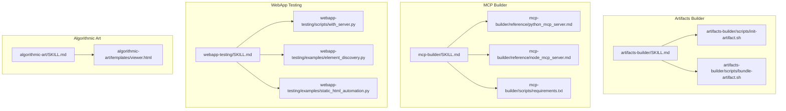
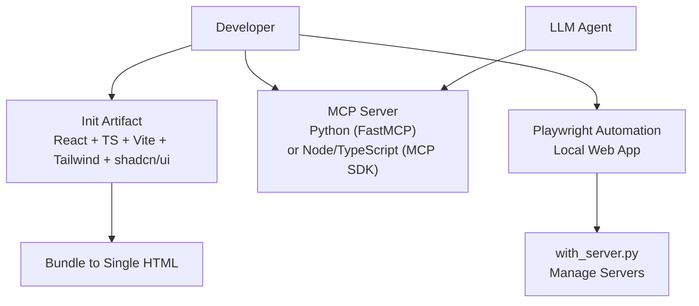
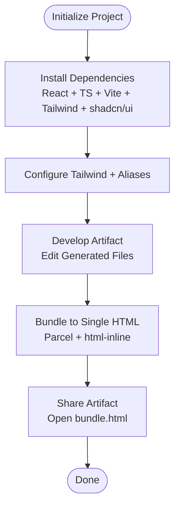
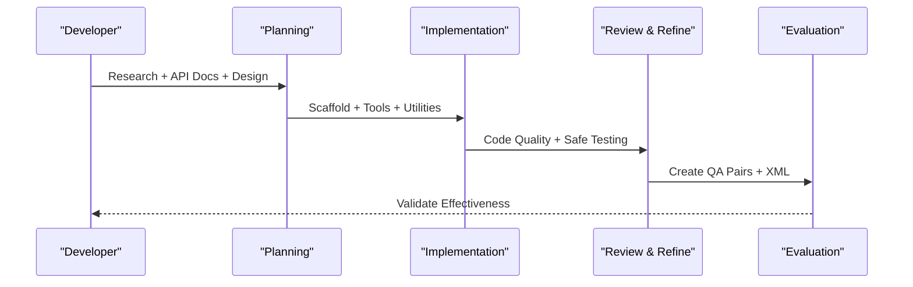
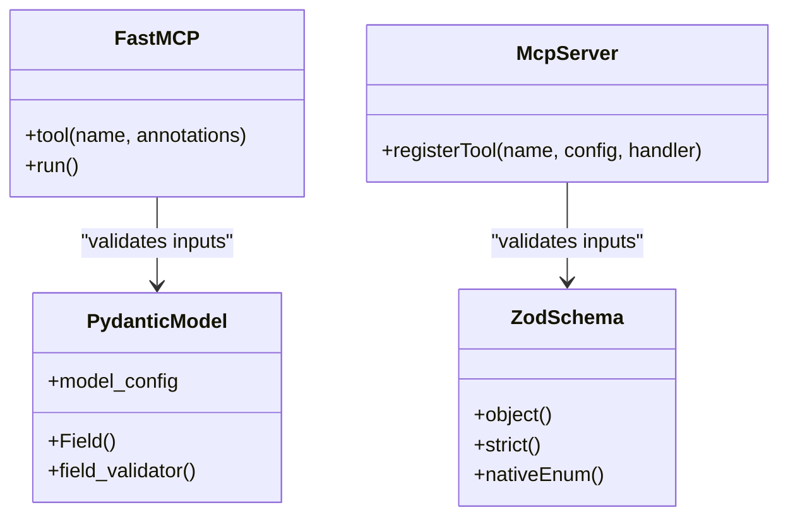
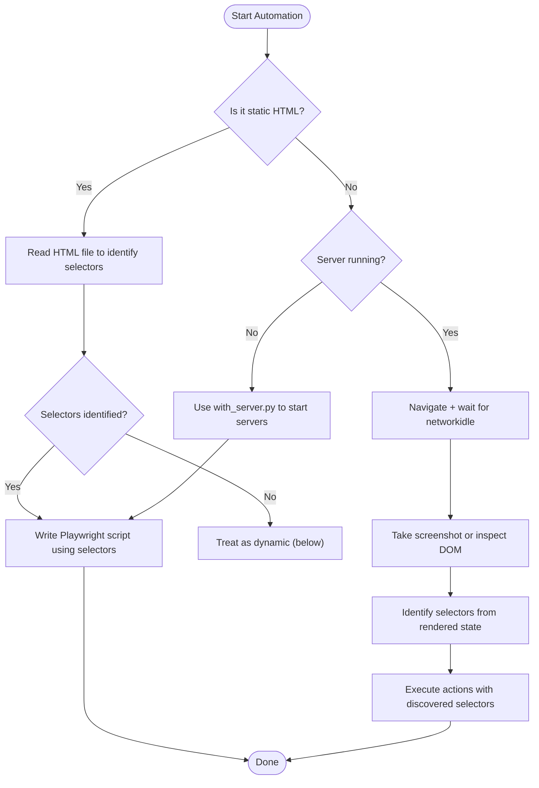
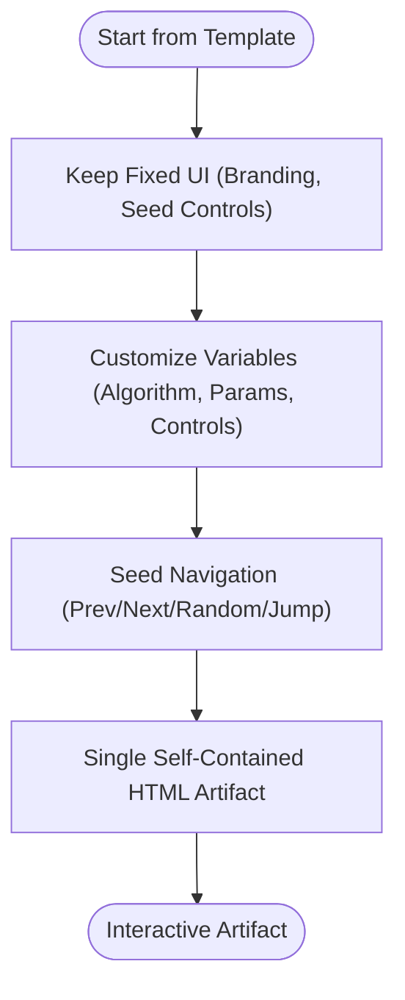
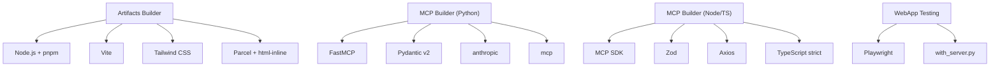

# Development & Technical Skills

<cite>
**Referenced Files in This Document**
- [artifacts-builder/SKILL.md](file://artifacts-builder/SKILL.md)
- [artifacts-builder/scripts/init-artifact.sh](file://artifacts-builder/scripts/init-artifact.sh)
- [artifacts-builder/scripts/bundle-artifact.sh](file://artifacts-builder/scripts/bundle-artifact.sh)
- [mcp-builder/SKILL.md](file://mcp-builder/SKILL.md)
- [mcp-builder/reference/python_mcp_server.md](file://mcp-builder/reference/python_mcp_server.md)
- [mcp-builder/reference/node_mcp_server.md](file://mcp-builder/reference/node_mcp_server.md)
- [mcp-builder/scripts/requirements.txt](file://mcp-builder/scripts/requirements.txt)
- [webapp-testing/SKILL.md](file://webapp-testing/SKILL.md)
- [webapp-testing/scripts/with_server.py](file://webapp-testing/scripts/with_server.py)
- [webapp-testing/examples/element_discovery.py](file://webapp-testing/examples/element_discovery.py)
- [webapp-testing/examples/static_html_automation.py](file://webapp-testing/examples/static_html_automation.py)
- [algorithmic-art/SKILL.md](file://algorithmic-art/SKILL.md)
- [algorithmic-art/templates/viewer.html](file://algorithmic-art/templates/viewer.html)
</cite>

## Table of Contents
1. [Introduction](#introduction)
2. [Project Structure](#project-structure)
3. [Core Components](#core-components)
4. [Architecture Overview](#architecture-overview)
5. [Detailed Component Analysis](#detailed-component-analysis)
6. [Dependency Analysis](#dependency-analysis)
7. [Performance Considerations](#performance-considerations)
8. [Troubleshooting Guide](#troubleshooting-guide)
9. [Conclusion](#conclusion)
10. [Appendices](#appendices)

## Introduction
This document explains the development and technical skills that power modern software workflows: building interactive HTML artifacts, integrating external services via MCP servers, and automating web application testing. It focuses on:
- artifacts-builder: React + Tailwind CSS + shadcn/ui for multi-component HTML artifacts, with bundling to a single HTML file for easy sharing.
- mcp-builder: MCP server creation for external API connectivity using Python (FastMCP) or Node/TypeScript (MCP SDK), emphasizing robust tool design, validation, and transport options.
- webapp-testing: Playwright-based browser automation for local web apps, including server lifecycle management and best practices for reliable UI testing.

The goal is to help developers build optimized artifacts, integrate external services safely and efficiently, and automate UI testing with consistent, maintainable scripts.

## Project Structure
The repository organizes skills by capability. The relevant directories for this document are:
- artifacts-builder: Provides scaffolding and bundling for React/Tailwind/shadcn/ui artifacts.
- mcp-builder: Guides MCP server creation for Python and Node/TypeScript, with reference materials and evaluation practices.
- webapp-testing: Provides Playwright automation scripts and examples for local web apps.
- algorithmic-art: Demonstrates a template-driven approach to creating interactive generative art artifacts.

**Diagram sources**
- [artifacts-builder/SKILL.md](file://artifacts-builder/SKILL.md#L1-L74)
- [artifacts-builder/scripts/init-artifact.sh](file://artifacts-builder/scripts/init-artifact.sh#L1-L323)
- [artifacts-builder/scripts/bundle-artifact.sh](file://artifacts-builder/scripts/bundle-artifact.sh#L1-L54)
- [mcp-builder/SKILL.md](file://mcp-builder/SKILL.md#L1-L329)
- [mcp-builder/reference/python_mcp_server.md](file://mcp-builder/reference/python_mcp_server.md#L1-L752)
- [mcp-builder/reference/node_mcp_server.md](file://mcp-builder/reference/node_mcp_server.md#L1-L800)
- [mcp-builder/scripts/requirements.txt](file://mcp-builder/scripts/requirements.txt#L1-L3)
- [webapp-testing/SKILL.md](file://webapp-testing/SKILL.md#L1-L96)
- [webapp-testing/scripts/with_server.py](file://webapp-testing/scripts/with_server.py#L1-L106)
- [webapp-testing/examples/element_discovery.py](file://webapp-testing/examples/element_discovery.py#L1-L40)
- [webapp-testing/examples/static_html_automation.py](file://webapp-testing/examples/static_html_automation.py#L1-L33)
- [algorithmic-art/SKILL.md](file://algorithmic-art/SKILL.md#L1-L405)
- [algorithmic-art/templates/viewer.html](file://algorithmic-art/templates/viewer.html#L1-L599)

**Section sources**
- [artifacts-builder/SKILL.md](file://artifacts-builder/SKILL.md#L1-L74)
- [mcp-builder/SKILL.md](file://mcp-builder/SKILL.md#L1-L329)
- [webapp-testing/SKILL.md](file://webapp-testing/SKILL.md#L1-L96)
- [algorithmic-art/SKILL.md](file://algorithmic-art/SKILL.md#L1-L405)

## Core Components
- artifacts-builder: Initializes a React + TypeScript + Vite + Tailwind CSS + shadcn/ui project and bundles it into a single HTML artifact for sharing.
- mcp-builder: Provides end-to-end guidance for building MCP servers in Python (FastMCP) or Node/TypeScript (MCP SDK), including tool design, validation, transport, and evaluation.
- webapp-testing: Offers Playwright automation scripts and examples for local web apps, including a helper to manage server lifecycles and a reconnaissance-first automation pattern.
- algorithmic-art: Demonstrates a template-driven approach to creating interactive generative art artifacts with seeded randomness and parameter controls.

**Section sources**
- [artifacts-builder/SKILL.md](file://artifacts-builder/SKILL.md#L1-L74)
- [mcp-builder/SKILL.md](file://mcp-builder/SKILL.md#L1-L329)
- [webapp-testing/SKILL.md](file://webapp-testing/SKILL.md#L1-L96)
- [algorithmic-art/SKILL.md](file://algorithmic-art/SKILL.md#L1-L405)

## Architecture Overview
The three skills operate independently but complement each other in a typical development workflow:
- Build artifacts with artifacts-builder (React + Tailwind + shadcn/ui) and bundle them for distribution.
- Integrate external services via MCP servers (Python or Node/TypeScript) to expose tools to LLMs.
- Automate UI testing with Playwright, optionally managing local servers with the provided helper.

**Diagram sources**
- [artifacts-builder/SKILL.md](file://artifacts-builder/SKILL.md#L1-L74)
- [mcp-builder/SKILL.md](file://mcp-builder/SKILL.md#L1-L329)
- [webapp-testing/SKILL.md](file://webapp-testing/SKILL.md#L1-L96)
- [webapp-testing/scripts/with_server.py](file://webapp-testing/scripts/with_server.py#L1-L106)

## Detailed Component Analysis

### artifacts-builder: React + Tailwind CSS + shadcn/ui HTML Artifact Generation
- Purpose: Create complex, multi-component HTML artifacts using modern frontend technologies. Ideal for interactive dashboards, data visualizations, or UI prototypes that benefit from state management, routing, and shadcn/ui components.
- Technology stack: React 18 + TypeScript + Vite + Parcel (bundling) + Tailwind CSS + shadcn/ui.
- Key steps:
  - Initialize project with the provided script to scaffold a React + TypeScript + Vite + Tailwind + shadcn/ui setup.
  - Develop the artifact by editing generated files.
  - Bundle the app into a single HTML file using the bundling script.
  - Share the artifact in conversations or test it locally by opening the bundled HTML.

Implementation highlights:
- Initialization script configures Tailwind CSS, path aliases, and installs 40+ shadcn/ui components. It also detects Node.js version and pins Vite accordingly.
- Bundling script installs Parcel and related resolvers, builds the app without source maps, and inlines assets into a single HTML file.

Practical examples:
- Build an interactive dashboard with charts and forms using shadcn/ui components.
- Create a data explorer with parameter controls and real-time updates.
- Package the final artifact as a single HTML file for immediate sharing.

Performance considerations:
- Keep the artifact lightweight by avoiding heavy dependencies and minimizing asset sizes.
- Use Tailwind’s purge configuration and disable source maps in production builds.
- Prefer lazy-loading for large datasets and defer non-critical resources.

Common issues and solutions:
- Missing index.html: Ensure the project root contains an index.html entry point before bundling.
- Node.js version mismatch: The initialization script enforces Node >= 18 and adjusts Vite version compatibility.
- Dependency conflicts: Use the provided scripts to install pinned versions of Tailwind and Vite; avoid mixing global and local installations.

**Diagram sources**
- [artifacts-builder/scripts/init-artifact.sh](file://artifacts-builder/scripts/init-artifact.sh#L1-L323)
- [artifacts-builder/scripts/bundle-artifact.sh](file://artifacts-builder/scripts/bundle-artifact.sh#L1-L54)
- [artifacts-builder/SKILL.md](file://artifacts-builder/SKILL.md#L1-L74)

**Section sources**
- [artifacts-builder/SKILL.md](file://artifacts-builder/SKILL.md#L1-L74)
- [artifacts-builder/scripts/init-artifact.sh](file://artifacts-builder/scripts/init-artifact.sh#L1-L323)
- [artifacts-builder/scripts/bundle-artifact.sh](file://artifacts-builder/scripts/bundle-artifact.sh#L1-L54)

### mcp-builder: MCP Server Creation for External API Connectivity
- Purpose: Build MCP servers that enable LLMs to interact with external services through well-designed tools. Choose Python (FastMCP) or Node/TypeScript (MCP SDK) depending on your environment.
- Technology stack:
  - Python: FastMCP, Pydantic v2, httpx, anthropic, mcp.
  - Node/TypeScript: MCP SDK, Zod, Axios, TypeScript strict mode.

Key phases:
- Deep research and planning: Agent-centric design, protocol study, API documentation review, and implementation planning.
- Implementation: Set up project structure, implement shared utilities, define input schemas, implement tools systematically, and follow language-specific best practices.
- Review and refine: Code quality review, safe testing approaches, and quality checklists.
- Create evaluations: Build realistic QA pairs to validate tool effectiveness.

Python implementation specifics:
- Server naming convention: service_mcp.
- Tool registration with decorators and Pydantic models for input validation.
- Response formats: Markdown and JSON; pagination and character limits; robust error handling.
- Advanced features: Context injection, resource registration, structured output types, lifespan management, and multiple transport options (stdio, HTTP, SSE).

Node/TypeScript implementation specifics:
- Server naming convention: service-mcp-server.
- Project structure with src/, schemas/, services/, tools/, constants/.
- Tool registration with registerTool and Zod schemas; strict TypeScript; explicit types and annotations.
- Response formats, pagination, character limits, error handling, and transport options.

**Diagram sources**
- [mcp-builder/SKILL.md](file://mcp-builder/SKILL.md#L1-L329)

Python best practices and patterns:
- Use FastMCP decorators for tool registration and Pydantic v2 models for validation.
- Implement shared utilities for API requests and error handling.
- Support multiple response formats and enforce character limits.
- Use async/await consistently and provide comprehensive docstrings.

Node/TypeScript best practices and patterns:
- Use registerTool with Zod schemas and strict TypeScript.
- Organize code into domains (tools, services, schemas, constants).
- Implement shared utilities for HTTP requests and error handling.
- Support multiple response formats and pagination; configure transports.

**Diagram sources**
- [mcp-builder/reference/python_mcp_server.md](file://mcp-builder/reference/python_mcp_server.md#L1-L752)
- [mcp-builder/reference/node_mcp_server.md](file://mcp-builder/reference/node_mcp_server.md#L1-L800)

**Section sources**
- [mcp-builder/SKILL.md](file://mcp-builder/SKILL.md#L1-L329)
- [mcp-builder/reference/python_mcp_server.md](file://mcp-builder/reference/python_mcp_server.md#L1-L752)
- [mcp-builder/reference/node_mcp_server.md](file://mcp-builder/reference/node_mcp_server.md#L1-L800)
- [mcp-builder/scripts/requirements.txt](file://mcp-builder/scripts/requirements.txt#L1-L3)

### webapp-testing: Playwright-Based Browser Automation
- Purpose: Interact with and test local web applications using Playwright. Supports verifying frontend functionality, debugging UI behavior, capturing screenshots, and viewing browser logs.
- Technology stack: Playwright with Chromium in headless mode; helper script to manage server lifecycles.

Decision tree for choosing approach:
- If the page is static HTML, read the file directly to identify selectors.
- If the page is dynamic, decide whether the server is already running:
  - If not, use the helper to start servers and ports, then run automation.
  - If yes, navigate, wait for networkidle, take screenshots, and identify selectors from the rendered state.

Automation pattern:
- Reconnaissance-then-action: Inspect DOM, identify selectors, execute actions.
- Always wait for networkidle before inspecting dynamic pages.
- Use descriptive selectors (text, role, CSS, IDs) and appropriate waits.

**Diagram sources**
- [webapp-testing/SKILL.md](file://webapp-testing/SKILL.md#L1-L96)
- [webapp-testing/scripts/with_server.py](file://webapp-testing/scripts/with_server.py#L1-L106)

Practical examples:
- Element discovery: Enumerate buttons, links, and inputs on a page.
- Static HTML automation: Interact with local HTML files using file:// URLs.
- Server lifecycle management: Start backend and frontend servers, run tests, and clean up.

Best practices:
- Use the helper script as a black box; run with --help to see usage.
- Always launch Chromium in headless mode.
- Close the browser when done.
- Use descriptive selectors and appropriate waits.

**Section sources**
- [webapp-testing/SKILL.md](file://webapp-testing/SKILL.md#L1-L96)
- [webapp-testing/scripts/with_server.py](file://webapp-testing/scripts/with_server.py#L1-L106)
- [webapp-testing/examples/element_discovery.py](file://webapp-testing/examples/element_discovery.py#L1-L40)
- [webapp-testing/examples/static_html_automation.py](file://webapp-testing/examples/static_html_automation.py#L1-L33)

### algorithmic-art: Template-Driven Generative Artifacts
- Purpose: Create interactive generative art artifacts using p5.js with seeded randomness and parameter exploration. The template ensures consistent UI while allowing creative algorithm customization.
- Technology stack: p5.js (CDN), HTML/CSS/JavaScript, seeded randomness, and a fixed UI structure.

Key aspects:
- Use the provided template as the starting point; keep the layout, branding, and seed controls intact.
- Customize the algorithm, parameters, and UI controls to match the artistic vision.
- Ensure reproducibility via seeded randomness and provide real-time parameter updates.

**Diagram sources**
- [algorithmic-art/SKILL.md](file://algorithmic-art/SKILL.md#L1-L405)
- [algorithmic-art/templates/viewer.html](file://algorithmic-art/templates/viewer.html#L1-L599)

**Section sources**
- [algorithmic-art/SKILL.md](file://algorithmic-art/SKILL.md#L1-L405)
- [algorithmic-art/templates/viewer.html](file://algorithmic-art/templates/viewer.html#L1-L599)

## Dependency Analysis
- artifacts-builder depends on Node.js, pnpm, Vite, Tailwind CSS, and Parcel for bundling. The initialization script configures Tailwind and path aliases; the bundling script installs Parcel and inlines assets.
- mcp-builder depends on anthropic and mcp for Python and MCP SDK, Zod, and Axios for Node/TypeScript. The Python guide emphasizes FastMCP and Pydantic v2; the Node guide emphasizes strict TypeScript and Zod schemas.
- webapp-testing depends on Playwright and a helper script to manage server lifecycles. The examples demonstrate element discovery and static HTML automation.

**Diagram sources**
- [artifacts-builder/scripts/init-artifact.sh](file://artifacts-builder/scripts/init-artifact.sh#L1-L323)
- [artifacts-builder/scripts/bundle-artifact.sh](file://artifacts-builder/scripts/bundle-artifact.sh#L1-L54)
- [mcp-builder/reference/python_mcp_server.md](file://mcp-builder/reference/python_mcp_server.md#L1-L752)
- [mcp-builder/reference/node_mcp_server.md](file://mcp-builder/reference/node_mcp_server.md#L1-L800)
- [mcp-builder/scripts/requirements.txt](file://mcp-builder/scripts/requirements.txt#L1-L3)
- [webapp-testing/SKILL.md](file://webapp-testing/SKILL.md#L1-L96)
- [webapp-testing/scripts/with_server.py](file://webapp-testing/scripts/with_server.py#L1-L106)

**Section sources**
- [artifacts-builder/scripts/init-artifact.sh](file://artifacts-builder/scripts/init-artifact.sh#L1-L323)
- [artifacts-builder/scripts/bundle-artifact.sh](file://artifacts-builder/scripts/bundle-artifact.sh#L1-L54)
- [mcp-builder/reference/python_mcp_server.md](file://mcp-builder/reference/python_mcp_server.md#L1-L752)
- [mcp-builder/reference/node_mcp_server.md](file://mcp-builder/reference/node_mcp_server.md#L1-L800)
- [mcp-builder/scripts/requirements.txt](file://mcp-builder/scripts/requirements.txt#L1-L3)
- [webapp-testing/SKILL.md](file://webapp-testing/SKILL.md#L1-L96)
- [webapp-testing/scripts/with_server.py](file://webapp-testing/scripts/with_server.py#L1-L106)

## Performance Considerations
- artifacts-builder:
  - Keep the artifact small by avoiding unnecessary dependencies and assets.
  - Disable source maps in production builds and leverage Tailwind’s purge configuration.
  - Use path aliases and modular component organization to improve build times.
- mcp-builder:
  - Use async/await for all I/O operations to prevent blocking.
  - Implement pagination and character limits to keep responses concise.
  - Centralize shared utilities to reduce duplication and improve maintainability.
- webapp-testing:
  - Wait for networkidle before inspecting dynamic pages to avoid flaky tests.
  - Use descriptive selectors and appropriate waits to minimize retries.
  - Manage server lifecycles with the helper to avoid hanging processes.

[No sources needed since this section provides general guidance]

## Troubleshooting Guide
- artifacts-builder:
  - Missing index.html: Ensure the project root contains an index.html entry point before bundling.
  - Node.js version mismatch: The initialization script enforces Node >= 18 and adjusts Vite version compatibility.
  - Dependency conflicts: Use the provided scripts to install pinned versions of Tailwind and Vite; avoid mixing global and local installations.
- mcp-builder:
  - Long-running server processes: Follow safe testing practices (evaluation harness, tmux, timeouts) to avoid hanging the main process.
  - Input validation failures: Ensure Pydantic/Zod schemas are strict and include proper constraints.
  - Transport configuration: Choose the appropriate transport (stdio, HTTP, SSE) based on deployment needs.
- webapp-testing:
  - Flaky tests on dynamic pages: Always wait for networkidle before inspection.
  - Server startup failures: Use the helper script to start and stop servers cleanly; verify ports are free.
  - Selector instability: Use descriptive selectors (text, role, CSS, IDs) and avoid brittle XPath.

**Section sources**
- [artifacts-builder/SKILL.md](file://artifacts-builder/SKILL.md#L1-L74)
- [artifacts-builder/scripts/init-artifact.sh](file://artifacts-builder/scripts/init-artifact.sh#L1-L323)
- [artifacts-builder/scripts/bundle-artifact.sh](file://artifacts-builder/scripts/bundle-artifact.sh#L1-L54)
- [mcp-builder/SKILL.md](file://mcp-builder/SKILL.md#L1-L329)
- [mcp-builder/reference/python_mcp_server.md](file://mcp-builder/reference/python_mcp_server.md#L1-L752)
- [mcp-builder/reference/node_mcp_server.md](file://mcp-builder/reference/node_mcp_server.md#L1-L800)
- [webapp-testing/SKILL.md](file://webapp-testing/SKILL.md#L1-L96)
- [webapp-testing/scripts/with_server.py](file://webapp-testing/scripts/with_server.py#L1-L106)

## Conclusion
These skills collectively support robust software development workflows:
- artifacts-builder streamlines the creation and bundling of interactive HTML artifacts.
- mcp-builder enables secure and reliable integration with external services via MCP servers.
- webapp-testing provides dependable automation for local web applications with server lifecycle management.

By following the documented patterns, best practices, and troubleshooting tips, developers can build optimized artifacts, integrate external services effectively, and automate UI testing with confidence.

[No sources needed since this section summarizes without analyzing specific files]

## Appendices
- Practical usage references:
  - artifacts-builder: [Initialization](file://artifacts-builder/scripts/init-artifact.sh#L1-L323), [Bundling](file://artifacts-builder/scripts/bundle-artifact.sh#L1-L54)
  - mcp-builder: [Python Guide](file://mcp-builder/reference/python_mcp_server.md#L1-L752), [Node Guide](file://mcp-builder/reference/node_mcp_server.md#L1-L800), [Requirements](file://mcp-builder/scripts/requirements.txt#L1-L3)
  - webapp-testing: [Helper](file://webapp-testing/scripts/with_server.py#L1-L106), [Element Discovery](file://webapp-testing/examples/element_discovery.py#L1-L40), [Static HTML Automation](file://webapp-testing/examples/static_html_automation.py#L1-L33)
  - algorithmic-art: [Template](file://algorithmic-art/templates/viewer.html#L1-L599)

[No sources needed since this section aggregates references without analyzing specific files]