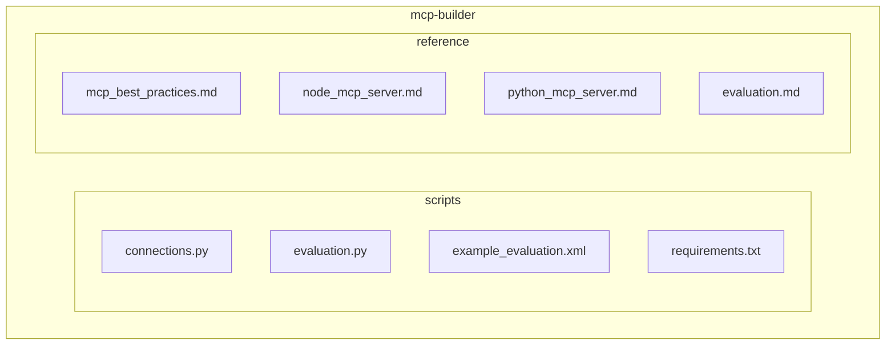
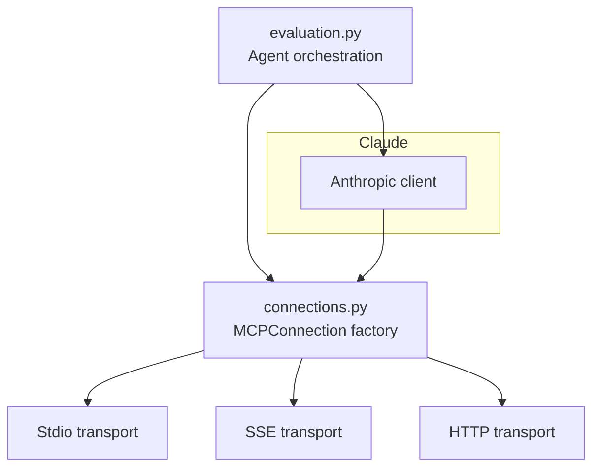
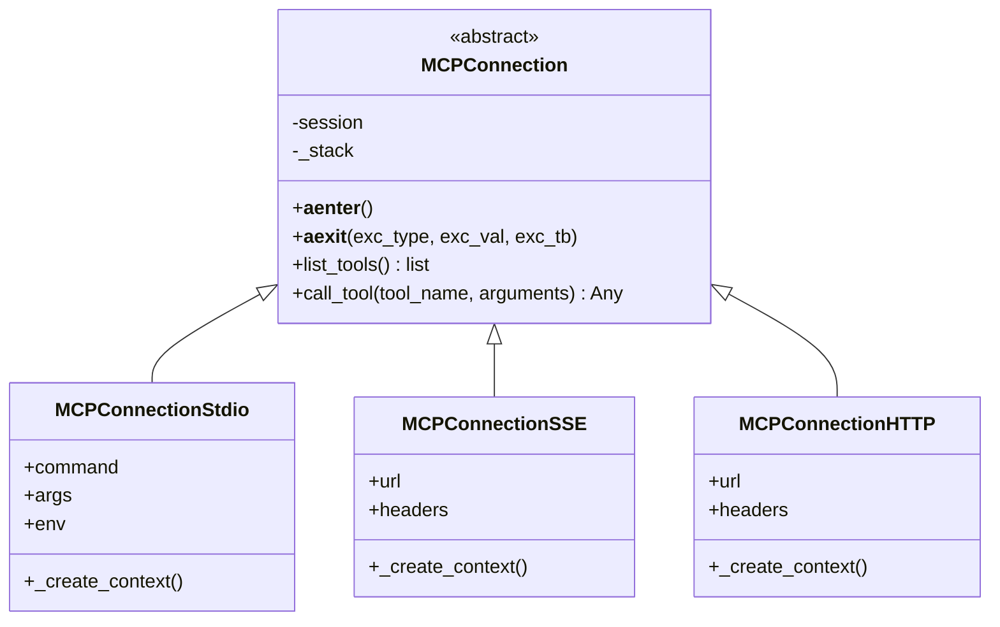
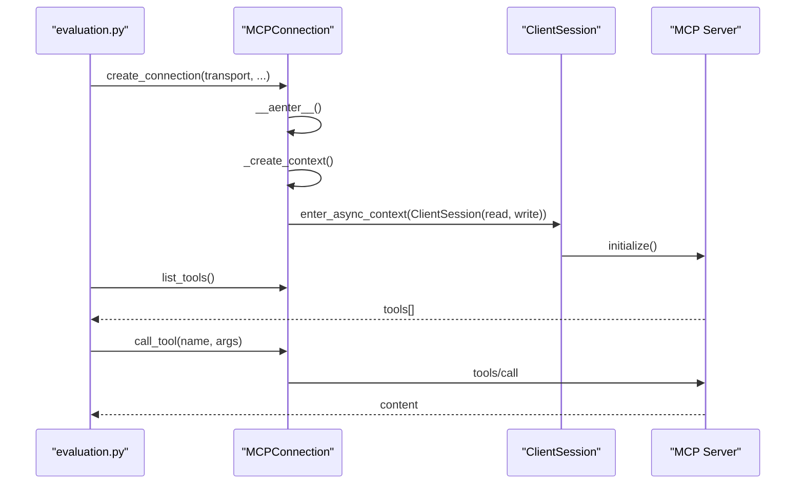
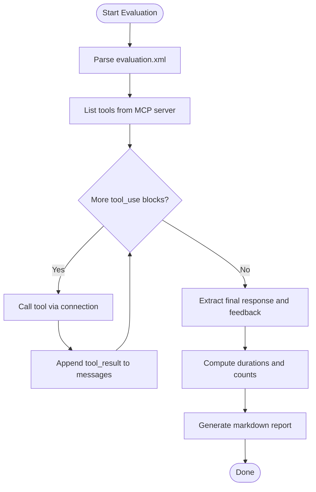
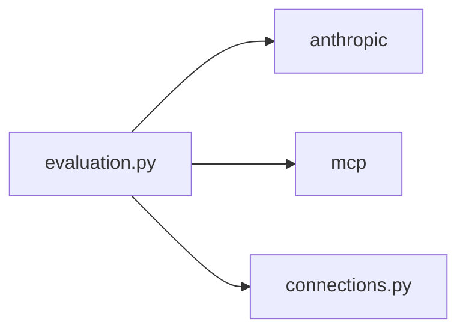

# MCP Builder

<cite>
**Referenced Files in This Document**
- [SKILL.md](file://mcp-builder/SKILL.md)
- [connections.py](file://mcp-builder/scripts/connections.py)
- [evaluation.py](file://mcp-builder/scripts/evaluation.py)
- [example_evaluation.xml](file://mcp-builder/scripts/example_evaluation.xml)
- [requirements.txt](file://mcp-builder/scripts/requirements.txt)
- [mcp_best_practices.md](file://mcp-builder/reference/mcp_best_practices.md)
- [node_mcp_server.md](file://mcp-builder/reference/node_mcp_server.md)
- [python_mcp_server.md](file://mcp-builder/reference/python_mcp_server.md)
- [evaluation.md](file://mcp-builder/reference/evaluation.md)
</cite>

## Table of Contents
1. [Introduction](#introduction)
2. [Project Structure](#project-structure)
3. [Core Components](#core-components)
4. [Architecture Overview](#architecture-overview)
5. [Detailed Component Analysis](#detailed-component-analysis)
6. [Dependency Analysis](#dependency-analysis)
7. [Performance Considerations](#performance-considerations)
8. [Troubleshooting Guide](#troubleshooting-guide)
9. [Conclusion](#conclusion)
10. [Appendices](#appendices)

## Introduction
The MCP Builder skill provides a practical foundation for creating MCP (Model Context Protocol) servers that enable Claude to securely and reliably integrate with external APIs. It includes:
- Lightweight connection handling for multiple transport types (stdio, SSE, HTTP)
- A robust evaluation harness that exercises MCP servers using realistic, multi-step questions
- Best practices for tool design, transport selection, security, and performance
- Guidance for extending server implementations in both Python and Node/TypeScript

This document explains how the skill’s components work together, how to configure and deploy MCP servers, and how to validate their effectiveness using the evaluation harness.

## Project Structure
The MCP Builder skill organizes its implementation and references into a clear layout:
- scripts: Core runtime modules for connection management and evaluation
- reference: Comprehensive guides and best practices for building MCP servers in Python and Node/TypeScript, plus evaluation methodology

**Diagram sources**
- [connections.py](file://mcp-builder/scripts/connections.py#L1-L152)
- [evaluation.py](file://mcp-builder/scripts/evaluation.py#L1-L374)
- [example_evaluation.xml](file://mcp-builder/scripts/example_evaluation.xml#L1-L23)
- [requirements.txt](file://mcp-builder/scripts/requirements.txt#L1-L3)
- [mcp_best_practices.md](file://mcp-builder/reference/mcp_best_practices.md#L1-L420)
- [node_mcp_server.md](file://mcp-builder/reference/node_mcp_server.md#L1-L200)
- [python_mcp_server.md](file://mcp-builder/reference/python_mcp_server.md#L1-L120)
- [evaluation.md](file://mcp-builder/reference/evaluation.md#L1-L120)

**Section sources**
- [SKILL.md](file://mcp-builder/SKILL.md#L1-L120)

## Core Components
- Connection factory and transport abstractions for MCP servers
- Evaluation harness that loads test questions, invokes tools, and reports results
- Example evaluation file demonstrating expected XML structure
- Requirements for dependencies (Anthropic client and MCP SDK)

Key responsibilities:
- connections.py: Provides a unified interface to connect to MCP servers via stdio, SSE, or HTTP, and exposes tool listing and invocation
- evaluation.py: Parses evaluation XML, orchestrates agent loops with Claude, measures tool call durations, and aggregates a detailed report
- example_evaluation.xml: Demonstrates the XML schema for QA pairs
- requirements.txt: Declares the minimum versions for anthropic and mcp packages

**Section sources**
- [connections.py](file://mcp-builder/scripts/connections.py#L1-L152)
- [evaluation.py](file://mcp-builder/scripts/evaluation.py#L1-L120)
- [example_evaluation.xml](file://mcp-builder/scripts/example_evaluation.xml#L1-L23)
- [requirements.txt](file://mcp-builder/scripts/requirements.txt#L1-L3)

## Architecture Overview
The MCP Builder skill supports three transport mechanisms, enabling flexible deployment scenarios:
- Stdio: Local subprocess execution, ideal for CLI tools and desktop integrations
- SSE: Server-Sent Events for real-time streaming updates
- HTTP (Streamable HTTP): Request-response over HTTP for web services and multi-client scenarios

**Diagram sources**
- [evaluation.py](file://mcp-builder/scripts/evaluation.py#L1-L120)
- [connections.py](file://mcp-builder/scripts/connections.py#L112-L152)

## Detailed Component Analysis

### Connection Handling (connections.py)
The connection module encapsulates transport-agnostic MCP connectivity:
- Base class MCPConnection defines lifecycle management and common operations
- Concrete transports:
  - MCPConnectionStdio: Uses stdio_client with command, args, and env
  - MCPConnectionSSE: Uses sse_client with URL and headers
  - MCPConnectionHTTP: Uses streamablehttp_client with URL and headers
- Factory function create_connection selects the appropriate transport based on arguments and enforces required parameters

**Diagram sources**
- [connections.py](file://mcp-builder/scripts/connections.py#L1-L152)

Operational flow for connecting and invoking tools:

**Diagram sources**
- [connections.py](file://mcp-builder/scripts/connections.py#L24-L110)
- [evaluation.py](file://mcp-builder/scripts/evaluation.py#L220-L273)

**Section sources**
- [connections.py](file://mcp-builder/scripts/connections.py#L1-L152)

### Evaluation Harness (evaluation.py)
The evaluation harness:
- Parses an XML evaluation file into QA pairs
- Initializes an Anthropic client and retrieves available tools from the MCP server
- Executes a loop with Claude that:
  - Sends the question
  - Observes tool_use blocks
  - Invokes the corresponding tool via the connection
  - Appends tool_result back into the conversation
  - Continues until a final response is produced
- Extracts structured summaries and feedback from Claude’s response
- Aggregates statistics and produces a markdown report

**Diagram sources**
- [evaluation.py](file://mcp-builder/scripts/evaluation.py#L56-L185)
- [evaluation.py](file://mcp-builder/scripts/evaluation.py#L187-L273)

Key behaviors:
- Tool call timing and metrics collection
- XML extraction of summary and feedback
- Robust error handling for tool execution failures
- Support for multiple transport types via the connection factory

**Section sources**
- [evaluation.py](file://mcp-builder/scripts/evaluation.py#L1-L374)

### Example Evaluation File (example_evaluation.xml)
The example demonstrates the expected XML structure for evaluation tasks:
- Root element evaluation
- Multiple qa_pair entries
- Each qa_pair contains question and answer elements

This file serves as a template for creating custom evaluation suites.

**Section sources**
- [example_evaluation.xml](file://mcp-builder/scripts/example_evaluation.xml#L1-L23)

### Requirements (requirements.txt)
Defines the minimal dependencies:
- anthropic: Client for interacting with Claude
- mcp: MCP SDK for client sessions and transports

**Section sources**
- [requirements.txt](file://mcp-builder/scripts/requirements.txt#L1-L3)

## Dependency Analysis
The evaluation harness depends on:
- anthropic for messaging with Claude
- mcp for client session management and transport contexts
- local connection factory for transport abstraction

**Diagram sources**
- [evaluation.py](file://mcp-builder/scripts/evaluation.py#L1-L30)
- [connections.py](file://mcp-builder/scripts/connections.py#L1-L20)

**Section sources**
- [evaluation.py](file://mcp-builder/scripts/evaluation.py#L1-L30)
- [connections.py](file://mcp-builder/scripts/connections.py#L1-L20)

## Performance Considerations
- Transport selection:
  - Stdio: Simple setup, local subprocess execution
  - SSE: Real-time streaming, suitable for push updates
  - HTTP: Request-response, scalable for multi-client deployments
- Tool design:
  - Respect pagination limits and return has_more/next_offset metadata
  - Implement character limits and graceful truncation
  - Provide concise vs detailed response formats to fit agent context budgets
- Error handling:
  - Use actionable error messages that guide the agent toward corrective actions
  - Implement timeouts and rate-limiting awareness
- Evaluation-driven iteration:
  - Use the evaluation harness to measure accuracy, average task duration, and tool call counts
  - Adjust tool schemas, descriptions, and pagination to improve performance

[No sources needed since this section provides general guidance]

## Troubleshooting Guide
Common issues and remedies:
- Authentication failures:
  - Verify headers and environment variables for SSE/HTTP transports
  - Ensure API keys are set and correctly formatted
- Timeout errors:
  - Increase model capability or adjust tool response sizes
  - Confirm pagination is implemented and used consistently
- Connection errors:
  - For stdio, confirm the command and arguments are correct
  - For SSE/HTTP, verify URL accessibility and headers
- Low accuracy:
  - Review agent feedback in the evaluation report
  - Improve tool descriptions and parameter documentation
  - Reduce excessive data in tool responses

**Section sources**
- [evaluation.md](file://mcp-builder/reference/evaluation.md#L578-L602)

## Conclusion
The MCP Builder skill provides a complete toolkit for designing, implementing, and validating MCP servers that integrate external APIs with Claude. By leveraging the connection factory for transport-agnostic connectivity, the evaluation harness for rigorous testing, and the comprehensive best practices and guides, developers can build secure, reliable, and high-performing MCP servers tailored to real-world workflows.

[No sources needed since this section summarizes without analyzing specific files]

## Appendices

### Transport Best Practices
- Choose the appropriate transport based on deployment scenario and real-time needs
- Implement proper error handling, timeouts, and authentication for each transport
- Follow security considerations for DNS rebinding and message validation

**Section sources**
- [mcp_best_practices.md](file://mcp-builder/reference/mcp_best_practices.md#L168-L230)

### Python MCP Server Implementation Patterns
- Use FastMCP with Pydantic models for input validation
- Register tools with clear descriptions, annotations, and consistent response formats
- Support both JSON and Markdown outputs and implement pagination and character limits

**Section sources**
- [python_mcp_server.md](file://mcp-builder/reference/python_mcp_server.md#L1-L120)
- [python_mcp_server.md](file://mcp-builder/reference/python_mcp_server.md#L121-L240)

### Node/TypeScript MCP Server Implementation Patterns
- Use the MCP TypeScript SDK with Zod schemas for runtime validation
- Register tools with explicit titles, descriptions, input schemas, and annotations
- Implement shared utilities, error handling, and multiple transport options

**Section sources**
- [node_mcp_server.md](file://mcp-builder/reference/node_mcp_server.md#L1-L120)
- [node_mcp_server.md](file://mcp-builder/reference/node_mcp_server.md#L121-L240)

### Evaluation Methodology
- Create 10 realistic, read-only, independent questions that require multiple tool calls
- Ensure answers are verifiable via direct string comparison and stable over time
- Use the evaluation harness to generate reports and iterate on tool design

**Section sources**
- [evaluation.md](file://mcp-builder/reference/evaluation.md#L1-L120)
- [evaluation.md](file://mcp-builder/reference/evaluation.md#L121-L244)