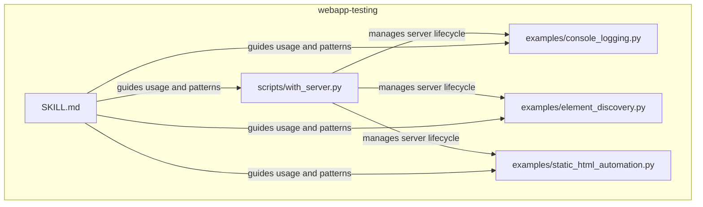
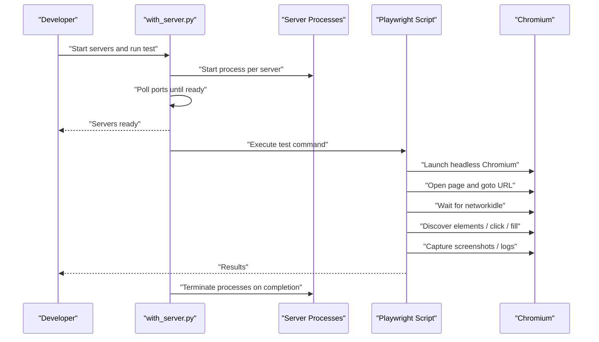
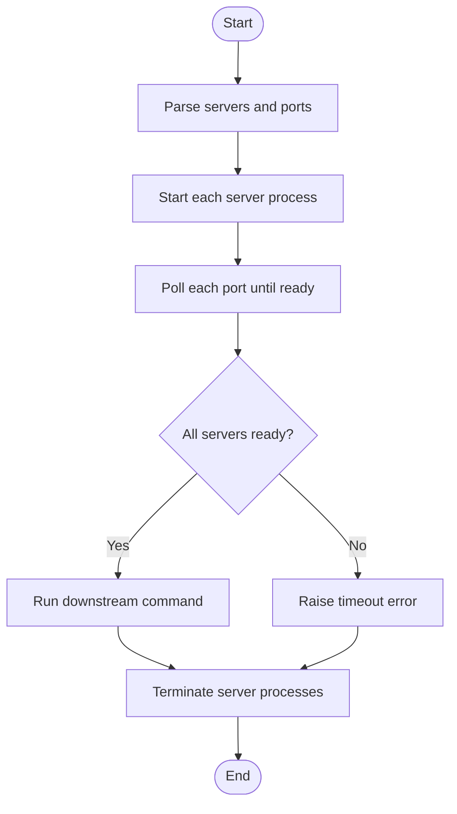
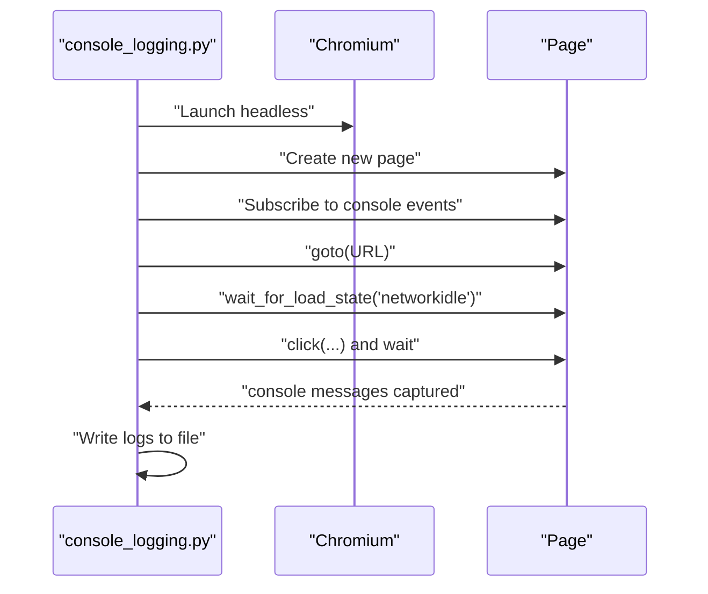
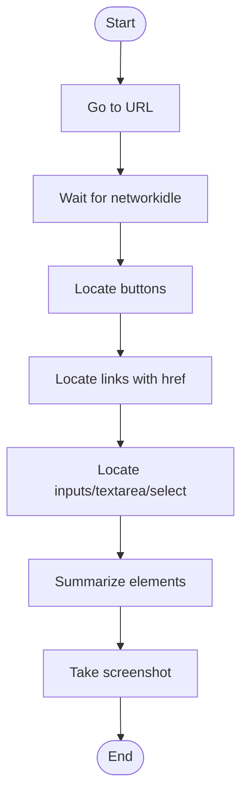
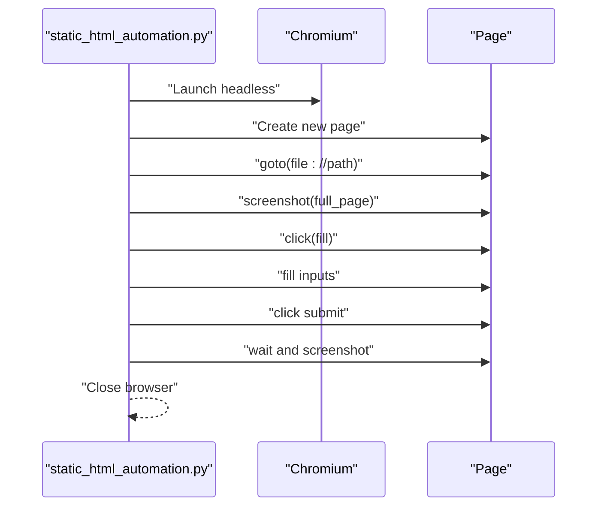
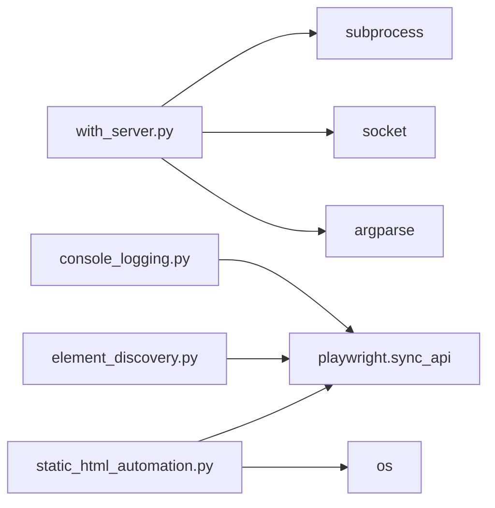

# Web Application Testing

<cite>
**Referenced Files in This Document**
- [webapp-testing/SKILL.md](file://webapp-testing/SKILL.md)
- [webapp-testing/scripts/with_server.py](file://webapp-testing/scripts/with_server.py)
- [webapp-testing/examples/console_logging.py](file://webapp-testing/examples/console_logging.py)
- [webapp-testing/examples/element_discovery.py](file://webapp-testing/examples/element_discovery.py)
- [webapp-testing/examples/static_html_automation.py](file://webapp-testing/examples/static_html_automation.py)
- [webapp-testing/LICENSE.txt](file://webapp-testing/LICENSE.txt)
</cite>

## Table of Contents
1. [Introduction](#introduction)
2. [Project Structure](#project-structure)
3. [Core Components](#core-components)
4. [Architecture Overview](#architecture-overview)
5. [Detailed Component Analysis](#detailed-component-analysis)
6. [Dependency Analysis](#dependency-analysis)
7. [Performance Considerations](#performance-considerations)
8. [Troubleshooting Guide](#troubleshooting-guide)
9. [Conclusion](#conclusion)
10. [Appendices](#appendices)

## Introduction
This document explains the webapp-testing skill for reliable end-to-end testing of web applications using Playwright. It covers how to orchestrate server lifecycles with the helper script, how to discover and interact with UI elements, how to capture console logs for debugging, and how to automate static HTML pages. It also provides practical patterns for writing robust test scripts, handling dynamic content, debugging failures, optimizing performance, and organizing tests for maintainability.

## Project Structure
The webapp-testing skill organizes reusable automation patterns and a server lifecycle helper:
- scripts/with_server.py: Starts one or more servers, waits for readiness, runs a command, and cleans up.
- examples/: Demonstrates common automation patterns:
  - console_logging.py: Captures console logs during automation.
  - element_discovery.py: Discovers buttons, links, and input fields.
  - static_html_automation.py: Automates static HTML files via file:// URLs.

**Diagram sources**
- [webapp-testing/SKILL.md](file://webapp-testing/SKILL.md#L1-L96)
- [webapp-testing/scripts/with_server.py](file://webapp-testing/scripts/with_server.py#L1-L106)
- [webapp-testing/examples/console_logging.py](file://webapp-testing/examples/console_logging.py#L1-L35)
- [webapp-testing/examples/element_discovery.py](file://webapp-testing/examples/element_discovery.py#L1-L40)
- [webapp-testing/examples/static_html_automation.py](file://webapp-testing/examples/static_html_automation.py#L1-L33)

**Section sources**
- [webapp-testing/SKILL.md](file://webapp-testing/SKILL.md#L1-L96)

## Core Components
- Server lifecycle manager (with_server.py):
  - Parses multiple server commands and ports.
  - Starts processes, polls ports for readiness, and runs a downstream command.
  - Cleans up server processes on exit.
- Automation examples:
  - Console logging capture for runtime diagnostics.
  - Element discovery for buttons, links, and inputs.
  - Static HTML automation using file:// URLs.

Key capabilities:
- Headless Chromium automation with Playwright.
- Network idle waits to ensure dynamic content is ready.
- Screenshot capture for visual verification.
- Console log capture for debugging client-side errors.

**Section sources**
- [webapp-testing/scripts/with_server.py](file://webapp-testing/scripts/with_server.py#L1-L106)
- [webapp-testing/examples/console_logging.py](file://webapp-testing/examples/console_logging.py#L1-L35)
- [webapp-testing/examples/element_discovery.py](file://webapp-testing/examples/element_discovery.py#L1-L40)
- [webapp-testing/examples/static_html_automation.py](file://webapp-testing/examples/static_html_automation.py#L1-L33)
- [webapp-testing/SKILL.md](file://webapp-testing/SKILL.md#L1-L96)

## Architecture Overview
The skill integrates a server manager with Playwright-driven automation. The server manager ensures the target web application is reachable before running tests. Tests then use Playwright to navigate, wait for dynamic content, discover elements, and capture logs/screenshots.

**Diagram sources**
- [webapp-testing/scripts/with_server.py](file://webapp-testing/scripts/with_server.py#L1-L106)
- [webapp-testing/examples/console_logging.py](file://webapp-testing/examples/console_logging.py#L1-L35)
- [webapp-testing/examples/element_discovery.py](file://webapp-testing/examples/element_discovery.py#L1-L40)
- [webapp-testing/examples/static_html_automation.py](file://webapp-testing/examples/static_html_automation.py#L1-L33)

## Detailed Component Analysis

### Server Lifecycle Manager (with_server.py)
Responsibilities:
- Accepts multiple server commands and corresponding ports.
- Starts each server process and waits for the port to accept connections.
- Runs a downstream command after all servers are ready.
- Ensures cleanup by terminating processes and waiting for completion.

Implementation highlights:
- Port readiness polling with a configurable timeout.
- Argument parsing for multiple servers and ports.
- Graceful termination with kill fallback on timeout.
- Shell invocation to support compound commands and directory changes.

**Diagram sources**
- [webapp-testing/scripts/with_server.py](file://webapp-testing/scripts/with_server.py#L1-L106)

**Section sources**
- [webapp-testing/scripts/with_server.py](file://webapp-testing/scripts/with_server.py#L1-L106)

### Console Logging Capture (console_logging.py)
Purpose:
- Capture browser console messages during automation for debugging.

Key steps:
- Launch Chromium headlessly.
- Subscribe to console events and append messages to a list.
- Navigate to a URL, wait for network idle, trigger interactions, and save logs to a file.

**Diagram sources**
- [webapp-testing/examples/console_logging.py](file://webapp-testing/examples/console_logging.py#L1-L35)

**Section sources**
- [webapp-testing/examples/console_logging.py](file://webapp-testing/examples/console_logging.py#L1-L35)

### Element Discovery (element_discovery.py)
Purpose:
- Inspect and enumerate interactive elements on a page for selector selection and verification.

Key steps:
- Navigate to a URL and wait for network idle.
- Discover buttons, links, and input fields.
- Print summaries and take a screenshot for visual reference.

**Diagram sources**
- [webapp-testing/examples/element_discovery.py](file://webapp-testing/examples/element_discovery.py#L1-L40)

**Section sources**
- [webapp-testing/examples/element_discovery.py](file://webapp-testing/examples/element_discovery.py#L1-L40)

### Static HTML Automation (static_html_automation.py)
Purpose:
- Automate interactions with local static HTML files using file:// URLs.

Key steps:
- Convert a local HTML file path to a file:// URL.
- Open in Chromium, take a screenshot, interact with elements, and take another screenshot.
- Close the browser.

**Diagram sources**
- [webapp-testing/examples/static_html_automation.py](file://webapp-testing/examples/static_html_automation.py#L1-L33)

**Section sources**
- [webapp-testing/examples/static_html_automation.py](file://webapp-testing/examples/static_html_automation.py#L1-L33)

## Dependency Analysis
- with_server.py depends on:
  - subprocess for process management.
  - socket for port readiness checks.
  - argparse for CLI parsing.
- Automation examples depend on:
  - playwright.sync_api for browser automation.
  - os for file path handling in static HTML example.

**Diagram sources**
- [webapp-testing/scripts/with_server.py](file://webapp-testing/scripts/with_server.py#L1-L106)
- [webapp-testing/examples/console_logging.py](file://webapp-testing/examples/console_logging.py#L1-L35)
- [webapp-testing/examples/element_discovery.py](file://webapp-testing/examples/element_discovery.py#L1-L40)
- [webapp-testing/examples/static_html_automation.py](file://webapp-testing/examples/static_html_automation.py#L1-L33)

**Section sources**
- [webapp-testing/scripts/with_server.py](file://webapp-testing/scripts/with_server.py#L1-L106)
- [webapp-testing/examples/console_logging.py](file://webapp-testing/examples/console_logging.py#L1-L35)
- [webapp-testing/examples/element_discovery.py](file://webapp-testing/examples/element_discovery.py#L1-L40)
- [webapp-testing/examples/static_html_automation.py](file://webapp-testing/examples/static_html_automation.py#L1-L33)

## Performance Considerations
- Use headless mode to reduce overhead.
- Wait for networkidle before inspecting dynamic content to avoid race conditions.
- Minimize screenshot usage; use targeted screenshots only when necessary.
- Prefer descriptive selectors (text, role, CSS, IDs) to reduce ambiguity and improve reliability.
- Use timeouts judiciously; avoid excessive waits by combining explicit waits with load states.
- Run multiple servers in parallel with the helper to reduce total test time.
- Keep viewport sizes reasonable; large viewports increase memory usage.

[No sources needed since this section provides general guidance]

## Troubleshooting Guide
Common issues and remedies:
- Flaky tests due to timing:
  - Ensure waits for networkidle before inspection.
  - Use explicit waits for specific elements before interacting.
- Element locator failures:
  - Use more specific selectors (role, text, CSS).
  - Re-run element discovery to confirm selectors.
- Dynamic content not ready:
  - Always wait for networkidle before taking screenshots or clicking.
- Server readiness problems:
  - Increase timeout or verify port bindings.
  - Confirm commands start the intended service on the specified port.
- Console logs missing:
  - Subscribe to console events before navigation.
  - Verify interactions that produce logs occur after navigation.

**Section sources**
- [webapp-testing/SKILL.md](file://webapp-testing/SKILL.md#L78-L90)
- [webapp-testing/examples/console_logging.py](file://webapp-testing/examples/console_logging.py#L1-L35)
- [webapp-testing/examples/element_discovery.py](file://webapp-testing/examples/element_discovery.py#L1-L40)
- [webapp-testing/scripts/with_server.py](file://webapp-testing/scripts/with_server.py#L1-L106)

## Conclusion
The webapp-testing skill provides a practical toolkit for reliable end-to-end testing of web applications. By combining a robust server lifecycle manager with Playwright automation patterns—element discovery, console logging capture, and static HTML automation—you can build efficient, maintainable tests. Following the reconnaissance-then-action pattern and best practices outlined here will help minimize flakiness, improve debuggability, and optimize performance.

[No sources needed since this section summarizes without analyzing specific files]

## Appendices

### Practical Patterns and Recipes
- Static HTML automation:
  - Use file:// URLs for local HTML files.
  - Take screenshots before and after interactions.
  - Fill inputs and click submit with descriptive selectors.
  - See [static_html_automation.py](file://webapp-testing/examples/static_html_automation.py#L1-L33).
- Dynamic app automation:
  - Navigate to the URL and wait for networkidle.
  - Discover elements to confirm availability.
  - Click and fill with explicit waits.
  - See [element_discovery.py](file://webapp-testing/examples/element_discovery.py#L1-L40).
- Debugging with console logs:
  - Subscribe to console events before navigation.
  - Trigger interactions and collect logs.
  - Save logs to a file for later inspection.
  - See [console_logging.py](file://webapp-testing/examples/console_logging.py#L1-L35).
- Server orchestration:
  - Start multiple servers and ports.
  - Run a test command after readiness.
  - Ensure cleanup on exit.
  - See [with_server.py](file://webapp-testing/scripts/with_server.py#L1-L106).

**Section sources**
- [webapp-testing/examples/static_html_automation.py](file://webapp-testing/examples/static_html_automation.py#L1-L33)
- [webapp-testing/examples/element_discovery.py](file://webapp-testing/examples/element_discovery.py#L1-L40)
- [webapp-testing/examples/console_logging.py](file://webapp-testing/examples/console_logging.py#L1-L35)
- [webapp-testing/scripts/with_server.py](file://webapp-testing/scripts/with_server.py#L1-L106)

### Licensing
The webapp-testing skill is licensed under the Apache License, Version 2.0. See [LICENSE.txt](file://webapp-testing/LICENSE.txt#L1-L202) for the full license terms.

**Section sources**
- [webapp-testing/LICENSE.txt](file://webapp-testing/LICENSE.txt#L1-L202)