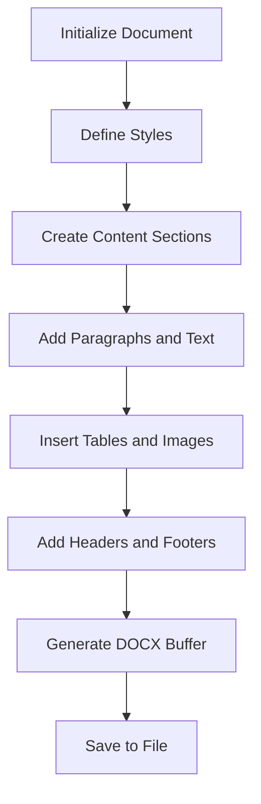
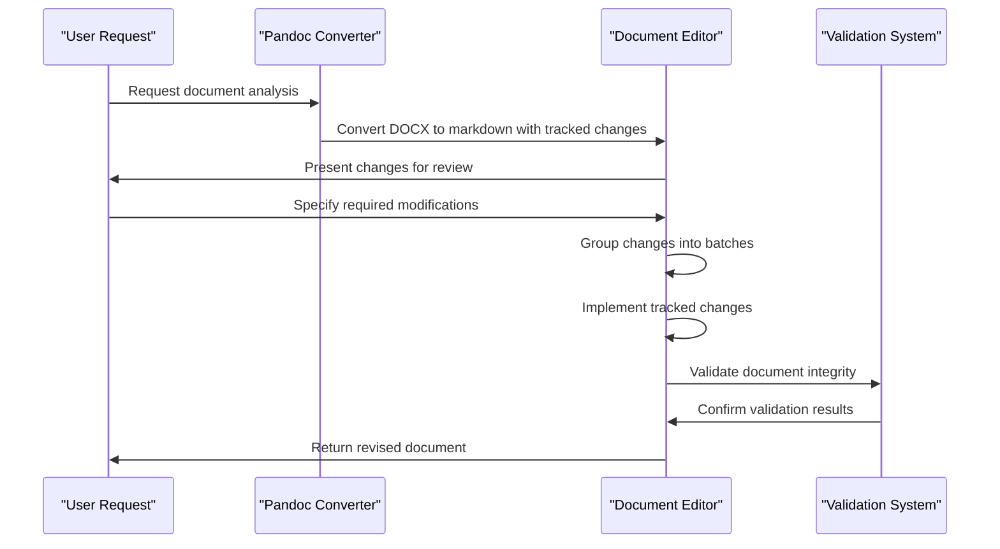

# DOCX Processing

<cite>
**Referenced Files in This Document**   
- [SKILL.md](file://document-skills/docx/SKILL.md)
- [docx-js.md](file://document-skills/docx/docx-js.md)
- [ooxml.md](file://document-skills/docx/ooxml.md)
</cite>

## Table of Contents
1. [Introduction](#introduction)
2. [OOXML Manipulation Workflow](#ooxml-manipulation-workflow)
3. [Document Creation with JavaScript](#document-creation-with-javascript)
4. [Tracked Changes and Redlining](#tracked-changes-and-redlining)
5. [Template-Based Generation and Automation](#template-based-generation-and-automation)
6. [Common Issues and Solutions](#common-issues-and-solutions)
7. [Security and Metadata Integrity](#security-and-metadata-integrity)

## Introduction

The DOCX processing skill provides comprehensive capabilities for creating, editing, and analyzing .docx files through OOXML manipulation. A .docx file is fundamentally a ZIP archive containing XML files and resources that define document structure, content, formatting, and metadata. This documentation details the implementation of OOXML manipulation using Python scripts for document modification, JavaScript integration via docx-js for document creation, and proper handling of tracked changes, comments, and redlining. The system supports template-based document generation, addresses common issues like formatting loss during round-trip processing, and incorporates security considerations for handling sensitive documents.

**Section sources**
- [SKILL.md](file://document-skills/docx/SKILL.md#L1-L197)

## OOXML Manipulation Workflow

The OOXML manipulation workflow involves unpacking, modifying, and repackaging DOCX files through a structured process that ensures schema compliance and document integrity. The process begins with unpacking the DOCX file using the provided unpack.py script, which extracts the OOXML package into a directory structure containing XML files and media resources. The core document content resides in word/document.xml, while additional components like comments, styles, and relationships are stored in corresponding XML files within the word/ directory.

Document modification occurs through direct manipulation of the XML structure, following strict OOXML schema requirements. Key structural patterns include proper element ordering in paragraph properties (<w:pPr>), correct handling of whitespace with xml:space='preserve', and appropriate Unicode character escaping. When adding new content such as images or hyperlinks, corresponding entries must be added to [Content_Types].xml and word/_rels/document.xml.rels to maintain package integrity.

After modifications are complete, the document is repackaged using the pack.py script, which compresses the modified directory back into a valid DOCX file. Throughout this process, schema validation ensures compliance with ISO/IEC 29500 standards, preventing document corruption and ensuring compatibility across different Word processors.

**Section sources**
- [SKILL.md](file://document-skills/docx/SKILL.md#L65-L73)
- [ooxml.md](file://document-skills/docx/ooxml.md#L1-L610)

## Document Creation with JavaScript

Document creation is accomplished through the docx-js library, which enables programmatic generation of DOCX files using JavaScript/TypeScript. This approach provides fine-grained control over document structure, styling, and content organization. The process begins with importing necessary components from the docx library, including Document, Paragraph, TextRun, Table, and other structural elements.

Key implementation patterns include proper text formatting with TextRun objects that support bold, italic, underline, color, highlighting, and other styling options. Professional document formatting is achieved through style definitions that override built-in Word styles such as Title, Heading1, and Heading2, ensuring consistent visual hierarchy and proper table of contents generation. The library requires specific implementation practices, such as avoiding standalone PageBreak elements (which must be wrapped in Paragraph objects) and properly configuring table cell shading with ShadingType.CLEAR to prevent rendering issues.

For complex document elements like tables, lists, and hyperlinks, the library provides specialized components that ensure proper OOXML structure. Tables require both columnWidths arrays and individual cell width specifications in DXA units (twentieths of a point), while lists must use proper numbering configurations rather than Unicode bullet characters. The system also supports headers, footers, page setup, and tab stops for advanced layout control.

**Diagram sources **
- [docx-js.md](file://document-skills/docx/docx-js.md#L1-L350)

**Section sources**
- [SKILL.md](file://document-skills/docx/SKILL.md#L56-L62)
- [docx-js.md](file://document-skills/docx/docx-js.md#L1-L350)

## Tracked Changes and Redlining

The tracked changes and redlining implementation follows a systematic workflow designed for professional document review and collaboration. The process begins with converting the document to markdown using pandoc with --track-changes=all to preserve existing revisions, allowing for comprehensive analysis of required changes. Changes are then grouped into logical batches of 3-10 related modifications to facilitate debugging and incremental progress.

The core principle of minimal, precise edits requires that only text that actually changes be marked with tracked changes, preserving unchanged text with its original RSID attributes. This approach maintains document professionalism and simplifies review. The Document library in Python automates infrastructure setup for tracked changes, including people.xml, RSIDs, settings.xml, comment files, relationships, and content types, reducing the potential for errors.

Implementation follows specific patterns for different scenarios: adding new tracked changes to regular text, partially modifying another author's tracked changes by nesting deletions within insertions, completely rejecting another author's insertions using revert_insertion(), and restoring deleted content with revert_deletion(). The system enforces validation rules that prevent modification of text inside another author's tracked changes and require proper nesting of deletions to maintain document integrity.

**Diagram sources **
- [SKILL.md](file://document-skills/docx/SKILL.md#L75-L154)
- [ooxml.md](file://document-skills/docx/ooxml.md#L266-L552)

**Section sources**
- [SKILL.md](file://document-skills/docx/SKILL.md#L75-L154)
- [ooxml.md](file://document-skills/docx/ooxml.md#L266-L552)

## Template-Based Generation and Automation

Template-based document generation leverages both JavaScript and Python workflows to automate document creation and modification. For new document creation, the docx-js library provides a structured approach using templates defined in JavaScript/TypeScript code. These templates define document structure, styles, and content organization through programmatic construction of Document objects with specified sections, paragraphs, tables, and other elements.

For existing document modification, the system supports template-driven automation through Python scripts that implement batched changes according to predefined patterns. The workflow involves identifying change locations using various methods such as section/heading numbers, paragraph identifiers, grep patterns with unique surrounding text, or document structure references. Changes are organized into logical batches by section, type, complexity, or proximity to facilitate systematic implementation.

The automation framework includes utilities for node retrieval, content replacement, and structural modification, with methods like get_node() for locating elements by text content, line number, or attributes, and replace_node() for implementing changes while preserving formatting. The system also supports direct DOM manipulation for complex scenarios not covered by high-level methods, providing flexibility for advanced document processing requirements.

**Section sources**
- [SKILL.md](file://document-skills/docx/SKILL.md#L100-L139)
- [ooxml.md](file://document-skills/docx/ooxml.md#L492-L512)

## Common Issues and Solutions

Several common issues arise during DOCX processing, particularly in round-trip operations involving format conversion. Formatting loss during round-trip processing can occur when converting between DOCX and other formats like markdown or PDF. This is mitigated by using pandoc with appropriate options to preserve document structure and tracked changes, and by validating output through comparison with original content.

Another common issue is XML structure corruption, which can happen when tracked changes are improperly nested or when PageBreak elements are used standalone rather than within Paragraph objects. The system addresses this through automated validation during the save process and by providing clear implementation guidelines that emphasize proper XML structure.

Unicode handling presents challenges when dealing with special characters like curly quotes, em-dashes, and apostrophes, which must be properly escaped in ASCII content. The system supports both entity notation and Unicode characters for searching and replacement, automatically converting between formats based on file encoding. Image handling issues related to dimension overflow and aspect ratio preservation are addressed by calculating appropriate EMU (English Metric Unit) dimensions based on document layout constraints.

**Section sources**
- [SKILL.md](file://document-skills/docx/SKILL.md#L144-L153)
- [ooxml.md](file://document-skills/docx/ooxml.md#L11-L21)

## Security and Metadata Integrity

Security considerations for handling sensitive Word documents include proper handling of metadata that may contain confidential information. The system uses defusedxml for secure XML parsing to prevent XML-based attacks, and the Document library automatically manages infrastructure setup in a way that preserves metadata integrity while enabling document modification.

When processing sensitive documents, the system maintains authorship information through proper RSID handling and tracks all changes with appropriate author and date attributes. The redlining workflow ensures that all modifications are properly tracked and attributable, providing an audit trail for document changes. Metadata integrity is preserved by maintaining the original document structure and only modifying content as explicitly specified, avoiding unintended changes to document properties or embedded metadata.

The system also addresses security concerns related to external content by properly handling hyperlinks and embedded media, ensuring that relationships are correctly defined in the package manifest. When inserting images or other media, the system follows secure practices for file handling and content type registration to prevent package corruption or security vulnerabilities.

**Section sources**
- [SKILL.md](file://document-skills/docx/SKILL.md#L190-L197)
- [ooxml.md](file://document-skills/docx/ooxml.md#L268-L269)