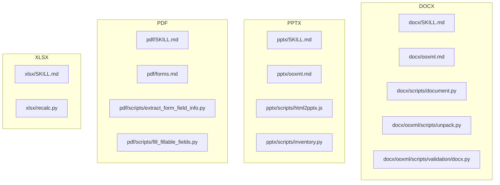
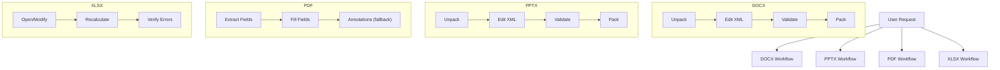
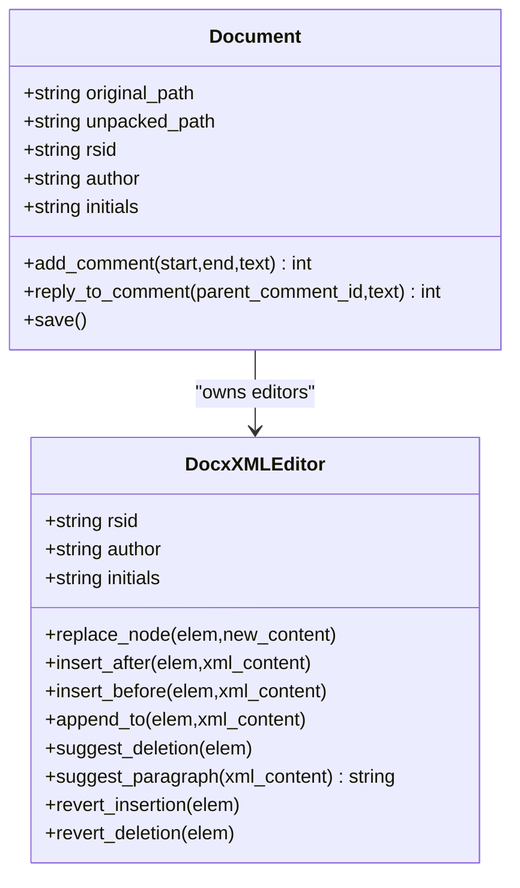
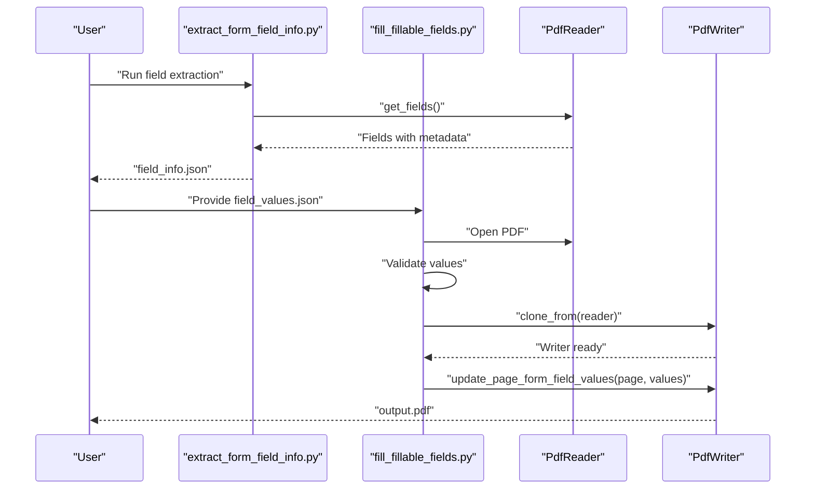
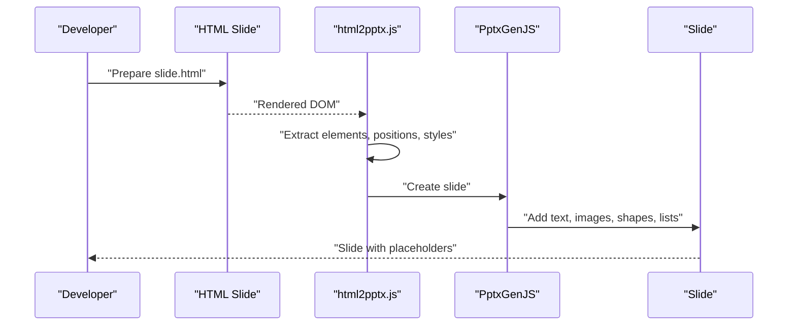
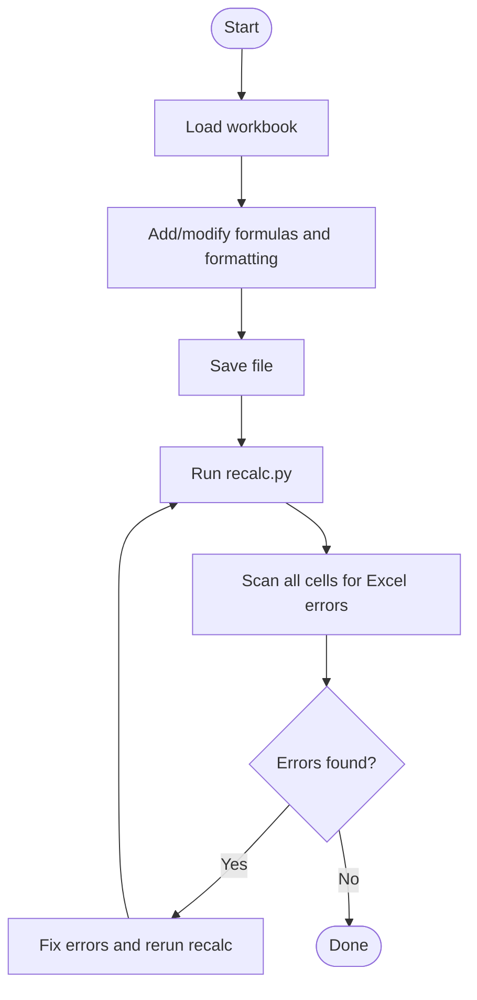
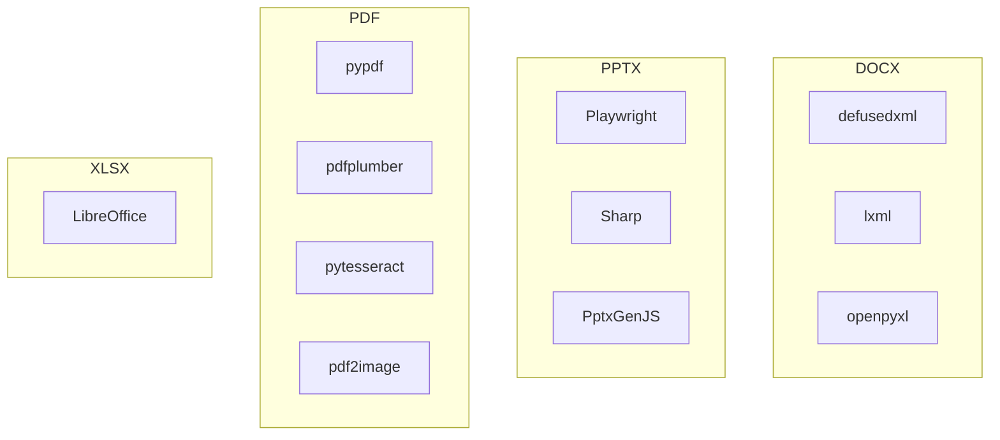

# Document Processing Skills

<cite>
**Referenced Files in This Document**
- [docx/SKILL.md](file://document-skills/docx/SKILL.md)
- [docx/ooxml.md](file://document-skills/docx/ooxml.md)
- [docx/scripts/document.py](file://document-skills/docx/scripts/document.py)
- [docx/ooxml/scripts/unpack.py](file://document-skills/docx/ooxml/scripts/unpack.py)
- [docx/ooxml/scripts/validation/docx.py](file://document-skills/docx/ooxml/scripts/validation/docx.py)
- [pptx/SKILL.md](file://document-skills/pptx/SKILL.md)
- [pptx/ooxml.md](file://document-skills/pptx/ooxml.md)
- [pptx/scripts/html2pptx.js](file://document-skills/pptx/scripts/html2pptx.js)
- [pptx/scripts/inventory.py](file://document-skills/pptx/scripts/inventory.py)
- [pdf/SKILL.md](file://document-skills/pdf/SKILL.md)
- [pdf/forms.md](file://document-skills/pdf/forms.md)
- [pdf/scripts/extract_form_field_info.py](file://document-skills/pdf/scripts/extract_form_field_info.py)
- [pdf/scripts/fill_fillable_fields.py](file://document-skills/pdf/scripts/fill_fillable_fields.py)
- [xlsx/SKILL.md](file://document-skills/xlsx/SKILL.md)
- [xlsx/recalc.py](file://document-skills/xlsx/recalc.py)
</cite>

## Table of Contents
1. [Introduction](#introduction)
2. [Project Structure](#project-structure)
3. [Core Components](#core-components)
4. [Architecture Overview](#architecture-overview)
5. [Detailed Component Analysis](#detailed-component-analysis)
6. [Dependency Analysis](#dependency-analysis)
7. [Performance Considerations](#performance-considerations)
8. [Troubleshooting Guide](#troubleshooting-guide)
9. [Conclusion](#conclusion)
10. [Appendices](#appendices)

## Introduction
This document explains the document processing skills for creating, editing, and manipulating professional office documents across four major formats: DOCX (Word), PDF, PPTX (PowerPoint), and XLSX (Excel). It focuses on:
- How each skill implements its core capabilities (OOXML manipulation, tracked changes, form filling, slide management, HTML-to-PPTX conversion, and formula recalculation)
- Practical automation workflows for common tasks
- The shared OOXML foundation enabling cross-format consistency
- Security and integrity best practices
- Common issues and their solutions

## Project Structure
Each skill is organized as a cohesive module with:
- A capability-focused SKILL.md overview
- A technical reference (ooxml.md) for OOXML patterns and schema rules
- Implementation scripts and utilities for editing, validation, and automation
- Format-specific workflows for forms, slides, and spreadsheets

**Diagram sources**
- [docx/SKILL.md](file://document-skills/docx/SKILL.md#L1-L197)
- [docx/ooxml.md](file://document-skills/docx/ooxml.md#L1-L610)
- [docx/scripts/document.py](file://document-skills/docx/scripts/document.py#L1-L800)
- [docx/ooxml/scripts/unpack.py](file://document-skills/docx/ooxml/scripts/unpack.py#L1-L30)
- [docx/ooxml/scripts/validation/docx.py](file://document-skills/docx/ooxml/scripts/validation/docx.py#L1-L275)
- [pptx/SKILL.md](file://document-skills/pptx/SKILL.md#L1-L484)
- [pptx/ooxml.md](file://document-skills/pptx/ooxml.md#L1-L427)
- [pptx/scripts/html2pptx.js](file://document-skills/pptx/scripts/html2pptx.js#L1-L800)
- [pptx/scripts/inventory.py](file://document-skills/pptx/scripts/inventory.py#L1-L800)
- [pdf/SKILL.md](file://document-skills/pdf/SKILL.md#L1-L295)
- [pdf/forms.md](file://document-skills/pdf/forms.md#L1-L206)
- [pdf/scripts/extract_form_field_info.py](file://document-skills/pdf/scripts/extract_form_field_info.py#L1-L153)
- [pdf/scripts/fill_fillable_fields.py](file://document-skills/pdf/scripts/fill_fillable_fields.py#L1-L115)
- [xlsx/SKILL.md](file://document-skills/xlsx/SKILL.md#L1-L289)
- [xlsx/recalc.py](file://document-skills/xlsx/recalc.py#L1-L178)

**Section sources**
- [docx/SKILL.md](file://document-skills/docx/SKILL.md#L1-L197)
- [pptx/SKILL.md](file://document-skills/pptx/SKILL.md#L1-L484)
- [pdf/SKILL.md](file://document-skills/pdf/SKILL.md#L1-L295)
- [xlsx/SKILL.md](file://document-skills/xlsx/SKILL.md#L1-L289)

## Core Components
- DOCX: OOXML manipulation with tracked changes, comments, and redlining workflows; includes a Python library for safe, validated edits and a validator for schema compliance.
- PPTX: Slide management, HTML-to-PPTX conversion, and template-based content replacement; includes utilities for inventory extraction and slide operations.
- PDF: Form field extraction and filling, plus annotation-based filling for non-fillable forms; includes robust validation and bounding box checks.
- XLSX: Formula support and recalculation using LibreOffice; strict formatting and color conventions for financial modeling.

**Section sources**
- [docx/ooxml.md](file://document-skills/docx/ooxml.md#L1-L610)
- [pptx/ooxml.md](file://document-skills/pptx/ooxml.md#L1-L427)
- [pdf/forms.md](file://document-skills/pdf/forms.md#L1-L206)
- [xlsx/SKILL.md](file://document-skills/xlsx/SKILL.md#L1-L289)

## Architecture Overview
All four skills share a common OOXML-based architecture:
- Office files are ZIP archives containing XML and relationship files
- Editing workflows typically unpack the archive, manipulate XML, and repack
- Validation ensures schema compliance and structural correctness
- Utilities automate common tasks (unpacking, packing, validation, and content extraction)

**Diagram sources**
- [docx/ooxml/scripts/unpack.py](file://document-skills/docx/ooxml/scripts/unpack.py#L1-L30)
- [docx/ooxml/scripts/validation/docx.py](file://document-skills/docx/ooxml/scripts/validation/docx.py#L1-L275)
- [pptx/ooxml.md](file://document-skills/pptx/ooxml.md#L1-L427)
- [pdf/forms.md](file://document-skills/pdf/forms.md#L1-L206)
- [xlsx/recalc.py](file://document-skills/xlsx/recalc.py#L1-L178)

## Detailed Component Analysis

### DOCX: OOXML Manipulation and Tracked Changes
- Purpose: Create, edit, and analyze Word documents with full support for tracked changes, comments, formatting, and text extraction.
- Key capabilities:
  - Redlining workflow: systematic, batched tracked changes with minimal, precise edits
  - Comments: add and reply to comments spanning arbitrary XML ranges
  - Safe editing: automatic RSID, author, and date injection; validation of whitespace, deletions, and insertions
  - Image insertion: calculate dimensions and update relationships
  - Text extraction: convert to Markdown with tracked changes preserved
- Implementation highlights:
  - Document class manages infrastructure setup and provides high-level APIs for tracked changes and comments
  - XML editor injects attributes and validates structure during edits
  - Validator enforces schema compliance and detects common mistakes

**Diagram sources**
- [docx/scripts/document.py](file://document-skills/docx/scripts/document.py#L1-L800)

**Section sources**
- [docx/SKILL.md](file://document-skills/docx/SKILL.md#L1-L197)
- [docx/ooxml.md](file://document-skills/docx/ooxml.md#L1-L610)
- [docx/scripts/document.py](file://document-skills/docx/scripts/document.py#L1-L800)
- [docx/ooxml/scripts/validation/docx.py](file://document-skills/docx/ooxml/scripts/validation/docx.py#L1-L275)

### PDF: Form Filling and Text Extraction
- Purpose: Fill PDF forms (fillable fields and non-fillable forms), extract text and tables, and annotate text onto PDFs.
- Key capabilities:
  - Fillable fields: extract field metadata, validate values, and update form fields
  - Non-fillable forms: convert to images, define bounding boxes, validate intersections, and add annotations
  - Text extraction: use pypdf and pdfplumber for text and tables
- Implementation highlights:
  - Field extraction script builds a structured JSON with field types, pages, and geometry
  - Filling script validates values against field definitions and writes output
  - Annotation workflow ensures label and input regions do not intersect and validates rectangles

**Diagram sources**
- [pdf/scripts/extract_form_field_info.py](file://document-skills/pdf/scripts/extract_form_field_info.py#L1-L153)
- [pdf/scripts/fill_fillable_fields.py](file://document-skills/pdf/scripts/fill_fillable_fields.py#L1-L115)

**Section sources**
- [pdf/SKILL.md](file://document-skills/pdf/SKILL.md#L1-L295)
- [pdf/forms.md](file://document-skills/pdf/forms.md#L1-L206)
- [pdf/scripts/extract_form_field_info.py](file://document-skills/pdf/scripts/extract_form_field_info.py#L1-L153)
- [pdf/scripts/fill_fillable_fields.py](file://document-skills/pdf/scripts/fill_fillable_fields.py#L1-L115)

### PPTX: Slide Management and HTML-to-PPTX Conversion
- Purpose: Create and edit PowerPoint presentations, manage slides, and convert HTML slides to PPTX with accurate positioning.
- Key capabilities:
  - HTML-to-PPTX: accurate text, images, shapes, and lists; placeholder extraction; validation of overflow and layout
  - Slide operations: add, duplicate, reorder, and delete slides; update relationships and content types
  - Inventory extraction: structured text inventory with formatting, overflow detection, and issue reporting
- Implementation highlights:
  - HTML renderer captures computed styles and positions; converts to PptxGenJS slide elements
  - Slide operations enforce correct IDs and relationships; validation prevents broken references
  - Inventory script traverses GroupShapes recursively, computes absolute positions, and detects overflow/overlap

**Diagram sources**
- [pptx/scripts/html2pptx.js](file://document-skills/pptx/scripts/html2pptx.js#L1-L800)

**Section sources**
- [pptx/SKILL.md](file://document-skills/pptx/SKILL.md#L1-L484)
- [pptx/ooxml.md](file://document-skills/pptx/ooxml.md#L1-L427)
- [pptx/scripts/html2pptx.js](file://document-skills/pptx/scripts/html2pptx.js#L1-L800)
- [pptx/scripts/inventory.py](file://document-skills/pptx/scripts/inventory.py#L1-L800)

### XLSX: Formula Support and Recalculation
- Purpose: Create and edit spreadsheets with formulas, formatting, and data analysis; ensure formulas evaluate correctly.
- Key capabilities:
  - Strict formula-first policy: never hardcode calculated values; always use Excel formulas
  - Color conventions for financial models: standardized colors for inputs, formulas, links, and assumptions
  - Formula recalculation: use LibreOffice to compute values and scan for errors
- Implementation highlights:
  - Recalculation script sets up LibreOffice macro, runs recalculation, scans all cells for error types, and reports counts and locations
  - Guidelines emphasize preserving existing templates and formatting conventions

**Diagram sources**
- [xlsx/recalc.py](file://document-skills/xlsx/recalc.py#L1-L178)

**Section sources**
- [xlsx/SKILL.md](file://document-skills/xlsx/SKILL.md#L1-L289)
- [xlsx/recalc.py](file://document-skills/xlsx/recalc.py#L1-L178)

## Dependency Analysis
- Shared foundation: All skills rely on OOXML as the interchange format for Word and PowerPoint, and on ZIP packaging semantics for distribution.
- Cross-cutting utilities:
  - Unpack/pack scripts for DOCX/PPTX
  - Validation modules for schema compliance
  - Extraction utilities for content analysis
- External dependencies:
  - DOCX: defusedxml, lxml, openpyxl (for XLSX)
  - PPTX: Playwright, Sharp, PptxGenJS
  - PDF: pypdf, pdfplumber, pytesseract (OCR), pdf2image
  - XLSX: LibreOffice for recalculation

**Diagram sources**
- [docx/ooxml/scripts/validation/docx.py](file://document-skills/docx/ooxml/scripts/validation/docx.py#L1-L275)
- [pptx/scripts/html2pptx.js](file://document-skills/pptx/scripts/html2pptx.js#L1-L800)
- [pdf/SKILL.md](file://document-skills/pdf/SKILL.md#L1-L295)
- [xlsx/SKILL.md](file://document-skills/xlsx/SKILL.md#L1-L289)

**Section sources**
- [docx/SKILL.md](file://document-skills/docx/SKILL.md#L1-L197)
- [pptx/SKILL.md](file://document-skills/pptx/SKILL.md#L1-L484)
- [pdf/SKILL.md](file://document-skills/pdf/SKILL.md#L1-L295)
- [xlsx/SKILL.md](file://document-skills/xlsx/SKILL.md#L1-L289)

## Performance Considerations
- Batch operations: Group changes (DOCX tracked changes, PPTX slide operations) to reduce validation overhead and improve debuggability.
- Efficient extraction: Use streaming or chunked processing for large PDFs and spreadsheets.
- Validation timing: Run validation after major edits to catch issues early; defer heavy validation to post-processing.
- Rendering costs: HTML-to-PPTX conversion uses a headless browser; cache rendered assets when possible.

[No sources needed since this section provides general guidance]

## Troubleshooting Guide
- DOCX tracked changes:
  - Ensure minimal edits: only mark changed text; preserve unchanged runs to maintain reviewability.
  - Validate whitespace: add xml:space="preserve" for text with leading/trailing spaces.
  - Avoid nested tracked change violations: deletions must not contain w:t; insertions must not contain w:delText outside w:del.
- PPTX slide operations:
  - Maintain unique IDs and correct relationships; update content types and presentation references.
  - Validate placeholder extraction and layout; ensure shapes do not overflow slide boundaries.
- PDF forms:
  - For non-fillable forms, ensure label and input bounding boxes do not intersect; validate rectangles before annotation.
  - For fillable forms, verify field IDs and values match definitions; handle radio groups and choice lists correctly.
- XLSX formulas:
  - Use LibreOffice recalculation to detect #REF!, #DIV/0!, #VALUE!, #NAME?, #NULL!, #NUM!, #N/A.
  - Preserve existing templates and formatting conventions; avoid hardcoding values.

**Section sources**
- [docx/ooxml.md](file://document-skills/docx/ooxml.md#L1-L610)
- [docx/ooxml/scripts/validation/docx.py](file://document-skills/docx/ooxml/scripts/validation/docx.py#L1-L275)
- [pptx/ooxml.md](file://document-skills/pptx/ooxml.md#L1-L427)
- [pptx/scripts/inventory.py](file://document-skills/pptx/scripts/inventory.py#L1-L800)
- [pdf/forms.md](file://document-skills/pdf/forms.md#L1-L206)
- [xlsx/recalc.py](file://document-skills/xlsx/recalc.py#L1-L178)

## Conclusion
These skills provide a robust, standards-based toolkit for automating document workflows across DOCX, PDF, PPTX, and XLSX. By leveraging OOXML and consistent validation, they enable reliable, repeatable transformations while preserving formatting, structure, and integrity. Following the outlined workflows and best practices ensures secure, high-quality results for professional document automation.

[No sources needed since this section summarizes without analyzing specific files]

## Appendices

### Practical Automation Examples
- DOCX redlining:
  - Convert to Markdown with tracked changes, plan batches, unpack and edit XML, validate, and repack.
- PPTX HTML-to-PPTX:
  - Prepare slide HTML, render with Playwright, extract placeholders, add charts and tables, validate overflow, and save.
- PDF form filling:
  - Extract field info, validate values, update fillable fields, or annotate non-fillable forms with bounding boxes.
- XLSX formula recalculation:
  - Add formulas, save, run recalculation, and fix reported errors before finalizing.

**Section sources**
- [docx/SKILL.md](file://document-skills/docx/SKILL.md#L1-L197)
- [pptx/SKILL.md](file://document-skills/pptx/SKILL.md#L1-L484)
- [pdf/forms.md](file://document-skills/pdf/forms.md#L1-L206)
- [xlsx/SKILL.md](file://document-skills/xlsx/SKILL.md#L1-L289)