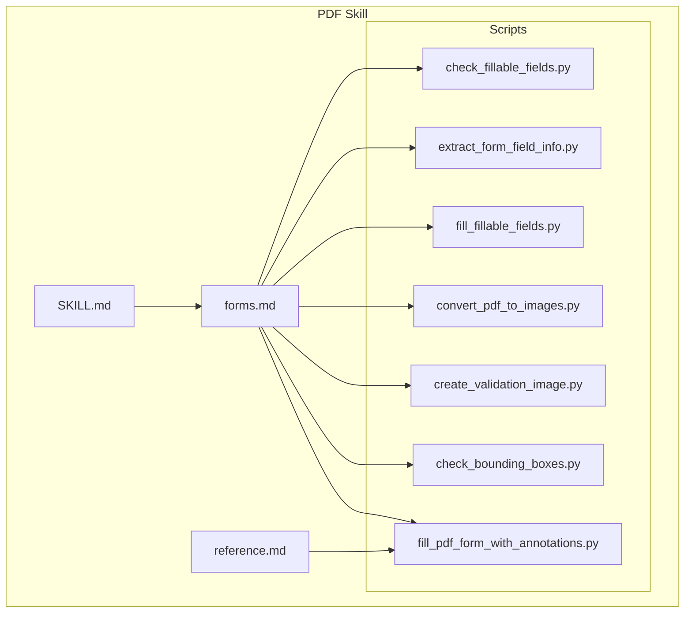
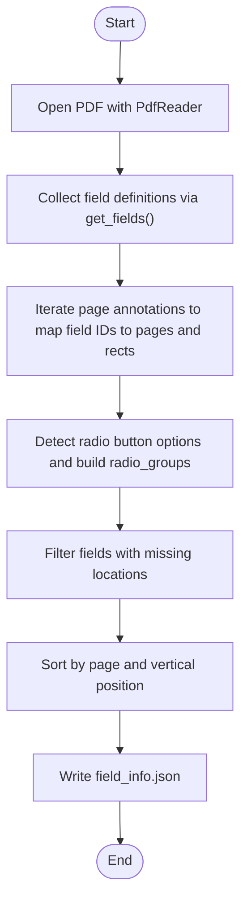
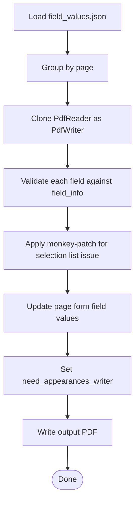
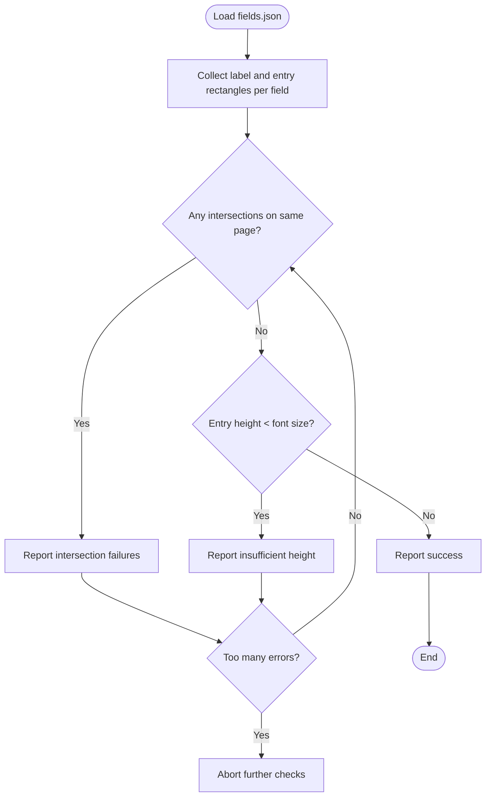
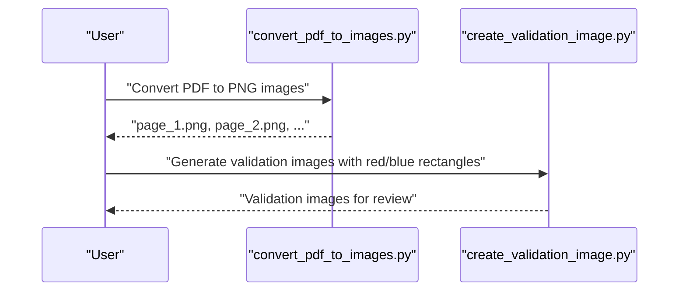
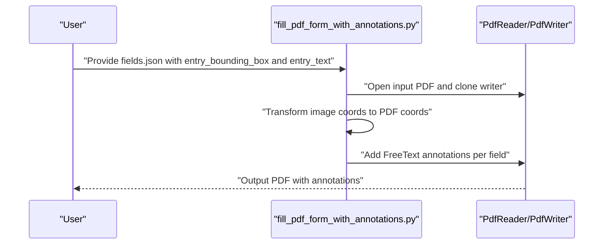
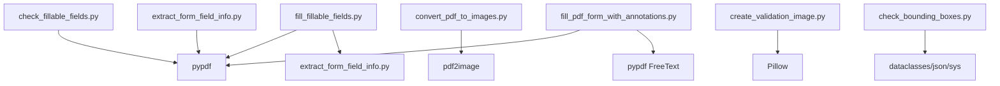

# PDF Processing

<cite>
**Referenced Files in This Document**
- [SKILL.md](file://document-skills/pdf/SKILL.md)
- [forms.md](file://document-skills/pdf/forms.md)
- [reference.md](file://document-skills/pdf/reference.md)
- [check_fillable_fields.py](file://document-skills/pdf/scripts/check_fillable_fields.py)
- [extract_form_field_info.py](file://document-skills/pdf/scripts/extract_form_field_info.py)
- [fill_fillable_fields.py](file://document-skills/pdf/scripts/fill_fillable_fields.py)
- [convert_pdf_to_images.py](file://document-skills/pdf/scripts/convert_pdf_to_images.py)
- [create_validation_image.py](file://document-skills/pdf/scripts/create_validation_image.py)
- [check_bounding_boxes.py](file://document-skills/pdf/scripts/check_bounding_boxes.py)
- [check_bounding_boxes_test.py](file://document-skills/pdf/scripts/check_bounding_boxes_test.py)
- [fill_pdf_form_with_annotations.py](file://document-skills/pdf/scripts/fill_pdf_form_with_annotations.py)
</cite>

## Table of Contents
1. [Introduction](#introduction)
2. [Project Structure](#project-structure)
3. [Core Components](#core-components)
4. [Architecture Overview](#architecture-overview)
5. [Detailed Component Analysis](#detailed-component-analysis)
6. [Dependency Analysis](#dependency-analysis)
7. [Performance Considerations](#performance-considerations)
8. [Troubleshooting Guide](#troubleshooting-guide)
9. [Security Considerations](#security-considerations)
10. [Conclusion](#conclusion)
11. [Appendices](#appendices)

## Introduction
This document explains the PDF processing skill implemented in the repository. It focuses on:
- Detecting and validating form fields
- Performing bounding box analysis for non-fillable forms
- Programmatic form filling using pypdf
- Converting PDFs to images for validation and annotation overlay
- Workflows for automated data entry, compliance checks, and document verification
- Common issues such as font embedding and cross-reader compatibility
- Security considerations for handling confidential PDFs and maintaining document integrity

The skill leverages Python libraries (pypdf, pdfplumber, reportlab, pdf2image, pypdfium2) and command-line tools (poppler-utils, qpdf) to support robust PDF manipulation.

## Project Structure
The PDF skill is organized into a guide, a forms workflow, and a set of scripts that implement the end-to-end pipeline for form detection, validation, and filling.

**Diagram sources**
- [SKILL.md](file://document-skills/pdf/SKILL.md#L1-L295)
- [forms.md](file://document-skills/pdf/forms.md#L1-L206)
- [reference.md](file://document-skills/pdf/reference.md#L1-L612)
- [check_fillable_fields.py](file://document-skills/pdf/scripts/check_fillable_fields.py#L1-L13)
- [extract_form_field_info.py](file://document-skills/pdf/scripts/extract_form_field_info.py#L1-L153)
- [fill_fillable_fields.py](file://document-skills/pdf/scripts/fill_fillable_fields.py#L1-L115)
- [convert_pdf_to_images.py](file://document-skills/pdf/scripts/convert_pdf_to_images.py#L1-L36)
- [create_validation_image.py](file://document-skills/pdf/scripts/create_validation_image.py#L1-L42)
- [check_bounding_boxes.py](file://document-skills/pdf/scripts/check_bounding_boxes.py#L1-L71)
- [fill_pdf_form_with_annotations.py](file://document-skills/pdf/scripts/fill_pdf_form_with_annotations.py#L1-L108)

**Section sources**
- [SKILL.md](file://document-skills/pdf/SKILL.md#L1-L295)
- [forms.md](file://document-skills/pdf/forms.md#L1-L206)

## Core Components
- Form detection and metadata extraction
- Bounding box validation for non-fillable forms
- Programmatic form filling with pypdf
- Image conversion and validation overlays
- Annotation-based filling for non-fillable forms

Key capabilities:
- Detect fillable fields and derive field metadata (types, states, options)
- Convert PDFs to images for visual analysis
- Validate bounding boxes and produce validation images
- Fill forms either by updating form field values or by adding text annotations
- Provide robust error handling and monkey-patches for known library issues

**Section sources**
- [extract_form_field_info.py](file://document-skills/pdf/scripts/extract_form_field_info.py#L1-L153)
- [fill_fillable_fields.py](file://document-skills/pdf/scripts/fill_fillable_fields.py#L1-L115)
- [convert_pdf_to_images.py](file://document-skills/pdf/scripts/convert_pdf_to_images.py#L1-L36)
- [check_bounding_boxes.py](file://document-skills/pdf/scripts/check_bounding_boxes.py#L1-L71)
- [create_validation_image.py](file://document-skills/pdf/scripts/create_validation_image.py#L1-L42)
- [fill_pdf_form_with_annotations.py](file://document-skills/pdf/scripts/fill_pdf_form_with_annotations.py#L1-L108)

## Architecture Overview
The PDF processing skill orchestrates a series of scripts that handle different stages of form processing. The flow varies depending on whether the PDF has fillable fields or not.

```mermaid
sequenceDiagram
participant U as "User"
participant CF as "check_fillable_fields.py"
participant EF as "extract_form_field_info.py"
participant FF as "fill_fillable_fields.py"
participant CI as "convert_pdf_to_images.py"
participant CV as "create_validation_image.py"
participant CB as "check_bounding_boxes.py"
participant AN as "fill_pdf_form_with_annotations.py"
U->>CF : "Run check_fillable_fields.py <file.pdf>"
alt "Has fillable fields"
CF-->>U : "Fillable fields present"
U->>EF : "Run extract_form_field_info.py <input.pdf> <field_info.json>"
EF-->>U : "field_info.json"
U->>FF : "Run fill_fillable_fields.py <input.pdf> <field_values.json> <output.pdf>"
FF-->>U : "Filled PDF"
else "No fillable fields"
CF-->>U : "No fillable fields"
U->>CI : "Run convert_pdf_to_images.py <file.pdf> <output_dir>"
CI-->>U : "PNG images per page"
U->>CV : "Run create_validation_image.py <page> <fields.json> <input_img> <output_img>"
CV-->>U : "Validation images"
U->>CB : "Run check_bounding_boxes.py <fields.json>"
CB-->>U : "Validation messages"
U->>AN : "Run fill_pdf_form_with_annotations.py <input.pdf> <fields.json> <output.pdf>"
AN-->>U : "Filled PDF with annotations"
end
```

**Diagram sources**
- [check_fillable_fields.py](file://document-skills/pdf/scripts/check_fillable_fields.py#L1-L13)
- [extract_form_field_info.py](file://document-skills/pdf/scripts/extract_form_field_info.py#L1-L153)
- [fill_fillable_fields.py](file://document-skills/pdf/scripts/fill_fillable_fields.py#L1-L115)
- [convert_pdf_to_images.py](file://document-skills/pdf/scripts/convert_pdf_to_images.py#L1-L36)
- [create_validation_image.py](file://document-skills/pdf/scripts/create_validation_image.py#L1-L42)
- [check_bounding_boxes.py](file://document-skills/pdf/scripts/check_bounding_boxes.py#L1-L71)
- [fill_pdf_form_with_annotations.py](file://document-skills/pdf/scripts/fill_pdf_form_with_annotations.py#L1-L108)

## Detailed Component Analysis

### Form Detection and Metadata Extraction
This component identifies fillable fields and builds a structured representation of field metadata, including types, page locations, and bounding boxes. It also handles radio button groups and choice lists.

**Diagram sources**
- [extract_form_field_info.py](file://document-skills/pdf/scripts/extract_form_field_info.py#L1-L153)

**Section sources**
- [extract_form_field_info.py](file://document-skills/pdf/scripts/extract_form_field_info.py#L1-L153)

### Programmatic Form Filling with pypdf
This component validates user-provided field values against the discovered metadata and updates form fields. It includes a monkey-patch for a known issue with selection lists.

**Diagram sources**
- [fill_fillable_fields.py](file://document-skills/pdf/scripts/fill_fillable_fields.py#L1-L115)

**Section sources**
- [fill_fillable_fields.py](file://document-skills/pdf/scripts/fill_fillable_fields.py#L1-L115)

### Bounding Box Validation for Non-Fillable Forms
Bounding box validation ensures that label and entry boxes do not intersect and that entry boxes are tall enough for the intended text. It also limits the number of reported errors to keep feedback manageable.

**Diagram sources**
- [check_bounding_boxes.py](file://document-skills/pdf/scripts/check_bounding_boxes.py#L1-L71)

**Section sources**
- [check_bounding_boxes.py](file://document-skills/pdf/scripts/check_bounding_boxes.py#L1-L71)
- [check_bounding_boxes_test.py](file://document-skills/pdf/scripts/check_bounding_boxes_test.py#L1-L227)

### Image Conversion and Validation Overlay
Converting PDFs to images enables visual analysis of form fields. Validation images highlight label and entry bounding boxes to aid manual verification.

**Diagram sources**
- [convert_pdf_to_images.py](file://document-skills/pdf/scripts/convert_pdf_to_images.py#L1-L36)
- [create_validation_image.py](file://document-skills/pdf/scripts/create_validation_image.py#L1-L42)

**Section sources**
- [convert_pdf_to_images.py](file://document-skills/pdf/scripts/convert_pdf_to_images.py#L1-L36)
- [create_validation_image.py](file://document-skills/pdf/scripts/create_validation_image.py#L1-L42)

### Annotation-Based Filling for Non-Fillable Forms
When a PDF lacks fillable fields, the skill adds text annotations at computed PDF coordinates derived from image-based bounding boxes. It transforms image coordinates to PDF coordinates and applies FreeText annotations.

**Diagram sources**
- [fill_pdf_form_with_annotations.py](file://document-skills/pdf/scripts/fill_pdf_form_with_annotations.py#L1-L108)

**Section sources**
- [fill_pdf_form_with_annotations.py](file://document-skills/pdf/scripts/fill_pdf_form_with_annotations.py#L1-L108)

## Dependency Analysis
The scripts depend on pypdf for PDF manipulation and on external libraries for image conversion and validation.

**Diagram sources**
- [check_fillable_fields.py](file://document-skills/pdf/scripts/check_fillable_fields.py#L1-L13)
- [extract_form_field_info.py](file://document-skills/pdf/scripts/extract_form_field_info.py#L1-L153)
- [fill_fillable_fields.py](file://document-skills/pdf/scripts/fill_fillable_fields.py#L1-L115)
- [convert_pdf_to_images.py](file://document-skills/pdf/scripts/convert_pdf_to_images.py#L1-L36)
- [create_validation_image.py](file://document-skills/pdf/scripts/create_validation_image.py#L1-L42)
- [check_bounding_boxes.py](file://document-skills/pdf/scripts/check_bounding_boxes.py#L1-L71)
- [fill_pdf_form_with_annotations.py](file://document-skills/pdf/scripts/fill_pdf_form_with_annotations.py#L1-L108)

**Section sources**
- [check_fillable_fields.py](file://document-skills/pdf/scripts/check_fillable_fields.py#L1-L13)
- [extract_form_field_info.py](file://document-skills/pdf/scripts/extract_form_field_info.py#L1-L153)
- [fill_fillable_fields.py](file://document-skills/pdf/scripts/fill_fillable_fields.py#L1-L115)
- [convert_pdf_to_images.py](file://document-skills/pdf/scripts/convert_pdf_to_images.py#L1-L36)
- [create_validation_image.py](file://document-skills/pdf/scripts/create_validation_image.py#L1-L42)
- [check_bounding_boxes.py](file://document-skills/pdf/scripts/check_bounding_boxes.py#L1-L71)
- [fill_pdf_form_with_annotations.py](file://document-skills/pdf/scripts/fill_pdf_form_with_annotations.py#L1-L108)

## Performance Considerations
- Prefer command-line tools for large-scale operations:
  - Use qpdf for splitting and merging large PDFs
  - Use poppler’s pdftotext with bbox-layout for fast text extraction
- For image extraction, pdfimages is faster than rendering pages
- When processing large PDFs, consider streaming and chunked operations
- For text extraction, pdfplumber is suitable for structured data and tables; pypdf’s extract_text may be less efficient for very large documents
- For rendering, pypdfium2 offers fast page rendering and image generation

[No sources needed since this section provides general guidance]

## Troubleshooting Guide
Common issues and resolutions:
- Encrypted PDFs: Decrypt before processing or handle exceptions during read
- Corrupted PDFs: Use qpdf to check and repair
- OCR fallback: Convert scanned PDFs to images and apply OCR
- Font embedding and cross-viewer compatibility:
  - Font size and color may not render consistently across viewers; verify results visually
  - For non-fillable forms, use annotations to ensure visibility
- Selection list field values: A known pypdf issue is addressed by a monkey-patch in the filling script

**Section sources**
- [reference.md](file://document-skills/pdf/reference.md#L568-L602)
- [fill_fillable_fields.py](file://document-skills/pdf/scripts/fill_fillable_fields.py#L78-L105)

## Security Considerations
- Protect sensitive data:
  - Avoid logging raw PDF content or field values
  - Restrict access to intermediate images and JSON files
  - Use secure temporary storage and clean up artifacts after processing
- Maintain document integrity:
  - Preserve original PDF structure when possible
  - Use cloning and appending to avoid unintended modifications
  - Validate outputs before distributing
- Access control:
  - Restrict execution of scripts to trusted environments
  - Sanitize inputs and enforce strict validation of field metadata and values

[No sources needed since this section provides general guidance]

## Conclusion
The PDF processing skill provides a comprehensive, script-driven workflow for detecting and filling PDF forms, validating bounding boxes, and generating annotated outputs. By combining pypdf for form manipulation, pdf2image for image conversion, and robust validation utilities, it supports automated data entry, compliance checks, and document verification across diverse PDFs. Adhering to the outlined workflows and troubleshooting practices ensures reliable and secure processing.

[No sources needed since this section summarizes without analyzing specific files]

## Appendices

### Usage Patterns and Workflows
- Automated data entry:
  - Detect fillable fields, extract metadata, and update values programmatically
  - Validate values against field types and options before writing
- Compliance checks:
  - Use bounding box validation to ensure label and entry areas are correctly defined
  - Generate validation images for manual review
- Document verification:
  - Convert PDFs to images for visual inspection
  - Add annotations for non-fillable forms to preserve structure and readability

[No sources needed since this section provides general guidance]