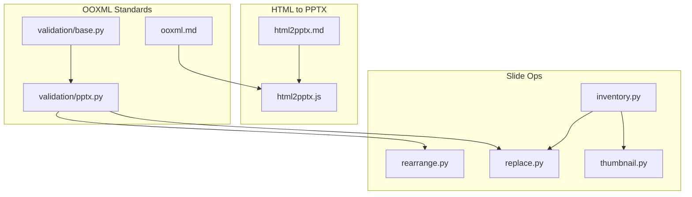
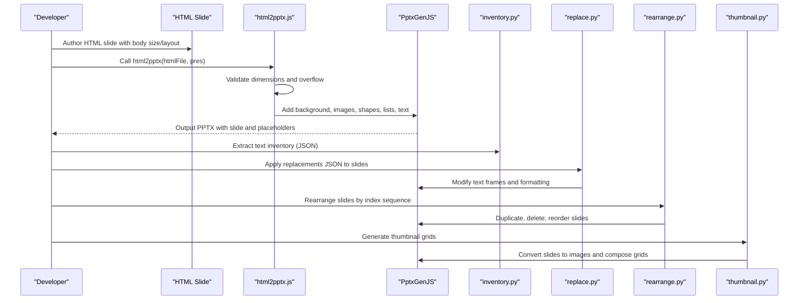
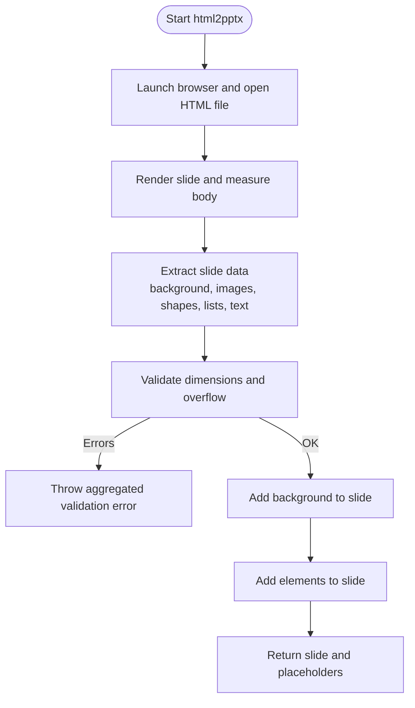
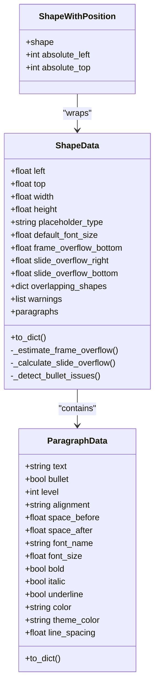
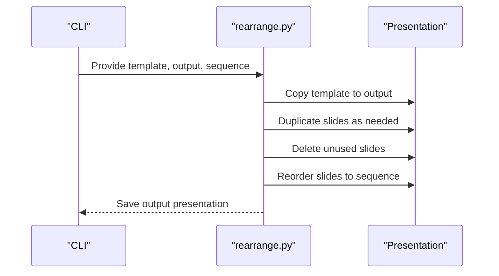
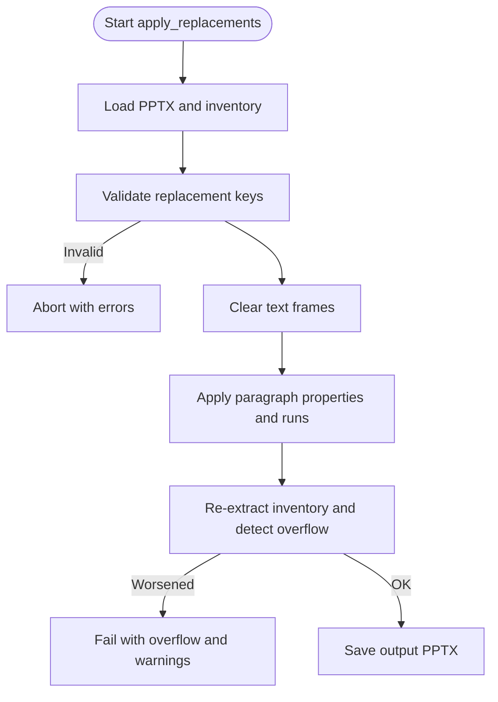
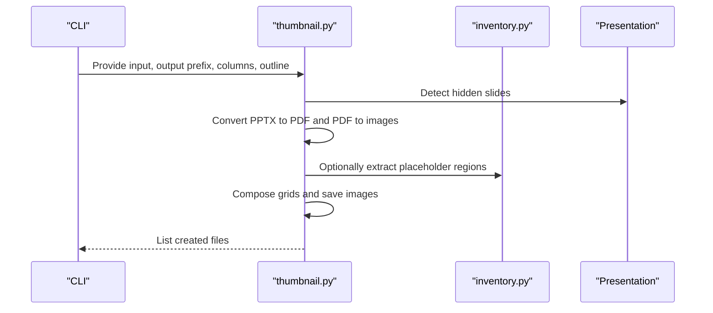
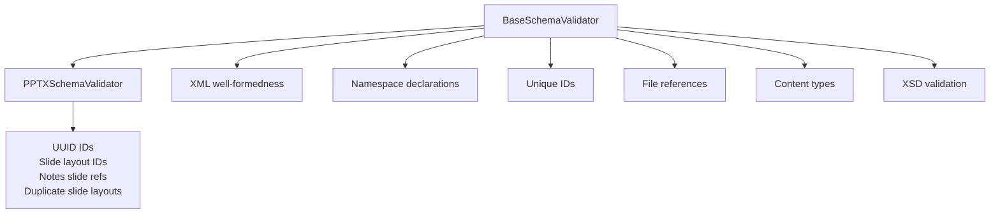
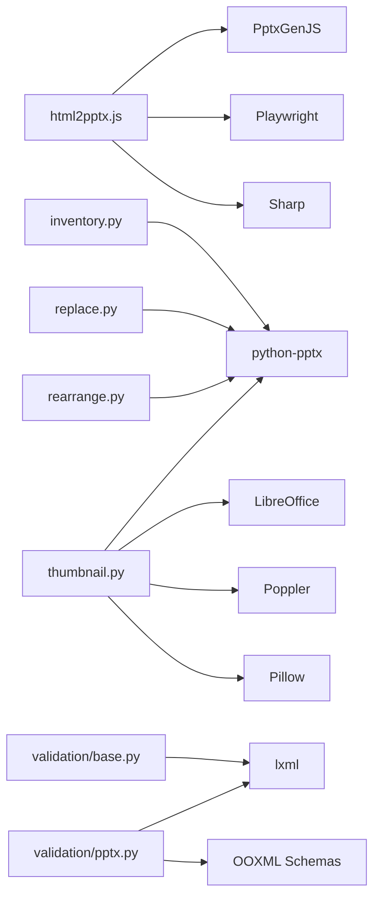

# PPTX Processing

<cite>
**Referenced Files in This Document**
- [html2pptx.md](file://document-skills/pptx/html2pptx.md)
- [ooxml.md](file://document-skills/pptx/ooxml.md)
- [html2pptx.js](file://document-skills/pptx/scripts/html2pptx.js)
- [inventory.py](file://document-skills/pptx/scripts/inventory.py)
- [rearrange.py](file://document-skills/pptx/scripts/rearrange.py)
- [replace.py](file://document-skills/pptx/scripts/replace.py)
- [thumbnail.py](file://document-skills/pptx/scripts/thumbnail.py)
- [pptx.py](file://document-skills/pptx/ooxml/scripts/validation/pptx.py)
- [base.py](file://document-skills/pptx/ooxml/scripts/validation/base.py)
</cite>

## Table of Contents
1. [Introduction](#introduction)
2. [Project Structure](#project-structure)
3. [Core Components](#core-components)
4. [Architecture Overview](#architecture-overview)
5. [Detailed Component Analysis](#detailed-component-analysis)
6. [Dependency Analysis](#dependency-analysis)
7. [Performance Considerations](#performance-considerations)
8. [Troubleshooting Guide](#troubleshooting-guide)
9. [Conclusion](#conclusion)
10. [Appendices](#appendices)

## Introduction
This document explains the PPTX processing skill with a focus on PowerPoint manipulation using OOXML standards, HTML-to-PPTX conversion, slide inventory management, layout rearrangement, text replacement workflows, and thumbnail generation. It also covers common issues such as animation loss and font substitution, and provides integration patterns for enterprise reporting scenarios.

## Project Structure
The PPTX skill is organized into two primary areas:
- HTML-to-PPTX conversion and formatting pipeline
- Slide lifecycle operations (inventory, rearrange, replace, thumbnail)

**Diagram sources**
- [html2pptx.js](file://document-skills/pptx/scripts/html2pptx.js#L1-L979)
- [html2pptx.md](file://document-skills/pptx/html2pptx.md#L1-L625)
- [ooxml.md](file://document-skills/pptx/ooxml.md#L1-L427)
- [base.py](file://document-skills/pptx/ooxml/scripts/validation/base.py#L1-L952)
- [pptx.py](file://document-skills/pptx/ooxml/scripts/validation/pptx.py#L1-L316)
- [inventory.py](file://document-skills/pptx/scripts/inventory.py#L1-L1021)
- [rearrange.py](file://document-skills/pptx/scripts/rearrange.py#L1-L232)
- [replace.py](file://document-skills/pptx/scripts/replace.py#L1-L386)
- [thumbnail.py](file://document-skills/pptx/scripts/thumbnail.py#L1-L451)

**Section sources**
- [html2pptx.js](file://document-skills/pptx/scripts/html2pptx.js#L1-L979)
- [html2pptx.md](file://document-skills/pptx/html2pptx.md#L1-L625)
- [ooxml.md](file://document-skills/pptx/ooxml.md#L1-L427)
- [base.py](file://document-skills/pptx/ooxml/scripts/validation/base.py#L1-L952)
- [pptx.py](file://document-skills/pptx/ooxml/scripts/validation/pptx.py#L1-L316)
- [inventory.py](file://document-skills/pptx/scripts/inventory.py#L1-L1021)
- [rearrange.py](file://document-skills/pptx/scripts/rearrange.py#L1-L232)
- [replace.py](file://document-skills/pptx/scripts/replace.py#L1-L386)
- [thumbnail.py](file://document-skills/pptx/scripts/thumbnail.py#L1-L451)

## Core Components
- HTML to PPTX conversion engine: Parses HTML pages, extracts positions and styles, validates constraints, and renders slides with PptxGenJS.
- Slide inventory extraction: Recursively traverses shapes, preserves paragraph formatting, detects overflow and overlaps, and exports structured JSON.
- Slide rearrangement: Duplicates slides, deletes unused slides, and reorders to produce a new presentation.
- Text replacement: Applies structured replacements to text frames, validates formatting, and reports issues.
- Thumbnail generation: Produces slide grids with optional placeholder outlines and handles hidden slides.

**Section sources**
- [html2pptx.js](file://document-skills/pptx/scripts/html2pptx.js#L896-L979)
- [inventory.py](file://document-skills/pptx/scripts/inventory.py#L1-L1021)
- [rearrange.py](file://document-skills/pptx/scripts/rearrange.py#L1-L232)
- [replace.py](file://document-skills/pptx/scripts/replace.py#L1-L386)
- [thumbnail.py](file://document-skills/pptx/scripts/thumbnail.py#L1-L451)

## Architecture Overview
The system integrates HTML templating with PPTX generation and slide lifecycle operations. HTML slides are validated and converted to PptxGenJS slides. Slide operations (rearrange, replace, inventory, thumbnails) operate on the PPTX file using Python/Pillow/PPTX libraries.

**Diagram sources**
- [html2pptx.js](file://document-skills/pptx/scripts/html2pptx.js#L896-L979)
- [inventory.py](file://document-skills/pptx/scripts/inventory.py#L1-L1021)
- [replace.py](file://document-skills/pptx/scripts/replace.py#L1-L386)
- [rearrange.py](file://document-skills/pptx/scripts/rearrange.py#L1-L232)
- [thumbnail.py](file://document-skills/pptx/scripts/thumbnail.py#L1-L451)

## Detailed Component Analysis

### HTML to PPTX Conversion Engine
The conversion engine uses Playwright to render HTML and PptxGenJS to assemble slides. It validates layout dimensions, detects overflow, parses inline formatting, and converts CSS into PptxGenJS-compatible properties.

Key behaviors:
- Validates HTML body dimensions against presentation layout.
- Detects content overflow and bottom-margin proximity for text boxes.
- Extracts background images/colors, images, shapes, lists, and plain/text runs with inline formatting.
- Converts CSS transforms and writing modes to rotation.
- Parses box-shadows into PowerPoint-compatible shadows (outer only).
- Emits a single error message collecting all validation issues.

**Diagram sources**
- [html2pptx.js](file://document-skills/pptx/scripts/html2pptx.js#L896-L979)

**Section sources**
- [html2pptx.js](file://document-skills/pptx/scripts/html2pptx.js#L1-L979)
- [html2pptx.md](file://document-skills/pptx/html2pptx.md#L1-L625)

### Slide Inventory Management
The inventory module extracts structured text content from slides, preserving paragraph formatting and handling nested groups. It computes overflow and overlap, filters placeholders, and exports JSON for downstream replacement.

Highlights:
- Recursively collects shapes with absolute positions (including grouped shapes).
- Computes frame overflow using PIL text measurement and usable margins.
- Detects slide boundary overflow and bullet formatting issues.
- Exports JSON with paragraphs, formatting, and warnings.

**Diagram sources**
- [inventory.py](file://document-skills/pptx/scripts/inventory.py#L1-L1021)

**Section sources**
- [inventory.py](file://document-skills/pptx/scripts/inventory.py#L1-L1021)

### Slide Rearrangement Workflow
The rearrange script duplicates slides when needed, deletes unused slides, and reorders to match a specified sequence. It preserves slide layouts and updates relationships.

**Diagram sources**
- [rearrange.py](file://document-skills/pptx/scripts/rearrange.py#L1-L232)

**Section sources**
- [rearrange.py](file://document-skills/pptx/scripts/rearrange.py#L1-L232)

### Text Replacement Workflow
The replace script validates that all shapes exist, clears text frames, applies paragraph-level formatting, and checks for regressions in overflow.

**Diagram sources**
- [replace.py](file://document-skills/pptx/scripts/replace.py#L1-L386)
- [inventory.py](file://document-skills/pptx/scripts/inventory.py#L1-L1021)

**Section sources**
- [replace.py](file://document-skills/pptx/scripts/replace.py#L1-L386)
- [inventory.py](file://document-skills/pptx/scripts/inventory.py#L1-L1021)

### Thumbnail Generation
The thumbnail script converts slides to images via LibreOffice and Poppler, composes grids, and optionally outlines placeholder regions.

**Diagram sources**
- [thumbnail.py](file://document-skills/pptx/scripts/thumbnail.py#L1-L451)
- [inventory.py](file://document-skills/pptx/scripts/inventory.py#L1-L1021)

**Section sources**
- [thumbnail.py](file://document-skills/pptx/scripts/thumbnail.py#L1-L451)

### OOXML Standards and Validation
The validation stack ensures PPTX integrity by checking XML well-formedness, namespace declarations, unique IDs, file references, content types, XSD compliance, and relationship integrity.

**Diagram sources**
- [base.py](file://document-skills/pptx/ooxml/scripts/validation/base.py#L1-L952)
- [pptx.py](file://document-skills/pptx/ooxml/scripts/validation/pptx.py#L1-L316)

**Section sources**
- [base.py](file://document-skills/pptx/ooxml/scripts/validation/base.py#L1-L952)
- [pptx.py](file://document-skills/pptx/ooxml/scripts/validation/pptx.py#L1-L316)
- [ooxml.md](file://document-skills/pptx/ooxml.md#L1-L427)

## Dependency Analysis
- html2pptx.js depends on Playwright for rendering and Sharp for rasterization, and PptxGenJS for slide assembly.
- inventory.py and replace.py depend on python-pptx for reading and modifying slides.
- rearrange.py manipulates slide relationships and IDs using python-pptx internals.
- thumbnail.py depends on LibreOffice and Poppler for conversion and Pillow for image composition.
- Validation scripts depend on lxml and OOXML schemas to enforce standards.

**Diagram sources**
- [html2pptx.js](file://document-skills/pptx/scripts/html2pptx.js#L1-L979)
- [inventory.py](file://document-skills/pptx/scripts/inventory.py#L1-L1021)
- [replace.py](file://document-skills/pptx/scripts/replace.py#L1-L386)
- [rearrange.py](file://document-skills/pptx/scripts/rearrange.py#L1-L232)
- [thumbnail.py](file://document-skills/pptx/scripts/thumbnail.py#L1-L451)
- [base.py](file://document-skills/pptx/ooxml/scripts/validation/base.py#L1-L952)
- [pptx.py](file://document-skills/pptx/ooxml/scripts/validation/pptx.py#L1-L316)

**Section sources**
- [html2pptx.js](file://document-skills/pptx/scripts/html2pptx.js#L1-L979)
- [inventory.py](file://document-skills/pptx/scripts/inventory.py#L1-L1021)
- [replace.py](file://document-skills/pptx/scripts/replace.py#L1-L386)
- [rearrange.py](file://document-skills/pptx/scripts/rearrange.py#L1-L232)
- [thumbnail.py](file://document-skills/pptx/scripts/thumbnail.py#L1-L451)
- [base.py](file://document-skills/pptx/ooxml/scripts/validation/base.py#L1-L952)
- [pptx.py](file://document-skills/pptx/ooxml/scripts/validation/pptx.py#L1-L316)

## Performance Considerations
- Rendering HTML with Playwright and converting PDF to images can be CPU-intensive; batch operations and caching help reduce overhead.
- PIL text measurement for overflow detection scales with paragraph count and font sizes; consider limiting font variations and wrapping strategies.
- Slide rearrangement involves deep copying shapes and updating relationships; minimize unnecessary duplication and deletions.
- Thumbnail generation benefits from appropriate DPI and grid sizing to balance quality and file size.

[No sources needed since this section provides general guidance]

## Troubleshooting Guide
Common issues and mitigations:
- Animation loss: Animations are not preserved when converting HTML to PPTX or when manipulating slides programmatically. Mitigation: define animations in the final PPTX using PptxGenJS after content insertion.
- Font substitution: Use web-safe fonts in HTML templates to avoid fallbacks. If custom fonts are required, embed them and ensure availability in the target environment.
- Gradient and complex CSS: Pre-rasterize gradients/icons with Sharp and reference PNGs in HTML.
- Overflow and alignment: Use the inventory tool to detect and resolve text overflow; adjust margins and line spacing.
- Relationship corruption: Use the validation scripts to ensure all relationships and content types are declared correctly.

**Section sources**
- [html2pptx.md](file://document-skills/pptx/html2pptx.md#L1-L625)
- [ooxml.md](file://document-skills/pptx/ooxml.md#L1-L427)
- [base.py](file://document-skills/pptx/ooxml/scripts/validation/base.py#L1-L952)
- [pptx.py](file://document-skills/pptx/ooxml/scripts/validation/pptx.py#L1-L316)

## Conclusion
The PPTX processing skill provides a robust pipeline for transforming HTML slides into structured presentations, managing slide inventories, automating rearrangements and replacements, and generating thumbnails. By adhering to OOXML standards and leveraging validation tools, teams can build reliable, enterprise-grade reporting solutions that preserve formatting and maintain file integrity.

[No sources needed since this section summarizes without analyzing specific files]

## Appendices

### Integration Patterns for Enterprise Reporting
- Template-driven HTML: Create reusable HTML templates with placeholders for dynamic content; convert to PPTX using html2pptx.js.
- Structured replacements: Use inventory JSON to drive replace.py for batch updates across decks.
- Slide orchestration: Use rearrange.py to assemble decks from templates and repeat slides as needed.
- Preview and review: Use thumbnail.py to generate slide grids for quick review and placeholder highlighting.

**Section sources**
- [html2pptx.md](file://document-skills/pptx/html2pptx.md#L1-L625)
- [inventory.py](file://document-skills/pptx/scripts/inventory.py#L1-L1021)
- [replace.py](file://document-skills/pptx/scripts/replace.py#L1-L386)
- [rearrange.py](file://document-skills/pptx/scripts/rearrange.py#L1-L232)
- [thumbnail.py](file://document-skills/pptx/scripts/thumbnail.py#L1-L451)