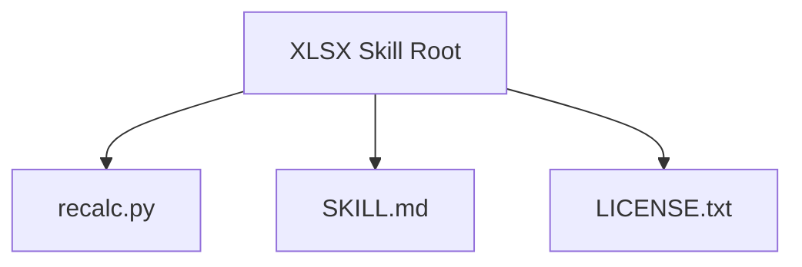
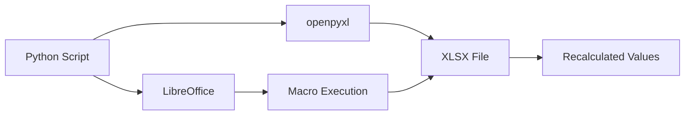
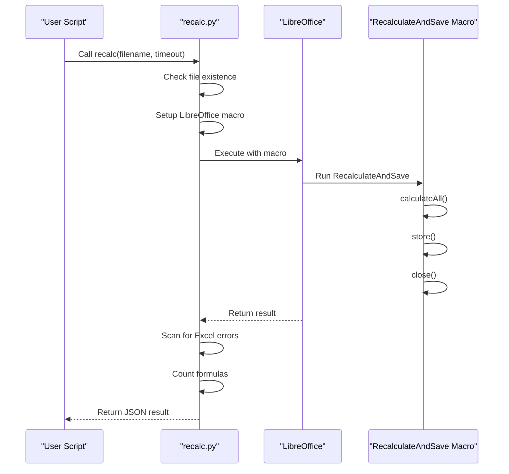
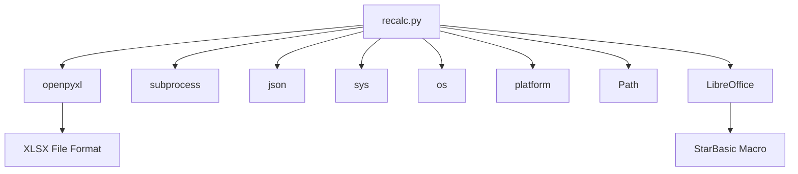

# XLSX Processing

<cite>
**Referenced Files in This Document**   
- [recalc.py](file://document-skills/xlsx/recalc.py)
- [SKILL.md](file://document-skills/xlsx/SKILL.md)
- [LICENSE.txt](file://document-skills/xlsx/LICENSE.txt)
</cite>

## Table of Contents
1. [Introduction](#introduction)
2. [Project Structure](#project-structure)
3. [Core Components](#core-components)
4. [Architecture Overview](#architecture-overview)
5. [Detailed Component Analysis](#detailed-component-analysis)
6. [Dependency Analysis](#dependency-analysis)
7. [Performance Considerations](#performance-considerations)
8. [Troubleshooting Guide](#troubleshooting-guide)
9. [Conclusion](#conclusion)

## Introduction
This document provides comprehensive documentation for the XLSX processing skill, focusing on Excel spreadsheet manipulation with emphasis on formula preservation and recalculation logic. The system enables automated financial modeling, data analysis, and report generation through programmatic reading, modifying, and recalculating complex spreadsheets. The documentation covers the OOXML-based structure of XLSX files, implementation details of the recalculation engine, and best practices for maintaining calculation integrity in automated workflows.

## Project Structure
The XLSX processing skill is organized within the document-skills directory, containing essential components for spreadsheet manipulation. The structure includes the core recalculation script, documentation, and licensing information.

**Diagram sources**
- [recalc.py](file://document-skills/xlsx/recalc.py)
- [SKILL.md](file://document-skills/xlsx/SKILL.md)

**Section sources**
- [recalc.py](file://document-skills/xlsx/recalc.py)
- [SKILL.md](file://document-skills/xlsx/SKILL.md)

## Core Components
The XLSX processing system consists of three primary components: the recalculation engine (recalc.py), comprehensive documentation (SKILL.md), and licensing terms (LICENSE.txt). The recalculation engine is the core functionality that enables formula recalculation using LibreOffice, while the documentation provides detailed guidance on proper usage patterns, requirements, and best practices for spreadsheet automation.

**Section sources**
- [recalc.py](file://document-skills/xlsx/recalc.py)
- [SKILL.md](file://document-skills/xlsx/SKILL.md)

## Architecture Overview
The XLSX processing architecture leverages LibreOffice for formula recalculation, using a macro-based approach to ensure accurate computation of Excel formulas. The system integrates with Python through the openpyxl library for file manipulation and subprocess calls for LibreOffice interaction. This hybrid approach combines the strengths of dedicated spreadsheet software for calculation accuracy with Python's flexibility for automation and integration.

**Diagram sources**
- [recalc.py](file://document-skills/xlsx/recalc.py)

## Detailed Component Analysis

### recalc.py Analysis
The recalc.py script implements a robust solution for recalculating Excel formulas by leveraging LibreOffice's calculation engine. It automatically configures the necessary macro environment on first run and provides comprehensive error detection and reporting.

**Diagram sources**
- [recalc.py](file://document-skills/xlsx/recalc.py#L1-L178)

**Section sources**
- [recalc.py](file://document-skills/xlsx/recalc.py#L1-L178)

### SKILL.md Analysis
The SKILL.md documentation provides comprehensive guidelines for XLSX processing, including requirements for outputs, color coding standards, number formatting rules, and formula construction principles. It establishes industry-standard conventions for financial modeling and data analysis workflows.

**Section sources**
- [SKILL.md](file://document-skills/xlsx/SKILL.md#L1-L289)

## Dependency Analysis
The XLSX processing system depends on several external components and libraries to function properly. These dependencies enable the core functionality of spreadsheet manipulation and formula recalculation.

**Diagram sources**
- [recalc.py](file://document-skills/xlsx/recalc.py#L7-L12)
- [recalc.py](file://document-skills/xlsx/recalc.py#L16-L49)

**Section sources**
- [recalc.py](file://document-skills/xlsx/recalc.py#L7-L50)

## Performance Considerations
The recalculation process performance depends on several factors including file size, formula complexity, and system resources. The script implements timeout functionality to prevent indefinite execution and uses efficient scanning methods to identify errors in large spreadsheets. For optimal performance, users should ensure LibreOffice is properly installed and configured, and consider the complexity of formulas when designing automated workflows.

## Troubleshooting Guide
The XLSX processing system includes comprehensive error handling and reporting capabilities. The recalc.py script returns detailed JSON output that identifies any formula errors found during recalculation, including error type, count, and specific cell locations. Common issues include #REF!, #DIV/0!, #VALUE!, #NAME?, #NULL!, #NUM!, and #N/A errors, each of which is reported with specific locations to facilitate quick resolution.

**Section sources**
- [recalc.py](file://document-skills/xlsx/recalc.py#L101-L137)
- [SKILL.md](file://document-skills/xlsx/SKILL.md#L139-L147)

## Conclusion
The XLSX processing skill provides a robust framework for automated spreadsheet manipulation, with a particular focus on formula preservation and recalculation accuracy. By leveraging LibreOffice's calculation engine through the recalc.py script, the system ensures reliable computation of complex formulas while maintaining compatibility with Excel file formats. The comprehensive documentation in SKILL.md establishes clear standards for financial modeling, data analysis, and report generation, ensuring consistent and professional results across automated workflows.