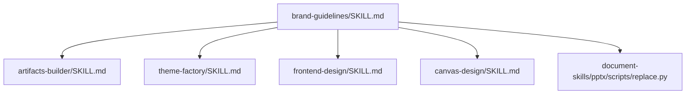
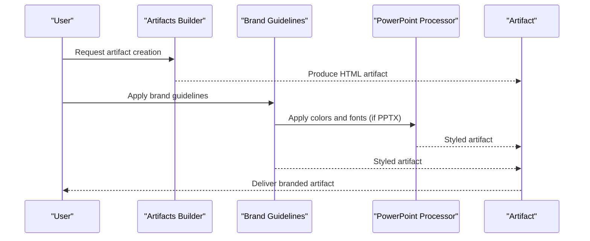
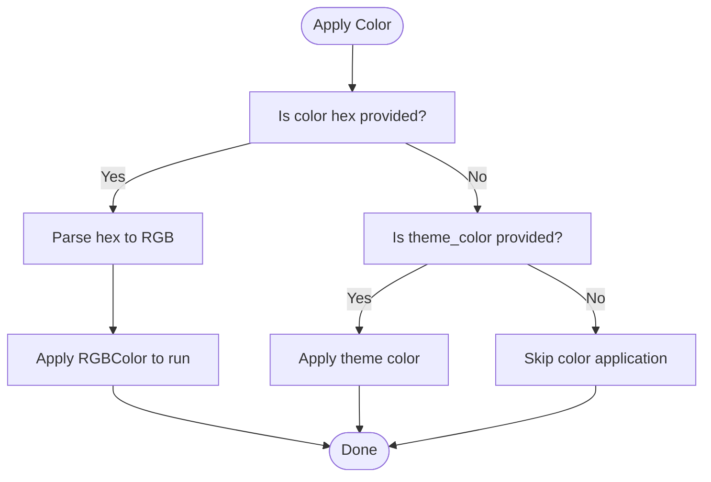
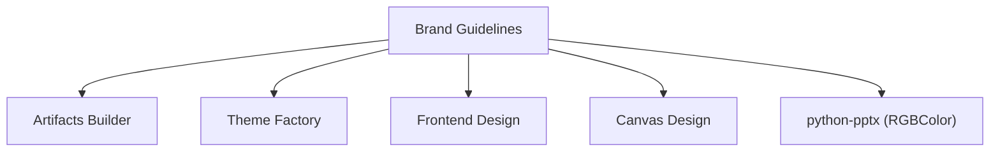

# Brand Guidelines

<cite>
**Referenced Files in This Document**
- [brand-guidelines/SKILL.md](file://brand-guidelines/SKILL.md)
- [brand-guidelines/LICENSE.txt](file://brand-guidelines/LICENSE.txt)
- [artifacts-builder/SKILL.md](file://artifacts-builder/SKILL.md)
- [theme-factory/SKILL.md](file://theme-factory/SKILL.md)
- [frontend-design/SKILL.md](file://frontend-design/SKILL.md)
- [canvas-design/SKILL.md](file://canvas-design/SKILL.md)
- [document-skills/pptx/scripts/replace.py](file://document-skills/pptx/scripts/replace.py)
</cite>

## Table of Contents
1. [Introduction](#introduction)
2. [Project Structure](#project-structure)
3. [Core Components](#core-components)
4. [Architecture Overview](#architecture-overview)
5. [Detailed Component Analysis](#detailed-component-analysis)
6. [Dependency Analysis](#dependency-analysis)
7. [Performance Considerations](#performance-considerations)
8. [Troubleshooting Guide](#troubleshooting-guide)
9. [Conclusion](#conclusion)
10. [Appendices](#appendices)

## Introduction
This document explains the brand-guidelines skill and how it enforces brand consistency across generated artifacts. It covers the structure of the skill’s documentation, the brand rules it defines, and how to apply them to documents and HTML artifacts. It also describes integration points with other skills such as artifacts-builder and theme-factory, and provides troubleshooting guidance for common issues like incorrect color application or font substitution.

## Project Structure
The brand-guidelines skill is documented in a dedicated SKILL.md file and includes a license. It defines brand colors and typography standards intended for use across various artifact types. The skill is designed to be used in conjunction with other skills that produce artifacts (for example, artifacts-builder for HTML artifacts and theme-factory for theme-based styling).

**Diagram sources**
- [brand-guidelines/SKILL.md](file://brand-guidelines/SKILL.md#L1-L74)
- [artifacts-builder/SKILL.md](file://artifacts-builder/SKILL.md#L1-L74)
- [theme-factory/SKILL.md](file://theme-factory/SKILL.md#L1-L60)
- [frontend-design/SKILL.md](file://frontend-design/SKILL.md#L1-L43)
- [canvas-design/SKILL.md](file://canvas-design/SKILL.md#L1-L130)
- [document-skills/pptx/scripts/replace.py](file://document-skills/pptx/scripts/replace.py#L1-L386)

**Section sources**
- [brand-guidelines/SKILL.md](file://brand-guidelines/SKILL.md#L1-L74)

## Core Components
The brand-guidelines skill defines:
- A color palette with primary, secondary, and accent colors
- Typography standards for headings and body text
- Smart font application behavior with fallbacks
- Text styling rules and color application logic
- Shape and accent color usage for non-text elements

These rules are enforced by applying the defined colors and fonts to generated artifacts. The skill emphasizes preserving readability and visual hierarchy across different systems.

Key elements:
- Colors: Dark, Light, Mid Gray, Light Gray, and Accent Colors (Orange, Blue, Green)
- Typography: Poppins for headings (24pt and larger) and Lora for body text, with Arial and Georgia fallbacks
- Color application: RGB color values applied via python-pptx’s RGBColor class
- Shape accent colors: cycling through orange, blue, and green accents

**Section sources**
- [brand-guidelines/SKILL.md](file://brand-guidelines/SKILL.md#L15-L74)

## Architecture Overview
The brand-guidelines skill integrates with other skills that produce artifacts. The typical flow is:
- An artifact is produced by a builder skill (for example, artifacts-builder for HTML artifacts)
- The brand-guidelines skill applies brand colors and typography to the artifact
- For PowerPoint-based artifacts, the color application logic uses python-pptx’s RGBColor class

**Diagram sources**
- [artifacts-builder/SKILL.md](file://artifacts-builder/SKILL.md#L1-L74)
- [brand-guidelines/SKILL.md](file://brand-guidelines/SKILL.md#L15-L74)
- [document-skills/pptx/scripts/replace.py](file://document-skills/pptx/scripts/replace.py#L1-L386)

## Detailed Component Analysis

### Brand Rules Definition (SKILL.md)
The brand-guidelines skill’s documentation defines:
- Color palette and usage
- Typography standards and fallbacks
- Smart font application behavior
- Text styling rules
- Color application via RGBColor
- Accent color usage for shapes

These rules provide a consistent baseline for visual identity across all artifacts.

**Section sources**
- [brand-guidelines/SKILL.md](file://brand-guidelines/SKILL.md#L15-L74)

### Integration with Artifacts Builder
Artifacts Builder produces HTML artifacts using modern frontend technologies. The brand-guidelines skill can be applied to ensure brand colors and typography are used consistently in these artifacts. The builder skill’s SKILL.md outlines the development stack and bundling process for HTML artifacts.

Practical integration steps:
- After building the artifact with Artifacts Builder, apply brand colors and fonts as defined in brand-guidelines
- Ensure fonts are pre-installed or rely on fallbacks as documented
- Validate that typography and color usage align with the brand guidelines

**Section sources**
- [artifacts-builder/SKILL.md](file://artifacts-builder/SKILL.md#L1-L74)
- [brand-guidelines/SKILL.md](file://brand-guidelines/SKILL.md#L38-L74)

### Integration with Theme Factory
Theme Factory provides curated themes with color palettes and font pairings. The brand-guidelines skill complements Theme Factory by offering a standardized set of brand colors and typography that can be applied consistently across artifacts. When a theme is selected, the brand guidelines ensure that brand colors and fonts are applied uniformly.

Practical integration steps:
- Select a theme from Theme Factory
- Apply the theme’s colors and fonts to the artifact
- Use brand-guidelines to enforce brand-specific colors and typography where necessary

**Section sources**
- [theme-factory/SKILL.md](file://theme-factory/SKILL.md#L1-L60)
- [brand-guidelines/SKILL.md](file://brand-guidelines/SKILL.md#L15-L74)

### Integration with Frontend Design
Frontend Design focuses on creating production-grade interfaces with distinctive aesthetics. The brand-guidelines skill ensures that brand colors and typography are applied consistently in frontend artifacts. The frontend design skill emphasizes avoiding generic aesthetics and using CSS variables for consistency, which aligns with the brand guidelines’ emphasis on color and typography standards.

Practical integration steps:
- Use brand colors and typography in frontend components
- Maintain consistent color usage across the interface
- Ensure typography choices align with brand guidelines

**Section sources**
- [frontend-design/SKILL.md](file://frontend-design/SKILL.md#L1-L43)
- [brand-guidelines/SKILL.md](file://brand-guidelines/SKILL.md#L32-L53)

### Integration with Canvas Design
Canvas Design focuses on creating visual art in .png and .pdf formats. The brand-guidelines skill can be used to ensure brand colors and typography are applied to these visual artifacts. The canvas design skill instructs to use fonts from the canvas-fonts directory and emphasizes minimal text as a visual accent.

Practical integration steps:
- Select fonts from the canvas-fonts directory that align with brand guidelines
- Apply brand colors and typography to visual compositions
- Ensure text remains minimal and serves as a visual accent

**Section sources**
- [canvas-design/SKILL.md](file://canvas-design/SKILL.md#L1-L130)
- [brand-guidelines/SKILL.md](file://brand-guidelines/SKILL.md#L32-L53)

### Color Application Logic (PowerPoint)
For PowerPoint artifacts, the brand-guidelines skill’s color application logic uses python-pptx’s RGBColor class. The implementation demonstrates:
- Converting hex color values to RGB integers
- Applying RGBColor to text runs
- Falling back to theme colors when RGB is not provided

**Diagram sources**
- [document-skills/pptx/scripts/replace.py](file://document-skills/pptx/scripts/replace.py#L113-L141)

**Section sources**
- [document-skills/pptx/scripts/replace.py](file://document-skills/pptx/scripts/replace.py#L113-L141)
- [brand-guidelines/SKILL.md](file://brand-guidelines/SKILL.md#L69-L74)

### Practical Examples

#### Applying Brand Colors and Fonts to Documents
- Headings (24pt and larger): Use Poppins with Arial fallback
- Body text: Use Lora with Georgia fallback
- Background and text color: Use brand-defined colors (Dark, Light, Mid Gray, Light Gray)
- Accent colors: Use Orange, Blue, or Green for non-text shapes

Validation tips:
- Verify font availability on the target system
- Confirm color values match brand guidelines
- Ensure contrast ratios meet readability standards

**Section sources**
- [brand-guidelines/SKILL.md](file://brand-guidelines/SKILL.md#L32-L53)
- [brand-guidelines/SKILL.md](file://brand-guidelines/SKILL.md#L17-L31)

#### Applying Brand Colors and Fonts to HTML Artifacts
- Use CSS variables to define brand colors and typography
- Apply typography standards consistently across components
- Ensure fonts are pre-installed or rely on fallbacks as documented

Integration with Artifacts Builder:
- After bundling the artifact, apply brand colors and fonts
- Validate that the final artifact maintains brand consistency

**Section sources**
- [artifacts-builder/SKILL.md](file://artifacts-builder/SKILL.md#L1-L74)
- [brand-guidelines/SKILL.md](file://brand-guidelines/SKILL.md#L32-L53)

## Dependency Analysis
The brand-guidelines skill depends on:
- Color and typography standards defined in its SKILL.md
- Integration with other skills that produce artifacts (artifacts-builder, theme-factory, frontend-design, canvas-design)
- For PowerPoint artifacts, the python-pptx library for color application

**Diagram sources**
- [brand-guidelines/SKILL.md](file://brand-guidelines/SKILL.md#L15-L74)
- [artifacts-builder/SKILL.md](file://artifacts-builder/SKILL.md#L1-L74)
- [theme-factory/SKILL.md](file://theme-factory/SKILL.md#L1-L60)
- [frontend-design/SKILL.md](file://frontend-design/SKILL.md#L1-L43)
- [canvas-design/SKILL.md](file://canvas-design/SKILL.md#L1-L130)
- [document-skills/pptx/scripts/replace.py](file://document-skills/pptx/scripts/replace.py#L1-L386)

**Section sources**
- [brand-guidelines/SKILL.md](file://brand-guidelines/SKILL.md#L15-L74)
- [document-skills/pptx/scripts/replace.py](file://document-skills/pptx/scripts/replace.py#L1-L386)

## Performance Considerations
- Pre-install brand fonts (Poppins and Lora) to avoid runtime fallbacks and ensure consistent rendering
- Minimize color conversions and theme lookups to reduce processing overhead
- Validate artifacts early to prevent rework and ensure brand compliance

[No sources needed since this section provides general guidance]

## Troubleshooting Guide
Common issues and resolutions:
- Incorrect color application
  - Ensure hex color values are correctly formatted and within the brand palette
  - For PowerPoint artifacts, confirm RGBColor is used for precise color matching
  - If RGB is not available, verify theme color names are valid

- Font substitution
  - Confirm fonts are installed on the target system
  - Rely on fallbacks (Arial for headings, Georgia for body) when custom fonts are unavailable
  - For HTML artifacts, ensure fonts are loaded or use CSS fallbacks

- Contrast and readability
  - Verify contrast ratios between text and background colors
  - Adjust colors to meet accessibility guidelines

- Validation failures
  - For PowerPoint artifacts, check for text overflow or formatting warnings
  - Review replacement JSON structure and shape keys to ensure they match the inventory

**Section sources**
- [brand-guidelines/SKILL.md](file://brand-guidelines/SKILL.md#L62-L74)
- [document-skills/pptx/scripts/replace.py](file://document-skills/pptx/scripts/replace.py#L113-L141)
- [document-skills/pptx/scripts/replace.py](file://document-skills/pptx/scripts/replace.py#L330-L344)

## Conclusion
The brand-guidelines skill provides a clear, enforceable set of brand rules for colors and typography. By integrating with other skills that produce artifacts, it ensures consistent visual identity across documents, HTML artifacts, and visual designs. Following the troubleshooting steps and validation practices outlined here will help maintain brand compliance and deliver high-quality, consistent results.

[No sources needed since this section summarizes without analyzing specific files]

## Appendices

### Customization Options
- Define new brand guidelines by extending the color palette and typography standards
- Validate compliance by checking color values, font usage, and contrast ratios
- Integrate new guidelines with existing builders and processors

**Section sources**
- [brand-guidelines/SKILL.md](file://brand-guidelines/SKILL.md#L15-L74)

### License
The brand-guidelines skill is licensed under the Apache License, Version 2.0. See the license file for terms and conditions.

**Section sources**
- [brand-guidelines/LICENSE.txt](file://brand-guidelines/LICENSE.txt#L1-L202)