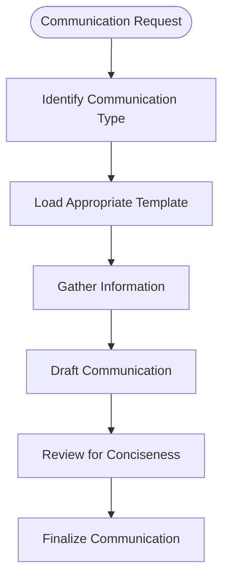

# Enterprise & Communication Skills

<cite>
**Referenced Files in This Document**   
- [brand-guidelines/SKILL.md](file://brand-guidelines/SKILL.md)
- [internal-comms/SKILL.md](file://internal-comms/SKILL.md)
- [internal-comms/examples/3p-updates.md](file://internal-comms/examples/3p-updates.md)
- [internal-comms/examples/company-newsletter.md](file://internal-comms/examples/company-newsletter.md)
- [internal-comms/examples/faq-answers.md](file://internal-comms/examples/faq-answers.md)
- [internal-comms/examples/general-comms.md](file://internal-comms/examples/general-comms.md)
- [theme-factory/SKILL.md](file://theme-factory/SKILL.md)
- [theme-factory/themes/ocean-depths.md](file://theme-factory/themes/ocean-depths.md)
- [theme-factory/themes/modern-minimalist.md](file://theme-factory/themes/modern-minimalist.md)
- [document-skills/pptx/SKILL.md](file://document-skills/pptx/SKILL.md)
- [document-skills/docx/SKILL.md](file://document-skills/docx/SKILL.md)
- [document-skills/pdf/SKILL.md](file://document-skills/pdf/SKILL.md)
</cite>

## Table of Contents
1. [Introduction](#introduction)
2. [Core Enterprise Communication Skills](#core-enterprise-communication-skills)
3. [Brand-Guidelines Implementation](#brand-guidelines-implementation)
4. [Internal-Comms Implementation](#internal-comms-implementation)
5. [Theme-Factory Implementation](#theme-factory-implementation)
6. [Integration with Document Skills](#integration-with-document-skills)
7. [Practical Usage Examples](#practical-usage-examples)
8. [Challenges and Solutions](#challenges-and-solutions)
9. [Best Practices and Guidelines](#best-practices-and-guidelines)
10. [Conclusion](#conclusion)

## Introduction

Enterprise and communication skills are essential for maintaining brand consistency and facilitating effective organizational communication. These skills provide standardized frameworks and tools that ensure all internal communications and artifacts adhere to organizational standards, regardless of format or medium. By implementing these skills, organizations can maintain a cohesive brand identity, streamline communication processes, and ensure that all stakeholders receive information in a consistent, professional format. This documentation provides a comprehensive overview of the key enterprise communication skills available in the system, detailing their implementation, integration, and practical application.

## Core Enterprise Communication Skills

The enterprise communication skills framework consists of three primary components: brand-guidelines, internal-comms, and theme-factory. Each skill serves a distinct purpose in maintaining organizational standards and facilitating effective communication. The brand-guidelines skill enforces corporate visual identity through standardized color and typography rules. The internal-comms skill provides templates and guidelines for various types of internal communications, ensuring consistency in tone and format. The theme-factory skill offers a library of professional themes that can be applied to various artifacts, enabling rapid styling of documents and presentations. Together, these skills create a comprehensive system for maintaining brand consistency across all organizational communications.

**Section sources**
- [brand-guidelines/SKILL.md](file://brand-guidelines/SKILL.md)
- [internal-comms/SKILL.md](file://internal-comms/SKILL.md)
- [theme-factory/SKILL.md](file://theme-factory/SKILL.md)

## Brand-Guidelines Implementation

The brand-guidelines skill enforces Anthropic's official brand colors and typography across all artifacts. This skill ensures visual consistency by applying specific color values and font selections according to predefined rules. The implementation includes both color standards and typography guidelines that must be followed when creating or modifying any organizational artifact.

### Color Standards

The brand-guidelines skill defines a comprehensive color palette with specific hex codes for different use cases:

**Main Colors:**
- Dark: `#141413` - Used for primary text and dark backgrounds
- Light: `#faf9f5` - Used for light backgrounds and text on dark
- Mid Gray: `#b0aea5` - Used for secondary elements
- Light Gray: `#e8e6dc` - Used for subtle backgrounds

**Accent Colors:**
- Orange: `#d97757` - Primary accent color
- Blue: `#6a9bcc` - Secondary accent color
- Green: `#788c5d` - Tertiary accent color

These colors are applied programmatically using RGB values to ensure precise brand matching across different systems and output formats.

### Typography Standards

The typography implementation follows strict font selection rules based on content hierarchy:

- **Headings**: Poppins font (with Arial fallback) for text 24pt and larger
- **Body Text**: Lora font (with Georgia fallback) for standard text

The system automatically applies these fonts while preserving readability across systems. When custom fonts are unavailable, the system falls back to standard system fonts (Arial for headings, Georgia for body text) to maintain visual hierarchy while ensuring content remains accessible.

### Technical Implementation

The brand-guidelines skill implements color and typography standards through programmatic application using Python libraries. Color application is handled via the python-pptx RGBColor class, ensuring color fidelity across different systems. Font management is designed to work with existing system fonts, eliminating the need for font installation while providing optimal results when Poppins and Lora fonts are pre-installed in the environment.


**Diagram sources**
- [brand-guidelines/SKILL.md](file://brand-guidelines/SKILL.md#L17-L74)

**Section sources**
- [brand-guidelines/SKILL.md](file://brand-guidelines/SKILL.md#L17-L74)

## Internal-Comms Implementation

The internal-comms skill provides a structured framework for creating various types of internal communications, ensuring consistency in format, tone, and content. This skill includes specific guidelines for different communication types, each with its own template and formatting rules.

### Communication Types and Templates

The internal-comms skill supports multiple communication formats, each with dedicated guidelines:

**3P Updates (Progress, Plans, Problems):**
- Purpose: Succinct team updates for executives and leadership
- Format: Three-section structure (Progress, Plans, Problems)
- Length: 30-60 seconds to read
- Content focus: Accomplishments, priorities, and blockers
- Tools for information gathering: Slack, Google Drive, Email, Calendar

**Company Newsletters:**
- Purpose: Company-wide updates distributed via Slack and email
- Format: Themed sections with bullet points
- Length: Approximately 20-25 bullet points
- Content focus: Company-wide impact, leadership announcements, major milestones
- Section organization: Company Announcements, Progress on Priorities, Leadership Updates, Social Updates

**FAQ Responses:**
- Purpose: Address frequently asked questions across the organization
- Format: Question-Answer pairs
- Content focus: Clarifying confusion on topics affecting large portions of employees
- Answer guidelines: Base answers on official communications, link to authoritative sources, indicate uncertainty when present

**General Communications:**
- Purpose: Internal communications that don't fit standard formats
- Approach: Clarify audience, purpose, tone, and formatting requirements before creation
- Principles: Clear and concise, active voice, important information first, include relevant links

### Workflow Implementation

The internal-comms skill follows a standardized workflow for creating communications:

1. **Identify communication type** from the request
2. **Load appropriate guideline file** from the examples directory
3. **Gather information** using available tools or user input
4. **Draft communication** following specific formatting guidelines
5. **Review** for conciseness and data-driven content

The system automatically selects the appropriate template based on the communication type specified in the request, ensuring consistent application of formatting rules and content structure.



**Diagram sources**
- [internal-comms/SKILL.md](file://internal-comms/SKILL.md#L7-L33)
- [internal-comms/examples/3p-updates.md](file://internal-comms/examples/3p-updates.md#L1-L47)
- [internal-comms/examples/company-newsletter.md](file://internal-comms/examples/company-newsletter.md#L1-L66)
- [internal-comms/examples/faq-answers.md](file://internal-comms/examples/faq-answers.md#L1-L30)
- [internal-comms/examples/general-comms.md](file://internal-comms/examples/general-comms.md#L1-L16)

**Section sources**
- [internal-comms/SKILL.md](file://internal-comms/SKILL.md#L7-L33)
- [internal-comms/examples/3p-updates.md](file://internal-comms/examples/3p-updates.md#L1-L47)
- [internal-comms/examples/company-newsletter.md](file://internal-comms/examples/company-newsletter.md#L1-L66)
- [internal-comms/examples/faq-answers.md](file://internal-comms/examples/faq-answers.md#L1-L30)
- [internal-comms/examples/general-comms.md](file://internal-comms/examples/general-comms.md#L1-L16)

## Theme-Factory Implementation

The theme-factory skill provides a toolkit for styling artifacts with professional themes, enabling consistent visual presentation across various document types. This skill offers both pre-set themes and the ability to generate custom themes on-the-fly.

### Available Themes

The theme-factory includes ten pre-set themes, each with a distinct visual identity:

1. **Ocean Depths**: Professional maritime theme with deep blues and teals
2. **Sunset Boulevard**: Warm sunset colors with vibrant oranges and reds
3. **Forest Canopy**: Natural earth tones with greens and browns
4. **Modern Minimalist**: Clean grayscale palette
5. **Golden Hour**: Rich autumnal colors with golds and ambers
6. **Arctic Frost**: Cool winter-inspired palette with blues and whites
7. **Desert Rose**: Soft dusty tones with pinks and beiges
8. **Tech Innovation**: Bold modern tech aesthetic
9. **Botanical Garden**: Fresh organic garden colors
10. **Midnight Galaxy**: Dramatic cosmic deep tones

Each theme includes a complete specification with color palette (hex codes) and font pairings for headers and body text.

### Theme Application Process

The theme-factory follows a standardized process for applying themes to artifacts:

1. **Show theme showcase**: Display the theme-showcase.pdf file to allow users to view all available themes
2. **Request theme selection**: Ask the user to choose a theme from the available options
3. **Confirm selection**: Obtain explicit confirmation of the chosen theme
4. **Apply theme**: Implement the selected theme's colors and fonts to the artifact

After theme selection, the system reads the corresponding theme file from the themes directory and applies the specified styling consistently throughout the artifact, ensuring proper contrast and readability.

### Custom Theme Generation

When none of the existing themes meet requirements, the system can generate custom themes based on user inputs. The custom theme generation process:

1. Accepts basic description of desired visual characteristics
2. Generates a new theme with appropriate color combinations and font pairings
3. Creates a descriptive name based on the theme's characteristics
4. Presents the generated theme for review and verification
5. Applies the custom theme following the same process as pre-set themes

This capability ensures flexibility while maintaining professional styling standards.


**Diagram sources**
- [theme-factory/SKILL.md](file://theme-factory/SKILL.md#L7-L60)
- [theme-factory/themes/ocean-depths.md](file://theme-factory/themes/ocean-depths.md#L1-L20)
- [theme-factory/themes/modern-minimalist.md](file://theme-factory/themes/modern-minimalist.md#L1-L20)

**Section sources**
- [theme-factory/SKILL.md](file://theme-factory/SKILL.md#L7-L60)
- [theme-factory/themes/ocean-depths.md](file://theme-factory/themes/ocean-depths.md#L1-L20)
- [theme-factory/themes/modern-minimalist.md](file://theme-factory/themes/modern-minimalist.md#L1-L20)

## Integration with Document Skills

The enterprise communication skills integrate seamlessly with document processing capabilities, enabling the application of branding and styling to various artifact types. This integration ensures that brand consistency is maintained across different document formats.

### PPTX Integration

The theme-factory and brand-guidelines skills integrate with the PPTX document skill to apply professional styling to presentations. When creating or modifying PowerPoint presentations, the system can:

- Apply theme colors to slide backgrounds, text, and accent elements
- Implement typography standards for headers and body text
- Ensure consistent styling across all slides
- Validate contrast and readability

The integration leverages the python-pptx library to programmatically apply styling elements, ensuring precise implementation of brand guidelines.

### DOCX Integration

For Word documents, the enterprise communication skills work with the DOCX processing capabilities to enforce brand standards. This includes:

- Applying brand colors to headings, accents, and other elements
- Implementing typography standards through font selection
- Ensuring consistent styling in templates and generated documents
- Maintaining brand compliance in tracked changes and comments

The integration uses the python-docx library to manipulate document elements while preserving the underlying structure and formatting.

### PDF Integration

The PDF processing capabilities integrate with enterprise communication skills to ensure brand consistency in PDF artifacts. This includes:

- Applying brand colors to text, backgrounds, and graphical elements
- Implementing typography standards in generated PDFs
- Ensuring consistent styling in merged or split documents
- Maintaining brand compliance in form fields and annotations

The integration leverages libraries like pypdf and reportlab to apply styling during PDF creation and modification.


**Diagram sources**
- [document-skills/pptx/SKILL.md](file://document-skills/pptx/SKILL.md#L1-L484)
- [document-skills/docx/SKILL.md](file://document-skills/docx/SKILL.md#L1-L197)
- [document-skills/pdf/SKILL.md](file://document-skills/pdf/SKILL.md#L1-L295)

**Section sources**
- [document-skills/pptx/SKILL.md](file://document-skills/pptx/SKILL.md#L1-L484)
- [document-skills/docx/SKILL.md](file://document-skills/docx/SKILL.md#L1-L197)
- [document-skills/pdf/SKILL.md](file://document-skills/pdf/SKILL.md#L1-L295)

## Practical Usage Examples

This section provides practical examples of how to use the enterprise communication skills to create on-brand communications and styled documents.

### Creating a Brand-Compliant Presentation

To create a presentation that adheres to brand guidelines:

1. Use the theme-factory skill to select an appropriate theme
2. Apply the selected theme to the presentation structure
3. Ensure all text elements follow typography standards
4. Validate that color usage aligns with brand guidelines
5. Check contrast and readability across all slides

Example workflow:
- Select "Modern Minimalist" theme for a technical presentation
- Apply charcoal (#36454f) for primary text and white (#ffffff) for backgrounds
- Use DejaVu Sans Bold for headers and DejaVu Sans for body text
- Ensure all accent elements use the specified gray tones
- Validate that text is readable against background colors

### Generating an Internal Communication

To create a 3P update for a product team:

1. Use the internal-comms skill with the 3p-updates template
2. Gather information on progress, plans, and problems
3. Structure the update with appropriate emoji and team name
4. Follow the strict formatting guidelines
5. Ensure content is concise and data-driven

Example output:
```
🚀 Product Team (June 1-7)
Progress: Launched new search feature, improved API response time by 40%, completed user testing for mobile app
Plans: Begin integration with payment system, optimize database queries, conduct accessibility audit
Problems: Delay in third-party API documentation, limited QA resources for mobile testing
```

### Applying a Professional Theme to a Report

To style a quarterly report with a professional theme:

1. Use the theme-factory skill to display available themes
2. Select "Ocean Depths" for a financial report
3. Apply deep navy (#1a2332) for backgrounds and cream (#f1faee) for text
4. Use teal (#2d8b8b) for accent elements and charts
5. Implement DejaVu Sans Bold for headers and DejaVu Sans for body text
6. Ensure consistent styling across all pages

**Section sources**
- [brand-guidelines/SKILL.md](file://brand-guidelines/SKILL.md)
- [internal-comms/SKILL.md](file://internal-comms/SKILL.md)
- [internal-comms/examples/3p-updates.md](file://internal-comms/examples/3p-updates.md)
- [theme-factory/SKILL.md](file://theme-factory/SKILL.md)
- [theme-factory/themes/ocean-depths.md](file://theme-factory/themes/ocean-depths.md)
- [theme-factory/themes/modern-minimalist.md](file://theme-factory/themes/modern-minimalist.md)

## Challenges and Solutions

Maintaining consistency across different output formats presents several challenges. This section addresses common issues and their solutions.

### Brand Guideline Violations

**Challenge**: Inconsistent application of brand colors and typography across different artifacts and formats.

**Solutions**:
- Implement automated validation checks before finalizing artifacts
- Use standardized color values (hex codes) rather than named colors
- Establish clear fallback mechanisms for unavailable fonts
- Create comprehensive style guides accessible to all users
- Implement regular audits of generated artifacts for compliance

### Theme Application Failures

**Challenge**: Incomplete or incorrect application of themes to artifacts, resulting in inconsistent styling.

**Solutions**:
- Implement thorough validation of theme application
- Ensure all theme elements (colors, fonts, spacing) are applied consistently
- Verify contrast ratios for accessibility compliance
- Test themes across different output formats (PPTX, DOCX, PDF)
- Provide clear error messages when theme application fails

### Cross-Format Consistency Issues

**Challenge**: Maintaining visual consistency when content is shared across different formats (presentations, documents, PDFs).

**Solutions**:
- Establish format-agnostic style definitions
- Use centralized theme repositories accessible to all document skills
- Implement automated conversion tools that preserve styling
- Create templates for common artifact types
- Provide guidelines for manual adjustments when automatic conversion is insufficient

### Customization Challenges

**Challenge**: Balancing brand consistency with the need for customization in specific contexts.

**Solutions**:
- Allow limited, approved customizations within brand guidelines
- Implement a review process for custom themes
- Provide clear boundaries for acceptable deviations
- Document approved exceptions and their use cases
- Train users on proper customization techniques

**Section sources**
- [brand-guidelines/SKILL.md](file://brand-guidelines/SKILL.md)
- [internal-comms/SKILL.md](file://internal-comms/SKILL.md)
- [theme-factory/SKILL.md](file://theme-factory/SKILL.md)
- [document-skills/pptx/SKILL.md](file://document-skills/pptx/SKILL.md)
- [document-skills/docx/SKILL.md](file://document-skills/docx/SKILL.md)
- [document-skills/pdf/SKILL.md](file://document-skills/pdf/SKILL.md)

## Best Practices and Guidelines

This section provides best practices for effectively using enterprise communication skills to maintain brand consistency and facilitate organizational communication.

### Brand Consistency Guidelines

- Always use exact hex codes for brand colors
- Implement font fallbacks to ensure readability
- Maintain consistent spacing and alignment across artifacts
- Use accent colors sparingly for emphasis
- Ensure sufficient contrast between text and backgrounds
- Regularly audit artifacts for brand compliance

### Communication Best Practices

- Match communication format to audience and purpose
- Keep internal communications concise and focused
- Use data to support claims and updates
- Include relevant links to supporting documentation
- Maintain consistent tone across communications
- Respect information hierarchy in formatting

### Theme Application Guidelines

- Select themes appropriate to content and audience
- Apply themes consistently across all pages/slides
- Verify readability before finalizing artifacts
- Use the theme showcase to aid selection
- Document custom theme creation for future reference
- Test themes on different devices and screens

### Integration Recommendations

- Use standardized interfaces between skills
- Implement error handling for failed integrations
- Document integration points and dependencies
- Test cross-skill workflows thoroughly
- Monitor performance of integrated systems
- Provide clear feedback when integrations fail

**Section sources**
- [brand-guidelines/SKILL.md](file://brand-guidelines/SKILL.md)
- [internal-comms/SKILL.md](file://internal-comms/SKILL.md)
- [theme-factory/SKILL.md](file://theme-factory/SKILL.md)

## Conclusion

The enterprise and communication skills provide a comprehensive framework for maintaining brand consistency and facilitating effective organizational communication. By implementing standardized guidelines for branding, internal communications, and professional styling, these skills ensure that all organizational artifacts present a cohesive and professional image. The integration with document processing capabilities enables consistent application of these standards across various formats, from presentations to reports to internal communications. By following the best practices outlined in this documentation, organizations can leverage these skills to enhance their communication effectiveness while maintaining brand integrity across all touchpoints.