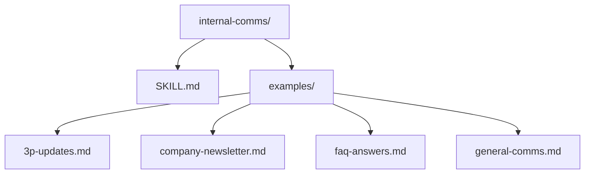
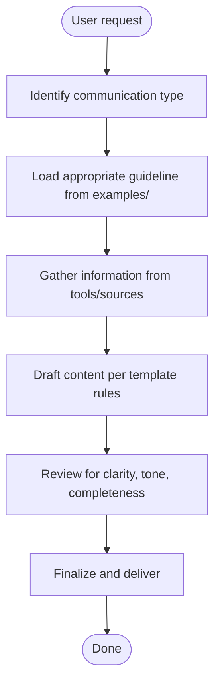
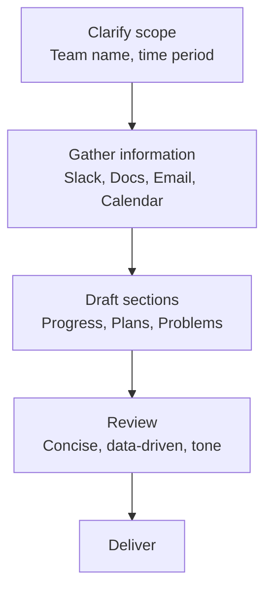
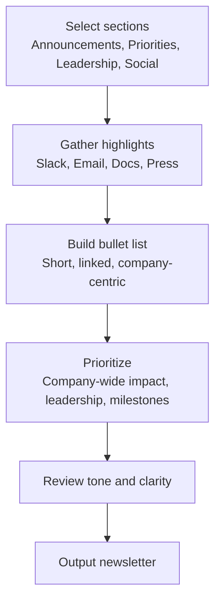
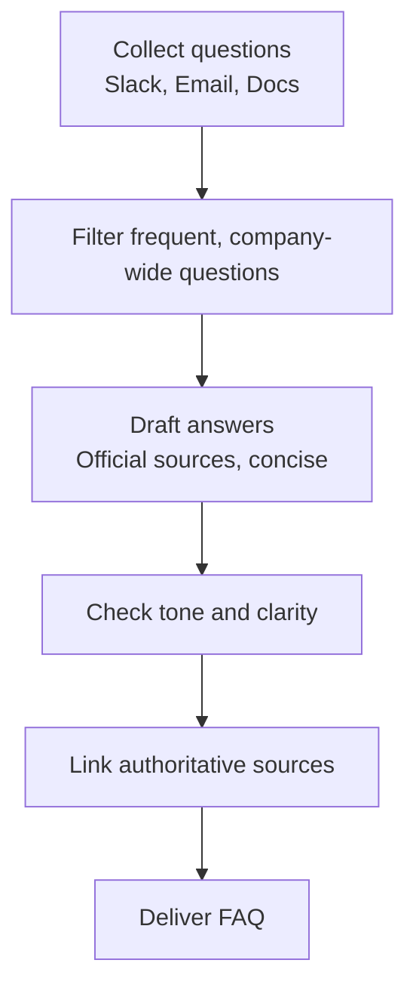
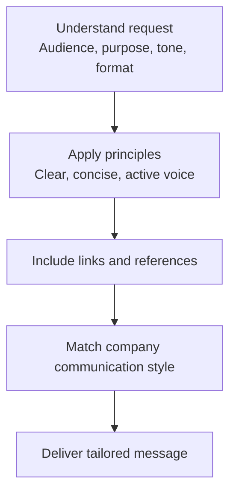
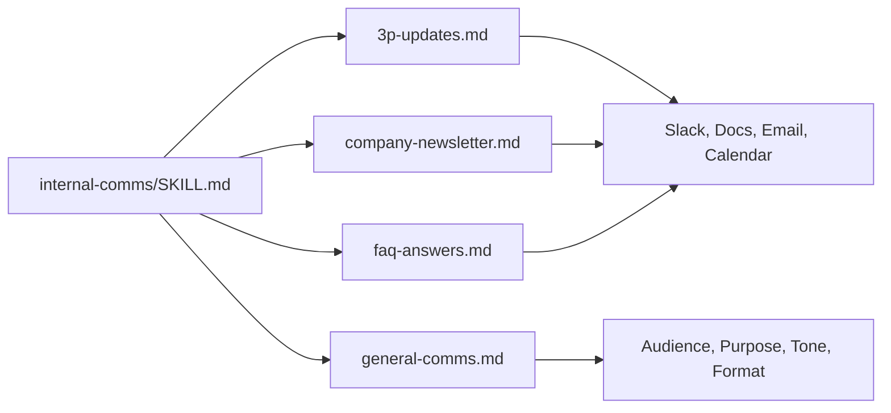

# Internal Communications

<cite>
**Referenced Files in This Document**
- [internal-comms/SKILL.md](file://internal-comms/SKILL.md)
- [internal-comms/examples/3p-updates.md](file://internal-comms/examples/3p-updates.md)
- [internal-comms/examples/company-newsletter.md](file://internal-comms/examples/company-newsletter.md)
- [internal-comms/examples/faq-answers.md](file://internal-comms/examples/faq-answers.md)
- [internal-comms/examples/general-comms.md](file://internal-comms/examples/general-comms.md)
- [README.md](file://README.md)
</cite>

## Table of Contents
1. [Introduction](#introduction)
2. [Project Structure](#project-structure)
3. [Core Components](#core-components)
4. [Architecture Overview](#architecture-overview)
5. [Detailed Component Analysis](#detailed-component-analysis)
6. [Dependency Analysis](#dependency-analysis)
7. [Performance Considerations](#performance-considerations)
8. [Troubleshooting Guide](#troubleshooting-guide)
9. [Conclusion](#conclusion)
10. [Appendices](#appendices)

## Introduction
This document explains the internal-comms skill and how it helps generate professional internal communications such as newsletters, status updates, FAQs, and other company-wide messages. It describes the example templates provided, their intended use cases, and how to apply them effectively. It also covers tone consistency, clarity, customization, and solutions for common issues like inappropriate tone or missing information.

## Project Structure
The internal-comms skill is organized as a self-contained skill with a metadata file and several example templates. The templates define the structure, tone, and content priorities for different communication types.

**Diagram sources**
- [internal-comms/SKILL.md](file://internal-comms/SKILL.md#L1-L33)
- [internal-comms/examples/3p-updates.md](file://internal-comms/examples/3p-updates.md#L1-L47)
- [internal-comms/examples/company-newsletter.md](file://internal-comms/examples/company-newsletter.md#L1-L66)
- [internal-comms/examples/faq-answers.md](file://internal-comms/examples/faq-answers.md#L1-L30)
- [internal-comms/examples/general-comms.md](file://internal-comms/examples/general-comms.md#L1-L16)

**Section sources**
- [internal-comms/SKILL.md](file://internal-comms/SKILL.md#L1-L33)
- [README.md](file://README.md#L38-L42)

## Core Components
- Skill metadata and usage guidance: Defines when to use the skill and how to select the appropriate template.
- Template for 3P updates: Structured format for Progress, Plans, Problems with strict formatting and time-bound coverage.
- Template for company newsletters: Bullet-style summaries with links, prioritization of company-wide impact, and sectioning for broad audiences.
- Template for FAQ answers: Systematic collection and summarization of frequently asked questions with authoritative sourcing and professional tone.
- Template for general communications: A flexible framework for non-standard comms requiring audience, purpose, tone, and formatting clarification.

**Section sources**
- [internal-comms/SKILL.md](file://internal-comms/SKILL.md#L7-L30)
- [internal-comms/examples/3p-updates.md](file://internal-comms/examples/3p-updates.md#L1-L47)
- [internal-comms/examples/company-newsletter.md](file://internal-comms/examples/company-newsletter.md#L1-L66)
- [internal-comms/examples/faq-answers.md](file://internal-comms/examples/faq-answers.md#L1-L30)
- [internal-comms/examples/general-comms.md](file://internal-comms/examples/general-comms.md#L1-L16)

## Architecture Overview
The internal-comms skill follows a simple, template-driven architecture:
- The skill’s metadata file determines when to activate the skill and which template to load.
- The selected template provides:
  - Purpose and scope
  - Tools and sources to gather information
  - Formatting rules and prioritization
  - Guidance for tone and clarity
- The process is iterative: clarify scope, gather information, draft, review, and finalize.

[No sources needed since this diagram shows conceptual workflow, not actual code structure]

## Detailed Component Analysis

### 3P Updates Template
Purpose:
- Provide concise, structured updates for executives and stakeholders.
Scope:
- Typically covers a week for Progress and Problems; next week for Plans.
Audience:
- Executives, leadership, peers, and teammates with limited context.

Key rules:
- Strict formatting with emoji, team name, and date range.
- Three sections: Progress, Plans, Problems.
- Concise, data-driven, and matter-of-fact tone.
- Gather from Slack, Google Drive, Email, and Calendar.

Practical example outline:
- Team name and dates covered
- Progress: milestones, shipped items, metrics
- Plans: top priorities for the next period
- Problems: blockers, constraints, risks

**Section sources**
- [internal-comms/examples/3p-updates.md](file://internal-comms/examples/3p-updates.md#L1-L47)

### Company Newsletter Template
Purpose:
- Summarize company-wide highlights for broad audiences.
Scope:
- Weekly or monthly summaries for 1000+ employees.
Audience:
- Entire company, consumed quickly via Slack/email.

Key rules:
- ~20–25 bullet points, short and to-the-point.
- Emphasize “we” perspective; company-wide impact.
- Include links to relevant Slack posts, emails, documents, and external press.
- Sectioning by themes (e.g., announcements, priorities, leadership, social).

Prioritization:
- Focus on company-wide impact, leadership announcements, major milestones, and widely relevant information.
- Avoid overly granular team updates, small-group-only info, and duplicates.

**Section sources**
- [internal-comms/examples/company-newsletter.md](file://internal-comms/examples/company-newsletter.md#L1-L66)

### FAQ Answers Template
Purpose:
- Consolidate and answer frequently asked questions across the company.
Scope:
- Weekly or periodic collection of common questions.
Audience:
- All employees seeking alignment and clarity.

Key rules:
- Holistic focus across the entire company.
- Basic formatting: Question and Answer entries.
- Base answers on official company communications; link authoritative sources.
- Keep tone professional yet approachable; flag uncertainty or executive input needs.

**Section sources**
- [internal-comms/examples/faq-answers.md](file://internal-comms/examples/faq-answers.md#L1-L30)

### General Communications Template
Purpose:
- Handle internal communications that do not fit standard formats.
Scope:
- Ad-hoc or hybrid comms requiring customization.
Audience:
- Varies by request.

Key rules:
- Clarify audience, purpose, tone, and formatting requirements.
- Apply general principles: clarity, conciseness, active voice, lead with key info, include links, match company style.

**Section sources**
- [internal-comms/examples/general-comms.md](file://internal-comms/examples/general-comms.md#L1-L16)

## Dependency Analysis
The internal-comms skill depends on:
- The skill metadata to determine activation and template selection.
- The selected template to define structure, tone, and content rules.
- External tools and sources (Slack, Email, Documents, Calendar, External press) to gather information for each template.

**Diagram sources**
- [internal-comms/SKILL.md](file://internal-comms/SKILL.md#L19-L29)
- [internal-comms/examples/3p-updates.md](file://internal-comms/examples/3p-updates.md#L14-L29)
- [internal-comms/examples/company-newsletter.md](file://internal-comms/examples/company-newsletter.md#L9-L18)
- [internal-comms/examples/faq-answers.md](file://internal-comms/examples/faq-answers.md#L10-L15)
- [internal-comms/examples/general-comms.md](file://internal-comms/examples/general-comms.md#L1-L10)

**Section sources**
- [internal-comms/SKILL.md](file://internal-comms/SKILL.md#L19-L29)
- [internal-comms/examples/3p-updates.md](file://internal-comms/examples/3p-updates.md#L14-L29)
- [internal-comms/examples/company-newsletter.md](file://internal-comms/examples/company-newsletter.md#L9-L18)
- [internal-comms/examples/faq-answers.md](file://internal-comms/examples/faq-answers.md#L10-L15)
- [internal-comms/examples/general-comms.md](file://internal-comms/examples/general-comms.md#L1-L10)

## Performance Considerations
- Template-driven drafting reduces ambiguity and speeds up production.
- Linking to authoritative sources minimizes fact-checking overhead.
- Sectioning and bullet lists improve readability for large audiences.
- Strict formatting reduces revision cycles and improves consistency.

[No sources needed since this section provides general guidance]

## Troubleshooting Guide
Common issues and solutions:
- Inappropriate tone:
  - Use the template’s tone guidance (e.g., “we” tense for newsletters, matter-of-fact for 3Ps, professional yet approachable for FAQs).
  - Review for clarity and adjust phrasing to match the company’s communication style.
- Missing information:
  - Follow the template’s tools/sources guidance to gather relevant highlights (Slack, Email, Documents, Calendar, External press).
  - If unavailable, ask the user for specifics to fill gaps.
- Overly granular content:
  - Apply prioritization rules: focus on company-wide impact, leadership announcements, and widely relevant milestones.
  - Avoid duplicating previously communicated items.
- Unclear audience or purpose:
  - Use the general-comms template to clarify audience, purpose, tone, and formatting before drafting.

**Section sources**
- [internal-comms/examples/company-newsletter.md](file://internal-comms/examples/company-newsletter.md#L23-L35)
- [internal-comms/examples/3p-updates.md](file://internal-comms/examples/3p-updates.md#L30-L37)
- [internal-comms/examples/faq-answers.md](file://internal-comms/examples/faq-answers.md#L23-L30)
- [internal-comms/examples/general-comms.md](file://internal-comms/examples/general-comms.md#L1-L16)

## Conclusion
The internal-comms skill provides a structured, reusable framework for creating professional internal communications. By selecting the right template, gathering information from trusted sources, and adhering to tone and clarity guidelines, you can consistently produce newsletters, status updates, FAQs, and other company messages that inform and engage broad audiences.

[No sources needed since this section summarizes without analyzing specific files]

## Appendices

### Practical Examples

- Generating a company newsletter:
  - Identify sections (announcements, priorities, leadership, social).
  - Gather highlights from Slack, Email, Documents, and External press.
  - Build a concise bullet list emphasizing company-wide impact and include links.
  - Prioritize leadership updates, major milestones, and widely relevant information.

  **Section sources**
  - [internal-comms/examples/company-newsletter.md](file://internal-comms/examples/company-newsletter.md#L20-L35)
  - [internal-comms/examples/company-newsletter.md](file://internal-comms/examples/company-newsletter.md#L36-L66)

- Generating a FAQ response:
  - Collect questions from Slack, Email, and Documents.
  - Filter for company-wide concerns and draft concise answers.
  - Link authoritative sources and flag uncertainty or executive input needs.

  **Section sources**
  - [internal-comms/examples/faq-answers.md](file://internal-comms/examples/faq-answers.md#L10-L15)
  - [internal-comms/examples/faq-answers.md](file://internal-comms/examples/faq-answers.md#L23-L30)

- Creating a 3P update:
  - Clarify team name and time period.
  - Gather Progress (last week), Plans (next week), and Problems (last week).
  - Follow strict formatting with emoji, team name, and date range.

  **Section sources**
  - [internal-comms/examples/3p-updates.md](file://internal-comms/examples/3p-updates.md#L11-L13)
  - [internal-comms/examples/3p-updates.md](file://internal-comms/examples/3p-updates.md#L30-L47)

### Customizing Templates and Creating New Communication Types
- Customize an existing template:
  - Adjust prioritization, formatting, and tone to align with organizational standards.
  - Add or refine tools/sources to reflect your company’s primary collaboration platforms.
- Create a new communication type:
  - Define purpose, audience, tone, and formatting requirements.
  - Use the general-comms template as a starting point and adapt it to your needs.
  - Ensure consistency with the company’s communication style and branding.

**Section sources**
- [internal-comms/examples/general-comms.md](file://internal-comms/examples/general-comms.md#L1-L16)
- [internal-comms/SKILL.md](file://internal-comms/SKILL.md#L19-L29)