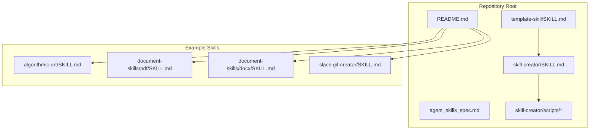
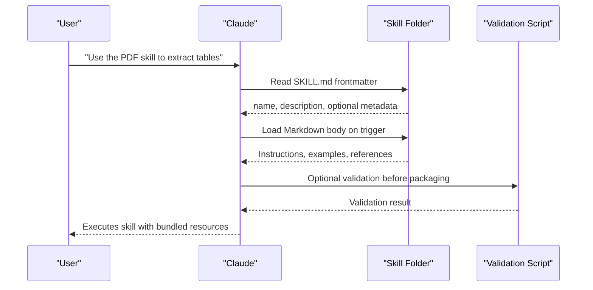
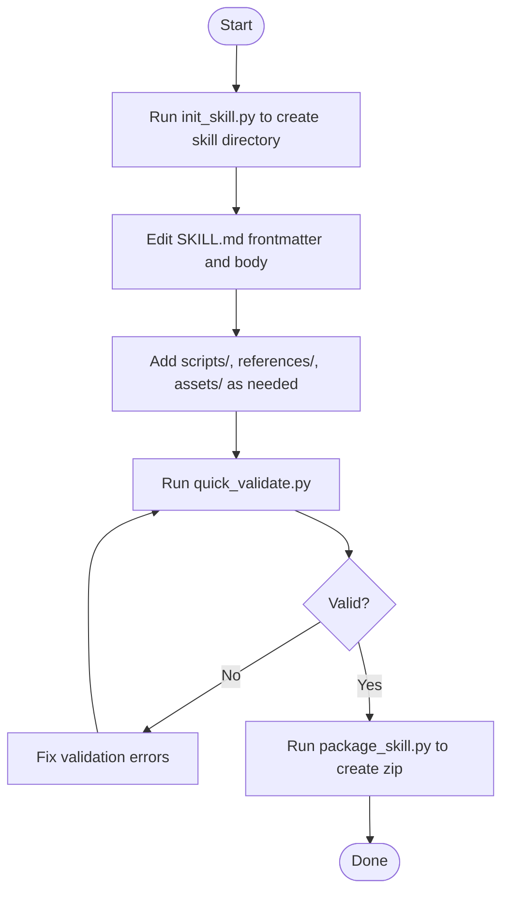
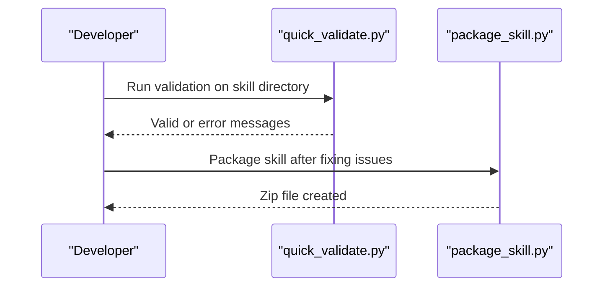
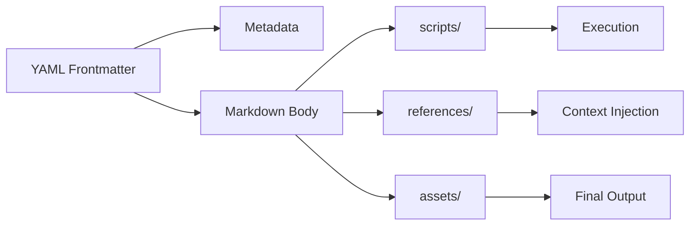

# Getting Started

<cite>
**Referenced Files in This Document**
- [README.md](file://README.md)
- [agent_skills_spec.md](file://agent_skills_spec.md)
- [template-skill/SKILL.md](file://template-skill/SKILL.md)
- [skill-creator/SKILL.md](file://skill-creator/SKILL.md)
- [skill-creator/scripts/init_skill.py](file://skill-creator/scripts/init_skill.py)
- [skill-creator/scripts/package_skill.py](file://skill-creator/scripts/package_skill.py)
- [skill-creator/scripts/quick_validate.py](file://skill-creator/scripts/quick_validate.py)
- [algorithmic-art/SKILL.md](file://algorithmic-art/SKILL.md)
- [document-skills/pdf/SKILL.md](file://document-skills/pdf/SKILL.md)
- [document-skills/pdf/forms.md](file://document-skills/pdf/forms.md)
- [document-skills/pdf/reference.md](file://document-skills/pdf/reference.md)
- [document-skills/docx/SKILL.md](file://document-skills/docx/SKILL.md)
- [slack-gif-creator/SKILL.md](file://slack-gif-creator/SKILL.md)
</cite>

## Table of Contents
1. [Introduction](#introduction)
2. [Project Structure](#project-structure)
3. [Core Components](#core-components)
4. [Architecture Overview](#architecture-overview)
5. [Detailed Component Analysis](#detailed-component-analysis)
6. [Dependency Analysis](#dependency-analysis)
7. [Performance Considerations](#performance-considerations)
8. [Troubleshooting Guide](#troubleshooting-guide)
9. [Conclusion](#conclusion)
10. [Appendices](#appendices)

## Introduction
Welcome to the skills framework. This guide helps you onboard quickly: explore existing skills, install them into Claude, configure them via YAML frontmatter, and invoke their functionality. It also walks you through creating your first custom skill using the template-skill as a foundation, shows the minimal required fields in SKILL.md, and demonstrates basic customization. Finally, it explains how to validate a skill using the skill-creator tools and provides troubleshooting tips for common configuration issues.

## Project Structure
At a high level, each skill is a folder containing a SKILL.md file and optional bundled resources (scripts/, references/, assets/). The repository includes example skills across creative, development, enterprise, and meta categories. The skill-creator skill provides a comprehensive guide and CLI tools to initialize, validate, and package skills.

**Diagram sources**
- [README.md](file://README.md#L1-L123)
- [agent_skills_spec.md](file://agent_skills_spec.md#L1-L56)
- [template-skill/SKILL.md](file://template-skill/SKILL.md#L1-L7)
- [skill-creator/SKILL.md](file://skill-creator/SKILL.md#L1-L210)
- [skill-creator/scripts/init_skill.py](file://skill-creator/scripts/init_skill.py#L1-L304)
- [skill-creator/scripts/package_skill.py](file://skill-creator/scripts/package_skill.py#L1-L111)
- [skill-creator/scripts/quick_validate.py](file://skill-creator/scripts/quick_validate.py#L1-L65)
- [algorithmic-art/SKILL.md](file://algorithmic-art/SKILL.md#L1-L405)
- [document-skills/pdf/SKILL.md](file://document-skills/pdf/SKILL.md#L1-L295)
- [document-skills/docx/SKILL.md](file://document-skills/docx/SKILL.md#L1-L197)
- [slack-gif-creator/SKILL.md](file://slack-gif-creator/SKILL.md#L1-L647)

**Section sources**
- [README.md](file://README.md#L1-L123)
- [agent_skills_spec.md](file://agent_skills_spec.md#L1-L56)

## Core Components
- SKILL.md: The skill’s entrypoint. It must start with YAML frontmatter followed by Markdown instructions. The frontmatter defines the skill’s identity and optional metadata.
- Template skill: A minimal SKILL.md scaffold to bootstrap your own skill.
- Skill creator tools: CLI scripts to initialize a new skill, validate it, and package it for distribution.

Key responsibilities:
- Define required frontmatter fields (name, description).
- Provide clear instructions, examples, and guidelines in the Markdown body.
- Optionally bundle scripts, references, and assets to support complex workflows.

**Section sources**
- [agent_skills_spec.md](file://agent_skills_spec.md#L17-L48)
- [template-skill/SKILL.md](file://template-skill/SKILL.md#L1-L7)
- [skill-creator/SKILL.md](file://skill-creator/SKILL.md#L25-L40)

## Architecture Overview
The skills framework relies on a simple contract: a skill folder with a SKILL.md file. When loaded by Claude, the YAML frontmatter is parsed to determine when and how to use the skill, and the Markdown body provides the procedural knowledge and examples.

**Diagram sources**
- [agent_skills_spec.md](file://agent_skills_spec.md#L17-L48)
- [document-skills/pdf/SKILL.md](file://document-skills/pdf/SKILL.md#L1-L295)
- [skill-creator/scripts/quick_validate.py](file://skill-creator/scripts/quick_validate.py#L1-L65)

## Detailed Component Analysis

### Explore Existing Skills
- Browse the repository to discover patterns and capabilities across categories (creative, development, enterprise, meta).
- Use the README to locate example skills and understand their scope.
- Study SKILL.md files to learn how frontmatter and Markdown bodies are structured.

Practical pointers:
- Start with simpler skills to understand the pattern, then move to more complex ones.
- Pay attention to how bundled resources (scripts, references, assets) are organized and referenced.

**Section sources**
- [README.md](file://README.md#L24-L123)
- [algorithmic-art/SKILL.md](file://algorithmic-art/SKILL.md#L1-L405)
- [slack-gif-creator/SKILL.md](file://slack-gif-creator/SKILL.md#L1-L647)
- [document-skills/docx/SKILL.md](file://document-skills/docx/SKILL.md#L1-L197)

### Install Skills into Claude
Installation methods vary by platform. The README provides explicit steps for Claude Code, Claude.ai, and the API.

- Claude Code: Register the repository as a marketplace and install specific plugins.
- Claude.ai: Skills are available to paid plans; follow the linked instructions to use or upload skills.
- Claude API: Use the Skills API to leverage pre-built skills and upload custom skills.

Tip: After installation, skills become available by mentioning them in your prompts.

**Section sources**
- [README.md](file://README.md#L60-L90)

### Configure a Skill via YAML Frontmatter
The YAML frontmatter is mandatory and must appear at the top of SKILL.md. It defines:
- name: Unique identifier for the skill (hyphen-case).
- description: Clear explanation of what the skill does and when to use it.
- Optional fields: license, allowed-tools, metadata.

Guidelines:
- Keep name hyphen-case and match the directory name.
- Use imperative, third-person descriptions in the frontmatter.
- Avoid angle brackets in the description.

**Section sources**
- [agent_skills_spec.md](file://agent_skills_spec.md#L23-L44)
- [README.md](file://README.md#L90-L118)

### Invoke a Skill’s Functionality
When you mention a skill in a prompt, Claude loads the SKILL.md and follows the instructions. For skills with bundled resources:
- Scripts can be executed deterministically without loading into context.
- References are loaded on-demand to inform Claude’s process.
- Assets are used in the final output without being loaded into context.

Real examples:
- PDF skill: Guides for merging, splitting, extracting text, and filling forms.
- DOCX skill: Decision trees and workflows for reading, creating, editing, and redlining documents.
- Slack GIF creator: Validators and animation primitives tailored to Slack constraints.

**Section sources**
- [document-skills/pdf/SKILL.md](file://document-skills/pdf/SKILL.md#L1-L295)
- [document-skills/pdf/forms.md](file://document-skills/pdf/forms.md#L1-L206)
- [document-skills/docx/SKILL.md](file://document-skills/docx/SKILL.md#L1-L197)
- [slack-gif-creator/SKILL.md](file://slack-gif-creator/SKILL.md#L1-L647)

### Create Your First Custom Skill (Template Foundation)
Use the template-skill as a starting point. The template provides:
- Minimal YAML frontmatter with placeholders.
- A skeleton Markdown body with guidance for structuring content.

Steps:
1. Initialize a new skill directory using the skill-creator initializer.
2. Edit SKILL.md to complete the frontmatter and body.
3. Add bundled resources (scripts, references, assets) as needed.
4. Validate and package the skill for distribution.

**Diagram sources**
- [skill-creator/scripts/init_skill.py](file://skill-creator/scripts/init_skill.py#L1-L304)
- [skill-creator/scripts/quick_validate.py](file://skill-creator/scripts/quick_validate.py#L1-L65)
- [skill-creator/scripts/package_skill.py](file://skill-creator/scripts/package_skill.py#L1-L111)

**Section sources**
- [template-skill/SKILL.md](file://template-skill/SKILL.md#L1-L7)
- [skill-creator/SKILL.md](file://skill-creator/SKILL.md#L133-L154)
- [skill-creator/scripts/init_skill.py](file://skill-creator/scripts/init_skill.py#L1-L304)

### Minimal Required Fields in SKILL.md
- YAML frontmatter must include:
  - name: hyphen-case identifier matching the directory name.
  - description: complete description of what the skill does and when to use it.

Optional fields:
- license
- allowed-tools
- metadata

Validation checks ensure:
- Presence of required fields.
- Correct naming conventions.
- Description does not contain angle brackets.

**Section sources**
- [agent_skills_spec.md](file://agent_skills_spec.md#L23-L44)
- [skill-creator/scripts/quick_validate.py](file://skill-creator/scripts/quick_validate.py#L1-L65)

### Basic Customization Examples
- Algorithmic art skill: Demonstrates a two-phase process (philosophy creation, p5.js implementation) with detailed instructions and templates.
- PDF skill: Provides quick-start code snippets and decision trees for common operations.
- DOCX skill: Uses a workflow decision tree and references for complex document editing.
- Slack GIF creator: Offers validators and composable animation primitives with concrete examples.

Use these as references for structuring your own skill’s Markdown body and bundling resources.

**Section sources**
- [algorithmic-art/SKILL.md](file://algorithmic-art/SKILL.md#L1-L405)
- [document-skills/pdf/SKILL.md](file://document-skills/pdf/SKILL.md#L1-L295)
- [document-skills/docx/SKILL.md](file://document-skills/docx/SKILL.md#L1-L197)
- [slack-gif-creator/SKILL.md](file://slack-gif-creator/SKILL.md#L1-L647)

### Validate a Skill Using Skill Creator Tools
- quick_validate.py: Checks for presence of SKILL.md, valid YAML frontmatter, required fields, naming conventions, and description formatting.
- package_skill.py: Validates the skill and packages it into a zip file for distribution.

**Diagram sources**
- [skill-creator/scripts/quick_validate.py](file://skill-creator/scripts/quick_validate.py#L1-L65)
- [skill-creator/scripts/package_skill.py](file://skill-creator/scripts/package_skill.py#L1-L111)

**Section sources**
- [skill-creator/scripts/quick_validate.py](file://skill-creator/scripts/quick_validate.py#L1-L65)
- [skill-creator/scripts/package_skill.py](file://skill-creator/scripts/package_skill.py#L1-L111)

## Dependency Analysis
- Frontmatter parsing: The YAML frontmatter is parsed to determine skill identity and optional metadata.
- Markdown body: Loaded when the skill is triggered; can reference bundled resources.
- Scripts: Executed deterministically without loading into context.
- References: Loaded on-demand to inform Claude’s process.
- Assets: Used in final output without being loaded into context.

**Diagram sources**
- [agent_skills_spec.md](file://agent_skills_spec.md#L17-L48)
- [skill-creator/SKILL.md](file://skill-creator/SKILL.md#L42-L76)

**Section sources**
- [agent_skills_spec.md](file://agent_skills_spec.md#L17-L48)
- [skill-creator/SKILL.md](file://skill-creator/SKILL.md#L42-L76)

## Performance Considerations
- Keep SKILL.md concise; move detailed reference material to references/.
- Use scripts for deterministic, repeated operations to reduce token overhead.
- Bundle assets separately to avoid loading large files into context.
- For complex skills, follow the progressive disclosure design principle: metadata always in context, body when triggered, resources as needed.

[No sources needed since this section provides general guidance]

## Troubleshooting Guide
Common setup issues and fixes:
- Missing SKILL.md: Ensure the file exists in the skill directory.
- Invalid YAML frontmatter: Confirm the file starts with delimiters and contains required fields.
- Incorrect name format: Use hyphen-case and match the directory name.
- Description formatting: Avoid angle brackets in the description.
- Installation problems: Follow platform-specific steps in the README for Claude Code, Claude.ai, and the API.

Validation and packaging:
- Use quick_validate.py to catch issues early.
- Use package_skill.py to validate and package the skill for distribution.

**Section sources**
- [skill-creator/scripts/quick_validate.py](file://skill-creator/scripts/quick_validate.py#L1-L65)
- [skill-creator/scripts/package_skill.py](file://skill-creator/scripts/package_skill.py#L1-L111)
- [README.md](file://README.md#L60-L90)

## Conclusion
You now have the essentials to explore, install, configure, and invoke skills, as well as create your first custom skill using the template-skill and the skill-creator tools. Start with simple examples, validate early, and progressively add complexity with scripts, references, and assets.

[No sources needed since this section summarizes without analyzing specific files]

## Appendices

### Appendix A: Platform Installation Quick Links
- Claude Code marketplace registration and plugin installation steps.
- Claude.ai usage and upload instructions.
- Claude API skills guide.

**Section sources**
- [README.md](file://README.md#L60-L90)

### Appendix B: Real Skill Patterns
- PDF skill: Decision trees and code examples for common operations.
- DOCX skill: Workflow decision tree and redlining patterns.
- Slack GIF creator: Validators and composable animation primitives.

**Section sources**
- [document-skills/pdf/SKILL.md](file://document-skills/pdf/SKILL.md#L1-L295)
- [document-skills/pdf/forms.md](file://document-skills/pdf/forms.md#L1-L206)
- [document-skills/docx/SKILL.md](file://document-skills/docx/SKILL.md#L1-L197)
- [slack-gif-creator/SKILL.md](file://slack-gif-creator/SKILL.md#L1-L647)