# Introduction

<cite>
**Referenced Files in This Document**
- [README.md](file://README.md)
- [agent_skills_spec.md](file://agent_skills_spec.md)
- [SKILL.md](file://template-skill/SKILL.md)
- [SKILL.md](file://document-skills/docx/SKILL.md)
- [SKILL.md](file://mcp-builder/SKILL.md)
- [SKILL.md](file://artifacts-builder/SKILL.md)
- [SKILL.md](file://internal-comms/SKILL.md)
- [SKILL.md](file://canvas-design/SKILL.md)
- [SKILL.md](file://slack-gif-creator/SKILL.md)
- [SKILL.md](file://webapp-testing/SKILL.md)
- [SKILL.md](file://brand-guidelines/SKILL.md)
- [SKILL.md](file://theme-factory/SKILL.md)
- [SKILL.md](file://skill-creator/SKILL.md)
</cite>

## Table of Contents
1. [Introduction](#introduction)
2. [Project Structure](#project-structure)
3. [Core Components](#core-components)
4. [Architecture Overview](#architecture-overview)
5. [Detailed Component Analysis](#detailed-component-analysis)
6. [Dependency Analysis](#dependency-analysis)
7. [Performance Considerations](#performance-considerations)
8. [Troubleshooting Guide](#troubleshooting-guide)
9. [Conclusion](#conclusion)

## Introduction
This repository is a curated collection of modular skills that extend Claude’s AI capabilities. Each skill is a self-contained package defined by a SKILL.md file and optional bundled resources (scripts, references, assets). The skills ecosystem demonstrates how to teach Claude repeatable, reliable workflows for specialized tasks ranging from creative generation and document processing to technical automation and enterprise-style communications.

The vision is to provide a flexible, extensible platform where developers, AI engineers, and technical writers can discover, adapt, and deploy skills tailored to their domains. The skills are structured to be reusable, consistent, and easy to evolve, enabling both rapid prototyping and production-grade automation.

Primary use cases include:
- Document processing: creating, editing, analyzing, and converting Word, PDF, PowerPoint, and Excel files
- Creative generation: producing visual art, animated GIFs, and branded artifacts
- Enterprise automation: internal communications, theming, branding, and web application testing
- Integration and tooling: building Model Context Protocol (MCP) servers and bundling complex HTML artifacts

Key benefits:
- Reusability: skills encapsulate workflows and resources for repeated use
- Consistency: standardized SKILL.md structure and metadata ensure predictable behavior
- Extensibility: plugin-based design allows adding new skills without changing core logic

Terminology aligned with the codebase:
- SKILL.md: the skill entrypoint and metadata container
- MCP: Model Context Protocol for integrating external services and tools
- Artifacts: self-contained outputs (HTML, PDF, PNG) produced by skills
- Bundled resources: scripts, references, and assets packaged with a skill

Practical examples:
- Use the document skills to extract text from a PDF, edit a Word document with tracked changes, or convert a presentation to images
- Apply the brand guidelines and theme factory to style artifacts with consistent colors and typography
- Build an MCP server to expose external APIs as tools for Claude
- Create animated GIFs optimized for Slack using composable animation primitives
- Test local web applications using Playwright with helper scripts

Relationship between skill categories:
- Creative & design skills (algorithmic-art, canvas-design, slack-gif-creator) focus on visual and animated outputs
- Development & technical skills (artifacts-builder, mcp-builder, webapp-testing) enable tooling and integration
- Enterprise & communication skills (brand-guidelines, internal-comms, theme-factory) standardize presentation and messaging
- Meta skills (skill-creator, template-skill) provide authoring and scaffolding guidance

Architectural principles:
- Plugin-based design: skills are independently loadable units that extend Claude’s capabilities
- Configuration-driven behavior: SKILL.md frontmatter and Markdown body define when and how a skill runs
- Progressive disclosure: metadata always in-context, skill body loaded on demand, and bundled resources accessed as needed

**Section sources**
- [README.md](file://README.md#L1-L123)
- [agent_skills_spec.md](file://agent_skills_spec.md#L1-L56)

## Project Structure
At a high level, the repository organizes skills by category:
- Creative & design: algorithmic-art, canvas-design, slack-gif-creator
- Development & technical: artifacts-builder, mcp-builder, webapp-testing
- Enterprise & communication: brand-guidelines, internal-comms, theme-factory
- Meta skills: skill-creator, template-skill
- Document skills: docx, pdf, pptx, xlsx

Each skill resides in its own directory and must include a SKILL.md file. Many skills also include scripts/, references/, and assets/ directories to support their workflows.

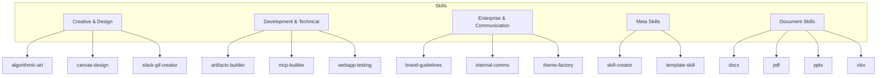

**Section sources**
- [README.md](file://README.md#L24-L118)

## Core Components
- SKILL.md: The skill entrypoint. It defines metadata (name, description, optional license, allowed tools, metadata) and the Markdown body with instructions, examples, and guidelines. See the Agent Skills Spec for the canonical structure and requirements.
- Scripts: Executable code (Python, Bash, etc.) for deterministic, reusable tasks
- References: Documentation and reference materials loaded on-demand
- Assets: Files used in outputs (templates, fonts, icons, etc.)

Key characteristics:
- Minimal requirement: a single SKILL.md file
- Optional enhancement: scripts/, references/, assets/ directories
- Progressive disclosure: metadata always in-context; skill body loaded when triggered; resources accessed as needed

**Section sources**
- [agent_skills_spec.md](file://agent_skills_spec.md#L17-L48)
- [SKILL.md](file://template-skill/SKILL.md#L1-L7)

## Architecture Overview
The skills ecosystem follows a plugin-based architecture:
- Discovery: Claude discovers skills by scanning directories and recognizing SKILL.md
- Activation: When a user request matches a skill’s metadata, the skill is loaded
- Execution: The Markdown body and bundled resources guide Claude through the workflow
- Output: Artifacts and results are produced and shared with the user

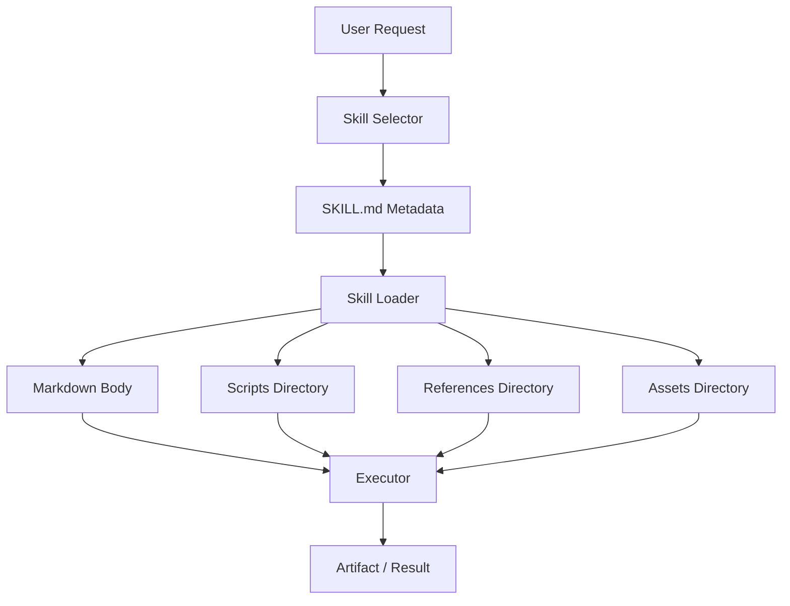

**Diagram sources**
- [agent_skills_spec.md](file://agent_skills_spec.md#L17-L48)
- [SKILL.md](file://template-skill/SKILL.md#L1-L7)

**Section sources**
- [agent_skills_spec.md](file://agent_skills_spec.md#L17-L48)

## Detailed Component Analysis

### Document Skills (docx, pdf, pptx, xlsx)
Purpose:
- Provide comprehensive workflows for creating, editing, analyzing, and converting office documents
- Demonstrate advanced patterns for working with complex file formats and binary data

Capabilities:
- Word (.docx): text extraction, raw XML access, creating new documents, editing with tracked changes, redlining workflow, converting to images
- PDF: extracting text and tables, creating new PDFs, merging/splitting, form handling
- PowerPoint (.pptx): creating/editing presentations, layouts, templates, charts, automated slide generation
- Excel (.xlsx): creating/editing spreadsheets, formulas, formatting, data analysis, visualization

Benefits:
- Structured decision trees and workflows
- Clear guidance on when to use each approach
- Practical examples and tooling for validation and optimization

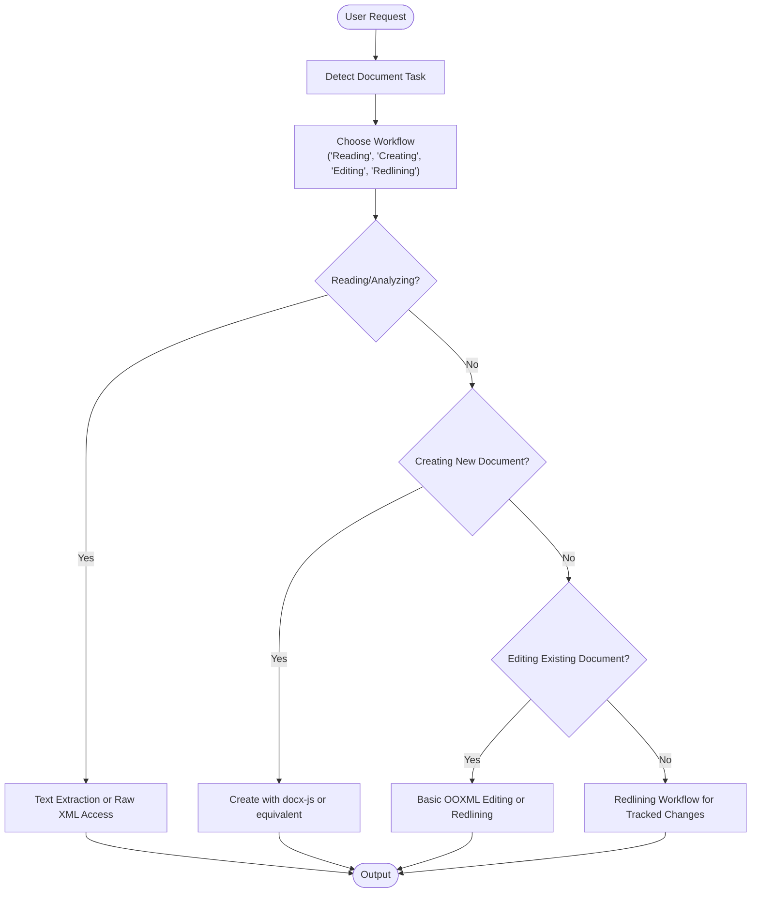

**Diagram sources**
- [SKILL.md](file://document-skills/docx/SKILL.md#L1-L197)

**Section sources**
- [SKILL.md](file://document-skills/docx/SKILL.md#L1-L197)

### MCP Builder (Model Context Protocol)
Purpose:
- Guide the creation of high-quality MCP servers that enable LLMs to interact with external services through well-designed tools

Key phases:
- Deep research and planning: agent-centric design principles, protocol documentation, framework documentation, API study, implementation plan
- Implementation: project setup, shared utilities, tool development, language-specific best practices
- Review and refine: code quality review, safe testing, quality checklist
- Create evaluations: realistic questions, verifiable answers, XML format

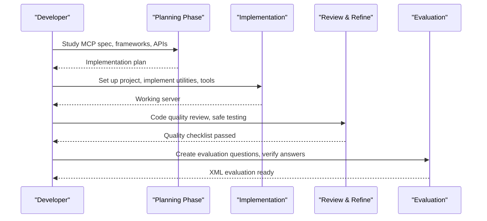

**Diagram sources**
- [SKILL.md](file://mcp-builder/SKILL.md#L1-L329)

**Section sources**
- [SKILL.md](file://mcp-builder/SKILL.md#L1-L329)

### Artifacts Builder
Purpose:
- Build complex, multi-component HTML artifacts using modern frontend technologies (React, Tailwind CSS, shadcn/ui)

Workflow:
- Initialize project with provided script
- Develop artifact by editing generated code
- Bundle into a single HTML file
- Optionally test the artifact
- Share artifact with user

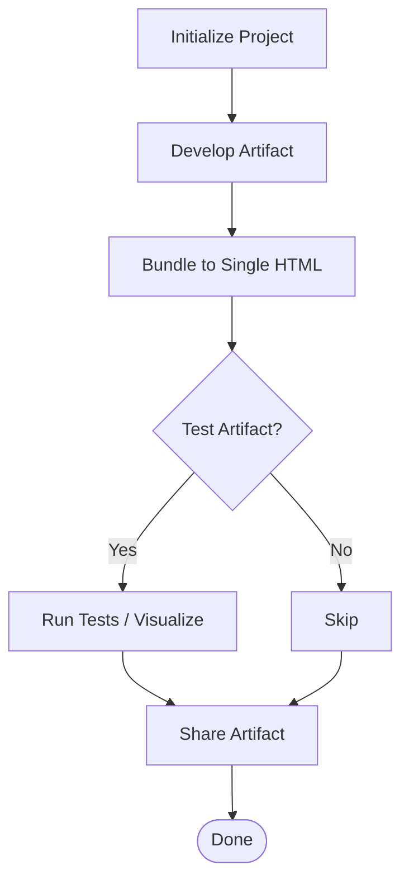

**Diagram sources**
- [SKILL.md](file://artifacts-builder/SKILL.md#L1-L74)

**Section sources**
- [SKILL.md](file://artifacts-builder/SKILL.md#L1-L74)

### Internal Communications
Purpose:
- Help write internal communications using company-preferred formats and guidelines

Workflow:
- Identify communication type from request
- Load appropriate guideline file from examples/
- Follow specific instructions for formatting, tone, and content gathering

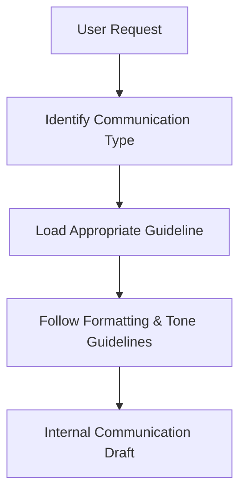

**Diagram sources**
- [SKILL.md](file://internal-comms/SKILL.md#L1-L33)

**Section sources**
- [SKILL.md](file://internal-comms/SKILL.md#L1-L33)

### Canvas Design
Purpose:
- Create beautiful visual art in .png and .pdf using design philosophy

Workflow:
- Design Philosophy Creation (4–6 paragraphs)
- Deduce subtle reference from user request
- Express philosophy on canvas (PDF or PNG)
- Optional multi-page extension

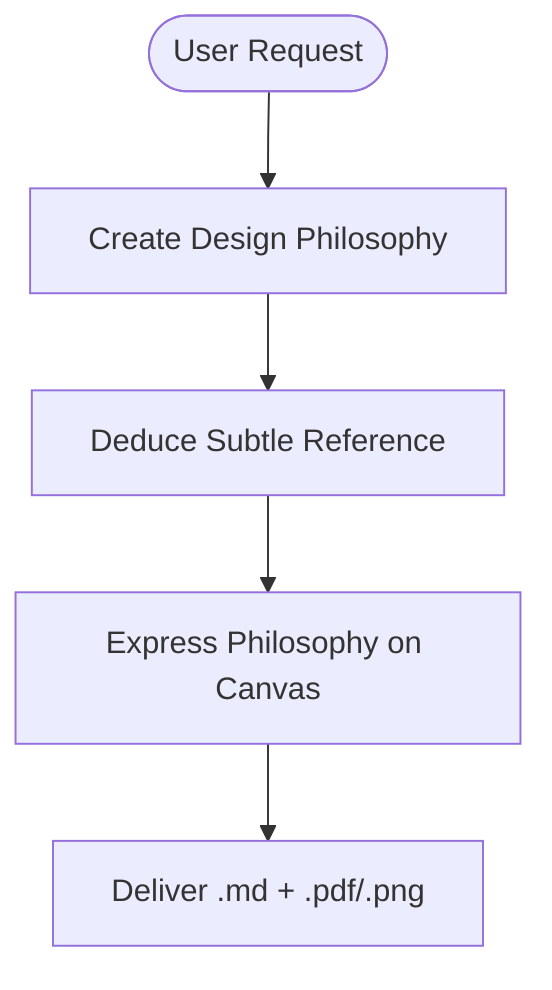

**Diagram sources**
- [SKILL.md](file://canvas-design/SKILL.md#L1-L130)

**Section sources**
- [SKILL.md](file://canvas-design/SKILL.md#L1-L130)

### Slack GIF Creator
Purpose:
- Create animated GIFs optimized for Slack with validators and composable animation primitives

Workflow:
- Understand Slack requirements (message vs emoji)
- Validators for size, dimensions, and readiness
- Compose animations using primitives (shake, bounce, spin, pulse, fade, zoom, explode, wiggle, slide, flip, morph, move, kaleidoscope)
- Helper utilities for text, color management, visual effects, easing, and frame composition
- Optimization strategies and example compositions

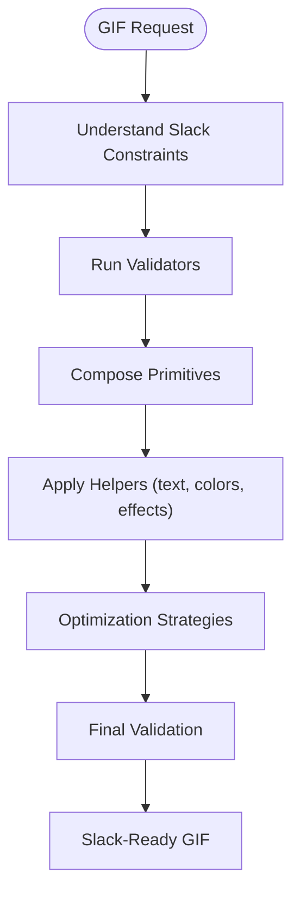

**Diagram sources**
- [SKILL.md](file://slack-gif-creator/SKILL.md#L1-L647)

**Section sources**
- [SKILL.md](file://slack-gif-creator/SKILL.md#L1-L647)

### Webapp Testing
Purpose:
- Interact with and test local web applications using Playwright

Workflow:
- Decision tree: static HTML vs dynamic webapp, server running or not
- Reconnaissance-then-action: inspect DOM, identify selectors, execute actions
- Helper scripts for managing server lifecycles
- Best practices: headless Chromium, descriptive selectors, waits, logging

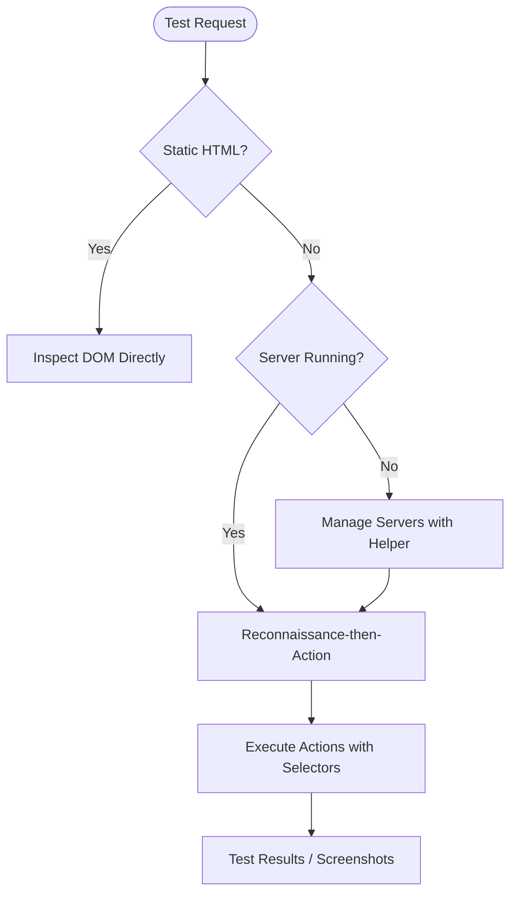

**Diagram sources**
- [SKILL.md](file://webapp-testing/SKILL.md#L1-L96)

**Section sources**
- [SKILL.md](file://webapp-testing/SKILL.md#L1-L96)

### Brand Guidelines
Purpose:
- Apply official brand colors and typography to artifacts

Capabilities:
- Smart font application (Poppins for headings, Lora for body)
- Color application (primary, secondary, accent colors)
- Shape and accent color usage
- Technical details for font management and color fidelity

**Section sources**
- [SKILL.md](file://brand-guidelines/SKILL.md#L1-L74)

### Theme Factory
Purpose:
- Style artifacts with professional themes (pre-set or custom)

Workflow:
- Show theme showcase
- Ask for selection
- Apply theme consistently across artifact
- Create custom theme when needed

**Section sources**
- [SKILL.md](file://theme-factory/SKILL.md#L1-L60)

### Skill Creator (Meta-Skill)
Purpose:
- Guide the creation and packaging of effective skills

Process:
- Understanding with concrete examples
- Planning reusable contents (scripts, references, assets)
- Initializing the skill
- Editing and updating SKILL.md
- Packaging into a distributable zip
- Iterating based on usage feedback

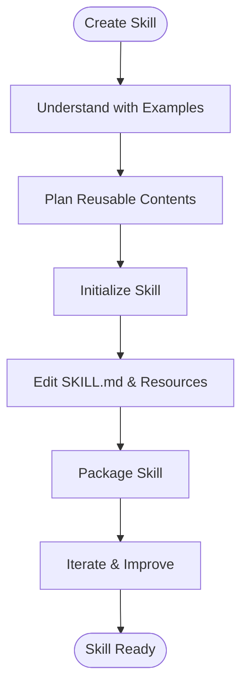

**Diagram sources**
- [SKILL.md](file://skill-creator/SKILL.md#L1-L210)

**Section sources**
- [SKILL.md](file://skill-creator/SKILL.md#L1-L210)

## Dependency Analysis
The skills ecosystem exhibits loose coupling and high cohesion:
- Loose coupling: skills are independent units with minimal interdependencies
- High cohesion: each skill focuses on a specific domain or workflow
- External dependencies: skills may rely on external tools (e.g., docx libraries, Playwright, MCP SDKs)
- Resource access: scripts can be executed without loading into context; references and assets are accessed on-demand

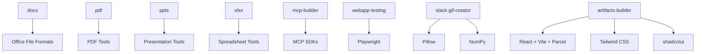

**Diagram sources**
- [SKILL.md](file://document-skills/docx/SKILL.md#L190-L197)
- [SKILL.md](file://mcp-builder/SKILL.md#L288-L329)
- [SKILL.md](file://webapp-testing/SKILL.md#L1-L96)
- [SKILL.md](file://slack-gif-creator/SKILL.md#L640-L647)
- [SKILL.md](file://artifacts-builder/SKILL.md#L16-L20)

**Section sources**
- [SKILL.md](file://document-skills/docx/SKILL.md#L190-L197)
- [SKILL.md](file://slack-gif-creator/SKILL.md#L640-L647)
- [SKILL.md](file://artifacts-builder/SKILL.md#L16-L20)
- [SKILL.md](file://mcp-builder/SKILL.md#L288-L329)
- [SKILL.md](file://webapp-testing/SKILL.md#L1-L96)

## Performance Considerations
- Progressive disclosure reduces context load by keeping SKILL.md lean and loading bundled resources only as needed
- Deterministic scripts minimize repeated code and improve reliability
- Validation and optimization strategies (e.g., GIF size checks, PDF conversions) help maintain acceptable output sizes and performance
- Headless browser automation and targeted waits prevent unnecessary delays

[No sources needed since this section provides general guidance]

## Troubleshooting Guide
Common issues and remedies:
- Skill not recognized: ensure SKILL.md exists and frontmatter includes required fields (name, description)
- Large context windows: rely on references and scripts to keep SKILL.md concise; load reference files on-demand
- External tool failures: verify dependencies are installed and accessible (e.g., docx libraries, Playwright, MCP SDKs)
- Slack GIF size exceeded: reduce frames, colors, or dimensions; validate with provided validators
- Webapp testing flakiness: always wait for networkidle before inspecting DOM; use descriptive selectors and appropriate waits

**Section sources**
- [agent_skills_spec.md](file://agent_skills_spec.md#L21-L48)
- [SKILL.md](file://slack-gif-creator/SKILL.md#L1-L118)
- [SKILL.md](file://webapp-testing/SKILL.md#L78-L90)

## Conclusion
This skills repository demonstrates a robust, extensible ecosystem for teaching Claude specialized capabilities. Through standardized SKILL.md files, progressive disclosure, and plugin-based design, the skills enable developers, AI engineers, and technical writers to rapidly prototype and deploy solutions spanning document processing, creative generation, enterprise automation, and integration with external services. The included examples and meta-skills provide a strong foundation for building, packaging, and iterating on new skills tailored to specific domains and workflows.

[No sources needed since this section summarizes without analyzing specific files]