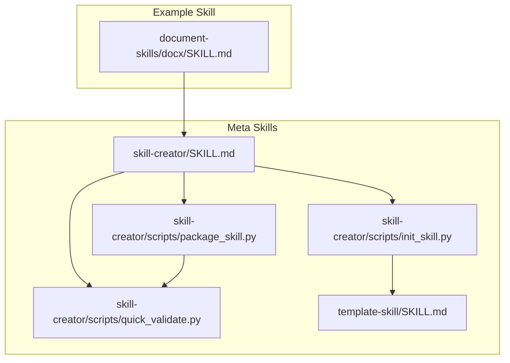
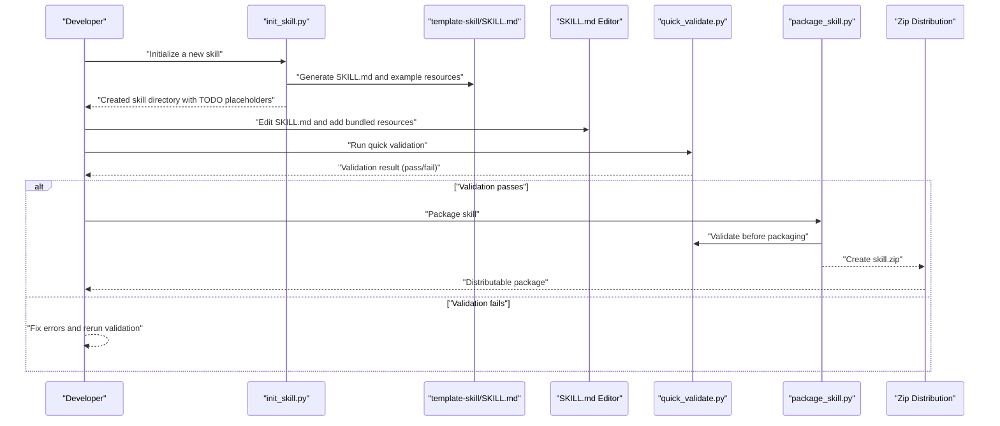
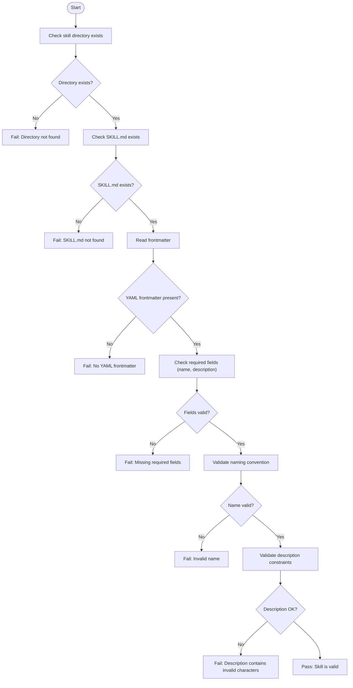
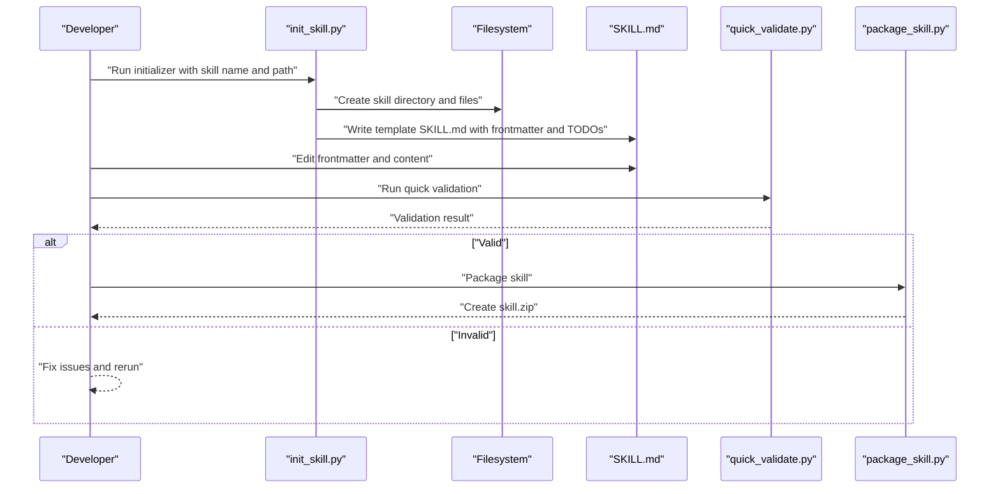
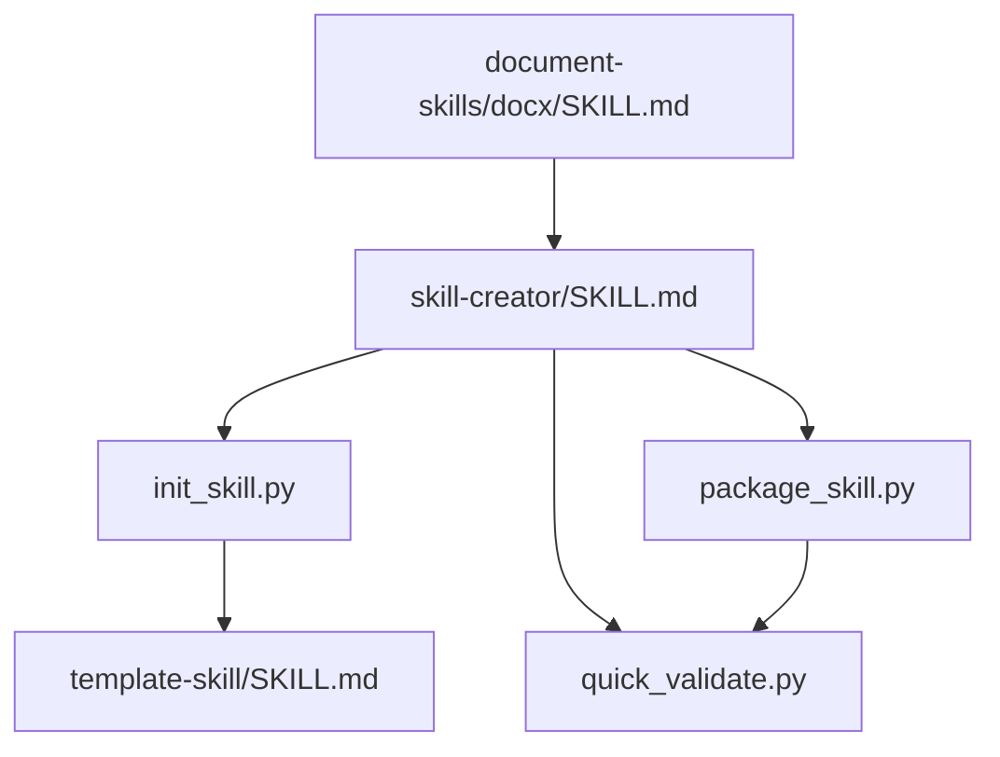

# Meta Skills

<cite>
**Referenced Files in This Document**
- [skill-creator/SKILL.md](file://skill-creator/SKILL.md)
- [skill-creator/scripts/init_skill.py](file://skill-creator/scripts/init_skill.py)
- [skill-creator/scripts/package_skill.py](file://skill-creator/scripts/package_skill.py)
- [skill-creator/scripts/quick_validate.py](file://skill-creator/scripts/quick_validate.py)
- [template-skill/SKILL.md](file://template-skill/SKILL.md)
- [document-skills/docx/SKILL.md](file://document-skills/docx/SKILL.md)
- [document-skills/docx/ooxml/scripts/validation/base.py](file://document-skills/docx/ooxml/scripts/validation/base.py)
- [document-skills/docx/ooxml/scripts/validation/docx.py](file://document-skills/docx/ooxml/scripts/validation/docx.py)
</cite>

## Table of Contents
1. [Introduction](#introduction)
2. [Project Structure](#project-structure)
3. [Core Components](#core-components)
4. [Architecture Overview](#architecture-overview)
5. [Detailed Component Analysis](#detailed-component-analysis)
6. [Dependency Analysis](#dependency-analysis)
7. [Performance Considerations](#performance-considerations)
8. [Troubleshooting Guide](#troubleshooting-guide)
9. [Conclusion](#conclusion)
10. [Appendices](#appendices)

## Introduction
This document explains the meta skills that enable creation, validation, and distribution of other skills in the skills ecosystem. The meta skills covered here are:
- skill-creator: The authoritative guide and tooling for creating, structuring, validating, and packaging skills.
- template-skill: A minimal starting point for new skills, providing a baseline SKILL.md with required frontmatter and placeholders.

Together, these meta skills standardize how skills are bootstrapped, validated, and packaged, ensuring consistency, quality, and interoperability across the ecosystem.

## Project Structure
The meta skills are organized under dedicated directories with clear roles:
- skill-creator: Contains the SKILL.md guide and the Python scripts for initialization, packaging, and validation.
- template-skill: Provides a minimal SKILL.md template to seed new skills quickly.
- Supporting skills (e.g., document-skills/docx/SKILL.md) illustrate best practices for structuring SKILL.md and bundling resources.

**Diagram sources**
- [skill-creator/SKILL.md](file://skill-creator/SKILL.md#L1-L210)
- [skill-creator/scripts/init_skill.py](file://skill-creator/scripts/init_skill.py#L1-L304)
- [skill-creator/scripts/package_skill.py](file://skill-creator/scripts/package_skill.py#L1-L111)
- [skill-creator/scripts/quick_validate.py](file://skill-creator/scripts/quick_validate.py#L1-L65)
- [template-skill/SKILL.md](file://template-skill/SKILL.md#L1-L7)
- [document-skills/docx/SKILL.md](file://document-skills/docx/SKILL.md#L1-L197)

**Section sources**
- [skill-creator/SKILL.md](file://skill-creator/SKILL.md#L1-L210)
- [template-skill/SKILL.md](file://template-skill/SKILL.md#L1-L7)

## Core Components
- skill-creator/SKILL.md: Defines the anatomy of a skill, the progressive disclosure design principle, and the six-step skill creation process. It also documents the roles of scripts/, references/, and assets/ directories and best practices for SKILL.md content.
- skill-creator/scripts/init_skill.py: Initializes a new skill directory with a complete SKILL.md template and example resource directories (scripts/, references/, assets/).
- skill-creator/scripts/package_skill.py: Validates a skill and packages it into a distributable zip file.
- skill-creator/scripts/quick_validate.py: Performs lightweight validation of a skill’s SKILL.md frontmatter (existence, YAML frontmatter presence, required fields, naming conventions, and description constraints).
- template-skill/SKILL.md: Minimal SKILL.md template with required frontmatter and a placeholder instruction section.

**Section sources**
- [skill-creator/SKILL.md](file://skill-creator/SKILL.md#L1-L210)
- [skill-creator/scripts/init_skill.py](file://skill-creator/scripts/init_skill.py#L1-L304)
- [skill-creator/scripts/package_skill.py](file://skill-creator/scripts/package_skill.py#L1-L111)
- [skill-creator/scripts/quick_validate.py](file://skill-creator/scripts/quick_validate.py#L1-L65)
- [template-skill/SKILL.md](file://template-skill/SKILL.md#L1-L7)

## Architecture Overview
The meta skill toolchain orchestrates skill creation and distribution:

**Diagram sources**
- [skill-creator/scripts/init_skill.py](file://skill-creator/scripts/init_skill.py#L1-L304)
- [template-skill/SKILL.md](file://template-skill/SKILL.md#L1-L7)
- [skill-creator/scripts/quick_validate.py](file://skill-creator/scripts/quick_validate.py#L1-L65)
- [skill-creator/scripts/package_skill.py](file://skill-creator/scripts/package_skill.py#L1-L111)

## Detailed Component Analysis

### skill-creator: Creation, Validation, and Packaging
- Purpose: Provide a standardized, repeatable process for creating, validating, and packaging skills.
- Key responsibilities:
  - Initialization: Generate a structured skill directory with a SKILL.md template and example resource directories.
  - Validation: Enforce basic frontmatter correctness and naming conventions.
  - Packaging: Produce a distributable zip while ensuring the skill meets quality gates.

Implementation highlights:
- Initialization:
  - Creates the skill directory and writes a SKILL.md template with frontmatter and TODO placeholders.
  - Creates example directories and files under scripts/, references/, and assets/.
  - Prints next steps to guide the developer.
- Packaging:
  - Validates the skill directory and SKILL.md existence.
  - Runs the validation routine before zipping.
  - Zips the skill directory into a single file named after the skill.
- Validation:
  - Checks for the presence of SKILL.md.
  - Verifies YAML frontmatter existence and format.
  - Ensures required fields (name, description) are present.
  - Enforces naming conventions for the skill name.
  - Prohibits angle brackets in the description.

**Diagram sources**
- [skill-creator/scripts/quick_validate.py](file://skill-creator/scripts/quick_validate.py#L1-L65)

**Section sources**
- [skill-creator/SKILL.md](file://skill-creator/SKILL.md#L1-L210)
- [skill-creator/scripts/init_skill.py](file://skill-creator/scripts/init_skill.py#L1-L304)
- [skill-creator/scripts/package_skill.py](file://skill-creator/scripts/package_skill.py#L1-L111)
- [skill-creator/scripts/quick_validate.py](file://skill-creator/scripts/quick_validate.py#L1-L65)

### template-skill: Starting Point for New Skills
- Purpose: Provide a minimal, consistent SKILL.md template with required frontmatter and placeholders to accelerate skill creation.
- Typical usage:
  - Use the template as the initial SKILL.md for a new skill.
  - Customize frontmatter (name, description) and replace TODO placeholders with actual content.
  - Delete example files and directories not needed for the skill.

Best practices:
- Keep frontmatter minimal and accurate.
- Use imperative/instructional tone in SKILL.md.
- Organize bundled resources under scripts/, references/, and assets/ as appropriate.

**Section sources**
- [template-skill/SKILL.md](file://template-skill/SKILL.md#L1-L7)

### Practical Bootstrapping Workflow
Steps to bootstrap a new skill:
1. Initialize the skill directory using the initializer script.
2. Edit SKILL.md to define purpose, usage scenarios, and procedural guidance.
3. Add bundled resources (scripts, references, assets) as needed.
4. Validate the skill using the quick validator.
5. Package the skill into a zip for distribution.

**Diagram sources**
- [skill-creator/scripts/init_skill.py](file://skill-creator/scripts/init_skill.py#L1-L304)
- [skill-creator/scripts/quick_validate.py](file://skill-creator/scripts/quick_validate.py#L1-L65)
- [skill-creator/scripts/package_skill.py](file://skill-creator/scripts/package_skill.py#L1-L111)

## Dependency Analysis
- skill-creator/SKILL.md defines the process and structure used by the scripts.
- package_skill.py depends on quick_validate.py to gate packaging.
- init_skill.py relies on template-skill/SKILL.md for the initial SKILL.md content.
- Example skills (e.g., document-skills/docx/SKILL.md) demonstrate best practices for SKILL.md organization and resource bundling.

**Diagram sources**
- [skill-creator/SKILL.md](file://skill-creator/SKILL.md#L1-L210)
- [skill-creator/scripts/init_skill.py](file://skill-creator/scripts/init_skill.py#L1-L304)
- [skill-creator/scripts/package_skill.py](file://skill-creator/scripts/package_skill.py#L1-L111)
- [skill-creator/scripts/quick_validate.py](file://skill-creator/scripts/quick_validate.py#L1-L65)
- [template-skill/SKILL.md](file://template-skill/SKILL.md#L1-L7)
- [document-skills/docx/SKILL.md](file://document-skills/docx/SKILL.md#L1-L197)

**Section sources**
- [skill-creator/SKILL.md](file://skill-creator/SKILL.md#L1-L210)
- [skill-creator/scripts/package_skill.py](file://skill-creator/scripts/package_skill.py#L1-L111)
- [skill-creator/scripts/quick_validate.py](file://skill-creator/scripts/quick_validate.py#L1-L65)
- [template-skill/SKILL.md](file://template-skill/SKILL.md#L1-L7)
- [document-skills/docx/SKILL.md](file://document-skills/docx/SKILL.md#L1-L197)

## Performance Considerations
- Validation is lightweight and fast, suitable for frequent local checks during development.
- Packaging compresses files into a single zip; ensure only necessary files are included to minimize distribution size.
- Keep SKILL.md concise and delegate detailed references to references/ to reduce context load during runtime.

[No sources needed since this section provides general guidance]

## Troubleshooting Guide
Common validation failures and resolutions:
- Missing SKILL.md:
  - Cause: The skill directory lacks the required file.
  - Resolution: Initialize the skill using the initializer or create SKILL.md with proper frontmatter.
  - Section sources
    - [skill-creator/scripts/package_skill.py](file://skill-creator/scripts/package_skill.py#L1-L111)
    - [skill-creator/scripts/quick_validate.py](file://skill-creator/scripts/quick_validate.py#L1-L65)
- No YAML frontmatter or invalid frontmatter format:
  - Cause: Missing or malformed frontmatter markers.
  - Resolution: Ensure the file starts with frontmatter markers and contains valid YAML with required fields.
  - Section sources
    - [skill-creator/scripts/quick_validate.py](file://skill-creator/scripts/quick_validate.py#L1-L65)
- Missing required fields (name, description):
  - Cause: Missing or empty required frontmatter keys.
  - Resolution: Add both name and description; ensure name follows hyphen-case conventions and description does not contain angle brackets.
  - Section sources
    - [skill-creator/scripts/quick_validate.py](file://skill-creator/scripts/quick_validate.py#L1-L65)
- Invalid skill name:
  - Cause: Name contains uppercase letters, underscores, spaces, or disallowed patterns.
  - Resolution: Use lowercase letters, digits, and hyphens only; avoid leading/trailing or consecutive hyphens.
  - Section sources
    - [skill-creator/scripts/quick_validate.py](file://skill-creator/scripts/quick_validate.py#L1-L65)
- Description contains angle brackets:
  - Cause: Description includes < or >.
  - Resolution: Remove angle brackets and rewrite the description.
  - Section sources
    - [skill-creator/scripts/quick_validate.py](file://skill-creator/scripts/quick_validate.py#L1-L65)

Additional best practices:
- Use the initializer to scaffold a new skill and avoid manual setup errors.
- Keep SKILL.md focused on procedural guidance; place detailed references in references/.
- Ensure scripts/ are executable and documented; assets/ are non-contextual resources used in outputs.
- Example skills demonstrate effective SKILL.md structure and resource organization.

**Section sources**
- [skill-creator/scripts/quick_validate.py](file://skill-creator/scripts/quick_validate.py#L1-L65)
- [skill-creator/scripts/package_skill.py](file://skill-creator/scripts/package_skill.py#L1-L111)
- [document-skills/docx/SKILL.md](file://document-skills/docx/SKILL.md#L1-L197)

## Conclusion
The meta skills provide a robust, repeatable pipeline for creating, validating, and distributing skills. By following the six-step process outlined in skill-creator/SKILL.md, using the initializer to scaffold new skills, and applying the quick validator before packaging, developers can consistently produce high-quality skills that integrate seamlessly into the ecosystem. The template-skill/SKILL.md ensures a minimal, consistent starting point, while example skills illustrate best practices for structure and resource organization.

[No sources needed since this section summarizes without analyzing specific files]

## Appendices

### Appendix A: SKILL.md Anatomy and Best Practices
- Anatomy:
  - Required: SKILL.md with YAML frontmatter (name, description) and Markdown body.
  - Optional: scripts/, references/, assets/ directories for bundled resources.
- Best practices:
  - Use imperative/instructional tone in SKILL.md.
  - Keep SKILL.md concise; move detailed references to references/.
  - Organize scripts/ for deterministic reliability; assets/ for output resources.
  - Progressive disclosure: metadata always in context; SKILL.md body loaded on trigger; resources loaded as needed.

**Section sources**
- [skill-creator/SKILL.md](file://skill-creator/SKILL.md#L1-L210)

### Appendix B: Example Skill Reference
- The document-skills/docx/SKILL.md demonstrates:
  - A structured SKILL.md with workflow guidance and resource references.
  - Clear separation of procedural instructions and detailed references.
  - Practical examples of bundling scripts and references.

**Section sources**
- [document-skills/docx/SKILL.md](file://document-skills/docx/SKILL.md#L1-L197)