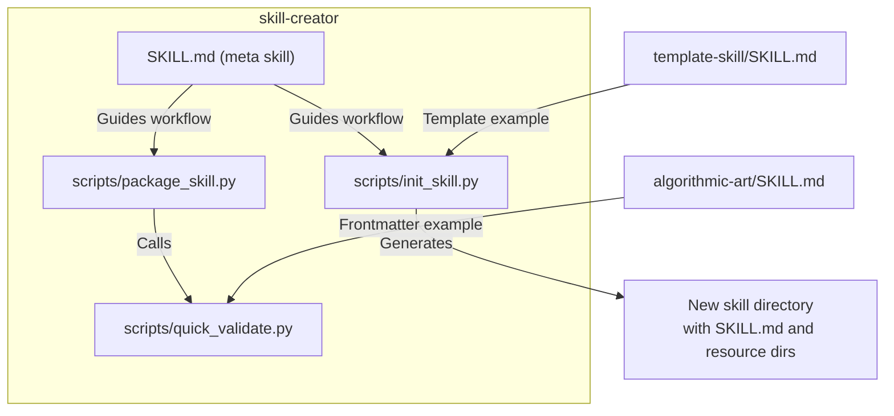
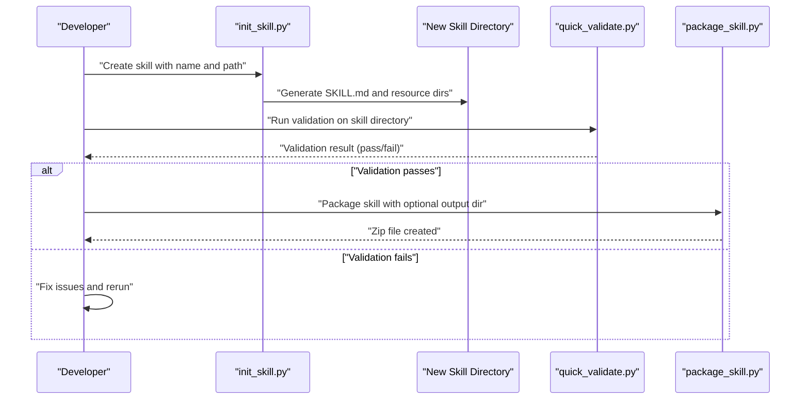
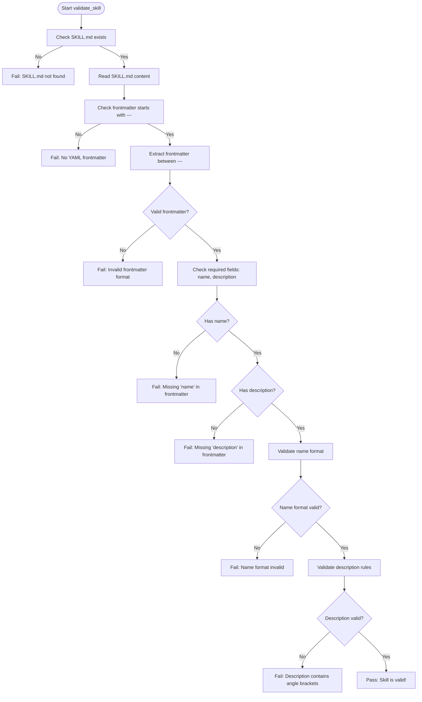
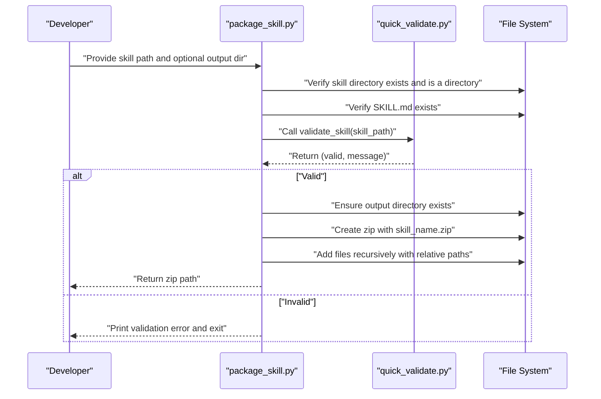
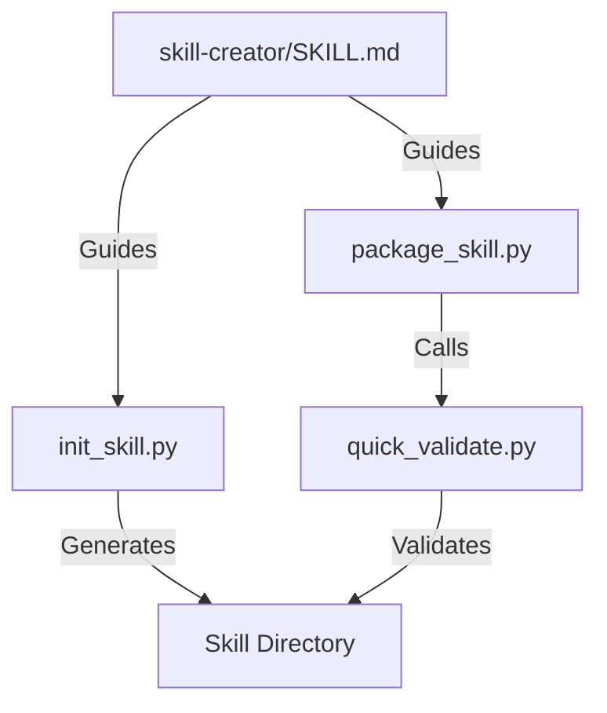

# Skill Creation Tools

<cite>
**Referenced Files in This Document**
- [init_skill.py](file://skill-creator/scripts/init_skill.py)
- [package_skill.py](file://skill-creator/scripts/package_skill.py)
- [quick_validate.py](file://skill-creator/scripts/quick_validate.py)
- [skill-creator SKILL.md](file://skill-creator/SKILL.md)
- [template-skill SKILL.md](file://template-skill/SKILL.md)
- [algorithmic-art SKILL.md](file://algorithmic-art/SKILL.md)
</cite>

## Table of Contents
1. [Introduction](#introduction)
2. [Project Structure](#project-structure)
3. [Core Components](#core-components)
4. [Architecture Overview](#architecture-overview)
5. [Detailed Component Analysis](#detailed-component-analysis)
6. [Dependency Analysis](#dependency-analysis)
7. [Performance Considerations](#performance-considerations)
8. [Troubleshooting Guide](#troubleshooting-guide)
9. [Conclusion](#conclusion)
10. [Appendices](#appendices)

## Introduction
This document explains the skill creation tools sub-component: init_skill.py, package_skill.py, and quick_validate.py. It covers how these tools bootstrap new skills with proper directory structure and templated files, enforce structural and naming conventions, and integrate validation into packaging. It also documents invocation relationships, common issues, and best practices for maintaining skill quality.

## Project Structure
The skill creation tools live under skill-creator/scripts and are supported by a meta skill (skill-creator/SKILL.md) that documents the anatomy of a skill and the recommended creation workflow. Example skills in the repository demonstrate the SKILL.md format with YAML frontmatter and optional bundled resources.

**Diagram sources**
- [init_skill.py](file://skill-creator/scripts/init_skill.py#L1-L304)
- [package_skill.py](file://skill-creator/scripts/package_skill.py#L1-L111)
- [quick_validate.py](file://skill-creator/scripts/quick_validate.py#L1-L65)
- [skill-creator SKILL.md](file://skill-creator/SKILL.md#L1-L210)
- [template-skill SKILL.md](file://template-skill/SKILL.md#L1-L7)
- [algorithmic-art SKILL.md](file://algorithmic-art/SKILL.md#L1-L10)

**Section sources**
- [skill-creator SKILL.md](file://skill-creator/SKILL.md#L1-L210)

## Core Components
- init_skill.py: Bootstraps a new skill directory with a templated SKILL.md and example resource directories (scripts/, references/, assets/).
- quick_validate.py: Enforces structural and naming conventions by validating YAML frontmatter presence and required fields, name format, and description rules.
- package_skill.py: Validates a skill before packaging it into a distributable zip file, with optional output directory specification.

**Section sources**
- [init_skill.py](file://skill-creator/scripts/init_skill.py#L1-L304)
- [quick_validate.py](file://skill-creator/scripts/quick_validate.py#L1-L65)
- [package_skill.py](file://skill-creator/scripts/package_skill.py#L1-L111)

## Architecture Overview
The tools form a linear development workflow:
- Use init_skill.py to create a new skill directory with a structured SKILL.md and example resource directories.
- Iterate on the skill locally, then run quick_validate.py to enforce conventions.
- Finally, run package_skill.py to validate and package the skill into a zip file.

**Diagram sources**
- [init_skill.py](file://skill-creator/scripts/init_skill.py#L189-L271)
- [quick_validate.py](file://skill-creator/scripts/quick_validate.py#L11-L57)
- [package_skill.py](file://skill-creator/scripts/package_skill.py#L19-L83)

## Detailed Component Analysis

### init_skill.py
Purpose:
- Create a new skill directory with a templated SKILL.md and example resource directories (scripts/, references/, assets/).

Key behaviors:
- Validates CLI arguments and skill name format.
- Creates the skill directory and writes SKILL.md with YAML frontmatter and guidance sections.
- Creates example files in scripts/, references/, and assets/ to demonstrate structure.
- Prints next steps for authoring and validation.

Implementation highlights:
- Uses a template string for SKILL.md with placeholders for skill name and title.
- Writes example Python script with executable permissions and example reference and asset placeholders.
- Enforces directory existence checks and handles errors gracefully.

Common usage patterns:
- Initialize a new skill with a hyphen-case name and a target path.
- Customize SKILL.md and resource directories before validation and packaging.

**Section sources**
- [init_skill.py](file://skill-creator/scripts/init_skill.py#L189-L271)
- [init_skill.py](file://skill-creator/scripts/init_skill.py#L273-L304)

#### Generated SKILL.md structure and frontmatter
- YAML frontmatter with name and description fields.
- Title case display name derived from the skill name.
- Guidance sections for structuring the skill and resource directories.

Concrete examples from the codebase:
- The template SKILL.md includes frontmatter with name and description keys and a structured outline with “Resources” section describing scripts/, references/, and assets/.
- The example resource directories are created with example files to demonstrate intended usage.

**Section sources**
- [init_skill.py](file://skill-creator/scripts/init_skill.py#L18-L103)
- [init_skill.py](file://skill-creator/scripts/init_skill.py#L236-L262)

### quick_validate.py
Purpose:
- Enforce structural and naming conventions for skills.

Checks performed:
- Ensures SKILL.md exists.
- Verifies YAML frontmatter presence and format.
- Requires name and description fields in frontmatter.
- Validates skill name format (lowercase, digits, hyphens; no leading/trailing or consecutive hyphens).
- Validates description rules (no angle brackets).

Return value:
- Boolean pass/fail and a descriptive message.

Integration:
- Called by package_skill.py before packaging.

**Section sources**
- [quick_validate.py](file://skill-creator/scripts/quick_validate.py#L11-L57)

#### Validation flowchart

**Diagram sources**
- [quick_validate.py](file://skill-creator/scripts/quick_validate.py#L11-L57)

### package_skill.py
Purpose:
- Create a distributable zip package of a skill after validation.

Pre-packaging validation:
- Validates that the skill directory exists and is a directory.
- Ensures SKILL.md exists.
- Calls validate_skill from quick_validate.py.

Packaging behavior:
- Determines output directory (current directory by default or provided path).
- Creates a zip file named after the skill directory.
- Walks the skill directory and adds files to the zip with relative paths.

Return value:
- Path to the created zip file or None on failure.

Invocation:
- Accepts skill path and optional output directory.

**Section sources**
- [package_skill.py](file://skill-creator/scripts/package_skill.py#L19-L83)
- [package_skill.py](file://skill-creator/scripts/package_skill.py#L85-L111)

#### Packaging sequence

**Diagram sources**
- [package_skill.py](file://skill-creator/scripts/package_skill.py#L19-L83)
- [quick_validate.py](file://skill-creator/scripts/quick_validate.py#L11-L57)

## Dependency Analysis
- package_skill.py depends on quick_validate.py for validation.
- init_skill.py is standalone and does not depend on the other tools.
- The meta skill (skill-creator/SKILL.md) documents the recommended workflow and skill anatomy.

**Diagram sources**
- [init_skill.py](file://skill-creator/scripts/init_skill.py#L189-L271)
- [quick_validate.py](file://skill-creator/scripts/quick_validate.py#L11-L57)
- [package_skill.py](file://skill-creator/scripts/package_skill.py#L19-L83)
- [skill-creator SKILL.md](file://skill-creator/SKILL.md#L1-L210)

**Section sources**
- [package_skill.py](file://skill-creator/scripts/package_skill.py#L16-L16)
- [skill-creator SKILL.md](file://skill-creator/SKILL.md#L1-L210)

## Performance Considerations
- Validation is lightweight and regex-based, suitable for frequent local checks.
- Packaging walks the skill directory recursively; large assets may increase zip creation time.
- Using an explicit output directory avoids unnecessary filesystem churn.

[No sources needed since this section provides general guidance]

## Troubleshooting Guide
Common issues and resolutions:

- Missing SKILL.md
  - Symptom: Validation or packaging fails early.
  - Resolution: Ensure SKILL.md exists in the skill directory. Use init_skill.py to bootstrap a new skill.

- Invalid YAML frontmatter
  - Symptom: Validation reports missing frontmatter or invalid format.
  - Resolution: Ensure the file starts with frontmatter delimiters and contains required fields.

- Missing required frontmatter fields
  - Symptom: Validation reports missing name or description.
  - Resolution: Add both fields in the frontmatter and ensure they are filled out.

- Invalid skill name format
  - Symptom: Validation reports name format errors.
  - Resolution: Use lowercase letters, digits, and hyphens only; avoid leading/trailing or consecutive hyphens.

- Description contains angle brackets
  - Symptom: Validation fails due to description rules.
  - Resolution: Remove angle brackets from the description.

- Directory structure issues
  - Symptom: Packaging reports path errors.
  - Resolution: Verify the skill path is a directory and contains SKILL.md.

- Output directory not found
  - Symptom: Packaging fails to write zip.
  - Resolution: Provide an existing or creatable output directory.

**Section sources**
- [quick_validate.py](file://skill-creator/scripts/quick_validate.py#L11-L57)
- [package_skill.py](file://skill-creator/scripts/package_skill.py#L32-L46)
- [package_skill.py](file://skill-creator/scripts/package_skill.py#L56-L63)

## Conclusion
The skill creation tools provide a clear, repeatable workflow:
- Use init_skill.py to scaffold a new skill with a structured SKILL.md and example resources.
- Use quick_validate.py to enforce conventions and catch issues early.
- Use package_skill.py to validate and package the skill into a distributable zip.

Following these tools and best practices ensures consistent, high-quality skills that are easy to iterate on and distribute.

[No sources needed since this section summarizes without analyzing specific files]

## Appendices

### Invocation Relationships and Workflow
- Initialization: run init_skill.py with a skill name and path.
- Authoring: edit SKILL.md and resource directories.
- Validation: run quick_validate.py on the skill directory.
- Packaging: run package_skill.py with optional output directory.

**Section sources**
- [init_skill.py](file://skill-creator/scripts/init_skill.py#L273-L304)
- [quick_validate.py](file://skill-creator/scripts/quick_validate.py#L58-L65)
- [package_skill.py](file://skill-creator/scripts/package_skill.py#L85-L111)
- [skill-creator SKILL.md](file://skill-creator/SKILL.md#L132-L210)

### Concrete Examples from the Codebase
- Template frontmatter example: The template-skill SKILL.md demonstrates a minimal YAML frontmatter with name and description.
- Frontmatter example: The algorithmic-art SKILL.md shows a richer frontmatter with additional metadata fields alongside the required name and description.

**Section sources**
- [template-skill SKILL.md](file://template-skill/SKILL.md#L1-L7)
- [algorithmic-art SKILL.md](file://algorithmic-art/SKILL.md#L1-L10)