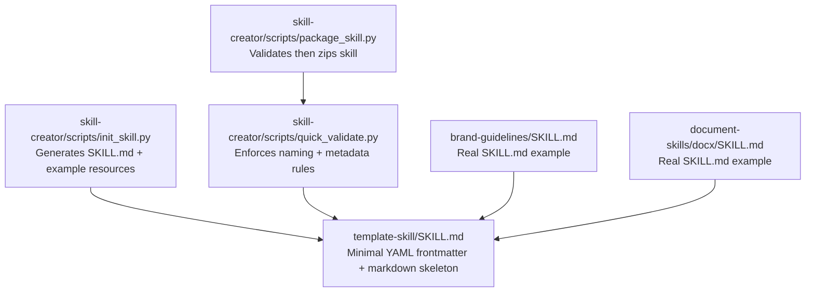
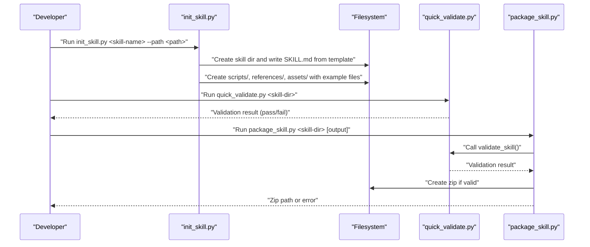
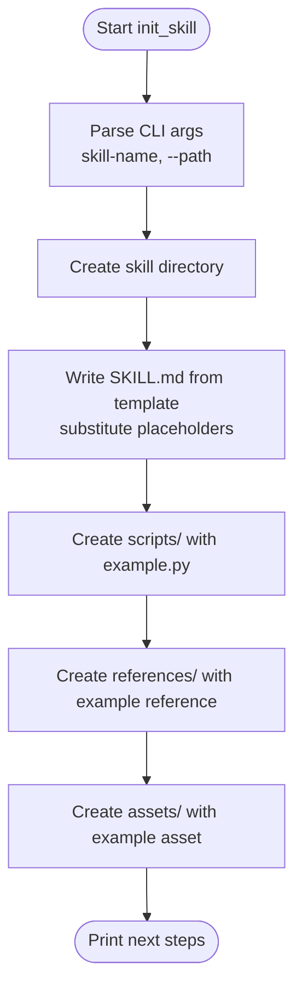
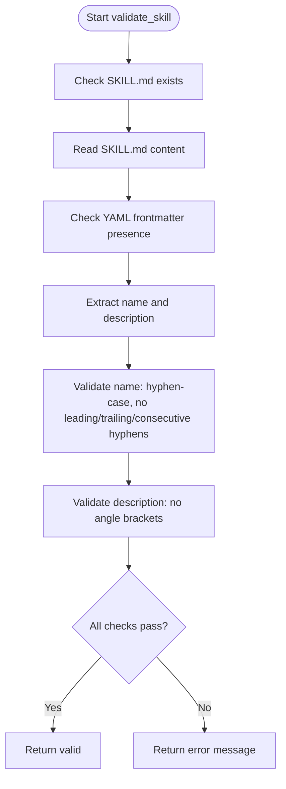
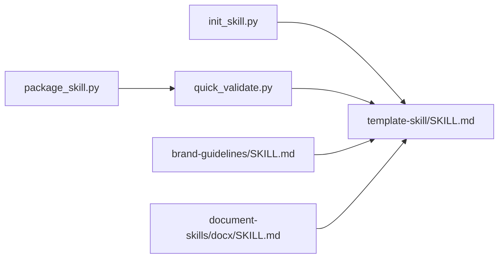

# Skill Templating

<cite>
**Referenced Files in This Document**
- [template-skill/SKILL.md](file://template-skill/SKILL.md)
- [skill-creator/scripts/init_skill.py](file://skill-creator/scripts/init_skill.py)
- [skill-creator/scripts/quick_validate.py](file://skill-creator/scripts/quick_validate.py)
- [skill-creator/scripts/package_skill.py](file://skill-creator/scripts/package_skill.py)
- [README.md](file://README.md)
- [skill-creator/SKILL.md](file://skill-creator/SKILL.md)
- [brand-guidelines/SKILL.md](file://brand-guidelines/SKILL.md)
- [document-skills/docx/SKILL.md](file://document-skills/docx/SKILL.md)
</cite>

## Table of Contents
1. [Introduction](#introduction)
2. [Project Structure](#project-structure)
3. [Core Components](#core-components)
4. [Architecture Overview](#architecture-overview)
5. [Detailed Component Analysis](#detailed-component-analysis)
6. [Dependency Analysis](#dependency-analysis)
7. [Performance Considerations](#performance-considerations)
8. [Troubleshooting Guide](#troubleshooting-guide)
9. [Conclusion](#conclusion)

## Introduction
This document explains the skill templating sub-component and how template-skill serves as the foundational blueprint for new skill development. It focuses on the minimal structure enforced by the template’s YAML frontmatter (name, description) and the markdown skeleton, and how this ensures consistency across the skills ecosystem. It also documents how the template integrates with the skill creation tools, especially how init_skill.py uses the template as a basis for new skills, and how quick_validate.py enforces naming conventions and metadata requirements. Finally, it addresses common issues and best practices for extending the template while maintaining compatibility with the broader system.

## Project Structure
The skill templating system centers around a minimal template skill and a set of developer tools that initialize, validate, and package skills. The key elements are:
- template-skill: A minimal SKILL.md with required YAML frontmatter and a markdown skeleton.
- skill-creator: Developer tools that initialize a new skill from the template, validate it, and package it for distribution.
- Example skills: Real-world SKILL.md files that demonstrate the required structure and metadata.

**Diagram sources**
- [template-skill/SKILL.md](file://template-skill/SKILL.md#L1-L7)
- [skill-creator/scripts/init_skill.py](file://skill-creator/scripts/init_skill.py#L18-L103)
- [skill-creator/scripts/quick_validate.py](file://skill-creator/scripts/quick_validate.py#L11-L57)
- [skill-creator/scripts/package_skill.py](file://skill-creator/scripts/package_skill.py#L19-L83)
- [brand-guidelines/SKILL.md](file://brand-guidelines/SKILL.md#L1-L74)
- [document-skills/docx/SKILL.md](file://document-skills/docx/SKILL.md#L1-L197)

**Section sources**
- [README.md](file://README.md#L90-L118)
- [template-skill/SKILL.md](file://template-skill/SKILL.md#L1-L7)
- [skill-creator/SKILL.md](file://skill-creator/SKILL.md#L25-L40)

## Core Components
- Template-skill SKILL.md: Defines the minimal required structure with YAML frontmatter (name, description) and a markdown skeleton. This is the canonical baseline for all new skills.
- init_skill.py: Reads the template content and writes a new SKILL.md with placeholders replaced by the skill name and title. It also creates example directories and files under scripts/, references/, and assets/.
- quick_validate.py: Validates that SKILL.md exists, has proper YAML frontmatter, contains required fields, and enforces naming conventions and description constraints.
- package_skill.py: Validates a skill before packaging it into a zip file for distribution.

**Section sources**
- [template-skill/SKILL.md](file://template-skill/SKILL.md#L1-L7)
- [skill-creator/scripts/init_skill.py](file://skill-creator/scripts/init_skill.py#L18-L103)
- [skill-creator/scripts/quick_validate.py](file://skill-creator/scripts/quick_validate.py#L11-L57)
- [skill-creator/scripts/package_skill.py](file://skill-creator/scripts/package_skill.py#L19-L83)

## Architecture Overview
The templating architecture enforces consistency by:
- Using a single source-of-truth template for the SKILL.md structure.
- Requiring all new skills to be initialized from this template via init_skill.py.
- Enforcing metadata and structure rules through quick_validate.py.
- Packaging validated skills with package_skill.py to ensure distribution readiness.

**Diagram sources**
- [skill-creator/scripts/init_skill.py](file://skill-creator/scripts/init_skill.py#L194-L271)
- [skill-creator/scripts/quick_validate.py](file://skill-creator/scripts/quick_validate.py#L11-L57)
- [skill-creator/scripts/package_skill.py](file://skill-creator/scripts/package_skill.py#L19-L83)

## Detailed Component Analysis

### Template-skill SKILL.md
- Purpose: Provide the minimal required structure for a skill.
- Required YAML frontmatter:
  - name: Unique identifier for the skill (lowercase, hyphens, digits).
  - description: Complete explanation of what the skill does and when to use it.
- Markdown skeleton: A header and a placeholder for instructions, followed by optional sections and resources guidance.

Concrete example from the template:
- The frontmatter includes the required fields with placeholder values indicating where to insert the skill name and description.
- The markdown skeleton includes placeholders for the skill title and sections that guide structuring the skill content.

How it enforces consistency:
- Ensures every skill has the required metadata (name, description) and a consistent document structure.
- Provides a standardized starting point that aligns with the broader skills ecosystem.

**Section sources**
- [template-skill/SKILL.md](file://template-skill/SKILL.md#L1-L7)
- [README.md](file://README.md#L90-L118)

### init_skill.py: Template-driven Initialization
- Role: Initializes a new skill directory from the template.
- Behavior:
  - Creates the skill directory and writes SKILL.md using a template string with placeholders for skill_name and skill_title.
  - Creates example directories and files under scripts/, references/, and assets/ to demonstrate structure and encourage reuse.
  - Prints next steps for completing the skill and running validation.

Template integration:
- The script defines a template string that mirrors the minimal structure and includes placeholders for dynamic values.
- The template is formatted with the skill name and title before writing SKILL.md.

**Diagram sources**
- [skill-creator/scripts/init_skill.py](file://skill-creator/scripts/init_skill.py#L194-L271)

**Section sources**
- [skill-creator/scripts/init_skill.py](file://skill-creator/scripts/init_skill.py#L18-L103)
- [skill-creator/scripts/init_skill.py](file://skill-creator/scripts/init_skill.py#L194-L271)

### quick_validate.py: Naming and Metadata Enforcement
- Role: Validates that a skill adheres to the required structure and metadata.
- Checks:
  - SKILL.md exists.
  - YAML frontmatter present and well-formed.
  - Required fields: name and description.
  - Naming convention: hyphen-case (lowercase letters, digits, hyphens only), disallow leading/trailing/consecutive hyphens.
  - Description constraints: disallow angle brackets.

Relationship to the template:
- The validation rules mirror the template’s required fields and enforce the same naming conventions and structure expectations.
- This ensures that skills initialized from the template remain compliant during development.

**Diagram sources**
- [skill-creator/scripts/quick_validate.py](file://skill-creator/scripts/quick_validate.py#L11-L57)

**Section sources**
- [skill-creator/scripts/quick_validate.py](file://skill-creator/scripts/quick_validate.py#L11-L57)

### package_skill.py: Validation and Packaging
- Role: Validates a skill and packages it into a zip file for distribution.
- Behavior:
  - Validates that the skill directory exists and contains SKILL.md.
  - Calls quick_validate.py to validate the skill.
  - If valid, creates a zip file containing the skill directory contents.

Integration with the template:
- Relies on quick_validate.py to ensure the skill meets the template’s requirements before packaging.
- Ensures consistent distribution format aligned with the template’s structure.

**Section sources**
- [skill-creator/scripts/package_skill.py](file://skill-creator/scripts/package_skill.py#L19-L83)

### Real SKILL.md Examples
- brand-guidelines/SKILL.md demonstrates a complete skill with required frontmatter and structured content.
- document-skills/docx/SKILL.md shows a more complex skill with extensive sections, workflows, and examples, illustrating how the template’s structure scales to richer content.

These examples reinforce the template’s minimal baseline and show how teams can extend the structure while maintaining required metadata.

**Section sources**
- [brand-guidelines/SKILL.md](file://brand-guidelines/SKILL.md#L1-L74)
- [document-skills/docx/SKILL.md](file://document-skills/docx/SKILL.md#L1-L197)

## Dependency Analysis
- init_skill.py depends on the template content to generate SKILL.md and example resources.
- quick_validate.py depends on the template’s required fields to enforce compliance.
- package_skill.py depends on quick_validate.py to validate skills before packaging.
- Real SKILL.md examples depend on the template’s structure to remain consistent with the ecosystem.

**Diagram sources**
- [skill-creator/scripts/init_skill.py](file://skill-creator/scripts/init_skill.py#L18-L103)
- [skill-creator/scripts/quick_validate.py](file://skill-creator/scripts/quick_validate.py#L11-L57)
- [skill-creator/scripts/package_skill.py](file://skill-creator/scripts/package_skill.py#L19-L83)
- [template-skill/SKILL.md](file://template-skill/SKILL.md#L1-L7)
- [brand-guidelines/SKILL.md](file://brand-guidelines/SKILL.md#L1-L74)
- [document-skills/docx/SKILL.md](file://document-skills/docx/SKILL.md#L1-L197)

**Section sources**
- [skill-creator/scripts/init_skill.py](file://skill-creator/scripts/init_skill.py#L18-L103)
- [skill-creator/scripts/quick_validate.py](file://skill-creator/scripts/quick_validate.py#L11-L57)
- [skill-creator/scripts/package_skill.py](file://skill-creator/scripts/package_skill.py#L19-L83)
- [template-skill/SKILL.md](file://template-skill/SKILL.md#L1-L7)

## Performance Considerations
- Keeping SKILL.md lean and moving detailed reference material to references/ reduces context load when the skill is triggered.
- Using scripts/ for deterministic, frequently reused operations avoids repeated token overhead.
- Following the template’s structure helps maintain predictable performance characteristics across the skills ecosystem.

[No sources needed since this section provides general guidance]

## Troubleshooting Guide
Common issues and resolutions:
- Missing SKILL.md: Ensure the file exists in the skill directory before validation or packaging.
- Missing YAML frontmatter: Ensure the frontmatter is present and properly delimited.
- Missing required fields: Ensure both name and description are present in the frontmatter.
- Invalid naming convention: Use hyphen-case (lowercase letters, digits, hyphens only) and avoid leading/trailing/consecutive hyphens.
- Description contains angle brackets: Remove angle brackets from the description.
- Directory already exists: Choose a unique skill name and path when initializing.

Best practices:
- Always initialize new skills using init_skill.py to ensure the template is applied consistently.
- Complete the frontmatter and remove placeholder TODOs before running validation.
- Keep SKILL.md focused on core instructions; place detailed references in references/.
- Delete unused example files and directories to minimize context load.
- Run quick_validate.py regularly to catch issues early.

**Section sources**
- [skill-creator/scripts/init_skill.py](file://skill-creator/scripts/init_skill.py#L205-L219)
- [skill-creator/scripts/quick_validate.py](file://skill-creator/scripts/quick_validate.py#L11-L57)
- [skill-creator/scripts/package_skill.py](file://skill-creator/scripts/package_skill.py#L32-L54)

## Conclusion
The template-skill component establishes a consistent, minimal baseline for all skills through required YAML frontmatter and a standardized markdown skeleton. The init_skill.py tool ensures new skills are initialized from this template, while quick_validate.py and package_skill.py enforce naming conventions, metadata requirements, and structural consistency, enabling reliable validation and packaging. By following these practices, teams can extend the template’s structure while maintaining compatibility across the skills ecosystem.