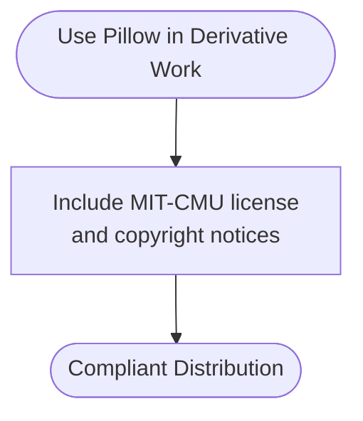

# Licensing and Compliance

<cite>
**Referenced Files in This Document**
- [THIRD_PARTY_NOTICES.md](file://THIRD_PARTY_NOTICES.md)
- [ArsenalSC-OFL.txt](file://canvas-design/canvas-fonts/ArsenalSC-OFL.txt)
- [BigShoulders-OFL.txt](file://canvas-design/canvas-fonts/BigShoulders-OFL.txt)
- [Boldonse-OFL.txt](file://canvas-design/canvas-fonts/Boldonse-OFL.txt)
- [BricolageGrotesque-OFL.txt](file://canvas-design/canvas-fonts/BricolageGrotesque-OFL.txt)
- [CrimsonPro-OFL.txt](file://canvas-design/canvas-fonts/CrimsonPro-OFL.txt)
- [DMMono-OFL.txt](file://canvas-design/canvas-fonts/DMMono-OFL.txt)
- [EricaOne-OFL.txt](file://canvas-design/canvas-fonts/EricaOne-OFL.txt)
- [GeistMono-OFL.txt](file://canvas-design/canvas-fonts/GeistMono-OFL.txt)
- [Gloock-OFL.txt](file://canvas-design/canvas-fonts/Gloock-OFL.txt)
- [IBMPlexMono-OFL.txt](file://canvas-design/canvas-fonts/IBMPlexMono-OFL.txt)
- [InstrumentSans-OFL.txt](file://canvas-design/canvas-fonts/InstrumentSans-OFL.txt)
- [Italiana-OFL.txt](file://canvas-design/canvas-fonts/Italiana-OFL.txt)
- [JetBrainsMono-OFL.txt](file://canvas-design/canvas-fonts/JetBrainsMono-OFL.txt)
- [Jura-OFL.txt](file://canvas-design/canvas-fonts/Jura-OFL.txt)
- [LibreBaskerville-OFL.txt](file://canvas-design/canvas-fonts/LibreBaskerville-OFL.txt)
- [Lora-OFL.txt](file://canvas-design/canvas-fonts/Lora-OFL.txt)
- [NationalPark-OFL.txt](file://canvas-design/canvas-fonts/NationalPark-OFL.txt)
- [NothingYouCouldDo-OFL.txt](file://canvas-design/canvas-fonts/NothingYouCouldDo-OFL.txt)
- [Outfit-OFL.txt](file://canvas-design/canvas-fonts/Outfit-OFL.txt)
- [PixelifySans-OFL.txt](file://canvas-design/canvas-fonts/PixelifySans-OFL.txt)
- [PoiretOne-OFL.txt](file://canvas-design/canvas-fonts/PoiretOne-OFL.txt)
- [RedHatMono-OFL.txt](file://canvas-design/canvas-fonts/RedHatMono-OFL.txt)
- [Silkscreen-OFL.txt](file://canvas-design/canvas-fonts/Silkscreen-OFL.txt)
- [SmoochSans-OFL.txt](file://canvas-design/canvas-fonts/SmoochSans-OFL.txt)
- [Tektur-OFL.txt](file://canvas-design/canvas-fonts/Tektur-OFL.txt)
- [WorkSans-OFL.txt](file://canvas-design/canvas-fonts/WorkSans-OFL.txt)
- [YoungSerif-OFL.txt](file://canvas-design/canvas-fonts/YoungSerif-OFL.txt)
- [requirements.txt](file://slack-gif-creator/requirements.txt)
- [gif_builder.py](file://slack-gif-creator/core/gif_builder.py)
</cite>

## Table of Contents
1. [Introduction](#introduction)
2. [Project Structure](#project-structure)
3. [Core Components](#core-components)
4. [Architecture Overview](#architecture-overview)
5. [Detailed Component Analysis](#detailed-component-analysis)
6. [Dependency Analysis](#dependency-analysis)
7. [Performance Considerations](#performance-considerations)
8. [Troubleshooting Guide](#troubleshooting-guide)
9. [Conclusion](#conclusion)
10. [Appendices](#appendices)

## Introduction
This document provides comprehensive licensing and compliance guidance for third-party dependencies used across the repository. It catalogs each third-party component listed in THIRD_PARTY_NOTICES.md, including FFmpeg 7.0.2 (GPLv3), Pillow 11.3.0 (MIT-CMU), imageio 2.37.0 (BSD 2-Clause), and the 25 fonts under SIL Open Font License v1.1. For each component, it outlines the exact license text, copyright holders, and specific compliance obligations such as source code distribution requirements, attribution notices, and redistribution terms. It also explains the implications of each license type (copyleft vs permissive) for developers, provides practical guidance for proper attribution in derivative works, and documents the specific requirements for the 25 fonts in canvas-design/canvas-fonts. Finally, it covers potential license conflicts, mitigation strategies, and the process for adding new dependencies while maintaining compliance.

## Project Structure
The repository organizes licensing and compliance information across:
- Central notices and license texts in THIRD_PARTY_NOTICES.md and per-font license files under canvas-design/canvas-fonts/.
- Python dependencies declared in slack-gif-creator/requirements.txt.
- Usage of these dependencies in slack-gif-creator/core/gif_builder.py.

**Diagram sources**
- [THIRD_PARTY_NOTICES.md](file://THIRD_PARTY_NOTICES.md#L1-L405)
- [requirements.txt](file://slack-gif-creator/requirements.txt#L1-L4)
- [gif_builder.py](file://slack-gif-creator/core/gif_builder.py#L1-L246)

**Section sources**
- [THIRD_PARTY_NOTICES.md](file://THIRD_PARTY_NOTICES.md#L1-L405)
- [requirements.txt](file://slack-gif-creator/requirements.txt#L1-L4)
- [gif_builder.py](file://slack-gif-creator/core/gif_builder.py#L1-L246)

## Core Components
This section catalogs the third-party components and their compliance obligations as documented in THIRD_PARTY_NOTICES.md and per-font license files.

- FFmpeg 7.0.2 (GPLv3)
  - License text and obligations are provided in THIRD_PARTY_NOTICES.md.
  - Compliance obligations include providing source code for object code distributions, including license notices, and ensuring redistribution under GPLv3 terms.
  - Implication: Copyleft license; any derivative work that distributes binaries must also distribute source code and preserve license terms.

- Pillow 11.3.0 (MIT-CMU)
  - License text and obligations are provided in THIRD_PARTY_NOTICES.md.
  - Compliance obligations include preserving copyright and permission notices.
  - Implication: Permissive license; minimal redistribution obligations.

- imageio 2.37.0 (BSD 2-Clause)
  - License text and obligations are provided in THIRD_PARTY_NOTICES.md.
  - Compliance obligations include preserving copyright and license notices in distributions.
  - Implication: Permissive license; minimal redistribution obligations.

- imageio-ffmpeg 0.6.0 (BSD 2-Clause)
  - License text and obligations are provided in THIRD_PARTY_NOTICES.md.
  - Compliance obligations include preserving copyright and license notices in distributions.
  - Implication: Permissive license; minimal redistribution obligations.

- 25 Fonts under SIL Open Font License v1.1
  - Catalog of fonts and their license texts are provided in THIRD_PARTY_NOTICES.md and per-font license files.
  - Compliance obligations include:
    - Do not sell the fonts by themselves.
    - If you distribute modified or unmodified fonts with software, include the copyright notice and license.
    - Do not use Reserved Font Names in Modified Versions without explicit permission.
    - Do not distribute Modified Versions under any other license.
  - Implication: Copyleft-style license for fonts; strong attribution and redistribution obligations.

Practical guidance for attribution in derivative works:
- Include license texts and copyright notices in your distribution.
- Preserve “NOTICE”-style attribution where applicable.
- For FFmpeg, include source code or written offer for source code upon request.
- For Pillow and imageio/imageio-ffmpeg, include copyright and permission/license notices.
- For fonts, include per-font license files and attribution notices.

**Section sources**
- [THIRD_PARTY_NOTICES.md](file://THIRD_PARTY_NOTICES.md#L1-L405)
- [ArsenalSC-OFL.txt](file://canvas-design/canvas-fonts/ArsenalSC-OFL.txt#L1-L94)
- [BigShoulders-OFL.txt](file://canvas-design/canvas-fonts/BigShoulders-OFL.txt)
- [Boldonse-OFL.txt](file://canvas-design/canvas-fonts/Boldonse-OFL.txt)
- [BricolageGrotesque-OFL.txt](file://canvas-design/canvas-fonts/BricolageGrotesque-OFL.txt)
- [CrimsonPro-OFL.txt](file://canvas-design/canvas-fonts/CrimsonPro-OFL.txt)
- [DMMono-OFL.txt](file://canvas-design/canvas-fonts/DMMono-OFL.txt)
- [EricaOne-OFL.txt](file://canvas-design/canvas-fonts/EricaOne-OFL.txt)
- [GeistMono-OFL.txt](file://canvas-design/canvas-fonts/GeistMono-OFL.txt)
- [Gloock-OFL.txt](file://canvas-design/canvas-fonts/Gloock-OFL.txt)
- [IBMPlexMono-OFL.txt](file://canvas-design/canvas-fonts/IBMPlexMono-OFL.txt)
- [InstrumentSans-OFL.txt](file://canvas-design/canvas-fonts/InstrumentSans-OFL.txt)
- [Italiana-OFL.txt](file://canvas-design/canvas-fonts/Italiana-OFL.txt)
- [JetBrainsMono-OFL.txt](file://canvas-design/canvas-fonts/JetBrainsMono-OFL.txt)
- [Jura-OFL.txt](file://canvas-design/canvas-fonts/Jura-OFL.txt)
- [LibreBaskerville-OFL.txt](file://canvas-design/canvas-fonts/LibreBaskerville-OFL.txt)
- [Lora-OFL.txt](file://canvas-design/canvas-fonts/Lora-OFL.txt)
- [NationalPark-OFL.txt](file://canvas-design/canvas-fonts/NationalPark-OFL.txt)
- [NothingYouCouldDo-OFL.txt](file://canvas-design/canvas-fonts/NothingYouCouldDo-OFL.txt)
- [Outfit-OFL.txt](file://canvas-design/canvas-fonts/Outfit-OFL.txt)
- [PixelifySans-OFL.txt](file://canvas-design/canvas-fonts/PixelifySans-OFL.txt)
- [PoiretOne-OFL.txt](file://canvas-design/canvas-fonts/PoiretOne-OFL.txt)
- [RedHatMono-OFL.txt](file://canvas-design/canvas-fonts/RedHatMono-OFL.txt)
- [Silkscreen-OFL.txt](file://canvas-design/canvas-fonts/Silkscreen-OFL.txt)
- [SmoochSans-OFL.txt](file://canvas-design/canvas-fonts/SmoochSans-OFL.txt)
- [Tektur-OFL.txt](file://canvas-design/canvas-fonts/Tektur-OFL.txt)
- [WorkSans-OFL.txt](file://canvas-design/canvas-fonts/WorkSans-OFL.txt)
- [YoungSerif-OFL.txt](file://canvas-design/canvas-fonts/YoungSerif-OFL.txt)

## Architecture Overview
The licensing architecture centers on three pillars:
- Central notices and license texts in THIRD_PARTY_NOTICES.md.
- Per-font license files under canvas-design/canvas-fonts/.
- Python dependency declarations and usage in slack-gif-creator.

**Diagram sources**
- [THIRD_PARTY_NOTICES.md](file://THIRD_PARTY_NOTICES.md#L1-L405)
- [requirements.txt](file://slack-gif-creator/requirements.txt#L1-L4)
- [gif_builder.py](file://slack-gif-creator/core/gif_builder.py#L1-L246)

## Detailed Component Analysis

### FFmpeg 7.0.2 (GPLv3)
- License type: Copyleft (GPLv3).
- Compliance obligations:
  - Provide source code for object code distributions.
  - Include license notices and copyright notices.
  - Ensure redistribution under GPLv3 terms.
  - Preserve license notices and provide a copy of the license.
- Implications for developers:
  - If you distribute binaries that include FFmpeg, you must also provide source code or a written offer to provide source code.
  - Any derivative work that distributes binaries must also be licensed under GPLv3.
- Practical attribution guidance:
  - Include the GPLv3 license text and copyright notices in your distribution.
  - Provide a written offer to supply source code upon request.
  - Ensure any redistributed binaries include license notices.

**Diagram sources**
- [THIRD_PARTY_NOTICES.md](file://THIRD_PARTY_NOTICES.md#L27-L285)

**Section sources**
- [THIRD_PARTY_NOTICES.md](file://THIRD_PARTY_NOTICES.md#L27-L285)

### Pillow 11.3.0 (MIT-CMU)
- License type: Permissive (MIT-CMU).
- Compliance obligations:
  - Preserve copyright and permission notices.
- Implications for developers:
  - Minimal redistribution obligations; permissive license.
- Practical attribution guidance:
  - Include the MIT-CMU license text and copyright notices in your distribution.

**Diagram sources**
- [THIRD_PARTY_NOTICES.md](file://THIRD_PARTY_NOTICES.md#L287-L301)

**Section sources**
- [THIRD_PARTY_NOTICES.md](file://THIRD_PARTY_NOTICES.md#L287-L301)

### imageio 2.37.0 (BSD 2-Clause)
- License type: Permissive (BSD 2-Clause).
- Compliance obligations:
  - Preserve copyright and license notices.
- Implications for developers:
  - Minimal redistribution obligations; permissive license.
- Practical attribution guidance:
  - Include the BSD 2-Clause license text and copyright notices in your distribution.

**Diagram sources**
- [THIRD_PARTY_NOTICES.md](file://THIRD_PARTY_NOTICES.md#L7-L25)

**Section sources**
- [THIRD_PARTY_NOTICES.md](file://THIRD_PARTY_NOTICES.md#L7-L25)

### imageio-ffmpeg 0.6.0 (BSD 2-Clause)
- License type: Permissive (BSD 2-Clause).
- Compliance obligations:
  - Preserve copyright and license notices.
- Implications for developers:
  - Minimal redistribution obligations; permissive license.
- Practical attribution guidance:
  - Include the BSD 2-Clause license text and copyright notices in your distribution.

**Diagram sources**
- [THIRD_PARTY_NOTICES.md](file://THIRD_PARTY_NOTICES.md#L7-L25)

**Section sources**
- [THIRD_PARTY_NOTICES.md](file://THIRD_PARTY_NOTICES.md#L7-L25)

### SIL Open Font License v1.1 (25 Fonts)
- License type: Copyleft-style font license.
- Compliance obligations:
  - Do not sell the fonts by themselves.
  - If distributing Modified or Unmodified Font Software with software, include the copyright notice and license.
  - Do not use Reserved Font Names in Modified Versions without explicit permission.
  - Do not distribute Modified Versions under any other license.
- Implications for developers:
  - Strong attribution and redistribution obligations for fonts.
  - Modified versions must remain under the OFL.
- Practical attribution guidance:
  - Include per-font license files and attribution notices.
  - Do not alter Reserved Font Names in Modified Versions without permission.
  - Ensure Modified Versions remain under the OFL.

**Diagram sources**
- [THIRD_PARTY_NOTICES.md](file://THIRD_PARTY_NOTICES.md#L303-L405)
- [ArsenalSC-OFL.txt](file://canvas-design/canvas-fonts/ArsenalSC-OFL.txt#L1-L94)

**Section sources**
- [THIRD_PARTY_NOTICES.md](file://THIRD_PARTY_NOTICES.md#L303-L405)
- [ArsenalSC-OFL.txt](file://canvas-design/canvas-fonts/ArsenalSC-OFL.txt#L1-L94)

### FFmpeg Usage in slack-gif-creator
- The slack-gif-creator module uses imageio and Pillow for GIF creation and relies on imageio-ffmpeg for encoding. The requirements.txt declares pillow, imageio, imageio-ffmpeg, and numpy. The gif_builder.py imports imageio and uses imageio.imwrite to write GIFs.
- Compliance implications:
  - FFmpeg is used indirectly via imageio-ffmpeg; ensure compliance with GPLv3 for any distribution that bundles FFmpeg binaries.
  - Include license notices for Pillow, imageio, and imageio-ffmpeg in your distribution.
  - Include per-font license files for any fonts distributed with the skill.

**Diagram sources**
- [requirements.txt](file://slack-gif-creator/requirements.txt#L1-L4)
- [gif_builder.py](file://slack-gif-creator/core/gif_builder.py#L1-L246)

**Section sources**
- [requirements.txt](file://slack-gif-creator/requirements.txt#L1-L4)
- [gif_builder.py](file://slack-gif-creator/core/gif_builder.py#L1-L246)

## Dependency Analysis
- FFmpeg 7.0.2 (GPLv3) is used indirectly via imageio-ffmpeg. Any distribution that bundles FFmpeg binaries must comply with GPLv3, including providing source code or a written offer.
- Pillow 11.3.0 (MIT-CMU) and imageio 2.37.0 (BSD 2-Clause) are permissive; include notices and copyright statements.
- imageio-ffmpeg 0.6.0 (BSD 2-Clause) is permissive; include notices and copyright statements.
- 25 fonts under SIL OFL v1.1 require attribution, non-sale of fonts by themselves, and Modified Versions to remain under OFL.

Potential license conflicts and mitigations:
- FFmpeg’s copyleft terms may conflict with proprietary distributions. Mitigation:
  - Avoid bundling FFmpeg binaries in proprietary distributions.
  - If bundling is unavoidable, ensure GPLv3 compliance (provide source code or written offer).
  - Prefer dynamic linking or rely on system-installed FFmpeg where feasible.
- OFL’s restrictions on Reserved Font Names and Modified Versions:
  - Do not rename fonts to Reserved Font Names without permission.
  - Do not relicense Modified Versions; keep under OFL.

**Section sources**
- [THIRD_PARTY_NOTICES.md](file://THIRD_PARTY_NOTICES.md#L7-L25)
- [THIRD_PARTY_NOTICES.md](file://THIRD_PARTY_NOTICES.md#L27-L285)
- [THIRD_PARTY_NOTICES.md](file://THIRD_PARTY_NOTICES.md#L303-L405)

## Performance Considerations
- Using FFmpeg for GIF encoding can increase build times. Consider optimizing frame counts, colors, and dimensions to balance quality and performance.
- OFL fonts are distributed as files; include only necessary fonts to minimize distribution size.

[No sources needed since this section provides general guidance]

## Troubleshooting Guide
Common compliance issues and resolutions:
- Missing license notices:
  - Resolution: Include license texts and copyright notices in your distribution.
- Missing source code for FFmpeg:
  - Resolution: Provide source code or a written offer to supply source code upon request.
- Incorrect attribution for fonts:
  - Resolution: Include per-font license files and attribution notices; do not alter Reserved Font Names.
- Misunderstanding OFL restrictions:
  - Resolution: Do not sell fonts by themselves; Modified Versions must remain under OFL.

**Section sources**
- [THIRD_PARTY_NOTICES.md](file://THIRD_PARTY_NOTICES.md#L7-L25)
- [THIRD_PARTY_NOTICES.md](file://THIRD_PARTY_NOTICES.md#L27-L285)
- [THIRD_PARTY_NOTICES.md](file://THIRD_PARTY_NOTICES.md#L303-L405)

## Conclusion
This repository’s third-party dependencies are governed by distinct license regimes: GPLv3 for FFmpeg, MIT-CMU and BSD 2-Clause for Pillow and imageio/imageio-ffmpeg, and SIL OFL v1.1 for 25 fonts. Compliance hinges on preserving notices, including license texts, and adhering to redistribution terms. For FFmpeg, ensure source code availability or written offers; for fonts, maintain OFL terms and avoid Reserved Font Name misuse. When adding new dependencies, evaluate license compatibility, document notices, and update dependency declarations accordingly.

[No sources needed since this section summarizes without analyzing specific files]

## Appendices

### Practical Attribution Checklist
- FFmpeg (GPLv3):
  - Include GPLv3 license text and copyright notices.
  - Provide source code or written offer for source code.
- Pillow (MIT-CMU):
  - Include MIT-CMU license text and copyright notices.
- imageio (BSD 2-Clause):
  - Include BSD 2-Clause license text and copyright notices.
- imageio-ffmpeg (BSD 2-Clause):
  - Include BSD 2-Clause license text and copyright notices.
- Fonts (SIL OFL v1.1):
  - Include per-font license files and attribution notices.
  - Do not sell fonts by themselves.
  - Do not use Reserved Font Names in Modified Versions without permission.
  - Do not relicense Modified Versions.

**Section sources**
- [THIRD_PARTY_NOTICES.md](file://THIRD_PARTY_NOTICES.md#L7-L25)
- [THIRD_PARTY_NOTICES.md](file://THIRD_PARTY_NOTICES.md#L27-L285)
- [THIRD_PARTY_NOTICES.md](file://THIRD_PARTY_NOTICES.md#L303-L405)