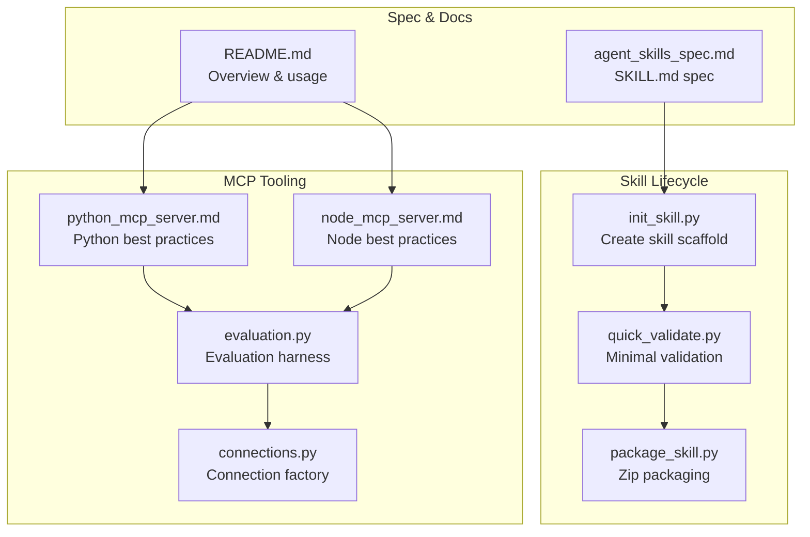
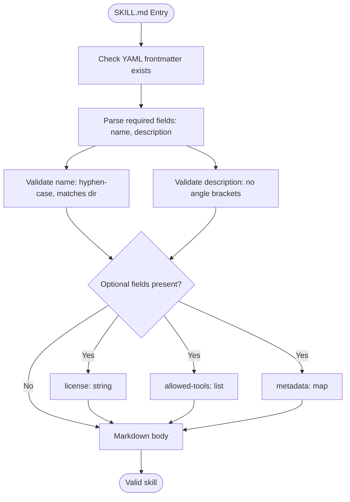
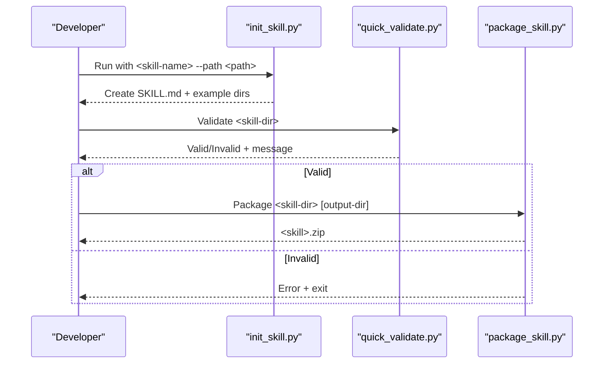
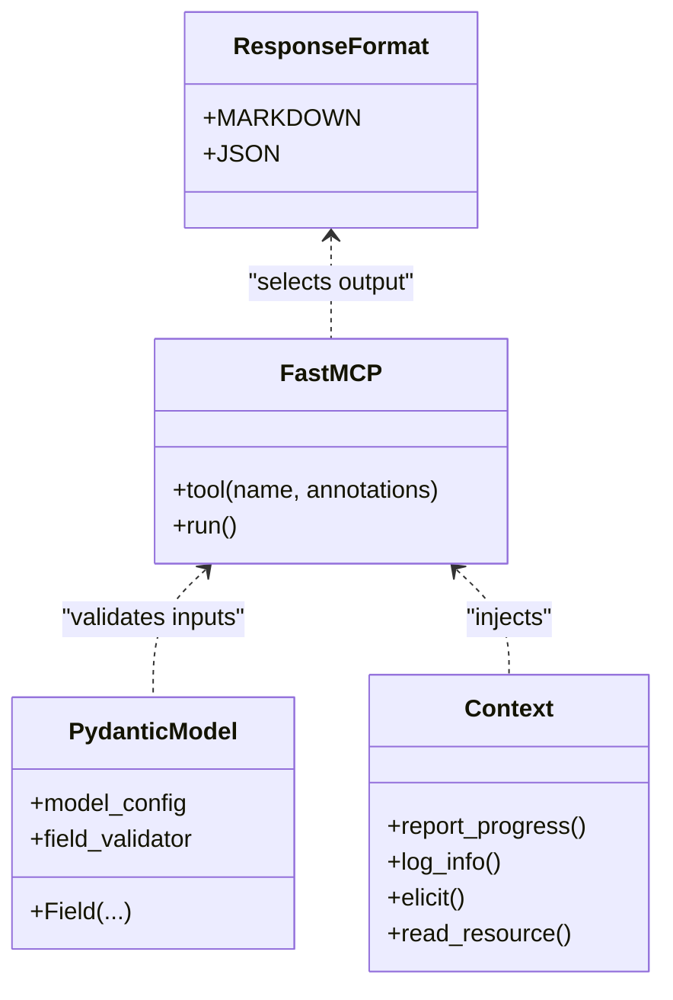
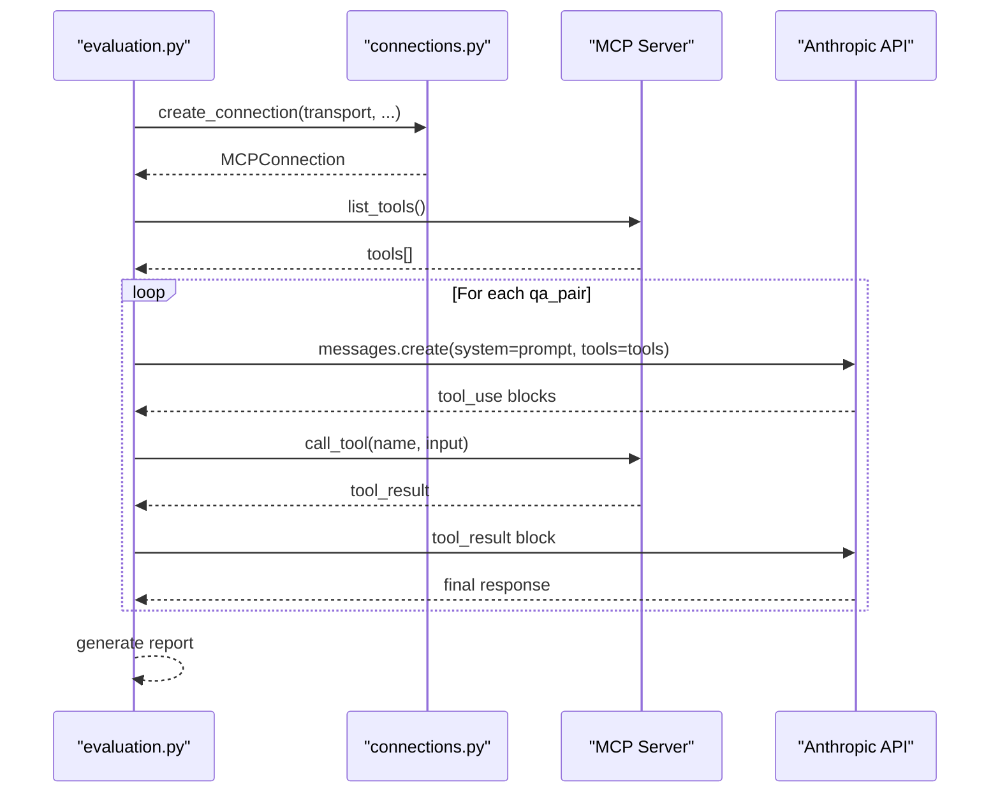
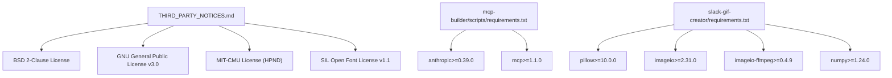

# Reference

<cite>
**Referenced Files in This Document**
- [agent_skills_spec.md](file://agent_skills_spec.md)
- [README.md](file://README.md)
- [THIRD_PARTY_NOTICES.md](file://THIRD_PARTY_NOTICES.md)
- [template-skill/SKILL.md](file://template-skill/SKILL.md)
- [document-skills/docx/SKILL.md](file://document-skills/docx/SKILL.md)
- [skill-creator/scripts/init_skill.py](file://skill-creator/scripts/init_skill.py)
- [skill-creator/scripts/package_skill.py](file://skill-creator/scripts/package_skill.py)
- [skill-creator/scripts/quick_validate.py](file://skill-creator/scripts/quick_validate.py)
- [mcp-builder/reference/python_mcp_server.md](file://mcp-builder/reference/python_mcp_server.md)
- [mcp-builder/reference/node_mcp_server.md](file://mcp-builder/reference/node_mcp_server.md)
- [mcp-builder/reference/evaluation.md](file://mcp-builder/reference/evaluation.md)
- [mcp-builder/scripts/connections.py](file://mcp-builder/scripts/connections.py)
- [mcp-builder/scripts/evaluation.py](file://mcp-builder/scripts/evaluation.py)
- [mcp-builder/scripts/requirements.txt](file://mcp-builder/scripts/requirements.txt)
- [slack-gif-creator/requirements.txt](file://slack-gif-creator/requirements.txt)
</cite>

## Table of Contents
1. [Introduction](#introduction)
2. [Project Structure](#project-structure)
3. [Core Components](#core-components)
4. [Architecture Overview](#architecture-overview)
5. [Detailed Component Analysis](#detailed-component-analysis)
6. [Dependency Analysis](#dependency-analysis)
7. [Performance Considerations](#performance-considerations)
8. [Troubleshooting Guide](#troubleshooting-guide)
9. [Conclusion](#conclusion)
10. [Appendices](#appendices)

## Introduction
This reference consolidates the skills framework specification and operational tooling for building, validating, packaging, and evaluating skills and MCP servers. It focuses on:
- The Agent Skills Specification for SKILL.md YAML frontmatter and Markdown body
- Third-party dependencies and licensing obligations
- Programmatic interfaces for skill validation and MCP server evaluation
- Configuration, environment variables, and command-line usage
- Cross-references to conceptual documentation

## Project Structure
The repository organizes example skills, meta skills, and MCP tooling under a cohesive layout. Key areas:
- Skills: example and reference skills (e.g., document-skills, algorithmic-art, canvas-design)
- Meta skills: skill-creator for scaffolding and validation
- MCP tooling: mcp-builder with reference guides and evaluation harness
- Licensing and specification: THIRD_PARTY_NOTICES.md and agent_skills_spec.md

```mermaid
graph TB
A["Root"] --> B["Skills (example/reference)"]
A --> C["Meta Skills (skill-creator)"]
A --> D["MCP Builder (reference + scripts)"]
A --> E["Docs (agent_skills_spec.md, README)"]
A --> F["Licenses (THIRD_PARTY_NOTICES.md)"]
B --> B1["document-skills/docx"]
B --> B2["document-skills/pdf"]
B --> B3["document-skills/pptx"]
B --> B4["document-skills/xlsx"]
B --> B5["algorithmic-art"]
B --> B6["canvas-design"]
B --> B7["brand-guidelines"]
B --> B8["frontend-design"]
B --> B9["internal-comms"]
B --> B10["artifacts-builder"]
B --> B11["theme-factory"]
B --> B12["webapp-testing"]
C --> C1["scripts/init_skill.py"]
C --> C2["scripts/package_skill.py"]
C --> C3["scripts/quick_validate.py"]
D --> D1["reference/python_mcp_server.md"]
D --> D2["reference/node_mcp_server.md"]
D --> D3["reference/evaluation.md"]
D --> D4["scripts/connections.py"]
D --> D5["scripts/evaluation.py"]
D --> D6["scripts/requirements.txt"]
```

**Diagram sources**
- [README.md](file://README.md#L1-L123)
- [agent_skills_spec.md](file://agent_skills_spec.md#L1-L56)
- [mcp-builder/reference/python_mcp_server.md](file://mcp-builder/reference/python_mcp_server.md#L1-L120)
- [mcp-builder/reference/node_mcp_server.md](file://mcp-builder/reference/node_mcp_server.md#L1-L120)
- [mcp-builder/reference/evaluation.md](file://mcp-builder/reference/evaluation.md#L1-L60)
- [skill-creator/scripts/init_skill.py](file://skill-creator/scripts/init_skill.py#L1-L60)
- [skill-creator/scripts/package_skill.py](file://skill-creator/scripts/package_skill.py#L1-L40)
- [skill-creator/scripts/quick_validate.py](file://skill-creator/scripts/quick_validate.py#L1-L30)

**Section sources**
- [README.md](file://README.md#L1-L123)
- [agent_skills_spec.md](file://agent_skills_spec.md#L1-L56)

## Core Components
- Agent Skills Specification: defines SKILL.md structure, YAML frontmatter fields, and Markdown body rules
- Skill Creator: scaffolds a new skill directory and files, validates structure, packages skills
- MCP Builder: reference guides for Python and Node MCP servers, evaluation harness, and connection utilities
- Licensing: third-party notices and license summaries

**Section sources**
- [agent_skills_spec.md](file://agent_skills_spec.md#L1-L56)
- [skill-creator/scripts/init_skill.py](file://skill-creator/scripts/init_skill.py#L1-L120)
- [skill-creator/scripts/package_skill.py](file://skill-creator/scripts/package_skill.py#L1-L80)
- [skill-creator/scripts/quick_validate.py](file://skill-creator/scripts/quick_validate.py#L1-L65)
- [mcp-builder/reference/python_mcp_server.md](file://mcp-builder/reference/python_mcp_server.md#L1-L120)
- [mcp-builder/reference/node_mcp_server.md](file://mcp-builder/reference/node_mcp_server.md#L1-L120)
- [mcp-builder/reference/evaluation.md](file://mcp-builder/reference/evaluation.md#L1-L120)
- [THIRD_PARTY_NOTICES.md](file://THIRD_PARTY_NOTICES.md#L1-L120)

## Architecture Overview
The skills framework centers on a simple, discoverable folder structure with a SKILL.md entrypoint. The skill-creator tools provide lifecycle management, while MCP builder references define best practices for tooling and evaluation.

**Diagram sources**
- [agent_skills_spec.md](file://agent_skills_spec.md#L1-L56)
- [README.md](file://README.md#L1-L123)
- [skill-creator/scripts/init_skill.py](file://skill-creator/scripts/init_skill.py#L1-L120)
- [skill-creator/scripts/quick_validate.py](file://skill-creator/scripts/quick_validate.py#L1-L65)
- [skill-creator/scripts/package_skill.py](file://skill-creator/scripts/package_skill.py#L1-L80)
- [mcp-builder/reference/python_mcp_server.md](file://mcp-builder/reference/python_mcp_server.md#L1-L120)
- [mcp-builder/reference/node_mcp_server.md](file://mcp-builder/reference/node_mcp_server.md#L1-L120)
- [mcp-builder/scripts/evaluation.py](file://mcp-builder/scripts/evaluation.py#L1-L120)
- [mcp-builder/scripts/connections.py](file://mcp-builder/scripts/connections.py#L1-L80)

## Detailed Component Analysis

### Agent Skills Specification (SKILL.md)
- Purpose: Defines the minimal and recommended structure for a skill folder recognized by the system
- Folder layout: At minimum, a skill folder contains a SKILL.md file
- SKILL.md entrypoint: Must start with YAML frontmatter followed by Markdown content
- YAML frontmatter (required):
  - name: hyphen-case identifier (lowercase alphanumeric + hyphens), must match directory name
  - description: description of what the skill does and when to use it
- YAML frontmatter (optional):
  - license: short license identifier or bundled license file name
  - allowed-tools: list of pre-approved tools (currently supported in Claude Code)
  - metadata: map of string keys to string values for client-defined attributes
- Markdown body: no restrictions; use for instructions, examples, and guidelines
- Additional information: references template-skill for minimal example and includes a version history

**Diagram sources**
- [agent_skills_spec.md](file://agent_skills_spec.md#L1-L56)

**Section sources**
- [agent_skills_spec.md](file://agent_skills_spec.md#L1-L56)
- [template-skill/SKILL.md](file://template-skill/SKILL.md#L1-L7)

### Skill Creator Tools
- init_skill.py
  - Purpose: Initialize a new skill directory with a template SKILL.md and example resource directories (scripts, references, assets)
  - Usage: Command-line invocation with skill name and destination path
  - Validation: Enforces naming conventions and directory existence checks
- quick_validate.py
  - Purpose: Lightweight validation of a skill directory
  - Checks: presence of SKILL.md, YAML frontmatter, required fields, name format, and description constraints
- package_skill.py
  - Purpose: Package a skill folder into a distributable zip
  - Precondition: Validates skill structure before packaging
  - Output: Zip file named after the skill directory

**Diagram sources**
- [skill-creator/scripts/init_skill.py](file://skill-creator/scripts/init_skill.py#L1-L120)
- [skill-creator/scripts/quick_validate.py](file://skill-creator/scripts/quick_validate.py#L1-L65)
- [skill-creator/scripts/package_skill.py](file://skill-creator/scripts/package_skill.py#L1-L111)

**Section sources**
- [skill-creator/scripts/init_skill.py](file://skill-creator/scripts/init_skill.py#L1-L304)
- [skill-creator/scripts/quick_validate.py](file://skill-creator/scripts/quick_validate.py#L1-L65)
- [skill-creator/scripts/package_skill.py](file://skill-creator/scripts/package_skill.py#L1-L111)

### MCP Server Builder References
- Python MCP Server
  - Best practices: server naming, tool registration with decorators, Pydantic validation, response formats, pagination, character limits, error handling, shared utilities, async/await patterns, type hints, docstrings, context injection, resource registration, structured output types, lifespan management, and transport options
  - Example: Complete working server with tool definitions, schemas, and runtime behavior
- Node/TypeScript MCP Server
  - Best practices: server naming, project structure, tool registration with Zod schemas, response formats, pagination, character limits, error handling, shared utilities, async/await patterns, TypeScript strictness, and transport options
  - Example: Complete working server with tool registration, schemas, and runtime behavior

**Diagram sources**
- [mcp-builder/reference/python_mcp_server.md](file://mcp-builder/reference/python_mcp_server.md#L1-L200)

**Section sources**
- [mcp-builder/reference/python_mcp_server.md](file://mcp-builder/reference/python_mcp_server.md#L1-L752)
- [mcp-builder/reference/node_mcp_server.md](file://mcp-builder/reference/node_mcp_server.md#L1-L916)

### MCP Evaluation Harness
- Purpose: Evaluate MCP servers using realistic, read-only questions and measure accuracy, duration, and tool usage
- Inputs: XML evaluation file with qa_pair entries, transport configuration (stdio, sse, http), model selection, optional headers and environment variables
- Behavior: Loads tools from the MCP server, runs tasks with Claude, collects metrics, and produces a report
- Outputs: Summary statistics and per-task results including correctness, durations, tool call counts, and agent feedback

**Diagram sources**
- [mcp-builder/scripts/evaluation.py](file://mcp-builder/scripts/evaluation.py#L1-L200)
- [mcp-builder/scripts/connections.py](file://mcp-builder/scripts/connections.py#L1-L152)
- [mcp-builder/reference/evaluation.md](file://mcp-builder/reference/evaluation.md#L1-L200)

**Section sources**
- [mcp-builder/scripts/evaluation.py](file://mcp-builder/scripts/evaluation.py#L1-L374)
- [mcp-builder/scripts/connections.py](file://mcp-builder/scripts/connections.py#L1-L152)
- [mcp-builder/reference/evaluation.md](file://mcp-builder/reference/evaluation.md#L1-L602)

### Document Skills Example (reference)
- The DOCX skill demonstrates advanced patterns for working with complex file formats and binary data, including reading, creating, editing, redlining workflows, and converting to images
- It references internal documentation and scripts for OOXML manipulation and validation

**Section sources**
- [document-skills/docx/SKILL.md](file://document-skills/docx/SKILL.md#L1-L197)

## Dependency Analysis
- Third-party dependencies and licenses are cataloged in THIRD_PARTY_NOTICES.md with license types and attribution notices
- MCP evaluation dependencies are declared in mcp-builder/scripts/requirements.txt
- Example skill dependencies are declared in slack-gif-creator/requirements.txt

**Diagram sources**
- [THIRD_PARTY_NOTICES.md](file://THIRD_PARTY_NOTICES.md#L1-L120)
- [mcp-builder/scripts/requirements.txt](file://mcp-builder/scripts/requirements.txt#L1-L3)
- [slack-gif-creator/requirements.txt](file://slack-gif-creator/requirements.txt#L1-L4)

**Section sources**
- [THIRD_PARTY_NOTICES.md](file://THIRD_PARTY_NOTICES.md#L1-L405)
- [mcp-builder/scripts/requirements.txt](file://mcp-builder/scripts/requirements.txt#L1-L3)
- [slack-gif-creator/requirements.txt](file://slack-gif-creator/requirements.txt#L1-L4)

## Performance Considerations
- MCP servers should implement pagination and character limits to avoid overwhelming responses
- Use async/await patterns for network and I/O operations
- Prefer structured output formats (JSON or Markdown) and consistent schemas
- Minimize tool call counts by composing tools and reducing redundant operations

[No sources needed since this section provides general guidance]

## Troubleshooting Guide
- Skill validation failures:
  - Missing or malformed YAML frontmatter
  - Missing required fields (name, description)
  - Name format violations (hyphen-case, directory match)
  - Description contains angle brackets
- Packaging failures:
  - Missing SKILL.md
  - Directory not found or not a directory
  - Validation failure before packaging
- MCP evaluation failures:
  - Connection errors (stdio command, sse/http URL, headers)
  - Low accuracy due to unclear tool descriptions or excessive data
  - Timeouts caused by large responses or missing pagination

**Section sources**
- [skill-creator/scripts/quick_validate.py](file://skill-creator/scripts/quick_validate.py#L1-L65)
- [skill-creator/scripts/package_skill.py](file://skill-creator/scripts/package_skill.py#L1-L111)
- [mcp-builder/reference/evaluation.md](file://mcp-builder/reference/evaluation.md#L378-L602)

## Conclusion
This reference consolidates the Agent Skills Specification, skill lifecycle tools, MCP server best practices, and evaluation harness. It provides authoritative definitions for SKILL.md frontmatter fields, outlines licensing obligations, and documents programmatic interfaces and configuration options for reliable, reproducible skill development and evaluation.

[No sources needed since this section summarizes without analyzing specific files]

## Appendices

### A. SKILL.md YAML Frontmatter Fields
- Required
  - name: hyphen-case identifier; must match directory name
  - description: description of what the skill does and when to use it
- Optional
  - license: short license identifier or bundled license file name
  - allowed-tools: list of pre-approved tools (Claude Code)
  - metadata: map of string keys to string values

**Section sources**
- [agent_skills_spec.md](file://agent_skills_spec.md#L20-L53)
- [template-skill/SKILL.md](file://template-skill/SKILL.md#L1-L7)

### B. Programmatic Interfaces and Command-Line Tools
- Skill Creator
  - init_skill.py: initialize a new skill scaffold
  - quick_validate.py: validate a skill directory
  - package_skill.py: package a skill into a zip
- MCP Evaluation
  - evaluation.py: run evaluations against MCP servers via stdio, sse, or http
  - connections.py: connection factory for stdio, sse, and http transports

**Section sources**
- [skill-creator/scripts/init_skill.py](file://skill-creator/scripts/init_skill.py#L1-L304)
- [skill-creator/scripts/quick_validate.py](file://skill-creator/scripts/quick_validate.py#L1-L65)
- [skill-creator/scripts/package_skill.py](file://skill-creator/scripts/package_skill.py#L1-L111)
- [mcp-builder/scripts/evaluation.py](file://mcp-builder/scripts/evaluation.py#L1-L374)
- [mcp-builder/scripts/connections.py](file://mcp-builder/scripts/connections.py#L1-L152)

### C. Configuration and Environment Variables
- MCP Evaluation
  - Environment variables: passed to stdio transport processes
  - HTTP headers: for sse/http transports
  - Model selection: default model configurable via command-line
- MCP Servers (Python/Node references)
  - Environment variables for API keys and secrets
  - Transport selection (stdio, http, sse)

**Section sources**
- [mcp-builder/reference/evaluation.md](file://mcp-builder/reference/evaluation.md#L378-L602)
- [mcp-builder/reference/python_mcp_server.md](file://mcp-builder/reference/python_mcp_server.md#L560-L752)
- [mcp-builder/reference/node_mcp_server.md](file://mcp-builder/reference/node_mcp_server.md#L520-L720)

### D. Third-Party Dependencies and Compliance Guidance
- License categories and components are listed in THIRD_PARTY_NOTICES.md
- Compliance guidance:
  - Retain license texts and notices
  - Attribute authors and copyright holders
  - Comply with GPL/AGPL requirements for source availability where applicable
  - Include SPDX identifiers and license texts in distributions

**Section sources**
- [THIRD_PARTY_NOTICES.md](file://THIRD_PARTY_NOTICES.md#L1-L405)