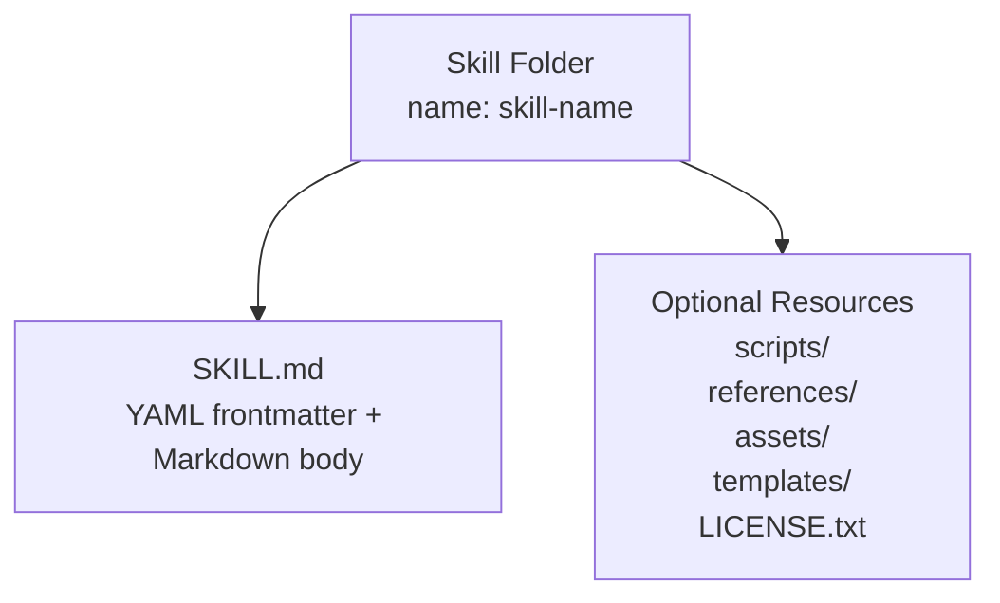
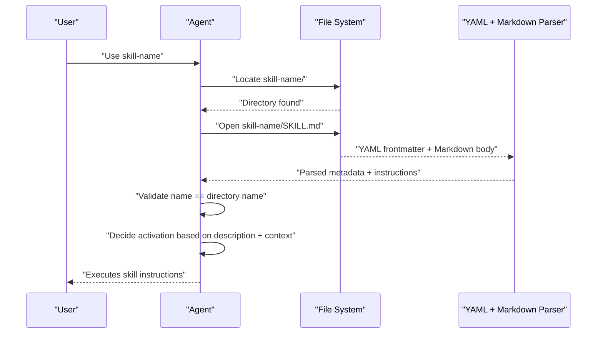
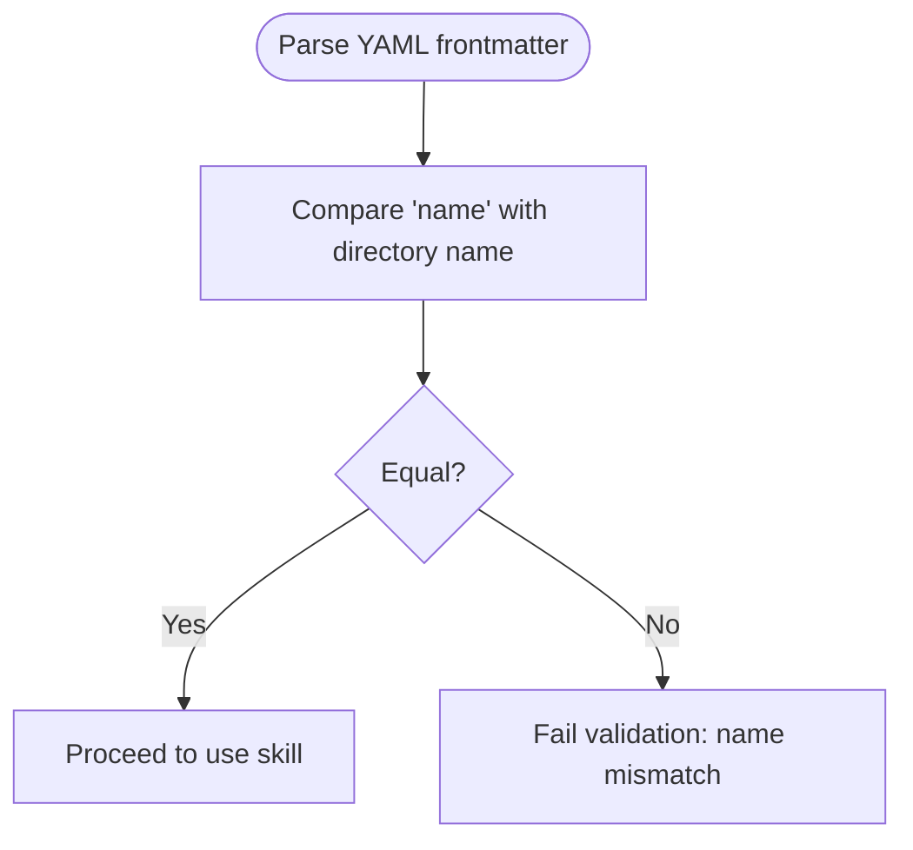
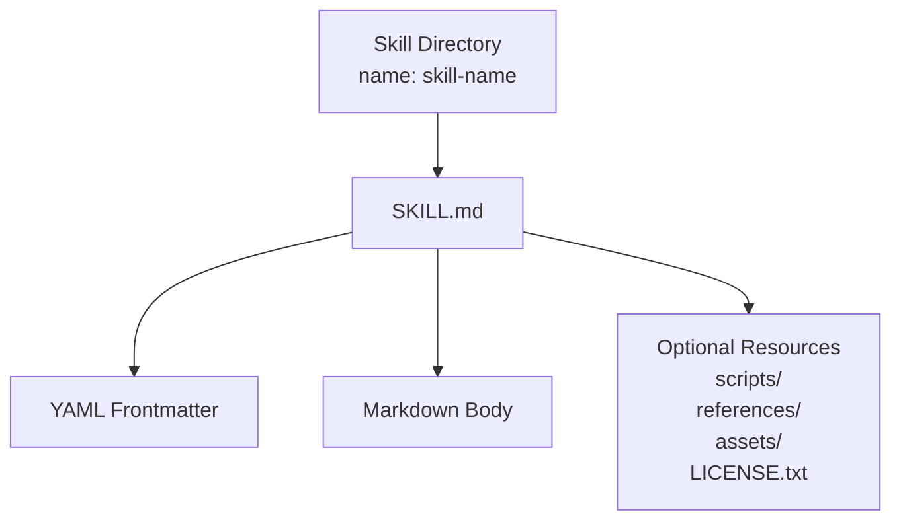

# Skill Specification

<cite>
**Referenced Files in This Document**
- [agent_skills_spec.md](file://agent_skills_spec.md)
- [README.md](file://README.md)
- [template-skill/SKILL.md](file://template-skill/SKILL.md)
- [algorithmic-art/SKILL.md](file://algorithmic-art/SKILL.md)
- [artifacts-builder/SKILL.md](file://artifacts-builder/SKILL.md)
- [brand-guidelines/SKILL.md](file://brand-guidelines/SKILL.md)
- [frontend-design/SKILL.md](file://frontend-design/SKILL.md)
- [internal-comms/SKILL.md](file://internal-comms/SKILL.md)
- [skill-creator/SKILL.md](file://skill-creator/SKILL.md)
- [canvas-design/SKILL.md](file://canvas-design/SKILL.md)
- [document-skills/docx/SKILL.md](file://document-skills/docx/SKILL.md)
- [document-skills/pdf/SKILL.md](file://document-skills/pdf/SKILL.md)
</cite>

## Table of Contents
1. [Introduction](#introduction)
2. [Project Structure](#project-structure)
3. [Core Components](#core-components)
4. [Architecture Overview](#architecture-overview)
5. [Detailed Component Analysis](#detailed-component-analysis)
6. [Dependency Analysis](#dependency-analysis)
7. [Performance Considerations](#performance-considerations)
8. [Troubleshooting Guide](#troubleshooting-guide)
9. [Conclusion](#conclusion)
10. [Appendices](#appendices)

## Introduction
This document defines the Agent Skills Specification for authoring skills that agents can discover and load dynamically. It explains the complete structure of a skill folder, the mandatory SKILL.md file, and the YAML frontmatter requirements. It also provides guidance on the Markdown body, best practices for writing effective skill descriptions and metadata, and common validation pitfalls.

## Project Structure
A skill is a folder containing a SKILL.md file and optional resources. The minimal structure is:
- skill-name/
  - SKILL.md

Additional directories and files may be included as needed (scripts/, references/, assets/, templates/, etc.).

**Section sources**
- [agent_skills_spec.md](file://agent_skills_spec.md#L1-L20)
- [README.md](file://README.md#L90-L118)

## Core Components
- Skill folder: A directory whose name becomes the canonical identifier for the skill.
- SKILL.md: The skill’s entrypoint. It must start with a YAML frontmatter block, followed by a Markdown body.
- YAML frontmatter: Contains required and optional metadata fields used to describe the skill and influence agent behavior.
- Markdown body: Free-form instructions, examples, and guidance for the agent.

Key requirements from the specification:
- Required frontmatter fields:
  - name: Lowercase Unicode alphanumeric + hyphen; must match the directory name.
  - description: What the skill does and when the agent should use it.
- Optional frontmatter fields:
  - license: Short license identifier or bundled license file name.
  - allowed-tools: List of pre-approved tools (currently supported in specific environments).
  - metadata: Map of string keys to string values for client-defined properties.
- Markdown body: No restrictions; use it to provide instructions, examples, and guidelines.

Relationship between directory name and name field:
- The frontmatter name must exactly match the skill folder’s directory name.

Validation rules and constraints:
- name must be lowercase, Unicode alphanumeric, and hyphens only.
- name must equal the directory name.
- description must be present and meaningful.
- license is optional; allowed-tools is optional; metadata is optional.

**Section sources**
- [agent_skills_spec.md](file://agent_skills_spec.md#L21-L48)
- [README.md](file://README.md#L113-L118)

## Architecture Overview
The skill lifecycle centers on SKILL.md. Agents parse the YAML frontmatter to decide when to activate a skill, then read the Markdown body to execute the skill’s instructions.

**Diagram sources**
- [agent_skills_spec.md](file://agent_skills_spec.md#L21-L48)
- [README.md](file://README.md#L90-L118)

## Detailed Component Analysis

### YAML Frontmatter Specification
- Required fields
  - name
    - Type: string
    - Constraints: lowercase Unicode alphanumeric + hyphen; must equal the directory name
    - Validation: Directory name must match name
  - description
    - Type: string
    - Purpose: What the skill does and when the agent should use it
- Optional fields
  - license
    - Type: string
    - Guidance: Keep it short (name of a license or bundled license file)
  - allowed-tools
    - Type: list of strings
    - Scope: Environment-dependent (e.g., specific clients)
  - metadata
    - Type: map of string -> string
    - Purpose: Client-defined properties; recommend unique keys to avoid conflicts

Best practices for writing effective skill descriptions and metadata:
- Use imperative, third-person phrasing in the description.
- Include clear triggers and conditions for when to use the skill.
- Keep metadata keys concise and unique to avoid collisions.
- License should reference the license file or a short identifier.

Common validation issues:
- name does not match directory name
- name contains uppercase letters or underscores
- description is missing or vague
- YAML syntax errors in frontmatter
- allowed-tools or metadata not in the expected format

**Section sources**
- [agent_skills_spec.md](file://agent_skills_spec.md#L23-L44)

### Markdown Body
- No restrictions; use it to provide:
  - Step-by-step instructions
  - Examples and guidelines
  - Resource references (scripts, templates, assets)
- The body is where agents read detailed procedural knowledge and context-specific guidance.

Flexibility:
- The body can be long and detailed, especially for complex skills.
- It can include code snippets, diagrams, and external references.

**Section sources**
- [agent_skills_spec.md](file://agent_skills_spec.md#L45-L48)

### Concrete Examples from the Codebase
Below are references to SKILL.md files that demonstrate proper formatting and structure. Use these as templates for your own skills.

- Minimal example
  - [template-skill/SKILL.md](file://template-skill/SKILL.md#L1-L7)
- Creative skill with detailed Markdown body
  - [algorithmic-art/SKILL.md](file://algorithmic-art/SKILL.md#L1-L20)
- Frontend artifact builder skill
  - [artifacts-builder/SKILL.md](file://artifacts-builder/SKILL.md#L1-L20)
- Brand guidelines skill
  - [brand-guidelines/SKILL.md](file://brand-guidelines/SKILL.md#L1-L20)
- Frontend design skill
  - [frontend-design/SKILL.md](file://frontend-design/SKILL.md#L1-L20)
- Internal communications skill
  - [internal-comms/SKILL.md](file://internal-comms/SKILL.md#L1-L20)
- Skill creator guidance (includes anatomy and best practices)
  - [skill-creator/SKILL.md](file://skill-creator/SKILL.md#L25-L41)
- Canvas design skill (two-phase process)
  - [canvas-design/SKILL.md](file://canvas-design/SKILL.md#L1-L20)
- Document skills (complex workflows)
  - [document-skills/docx/SKILL.md](file://document-skills/docx/SKILL.md#L1-L20)
  - [document-skills/pdf/SKILL.md](file://document-skills/pdf/SKILL.md#L1-L20)

**Section sources**
- [template-skill/SKILL.md](file://template-skill/SKILL.md#L1-L7)
- [algorithmic-art/SKILL.md](file://algorithmic-art/SKILL.md#L1-L20)
- [artifacts-builder/SKILL.md](file://artifacts-builder/SKILL.md#L1-L20)
- [brand-guidelines/SKILL.md](file://brand-guidelines/SKILL.md#L1-L20)
- [frontend-design/SKILL.md](file://frontend-design/SKILL.md#L1-L20)
- [internal-comms/SKILL.md](file://internal-comms/SKILL.md#L1-L20)
- [skill-creator/SKILL.md](file://skill-creator/SKILL.md#L25-L41)
- [canvas-design/SKILL.md](file://canvas-design/SKILL.md#L1-L20)
- [document-skills/docx/SKILL.md](file://document-skells/docx/SKILL.md#L1-L20)
- [document-skills/pdf/SKILL.md](file://document-skills/pdf/SKILL.md#L1-L20)

### Relationship Between Directory Name and name Field
- The frontmatter name must exactly equal the directory name.
- This ensures consistent identification and validation across environments.

Validation flow:

**Section sources**
- [agent_skills_spec.md](file://agent_skills_spec.md#L23-L31)

### Best Practices for Writing Effective Skills
- Use clear, actionable language in the description.
- Include examples of when to use the skill.
- Keep frontmatter concise but complete.
- Organize the Markdown body with headings and lists for readability.
- For complex skills, separate reusable resources into scripts/, references/, and assets/ directories.

**Section sources**
- [skill-creator/SKILL.md](file://skill-creator/SKILL.md#L42-L76)
- [README.md](file://README.md#L90-L118)

## Dependency Analysis
- Coupling: SKILL.md depends on the directory name for identity and validation.
- Cohesion: The frontmatter and body should be tightly focused on a single capability.
- External dependencies: Optional scripts and resources (e.g., templates, licenses) enhance functionality without changing the core SKILL.md contract.

**Diagram sources**
- [agent_skills_spec.md](file://agent_skills_spec.md#L1-L20)
- [README.md](file://README.md#L90-L118)

**Section sources**
- [agent_skills_spec.md](file://agent_skills_spec.md#L1-L20)
- [README.md](file://README.md#L90-L118)

## Performance Considerations
- Keep SKILL.md lean; place detailed reference material in references/ to reduce context load.
- Use scripts/ for deterministic, reusable logic to avoid rewriting code repeatedly.
- Package skills for distribution to streamline loading and validation.

[No sources needed since this section provides general guidance]

## Troubleshooting Guide
Common issues and resolutions:
- Name mismatch: Ensure the frontmatter name equals the directory name.
- Invalid characters in name: Use only lowercase Unicode alphanumeric and hyphens.
- Missing description: Provide a clear, complete description of the skill’s purpose and usage.
- YAML syntax errors: Validate frontmatter formatting.
- allowed-tools or metadata misuse: Ensure correct types (list or map) and avoid unsupported keys.

Validation references:
- Frontmatter requirements and constraints
- Directory name equality enforcement

**Section sources**
- [agent_skills_spec.md](file://agent_skills_spec.md#L23-L44)

## Conclusion
A well-formed skill adheres to the Agent Skills Specification: a valid directory name, a correctly formatted YAML frontmatter with required fields, and a clear Markdown body. Following the best practices and using the example skills as templates will help you create robust, reusable skills that agents can reliably discover and execute.

[No sources needed since this section summarizes without analyzing specific files]

## Appendices

### Appendix A: YAML Frontmatter Field Reference
- name
  - Type: string
  - Constraints: lowercase Unicode alphanumeric + hyphen; must equal directory name
- description
  - Type: string
  - Purpose: What the skill does and when to use it
- license (optional)
  - Type: string
  - Guidance: Keep short (license name or bundled license file)
- allowed-tools (optional)
  - Type: list of strings
  - Scope: Environment-dependent
- metadata (optional)
  - Type: map of string -> string
  - Guidance: Unique keys to avoid conflicts

**Section sources**
- [agent_skills_spec.md](file://agent_skills_spec.md#L23-L44)

### Appendix B: Example Paths
- Minimal template
  - [template-skill/SKILL.md](file://template-skill/SKILL.md#L1-L7)
- Creative skill
  - [algorithmic-art/SKILL.md](file://algorithmic-art/SKILL.md#L1-L20)
- Artifact builder
  - [artifacts-builder/SKILL.md](file://artifacts-builder/SKILL.md#L1-L20)
- Brand guidelines
  - [brand-guidelines/SKILL.md](file://brand-guidelines/SKILL.md#L1-L20)
- Frontend design
  - [frontend-design/SKILL.md](file://frontend-design/SKILL.md#L1-L20)
- Internal communications
  - [internal-comms/SKILL.md](file://internal-comms/SKILL.md#L1-L20)
- Skill creator guidance
  - [skill-creator/SKILL.md](file://skill-creator/SKILL.md#L25-L41)
- Canvas design
  - [canvas-design/SKILL.md](file://canvas-design/SKILL.md#L1-L20)
- Document skills
  - [document-skills/docx/SKILL.md](file://document-skills/docx/SKILL.md#L1-L20)
  - [document-skills/pdf/SKILL.md](file://document-skills/pdf/SKILL.md#L1-L20)

**Section sources**
- [template-skill/SKILL.md](file://template-skill/SKILL.md#L1-L7)
- [algorithmic-art/SKILL.md](file://algorithmic-art/SKILL.md#L1-L20)
- [artifacts-builder/SKILL.md](file://artifacts-builder/SKILL.md#L1-L20)
- [brand-guidelines/SKILL.md](file://brand-guidelines/SKILL.md#L1-L20)
- [frontend-design/SKILL.md](file://frontend-design/SKILL.md#L1-L20)
- [internal-comms/SKILL.md](file://internal-comms/SKILL.md#L1-L20)
- [skill-creator/SKILL.md](file://skill-creator/SKILL.md#L25-L41)
- [canvas-design/SKILL.md](file://canvas-design/SKILL.md#L1-L20)
- [document-skills/docx/SKILL.md](file://document-skills/docx/SKILL.md#L1-L20)
- [document-skills/pdf/SKILL.md](file://document-skills/pdf/SKILL.md#L1-L20)