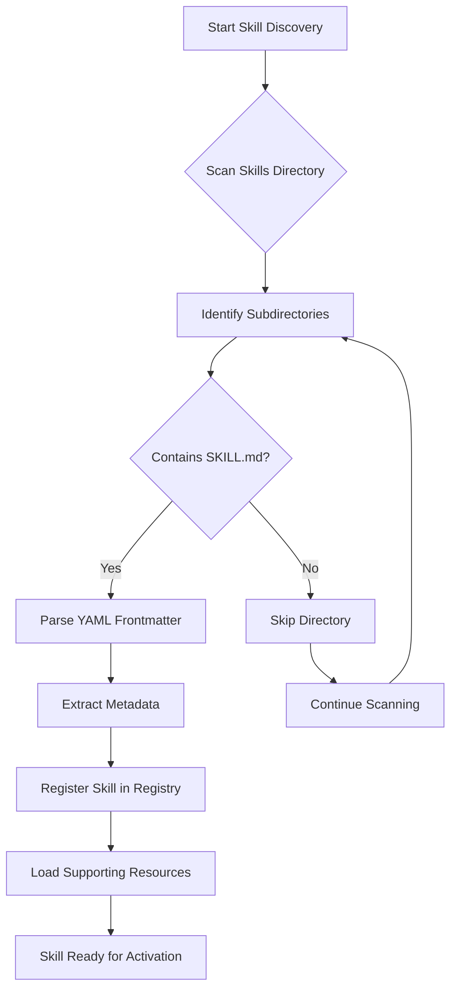
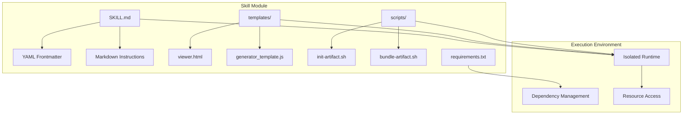
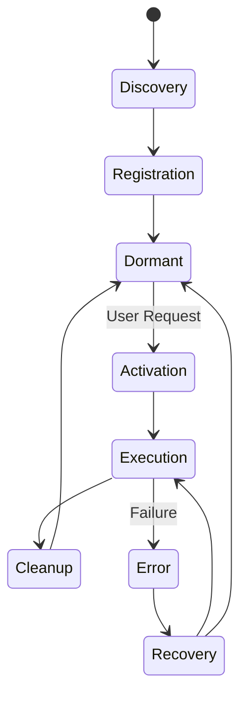
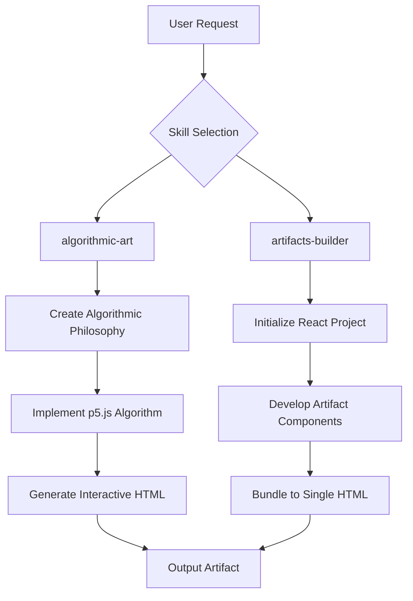
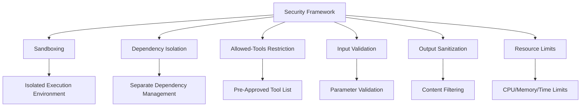

# Dynamic Skill Loading and Plugin Architecture

<cite>
**Referenced Files in This Document**   
- [README.md](file://README.md)
- [agent_skills_spec.md](file://agent_skills_spec.md)
- [algorithmic-art/SKILL.md](file://algorithmic-art/SKILL.md)
- [artifacts-builder/SKILL.md](file://artifacts-builder/SKILL.md)
- [slack-gif-creator/SKILL.md](file://slack-gif-creator/SKILL.md)
- [algorithmic-art/templates/viewer.html](file://algorithmic-art/templates/viewer.html)
- [artifacts-builder/scripts/init-artifact.sh](file://artifacts-builder/scripts/init-artifact.sh)
- [artifacts-builder/scripts/bundle-artifact.sh](file://artifacts-builder/scripts/bundle-artifact.sh)
- [slack-gif-creator/requirements.txt](file://slack-gif-creator/requirements.txt)
</cite>

## Table of Contents
1. [Introduction](#introduction)
2. [Skill Discovery and Loading Mechanism](#skill-discovery-and-loading-mechanism)
3. [Plugin Architecture and Self-Contained Modules](#plugin-architecture-and-self-contained-modules)
4. [Skill Lifecycle Management](#skill-lifecycle-management)
5. [Example Implementations](#example-implementations)
6. [Security Considerations](#security-considerations)
7. [Performance Implications](#performance-implications)
8. [Skill Management Strategies](#skill-management-strategies)
9. [Conclusion](#conclusion)

## Introduction

Claude's dynamic skill loading mechanism enables the AI system to extend its capabilities through modular, self-contained components called skills. These skills are discovered and loaded dynamically based on their presence in the skills directory, allowing Claude to adapt to specialized tasks without requiring permanent integration of all possible functionalities. This documentation details the architecture, implementation, and operational characteristics of this plugin system, focusing on how skills are discovered, loaded, and executed while maintaining security and performance.

The skill system is designed around the principle of discoverability through convention, where any directory containing a SKILL.md file is automatically recognized as a skill module. This approach enables a flexible, extensible architecture that supports a wide range of capabilities from creative applications to technical workflows.

**Section sources**
- [README.md](file://README.md#L1-L123)
- [agent_skills_spec.md](file://agent_skills_spec.md#L1-L56)

## Skill Discovery and Loading Mechanism

The dynamic skill loading mechanism operates on a simple yet powerful principle: skill discovery through the presence of SKILL.md files in designated directories. When the system scans the skills directory, it identifies potential skills by looking for folders that contain a SKILL.md file, which serves as the entrypoint and manifest for each skill module.

The loading process begins with directory traversal of the skills repository, where each subdirectory is examined for the presence of a SKILL.md file. Upon discovery, the system parses the YAML frontmatter of the SKILL.md file to extract essential metadata including the skill's name, description, license information, and optional configuration parameters. The name field in the frontmatter must match the directory name and follows hyphen-case convention, ensuring consistency between the file system structure and the skill's identifier.

The SKILL.md file structure consists of two main components: the YAML frontmatter and the Markdown body. The frontmatter contains structured metadata required for skill registration and discovery, while the Markdown body provides the instructional content that guides Claude's behavior when the skill is active. This separation allows for both machine-readable configuration and human-readable documentation within a single file.

Skills are loaded as self-contained units, with each skill directory potentially containing additional resources such as templates, scripts, and configuration files that support the skill's functionality. The system maintains a registry of available skills, mapping skill names to their respective directory paths and metadata, enabling efficient lookup and activation when specific capabilities are required.

**Diagram sources**
- [agent_skills_spec.md](file://agent_skills_spec.md#L3-L56)
- [README.md](file://README.md#L1-L123)

**Section sources**
- [agent_skills_spec.md](file://agent_skills_spec.md#L3-L56)
- [README.md](file://README.md#L1-L123)

## Plugin Architecture and Self-Contained Modules

The plugin architecture of Claude's skill system is designed around the principle of self-containment, where each skill operates as an independent module with minimal dependencies on other components. This architectural approach enables skills to be developed, tested, and deployed independently while maintaining the integrity of the overall system.

Each skill directory represents a complete functional unit that includes all necessary components for its operation. The SKILL.md file serves as the central configuration and instruction document, while additional directories within the skill module can contain templates, scripts, and other resources required for execution. This self-contained nature allows skills to be easily shared, versioned, and managed as discrete packages.

The architecture supports various types of skills with different technological stacks and implementation patterns. For example, the algorithmic-art skill uses p5.js for generative art creation, while the artifacts-builder skill leverages React, Tailwind CSS, and shadcn/ui components for complex frontend applications. Despite these differences in implementation, all skills adhere to the same interface contract defined by the SKILL.md file format, ensuring consistent integration with the host system.

Skills can include executable scripts that perform specific tasks, such as the init-artifact.sh and bundle-artifact.sh scripts in the artifacts-builder skill. These scripts are invoked as needed during the skill's execution lifecycle, allowing for complex workflows that involve multiple processing steps. The system provides appropriate execution environments for these scripts, ensuring they can access necessary dependencies and resources.

The plugin architecture also supports dependency management through files like requirements.txt, which specify the external packages needed for a skill's operation. When a skill requires specific dependencies, the system can automatically install them in isolated environments to prevent conflicts between different skills.

**Diagram sources**
- [artifacts-builder/SKILL.md](file://artifacts-builder/SKILL.md#L1-L74)
- [artifacts-builder/scripts/init-artifact.sh](file://artifacts-builder/scripts/init-artifact.sh#L1-L323)
- [artifacts-builder/scripts/bundle-artifact.sh](file://artifacts-builder/scripts/bundle-artifact.sh#L1-L54)
- [slack-gif-creator/requirements.txt](file://slack-gif-creator/requirements.txt#L1-L4)

**Section sources**
- [artifacts-builder/SKILL.md](file://artifacts-builder/SKILL.md#L1-L74)
- [slack-gif-creator/SKILL.md](file://slack-gif-creator/SKILL.md#L1-L647)

## Skill Lifecycle Management

The lifecycle of a skill in Claude's system encompasses several distinct phases from discovery to execution and eventual deactivation. This lifecycle management ensures that skills are properly initialized, configured, and executed while maintaining system stability and security.

The lifecycle begins with the discovery phase, where the system scans the skills directory for SKILL.md files and registers identified skills in its internal registry. During registration, the system validates the skill's metadata and establishes the necessary file system references for later activation. Skills remain in a dormant state in the registry until they are explicitly invoked for a specific task.

When a user request triggers the need for a particular skill, the system enters the activation phase. During activation, the skill's instructional content from the SKILL.md file is loaded into Claude's context, providing the necessary guidance for task execution. The system also initializes any required execution environments, such as setting up isolated runtimes for scripts or loading dependent libraries.

The execution phase varies depending on the specific skill and task requirements. For skills that generate artifacts, such as the algorithmic-art skill, this phase involves creating algorithmic philosophies, implementing generative algorithms, and producing interactive HTML artifacts. For skills that perform transformations, like the document-skills, the execution phase may involve parsing input files, applying modifications, and generating output in the desired format.

After execution, the system manages the cleanup phase, which includes releasing resources, removing temporary files, and updating any persistent state as needed. Skills that create long-lived artifacts, such as bundled HTML files, ensure these outputs are properly saved and made available to the user.

The lifecycle also includes mechanisms for error handling and recovery. If a skill encounters an error during execution, the system can attempt to recover by providing diagnostic information, suggesting alternative approaches, or falling back to simpler methods of accomplishing the task.

**Diagram sources**
- [algorithmic-art/SKILL.md](file://algorithmic-art/SKILL.md#L1-L405)
- [artifacts-builder/SKILL.md](file://artifacts-builder/SKILL.md#L1-L74)

**Section sources**
- [algorithmic-art/SKILL.md](file://algorithmic-art/SKILL.md#L1-L405)
- [artifacts-builder/SKILL.md](file://artifacts-builder/SKILL.md#L1-L74)

## Example Implementations

### Algorithmic Art Generation

The algorithmic-art skill demonstrates the creation of generative art using p5.js with seeded randomness and interactive parameter exploration. This skill follows a two-step process: first creating an algorithmic philosophy that defines the computational aesthetic, and then implementing this philosophy through code to produce interactive HTML artifacts.

The skill leverages templates, particularly the viewer.html file, as a foundation for generating consistent, branded artifacts. The template provides the structural and stylistic framework, including the sidebar layout, seed controls, and parameter interface, while allowing the algorithmic implementation to vary based on the specific artistic vision. This approach ensures a uniform user experience across different generative art pieces while preserving creative freedom in the underlying algorithms.

Key aspects of this implementation include seeded randomness for reproducible results, parameter controls that allow users to explore variations of the artwork, and a focus on craftsmanship in the algorithm design. The skill emphasizes creating "living algorithms" rather than static images, with beauty emerging from the execution process rather than the final frame.

**Section sources**
- [algorithmic-art/SKILL.md](file://algorithmic-art/SKILL.md#L1-L405)
- [algorithmic-art/templates/viewer.html](file://algorithmic-art/templates/viewer.html#L1-L599)

### React-Based Artifact Creation

The artifacts-builder skill illustrates how complex frontend applications can be created using modern web technologies. This skill provides a complete development environment for building elaborate HTML artifacts with React, Tailwind CSS, and shadcn/ui components.

The implementation follows a structured workflow: initializing a new project with the init-artifact.sh script, developing the artifact by editing the generated code, and bundling everything into a single HTML file with the bundle-artifact.sh script. The initialization script sets up a fully configured React project with path aliases, Tailwind CSS integration, and pre-installed shadcn/ui components, providing a robust foundation for development.

The bundling process is particularly noteworthy, as it transforms a multi-file React application into a single, self-contained HTML artifact. This is achieved through a combination of Parcel for building the application and html-inline for inlining all assets, resulting in a portable file that can be shared and viewed without requiring additional dependencies.

**Diagram sources**
- [algorithmic-art/SKILL.md](file://algorithmic-art/SKILL.md#L1-L405)
- [artifacts-builder/SKILL.md](file://artifacts-builder/SKILL.md#L1-L74)

**Section sources**
- [algorithmic-art/SKILL.md](file://algorithmic-art/SKILL.md#L1-L405)
- [artifacts-builder/SKILL.md](file://artifacts-builder/SKILL.md#L1-L74)

## Security Considerations

The dynamic skill loading system incorporates several security measures to protect the host environment while enabling powerful functionality. These considerations address potential risks associated with executing third-party code and accessing system resources.

Sandboxing is a fundamental security mechanism, where each skill executes in an isolated environment that limits its access to system resources. This isolation prevents skills from interfering with each other or accessing sensitive data outside their designated scope. The system enforces strict boundaries on file system access, network connectivity, and process execution to minimize attack surface.

Dependency isolation ensures that each skill's required packages are managed separately, preventing version conflicts and reducing the risk of malicious code injection through compromised dependencies. When a skill specifies dependencies in files like requirements.txt, these are installed in isolated environments rather than globally, maintaining the integrity of the overall system.

The allowed-tools restriction provides fine-grained control over which system tools a skill can invoke. This feature, currently supported in Claude Code, enables administrators to pre-approve specific tools for each skill, ensuring that only authorized operations can be performed. This approach balances functionality with security by allowing necessary tools while blocking potentially dangerous ones.

Additional security measures include input validation for user-provided parameters, output sanitization to prevent code injection, and resource limits to prevent denial-of-service attacks. The system also monitors skill execution for anomalous behavior and can terminate processes that exceed predefined thresholds for CPU usage, memory consumption, or execution time.

**Diagram sources**
- [agent_skills_spec.md](file://agent_skills_spec.md#L38-L40)
- [slack-gif-creator/SKILL.md](file://slack-gif-creator/SKILL.md#L641-L647)
- [slack-gif-creator/requirements.txt](file://slack-gif-creator/requirements.txt#L1-L4)

**Section sources**
- [agent_skills_spec.md](file://agent_skills_spec.md#L38-L40)
- [slack-gif-creator/SKILL.md](file://slack-gif-creator/SKILL.md#L1-L647)

## Performance Implications

The dynamic loading of skills introduces several performance considerations that affect both startup time and runtime efficiency. These implications stem from the need to discover, load, and execute modular components on demand rather than having all functionality pre-loaded.

Skill discovery and registration incur a startup cost proportional to the number of skills in the system. Each SKILL.md file must be parsed and validated, and the resulting metadata stored in the skill registry. While this process is generally fast, it can become noticeable with large numbers of skills, particularly if the files are large or complex.

Runtime performance varies significantly depending on the specific skill and task. Skills that involve complex computations, such as the algorithmic-art skill's generative algorithms, can be CPU-intensive and may require substantial processing time to produce results. Conversely, skills that primarily involve file manipulation or simple transformations typically have lower computational requirements.

The bundling process used by skills like artifacts-builder introduces additional performance considerations. Converting a multi-file React application into a single HTML artifact requires significant processing, including dependency resolution, code compilation, and asset inlining. This process can be time-consuming, particularly for large applications with many dependencies.

Memory usage is another important factor, as each skill may require its own execution environment with associated memory overhead. The system must balance the benefits of isolation with the costs of maintaining multiple runtime environments, particularly when multiple skills are used in sequence or concurrently.

To mitigate these performance implications, the system employs various optimization strategies, including caching frequently used skills, lazy loading of resources, and efficient bundling algorithms that minimize output size while maintaining functionality.

**Section sources**
- [artifacts-builder/SKILL.md](file://artifacts-builder/SKILL.md#L1-L74)
- [algorithmic-art/SKILL.md](file://algorithmic-art/SKILL.md#L1-L405)

## Skill Management Strategies

Effective management of skills requires strategies that address discoverability, versioning, dependency management, and performance optimization. These strategies ensure that the skill ecosystem remains maintainable, secure, and efficient as the number of available skills grows.

Organization by functionality is a key strategy, where skills are grouped into categories based on their purpose, such as creative applications, technical tools, or enterprise workflows. This categorization improves discoverability and helps users understand the available capabilities. The repository structure reflects this organization, with clear directory names that indicate each skill's domain.

Versioning and updates are managed through the standard file system and repository mechanisms. When a skill needs to be updated, the changes are made to the appropriate files in the skill directory, and the updated version is deployed through the same channels as the initial release. This approach leverages existing infrastructure for version control and distribution.

Dependency management follows a decentralized model, where each skill specifies its own requirements in dedicated files like requirements.txt. This allows skills to evolve independently with their own dependency trees, reducing conflicts between different modules. The system handles installation and isolation of these dependencies automatically, minimizing the administrative burden.

Performance optimization strategies include caching frequently used skills, pre-compiling templates, and implementing efficient loading mechanisms that minimize startup time. For skills that generate artifacts, optimization focuses on reducing output size while maintaining quality, such as the aggressive compression used for Slack emoji GIFs.

The system also supports meta-skills, such as the skill-creator skill, which provide guidance and tools for developing new skills. These meta-skills help maintain consistency across the skill ecosystem and lower the barrier to entry for new developers.

**Section sources**
- [README.md](file://README.md#L24-L45)
- [agent_skills_spec.md](file://agent_skills_spec.md#L51-L56)

## Conclusion

Claude's dynamic skill loading mechanism represents a sophisticated plugin architecture that enables extensible, modular functionality through self-contained skill modules. By leveraging the presence of SKILL.md files for discovery, the system creates a flexible framework for extending capabilities without tight coupling between components.

The architecture balances flexibility with security through sandboxing, dependency isolation, and allowed-tools restrictions, ensuring that skills can provide powerful functionality while maintaining system integrity. Performance considerations are addressed through efficient loading mechanisms, caching strategies, and optimization techniques that minimize the overhead of dynamic loading.

The example implementations of algorithmic art generation and React-based artifact creation demonstrate the versatility of the system, supporting both creative applications and complex technical workflows. As the skill ecosystem continues to evolve, the underlying architecture provides a solid foundation for innovation while maintaining consistency and reliability across diverse use cases.