# Skill Architecture

<cite>
**Referenced Files in This Document**
- [README.md](file://README.md)
- [agent_skills_spec.md](file://agent_skills_spec.md)
- [template-skill/SKILL.md](file://template-skill/SKILL.md)
- [skill-creator/SKILL.md](file://skill-creator/SKILL.md)
- [skill-creator/scripts/init_skill.py](file://skill-creator/scripts/init_skill.py)
- [slack-gif-creator/requirements.txt](file://slack-gif-creator/requirements.txt)
- [canvas-design/SKILL.md](file://canvas-design/SKILL.md)
- [canvas-design/canvas-fonts](file://canvas-design/canvas-fonts)
- [artifacts-builder/SKILL.md](file://artifacts-builder/SKILL.md)
- [internal-comms/SKILL.md](file://internal-comms/SKILL.md)
- [mcp-builder/SKILL.md](file://mcp-builder/SKILL.md)
- [document-skills/docx/SKILL.md](file://document-skills/docx/SKILL.md)
- [document-skills/docx/scripts](file://document-skills/docx/scripts)
- [THIRD_PARTY_NOTICES.md](file://THIRD_PARTY_NOTICES.md)
</cite>

## Table of Contents
1. [Introduction](#introduction)
2. [Project Structure](#project-structure)
3. [Core Components](#core-components)
4. [Architecture Overview](#architecture-overview)
5. [Detailed Component Analysis](#detailed-component-analysis)
6. [Dependency Analysis](#dependency-analysis)
7. [Performance Considerations](#performance-considerations)
8. [Troubleshooting Guide](#troubleshooting-guide)
9. [Conclusion](#conclusion)
10. [Appendices](#appendices)

## Introduction
This document describes the skill format and structure used by the system. A skill is a self-contained module consisting of a SKILL.md entry point, optional scripts, and resources. The SKILL.md file defines the skill’s metadata and instructions, while optional directories (scripts/, references/, assets/) provide executable code, reference materials, and output assets respectively. The Agent Skills Spec establishes the canonical requirements for a skill, including YAML frontmatter, directory layout, and optional metadata fields. This document explains how skills are organized, how metadata is defined, and how they integrate with the core AI system.

## Project Structure
The repository organizes skills as independent directories, each containing a SKILL.md file and optional resource directories. The top-level README provides an overview of example skills and usage patterns. The Agent Skills Spec defines the minimal structure and metadata requirements.

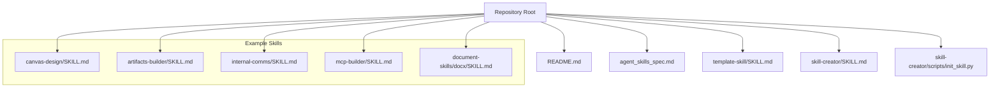

**Diagram sources**
- [README.md](file://README.md#L1-L123)
- [agent_skills_spec.md](file://agent_skills_spec.md#L1-L56)
- [template-skill/SKILL.md](file://template-skill/SKILL.md#L1-L7)
- [skill-creator/SKILL.md](file://skill-creator/SKILL.md#L1-L210)
- [skill-creator/scripts/init_skill.py](file://skill-creator/scripts/init_skill.py#L1-L304)
- [canvas-design/SKILL.md](file://canvas-design/SKILL.md#L1-L130)
- [artifacts-builder/SKILL.md](file://artifacts-builder/SKILL.md#L1-L74)
- [internal-comms/SKILL.md](file://internal-comms/SKILL.md#L1-L33)
- [mcp-builder/SKILL.md](file://mcp-builder/SKILL.md#L1-L329)
- [document-skills/docx/SKILL.md](file://document-skills/docx/SKILL.md#L1-L197)

**Section sources**
- [README.md](file://README.md#L1-L123)
- [agent_skills_spec.md](file://agent_skills_spec.md#L1-L56)

## Core Components
- SKILL.md entry point: The skill’s “entrypoint” is the SKILL.md file. It must start with YAML frontmatter followed by regular Markdown. The frontmatter defines required and optional metadata.
- Required frontmatter fields:
  - name: A hyphen-case identifier restricted to lowercase Unicode alphanumeric + hyphen, and must match the directory name.
  - description: A complete description of what the skill does and when to use it.
- Optional frontmatter fields:
  - license: The license applied to the skill.
  - allowed-tools: A list of tools pre-approved to run (currently only supported in specific clients).
  - metadata: A map from string keys to string values for client-defined properties.
- Optional resource directories:
  - scripts/: Executable code (Python/Bash/etc.) for deterministic reliability or repeated tasks.
  - references/: Documentation intended to be loaded into context as needed.
  - assets/: Files used in the final output (templates, icons, fonts, etc.), not loaded into context.
- Directory naming convention: The directory name must match the frontmatter name field.

**Section sources**
- [agent_skills_spec.md](file://agent_skills_spec.md#L17-L56)
- [template-skill/SKILL.md](file://template-skill/SKILL.md#L1-L7)
- [skill-creator/SKILL.md](file://skill-creator/SKILL.md#L25-L41)

## Architecture Overview
Skills are discovered and loaded dynamically by the core AI system. The system reads the YAML frontmatter from SKILL.md to determine when to activate a skill, then loads the Markdown body and optional resources as needed. The plugin architecture integrates skills by treating each skill directory as a module with a well-defined entry point and optional bundled resources.

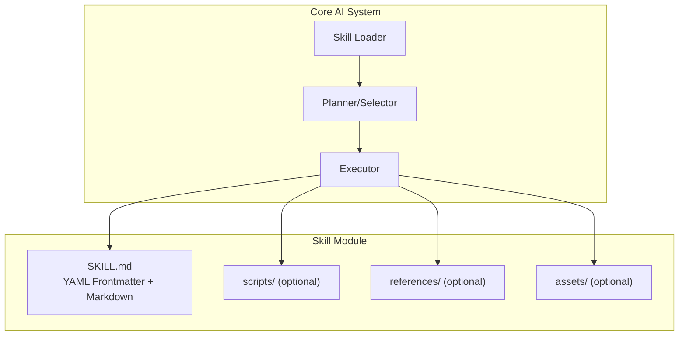

**Diagram sources**
- [agent_skills_spec.md](file://agent_skills_spec.md#L17-L56)
- [skill-creator/SKILL.md](file://skill-creator/SKILL.md#L25-L41)

## Detailed Component Analysis

### YAML Frontmatter and Metadata
The YAML frontmatter defines the skill’s identity and optional metadata. The spec requires:
- name: hyphen-case, lowercase alphanumeric + hyphen, must match directory name.
- description: purpose and usage guidance.
- Optional: license, allowed-tools, metadata.

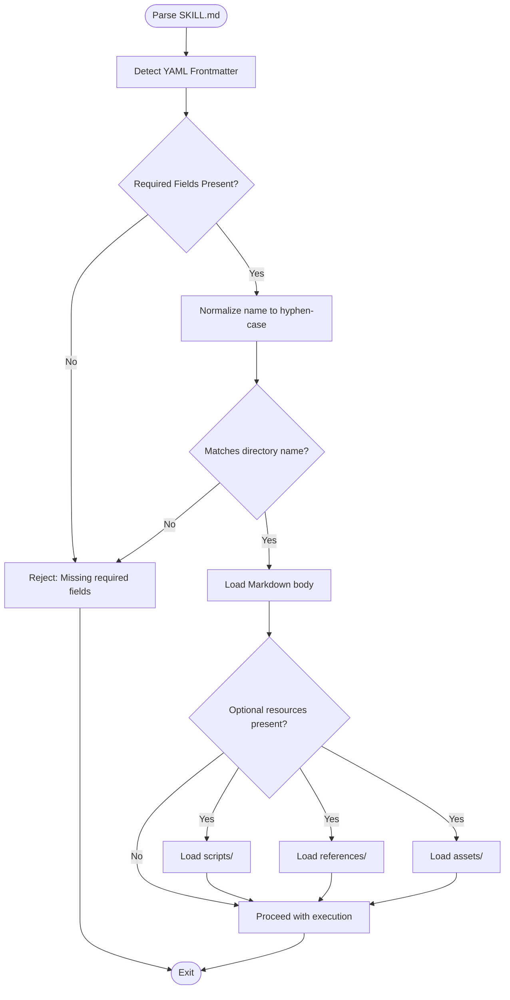

**Diagram sources**
- [agent_skills_spec.md](file://agent_skills_spec.md#L23-L44)
- [template-skill/SKILL.md](file://template-skill/SKILL.md#L1-L7)

**Section sources**
- [agent_skills_spec.md](file://agent_skills_spec.md#L23-L44)
- [template-skill/SKILL.md](file://template-skill/SKILL.md#L1-L7)

### Directory Structure Conventions and Naming Standards
- Minimal skill: directory containing SKILL.md.
- Optional directories:
  - scripts/: executable code for deterministic operations.
  - references/: reference docs loaded on demand.
  - assets/: output assets used in final artifacts.
- Directory name must equal the frontmatter name.

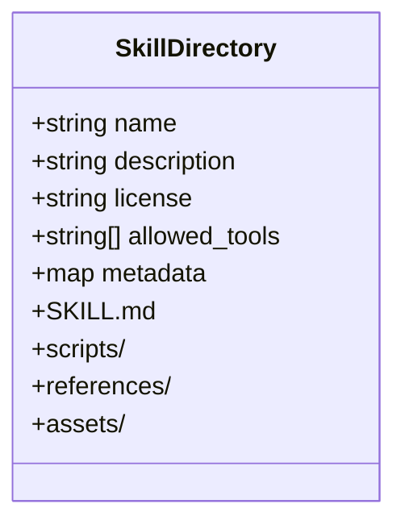

**Diagram sources**
- [agent_skills_spec.md](file://agent_skills_spec.md#L17-L56)
- [skill-creator/SKILL.md](file://skill-creator/SKILL.md#L25-L41)

**Section sources**
- [agent_skills_spec.md](file://agent_skills_spec.md#L17-L56)
- [skill-creator/SKILL.md](file://skill-creator/SKILL.md#L25-L41)

### Plugin Architecture and Dynamic Loading Mechanism
Skills are treated as modules with a well-defined entry point. The system:
- Discovers skill directories.
- Reads SKILL.md frontmatter to determine activation criteria.
- Loads Markdown body and optional resources as needed.
- Executes scripts without necessarily loading them into context, enabling deterministic reliability.

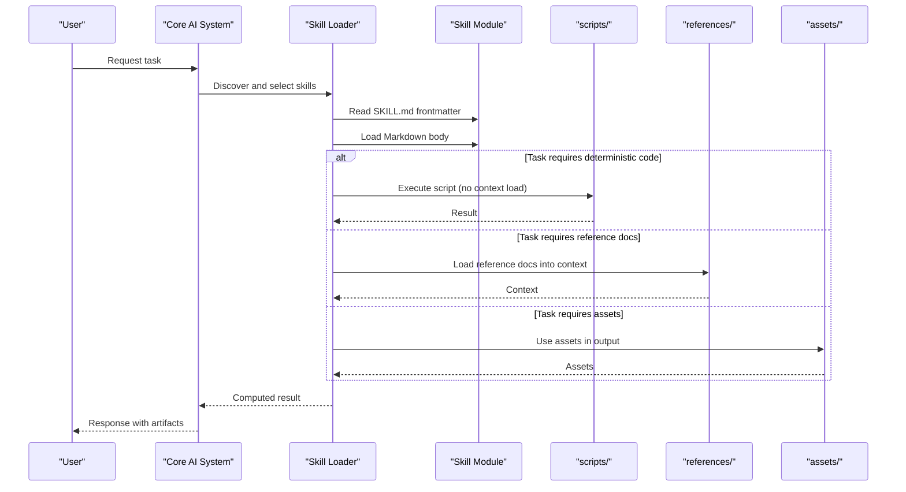

**Diagram sources**
- [agent_skills_spec.md](file://agent_skills_spec.md#L17-L56)
- [skill-creator/SKILL.md](file://skill-creator/SKILL.md#L48-L76)

**Section sources**
- [agent_skills_spec.md](file://agent_skills_spec.md#L17-L56)
- [skill-creator/SKILL.md](file://skill-creator/SKILL.md#L48-L76)

### Example Skills and Resource Patterns
- canvas-design: Uses a dedicated directory for fonts and emphasizes design philosophy and output assets.
- artifacts-builder: Provides scripts for initializing and bundling frontend artifacts.
- internal-comms: Demonstrates loading example guidelines from a references-style directory.
- mcp-builder: Guides MCP server development with reference documentation and evaluation scripts.
- document-skills/docx: Comprehensive documentation for Word document workflows, with scripts and reference materials.

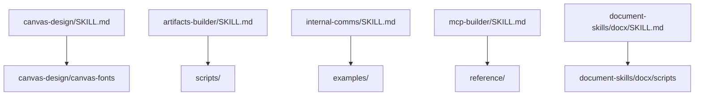

**Diagram sources**
- [canvas-design/SKILL.md](file://canvas-design/SKILL.md#L1-L130)
- [canvas-design/canvas-fonts](file://canvas-design/canvas-fonts)
- [artifacts-builder/SKILL.md](file://artifacts-builder/SKILL.md#L1-L74)
- [internal-comms/SKILL.md](file://internal-comms/SKILL.md#L1-L33)
- [mcp-builder/SKILL.md](file://mcp-builder/SKILL.md#L1-L329)
- [document-skills/docx/SKILL.md](file://document-skills/docx/SKILL.md#L1-L197)
- [document-skills/docx/scripts](file://document-skills/docx/scripts)

**Section sources**
- [canvas-design/SKILL.md](file://canvas-design/SKILL.md#L1-L130)
- [artifacts-builder/SKILL.md](file://artifacts-builder/SKILL.md#L1-L74)
- [internal-comms/SKILL.md](file://internal-comms/SKILL.md#L1-L33)
- [mcp-builder/SKILL.md](file://mcp-builder/SKILL.md#L1-L329)
- [document-skills/docx/SKILL.md](file://document-skills/docx/SKILL.md#L1-L197)

### Progressive Disclosure and Context Efficiency
Skills employ a three-level loading system:
- Metadata (name + description) always in context (~100 words).
- SKILL.md body when skill triggers (<5k words).
- Bundled resources as needed (unlimited because scripts can be executed without reading into context).

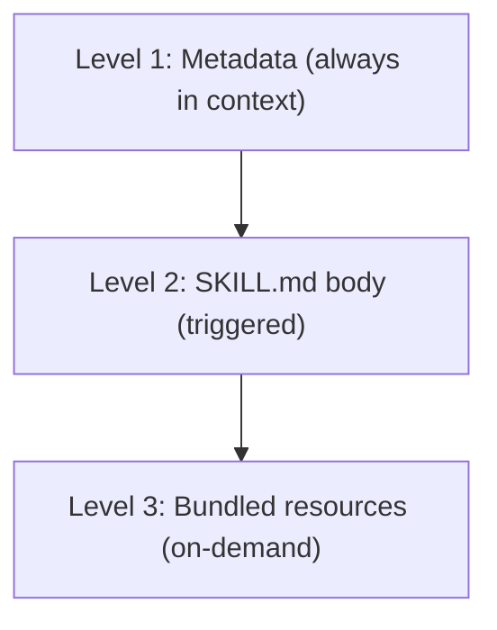

**Diagram sources**
- [skill-creator/SKILL.md](file://skill-creator/SKILL.md#L77-L86)

**Section sources**
- [skill-creator/SKILL.md](file://skill-creator/SKILL.md#L77-L86)

### Licensing and Third-Party Notices
- Each skill may include a license reference in SKILL.md frontmatter and a LICENSE.txt file in the directory.
- The repository includes a THIRD_PARTY_NOTICES.md file enumerating third-party licenses used across example skills.

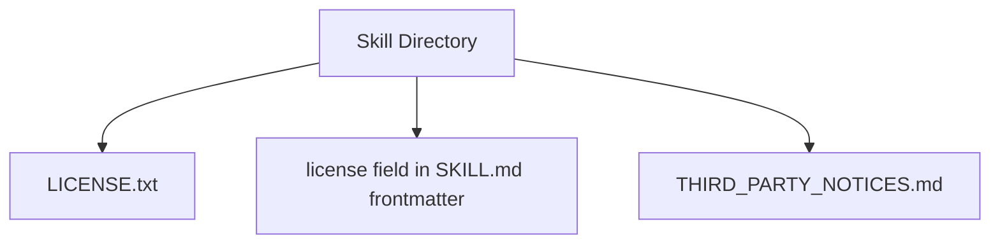

**Diagram sources**
- [document-skills/docx/SKILL.md](file://document-skills/docx/SKILL.md#L1-L5)
- [THIRD_PARTY_NOTICES.md](file://THIRD_PARTY_NOTICES.md#L1-L405)

**Section sources**
- [document-skills/docx/SKILL.md](file://document-skills/docx/SKILL.md#L1-L5)
- [THIRD_PARTY_NOTICES.md](file://THIRD_PARTY_NOTICES.md#L1-L405)

## Dependency Analysis
- Script dependencies: Some skills declare runtime dependencies (e.g., Pillow, imageio, numpy).
- Reference documentation: Skills often rely on reference materials loaded into context.
- Asset usage: Output assets are used without loading into context.

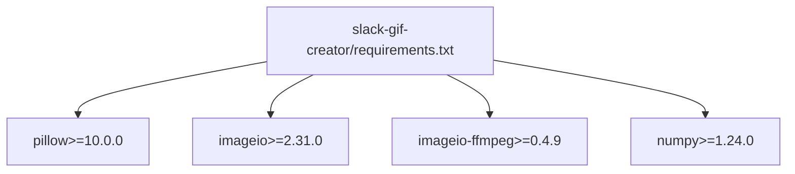

**Diagram sources**
- [slack-gif-creator/requirements.txt](file://slack-gif-creator/requirements.txt#L1-L4)

**Section sources**
- [slack-gif-creator/requirements.txt](file://slack-gif-reator/requirements.txt#L1-L4)

## Performance Considerations
- Deterministic execution: Scripts can be executed without loading into context, reducing token overhead.
- Context efficiency: Progressive disclosure ensures only necessary content is loaded.
- Resource organization: Keeping assets separate from documentation avoids bloating the context window.

[No sources needed since this section provides general guidance]

## Troubleshooting Guide
- Validation and packaging: The skill-creator includes a script to initialize, validate, and package skills. It checks YAML frontmatter format, naming conventions, and directory structure.
- Common issues:
  - Missing required frontmatter fields.
  - Directory name mismatch with frontmatter name.
  - Misplaced or missing SKILL.md.
  - Incorrect resource organization.

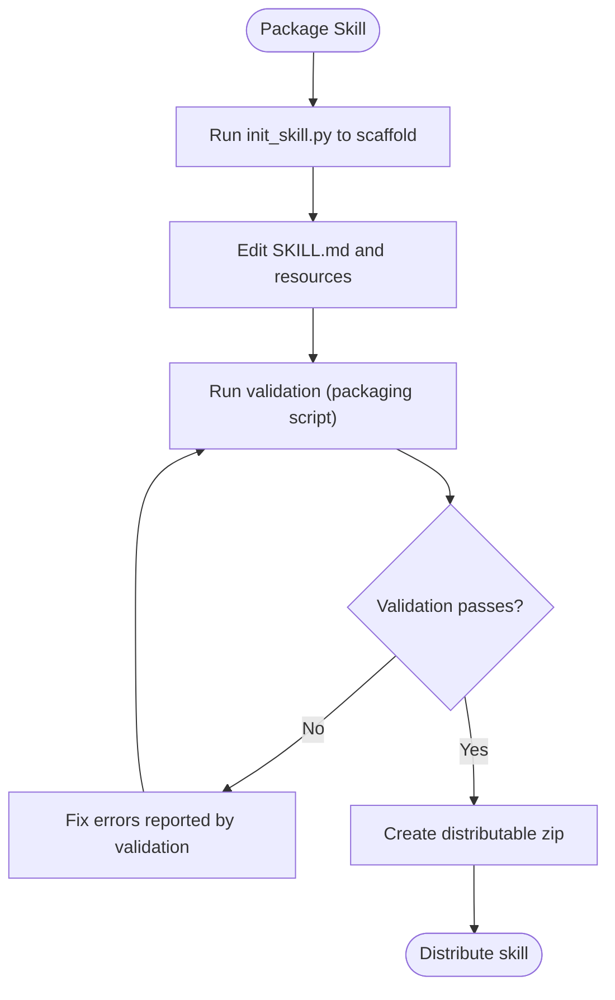

**Diagram sources**
- [skill-creator/SKILL.md](file://skill-creator/SKILL.md#L175-L201)
- [skill-creator/scripts/init_skill.py](file://skill-creator/scripts/init_skill.py#L1-L304)

**Section sources**
- [skill-creator/SKILL.md](file://skill-creator/SKILL.md#L175-L201)
- [skill-creator/scripts/init_skill.py](file://skill-creator/scripts/init_skill.py#L1-L304)

## Conclusion
Skills are modular, self-contained units defined by a SKILL.md entry point and optional resources. The YAML frontmatter specifies required and optional metadata, while scripts, references, and assets provide deterministic execution, context-aware guidance, and output assets respectively. The plugin architecture treats each skill directory as a module, enabling dynamic discovery and selective loading. Licensing and third-party notices ensure transparency and compliance. The example skills demonstrate best practices for structuring complex workflows, managing dependencies, and optimizing performance through progressive disclosure.

[No sources needed since this section summarizes without analyzing specific files]

## Appendices

### Appendix A: Minimal Skill Example
- A minimal skill directory contains only SKILL.md with YAML frontmatter and Markdown content.

**Section sources**
- [agent_skills_spec.md](file://agent_skills_spec.md#L7-L15)
- [template-skill/SKILL.md](file://template-skill/SKILL.md#L1-L7)

### Appendix B: System Context Diagram
This diagram shows how skills interact with the core AI system during execution.

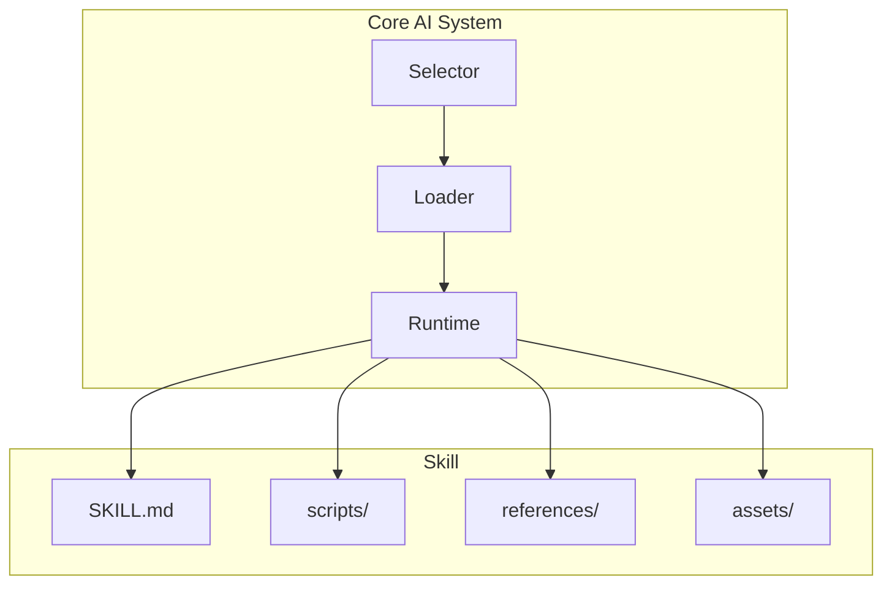

**Diagram sources**
- [agent_skills_spec.md](file://agent_skills_spec.md#L17-L56)
- [skill-creator/SKILL.md](file://skill-creator/SKILL.md#L25-L41)