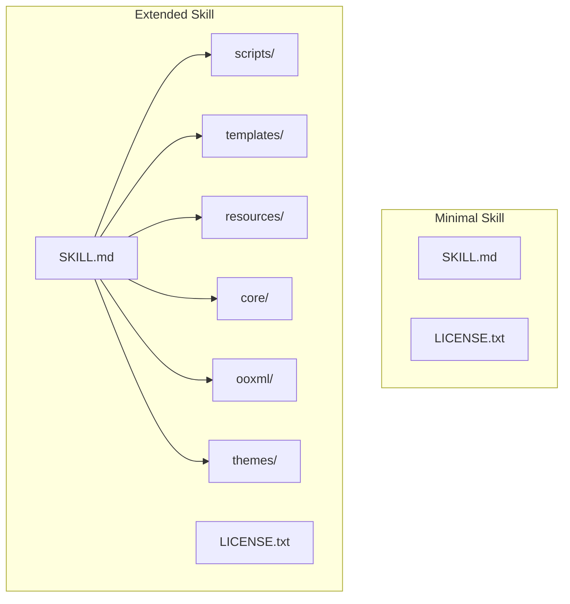
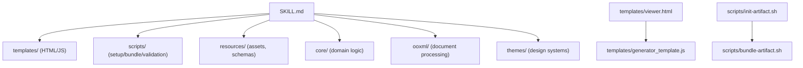
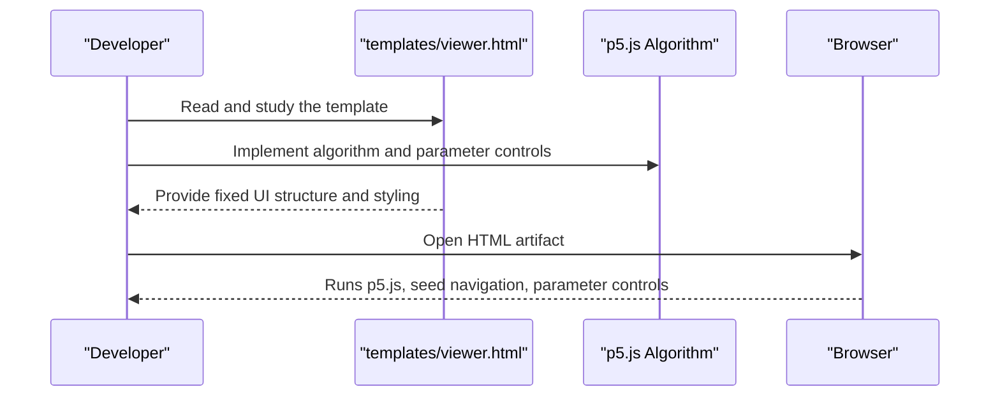
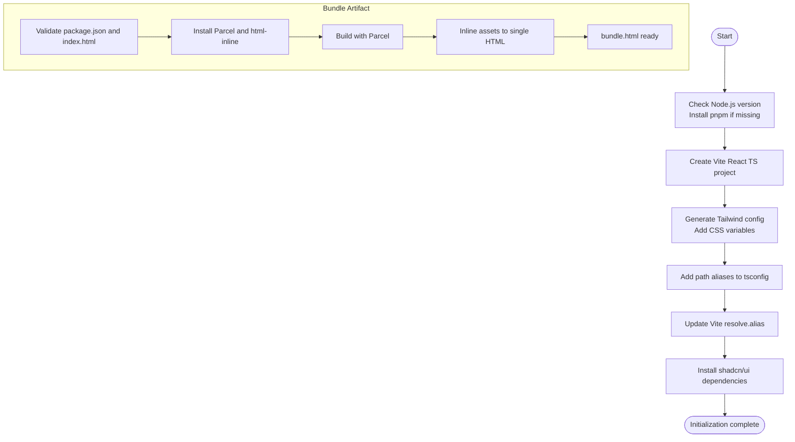
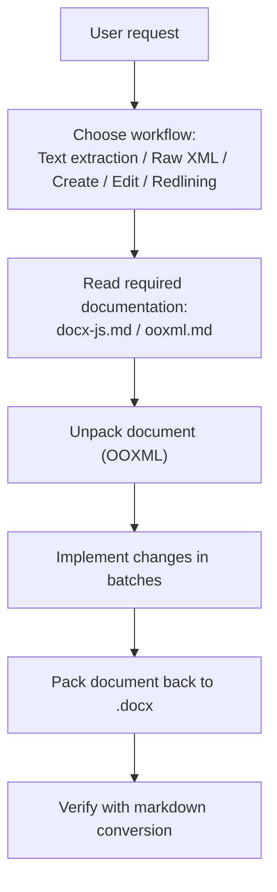
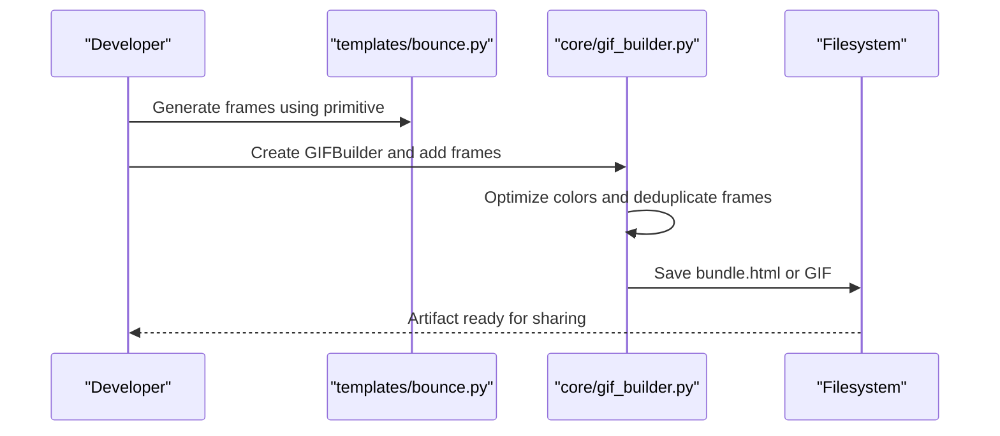
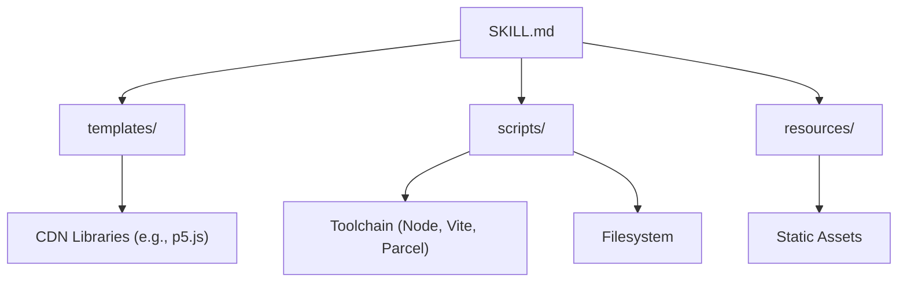

# Skill Directory Layout and Conventions

<cite>
**Referenced Files in This Document**
- [algorithmic-art/SKILL.md](file://algorithmic-art/SKILL.md)
- [algorithmic-art/templates/viewer.html](file://algorithmic-art/templates/viewer.html)
- [algorithmic-art/templates/generator_template.js](file://algorithmic-art/templates/generator_template.js)
- [artifacts-builder/SKILL.md](file://artifacts-builder/SKILL.md)
- [artifacts-builder/scripts/init-artifact.sh](file://artifacts-builder/scripts/init-artifact.sh)
- [artifacts-builder/scripts/bundle-artifact.sh](file://artifacts-builder/scripts/bundle-artifact.sh)
- [document-skills/docx/SKILL.md](file://document-skills/docx/SKILL.md)
- [document-skills/docx/docx-js.md](file://document-skills/docx/docx-js.md)
- [document-skills/docx/ooxml.md](file://document-skills/docx/ooxml.md)
- [slack-gif-creator/SKILL.md](file://slack-gif-creator/SKILL.md)
- [slack-gif-creator/core/gif_builder.py](file://slack-gif-creator/core/gif_builder.py)
- [slack-gif-creator/templates/bounce.py](file://slack-gif-creator/templates/bounce.py)
</cite>

## Table of Contents
1. [Introduction](#introduction)
2. [Project Structure](#project-structure)
3. [Core Components](#core-components)
4. [Architecture Overview](#architecture-overview)
5. [Detailed Component Analysis](#detailed-component-analysis)
6. [Dependency Analysis](#dependency-analysis)
7. [Performance Considerations](#performance-considerations)
8. [Troubleshooting Guide](#troubleshooting-guide)
9. [Conclusion](#conclusion)
10. [Appendices](#appendices)

## Introduction
This document defines the minimal and extended skill directory layouts and explains how to organize skills for clarity, reuse, and maintainability. It focuses on:
- The mandatory entry point file SKILL.md
- Optional components such as scripts, templates, and resources
- Naming conventions and file placement best practices
- How directory structure supports artifact generation and document processing
- Examples from algorithmic-art (templates) and artifacts-builder (shell scripts)

The goal is to enable developers to create new skills that are consistent, predictable, and easy to extend.

## Project Structure
A typical skill directory follows a minimal layout with a mandatory entry point and optional subdirectories. Extended layouts add scripts, templates, and resource directories to support complex workflows.

- Minimal layout
  - SKILL.md (mandatory)
  - LICENSE.txt (recommended)
  - Optional: README.md or other documentation files

- Extended layout
  - SKILL.md (mandatory)
  - LICENSE.txt (recommended)
  - scripts/ (optional)
  - templates/ (optional)
  - resources/ (optional)
  - Other domain-specific directories (e.g., core/, ooxml/, themes/)

Examples:
- algorithmic-art demonstrates a templates/ directory with viewer.html and generator_template.js
- artifacts-builder demonstrates a scripts/ directory with init-artifact.sh and bundle-artifact.sh
- document-skills/docx includes domain-specific documentation and scripts for OOXML processing
- slack-gif-creator organizes core logic and reusable animation templates

**Section sources**
- [algorithmic-art/SKILL.md](file://algorithmic-art/SKILL.md#L1-L405)
- [artifacts-builder/SKILL.md](file://artifacts-builder/SKILL.md#L1-L74)
- [document-skills/docx/SKILL.md](file://document-skills/docx/SKILL.md#L1-L197)
- [slack-gif-creator/SKILL.md](file://slack-gif-creator/SKILL.md#L1-L647)

## Core Components
- SKILL.md: The mandatory entry point that defines the skill’s purpose, capabilities, and operational guidance. It also declares the license and can include quick-start steps, design guidelines, and references to supporting files.
- scripts/: Shell or Python scripts that automate setup, packaging, validation, or artifact generation.
- templates/: Reusable starting points for artifacts or code scaffolding (e.g., HTML templates, JS patterns).
- resources/: Static assets such as fonts, icons, or schema files used by the skill.
- domain-specific directories: e.g., core/, ooxml/, themes/ for specialized libraries or data.

Best practices:
- Place SKILL.md at the root for discoverability.
- Keep scripts executable and documented with clear usage in SKILL.md.
- Treat templates as immutable starting points; developers customize only the variable sections.
- Use descriptive subdirectory names aligned with the skill’s domain.

**Section sources**
- [algorithmic-art/SKILL.md](file://algorithmic-art/SKILL.md#L1-L405)
- [artifacts-builder/SKILL.md](file://artifacts-builder/SKILL.md#L1-L74)
- [document-skills/docx/SKILL.md](file://document-skills/docx/SKILL.md#L1-L197)
- [slack-gif-creator/SKILL.md](file://slack-gif-creator/SKILL.md#L1-L647)

## Architecture Overview
The skill architecture centers on a clear separation of concerns:
- Entry point (SKILL.md) defines intent and process
- Templates provide a fixed, branded baseline for artifacts
- Scripts orchestrate setup, bundling, and validation
- Resources supply auxiliary assets
- Domain-specific modules encapsulate reusable logic

**Diagram sources**
- [algorithmic-art/SKILL.md](file://algorithmic-art/SKILL.md#L1-L405)
- [algorithmic-art/templates/viewer.html](file://algorithmic-art/templates/viewer.html#L1-L599)
- [algorithmic-art/templates/generator_template.js](file://algorithmic-art/templates/generator_template.js#L1-L223)
- [artifacts-builder/SKILL.md](file://artifacts-builder/SKILL.md#L1-L74)
- [artifacts-builder/scripts/init-artifact.sh](file://artifacts-builder/scripts/init-artifact.sh#L1-L323)
- [artifacts-builder/scripts/bundle-artifact.sh](file://artifacts-builder/scripts/bundle-artifact.sh#L1-L54)
- [document-skills/docx/SKILL.md](file://document-skills/docx/SKILL.md#L1-L197)
- [slack-gif-creator/SKILL.md](file://slack-gif-creator/SKILL.md#L1-L647)

## Detailed Component Analysis

### Minimal Layout: Entry Point and Licensing
- SKILL.md
  - Purpose: Declares the skill name, description, and license reference
  - Guidance: Provides quick-start steps and design guidelines
  - Example references: See algorithmic-art and artifacts-builder for practical patterns
- LICENSE.txt
  - Purpose: Defines licensing terms for reuse and distribution
  - Recommendation: Include a standard license file alongside SKILL.md

**Section sources**
- [algorithmic-art/SKILL.md](file://algorithmic-art/SKILL.md#L1-L405)
- [artifacts-builder/SKILL.md](file://artifacts-builder/SKILL.md#L1-L74)

### Extended Layout: Templates for Interactive Artifacts
The templates directory provides a fixed, branded baseline for interactive HTML artifacts. Developers customize only the variable sections while keeping the fixed structure intact.

Key elements:
- templates/viewer.html
  - Fixed structure: header, sidebar, main canvas area
  - Fixed branding: colors, fonts, layout
  - Fixed seed navigation section
  - Variable sections: p5.js algorithm, parameters, UI controls
- templates/generator_template.js
  - Best-practice patterns for parameter organization, seeded randomness, lifecycle, classes, performance, utilities, and exports

**Diagram sources**
- [algorithmic-art/templates/viewer.html](file://algorithmic-art/templates/viewer.html#L1-L599)
- [algorithmic-art/templates/generator_template.js](file://algorithmic-art/templates/generator_template.js#L1-L223)

**Section sources**
- [algorithmic-art/templates/viewer.html](file://algorithmic-art/templates/viewer.html#L1-L599)
- [algorithmic-art/templates/generator_template.js](file://algorithmic-art/templates/generator_template.js#L1-L223)
- [algorithmic-art/SKILL.md](file://algorithmic-art/SKILL.md#L1-L405)

### Extended Layout: Scripts for Artifact Generation
The scripts directory automates complex artifact generation and bundling workflows.

Patterns:
- init-artifact.sh
  - Detects Node.js version and pins Vite accordingly
  - Installs Tailwind CSS, shadcn/ui, and related dependencies
  - Creates Tailwind and PostCSS configuration
  - Adds path aliases and Vite configuration
- bundle-artifact.sh
  - Validates project structure (package.json, index.html)
  - Installs bundling dependencies (Parcel, html-inline)
  - Builds with Parcel and inlines assets into a single HTML artifact

**Diagram sources**
- [artifacts-builder/scripts/init-artifact.sh](file://artifacts-builder/scripts/init-artifact.sh#L1-L323)
- [artifacts-builder/scripts/bundle-artifact.sh](file://artifacts-builder/scripts/bundle-artifact.sh#L1-L54)

**Section sources**
- [artifacts-builder/scripts/init-artifact.sh](file://artifacts-builder/scripts/init-artifact.sh#L1-L323)
- [artifacts-builder/scripts/bundle-artifact.sh](file://artifacts-builder/scripts/bundle-artifact.sh#L1-L54)
- [artifacts-builder/SKILL.md](file://artifacts-builder/SKILL.md#L1-L74)

### Extended Layout: Document Processing Workflows
The document-skills/docx skill demonstrates a structured approach to document creation and editing, with domain-specific documentation and scripts.

Key elements:
- SKILL.md
  - Workflow decision tree for reading, creating, editing, and redlining
  - References to docx-js.md and ooxml.md for detailed guidance
- docx-js.md
  - Professional formatting, lists, tables, links, images, headers/footers, and constants
- ooxml.md
  - XML patterns for lists, tables, layout, images, hyperlinks, tracked changes, and DOM manipulation

**Diagram sources**
- [document-skills/docx/SKILL.md](file://document-skills/docx/SKILL.md#L1-L197)
- [document-skills/docx/docx-js.md](file://document-skills/docx/docx-js.md#L50-L350)
- [document-skills/docx/ooxml.md](file://document-skills/docx/ooxml.md#L50-L610)

**Section sources**
- [document-skills/docx/SKILL.md](file://document-skills/docx/SKILL.md#L1-L197)
- [document-skills/docx/docx-js.md](file://document-skills/docx/docx-js.md#L50-L350)
- [document-skills/docx/ooxml.md](file://document-skills/docx/ooxml.md#L50-L610)

### Extended Layout: Animation Toolkit with Primitives
The slack-gif-creator skill organizes core logic and reusable animation templates, plus validators and helpers.

Key elements:
- SKILL.md
  - Slack requirements (message vs emoji GIFs)
  - Toolkit structure: validators, animation primitives, helpers
- core/gif_builder.py
  - Optimizes colors, deduplicates frames, resizes for emoji mode, saves GIF
- templates/bounce.py
  - Example primitive animation (bounce) with configurable parameters

**Diagram sources**
- [slack-gif-creator/SKILL.md](file://slack-gif-creator/SKILL.md#L1-L647)
- [slack-gif-creator/core/gif_builder.py](file://slack-gif-creator/core/gif_builder.py#L50-L246)
- [slack-gif-creator/templates/bounce.py](file://slack-gif-creator/templates/bounce.py#L50-L106)

**Section sources**
- [slack-gif-creator/SKILL.md](file://slack-gif-creator/SKILL.md#L1-L647)
- [slack-gif-creator/core/gif_builder.py](file://slack-gif-creator/core/gif_builder.py#L50-L246)
- [slack-gif-creator/templates/bounce.py](file://slack-gif-creator/templates/bounce.py#L50-L106)

## Dependency Analysis
- Coupling
  - SKILL.md orchestrates dependencies on scripts, templates, and resources
  - Templates depend on fixed UI structure; customization is limited to variable sections
  - Scripts depend on Node.js ecosystem and toolchains (Vite, Parcel, Tailwind)
- Cohesion
  - Templates and scripts are cohesive around artifact generation and UI consistency
  - Domain-specific directories (core, ooxml, themes) encapsulate related logic
- External dependencies
  - Web artifacts rely on CDN-hosted libraries (e.g., p5.js)
  - Bundling relies on Parcel and html-inline
  - Document processing relies on Python libraries and OOXML standards

**Diagram sources**
- [algorithmic-art/SKILL.md](file://algorithmic-art/SKILL.md#L1-L405)
- [artifacts-builder/SKILL.md](file://artifacts-builder/SKILL.md#L1-L74)
- [document-skills/docx/SKILL.md](file://document-skills/docx/SKILL.md#L1-L197)
- [slack-gif-creator/SKILL.md](file://slack-gif-creator/SKILL.md#L1-L647)

**Section sources**
- [algorithmic-art/SKILL.md](file://algorithmic-art/SKILL.md#L1-L405)
- [artifacts-builder/SKILL.md](file://artifacts-builder/SKILL.md#L1-L74)
- [document-skills/docx/SKILL.md](file://document-skills/docx/SKILL.md#L1-L197)
- [slack-gif-creator/SKILL.md](file://slack-gif-creator/SKILL.md#L1-L647)

## Performance Considerations
- Templates
  - Keep fixed UI structure minimal and efficient; avoid heavy client-side frameworks when a single HTML artifact is required
- Scripts
  - Prefer inlining assets for single-file artifacts to reduce network overhead
  - Deduplicate frames and reduce color depth for GIFs to minimize file size
- Document processing
  - Use batched changes and minimal edits to preserve document integrity and reduce processing time
  - Validate early and often to catch issues before large transformations

[No sources needed since this section provides general guidance]

## Troubleshooting Guide
- Templates
  - If the interactive artifact does not behave as expected, verify that only the variable sections were modified and the fixed structure remains intact
- Scripts
  - For bundling failures, ensure package.json and index.html exist and are valid
  - For Node.js version mismatches, follow init-artifact.sh guidance to pin compatible Vite versions
- Document processing
  - For tracked changes issues, follow ooxml.md patterns for minimal edits and nested deletions
  - Validate with markdown conversion to confirm changes were applied correctly
- GIFs
  - If size exceeds Slack limits, reduce frames, colors, or dimensions; use emoji mode aggressively for emoji GIFs

**Section sources**
- [algorithmic-art/templates/viewer.html](file://algorithmic-art/templates/viewer.html#L1-L599)
- [artifacts-builder/scripts/bundle-artifact.sh](file://artifacts-builder/scripts/bundle-artifact.sh#L1-L54)
- [artifacts-builder/scripts/init-artifact.sh](file://artifacts-builder/scripts/init-artifact.sh#L1-L323)
- [document-skills/docx/ooxml.md](file://document-skills/docx/ooxml.md#L50-L610)
- [slack-gif-creator/core/gif_builder.py](file://slack-gif-creator/core/gif_builder.py#L50-L246)

## Conclusion
A well-defined skill directory layout improves reuse, maintainability, and clarity:
- SKILL.md is the single source of truth for intent and process
- Templates provide a fixed, branded baseline for artifacts
- Scripts automate setup and packaging
- Resources supply auxiliary assets
- Domain-specific directories encapsulate reusable logic

Adopting these conventions ensures consistent developer experiences across diverse skills such as generative art, frontend artifact creation, document processing, and animation toolkits.

[No sources needed since this section summarizes without analyzing specific files]

## Appendices

### Naming Conventions and File Placement
- Entry point: SKILL.md at the root
- Scripts: scripts/ with descriptive names (e.g., init-artifact.sh, bundle-artifact.sh)
- Templates: templates/ with clear baselines (e.g., viewer.html, generator_template.js)
- Resources: resources/ for static assets
- Domain-specific: core/, ooxml/, themes/, etc.

**Section sources**
- [algorithmic-art/SKILL.md](file://algorithmic-art/SKILL.md#L1-L405)
- [artifacts-builder/SKILL.md](file://artifacts-builder/SKILL.md#L1-L74)
- [document-skills/docx/SKILL.md](file://document-skills/docx/SKILL.md#L1-L197)
- [slack-gif-creator/SKILL.md](file://slack-gif-creator/SKILL.md#L1-L647)