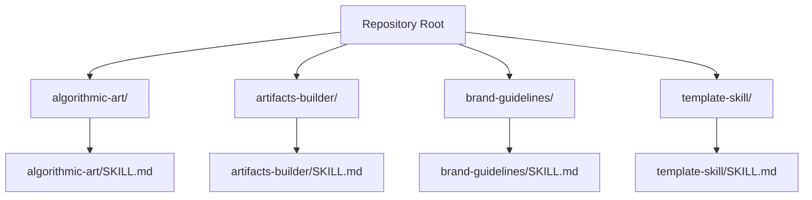
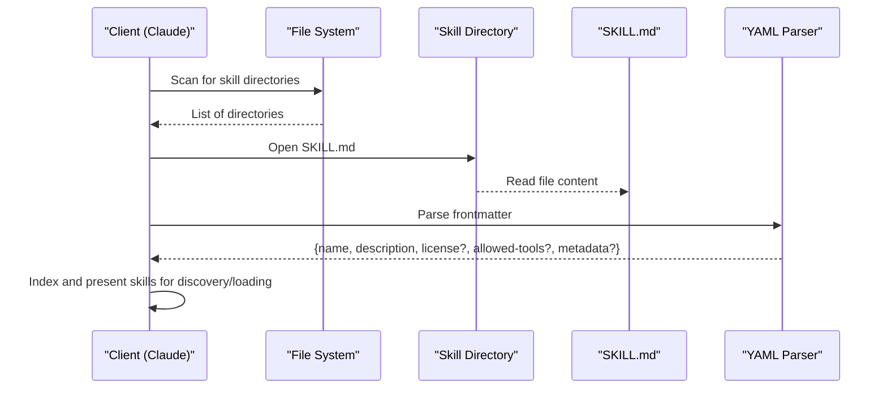
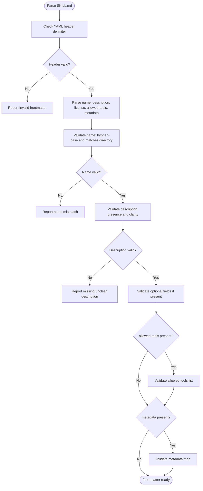
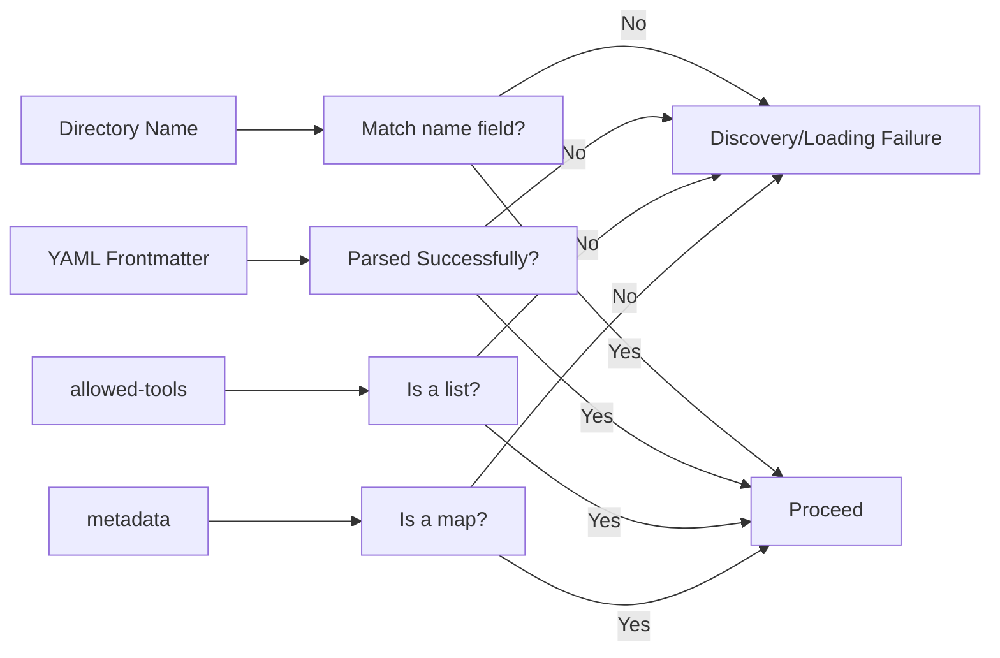

# Skill Metadata and YAML Frontmatter

<cite>
**Referenced Files in This Document**
- [agent_skills_spec.md](file://agent_skills_spec.md)
- [README.md](file://README.md)
- [template-skill/SKILL.md](file://template-skill/SKILL.md)
- [algorithmic-art/SKILL.md](file://algorithmic-art/SKILL.md)
- [artifacts-builder/SKILL.md](file://artifacts-builder/SKILL.md)
- [brand-guidelines/SKILL.md](file://brand-guidelines/SKILL.md)
</cite>

## Table of Contents
1. [Introduction](#introduction)
2. [Project Structure](#project-structure)
3. [Core Components](#core-components)
4. [Architecture Overview](#architecture-overview)
5. [Detailed Component Analysis](#detailed-component-analysis)
6. [Dependency Analysis](#dependency-analysis)
7. [Performance Considerations](#performance-considerations)
8. [Troubleshooting Guide](#troubleshooting-guide)
9. [Conclusion](#conclusion)

## Introduction
This document explains the skill metadata system centered on the YAML frontmatter in SKILL.md files. It covers the required and optional fields, their constraints, and how clients (notably Claude) use this metadata for skill discovery and loading. It also provides validation guidelines, common errors to avoid, and how metadata integrates with the broader skill architecture and tool permissions.

## Project Structure
Each skill is a directory containing a SKILL.md file. The SKILL.md file must start with a YAML frontmatter followed by Markdown content. The frontmatter defines the skill’s identity and optional metadata used by clients.

**Diagram sources**
- [README.md](file://README.md#L1-L123)
- [agent_skills_spec.md](file://agent_skills_spec.md#L1-L56)

**Section sources**
- [README.md](file://README.md#L1-L123)
- [agent_skills_spec.md](file://agent_skills_spec.md#L1-L56)

## Core Components
The YAML frontmatter in SKILL.md defines:
- Required fields
  - name: Unique identifier for the skill; must be in hyphen-case and match the directory name.
  - description: A clear description of what the skill does and when to use it.
- Optional fields
  - license: Short description or filename indicating the license.
  - allowed-tools: Pre-approved tool list (currently supported in Claude Code).
  - metadata: A map of string keys to string values for client-defined properties.

Constraints and rules:
- name must be lowercase Unicode alphanumeric with hyphens only and must exactly match the directory name.
- description should clearly describe the skill’s purpose and usage triggers.
- license is optional; if used, keep it short (e.g., a license name or a bundled license file name).
- allowed-tools is optional and currently supported in Claude Code.
- metadata is optional and allows storing additional properties not defined by the spec.

Examples from actual skills:
- algorithmic-art: name is hyphen-case and matches the directory name; description explains the skill’s purpose and usage.
- artifacts-builder: includes name, description, and license; demonstrates optional fields.
- brand-guidelines: includes name, description, and license; concise description suitable for discovery.

Validation guidelines:
- Ensure the frontmatter is valid YAML and begins with a triple-dash marker.
- Ensure name is hyphen-case and matches the directory name.
- Ensure description is present and meaningful.
- If using allowed-tools or metadata, ensure they are valid lists or maps respectively.

Common errors to avoid:
- Mismatch between name and directory name.
- Using uppercase letters or underscores in name.
- Omitting description.
- Incorrect YAML indentation or malformed frontmatter.
- Using allowed-tools or metadata in unsupported clients.

**Section sources**
- [agent_skills_spec.md](file://agent_skills_spec.md#L1-L56)
- [template-skill/SKILL.md](file://template-skill/SKILL.md#L1-L7)
- [algorithmic-art/SKILL.md](file://algorithmic-art/SKILL.md#L1-L5)
- [artifacts-builder/SKILL.md](file://artifacts-builder/SKILL.md#L1-L5)
- [brand-guidelines/SKILL.md](file://brand-guidelines/SKILL.md#L1-L5)

## Architecture Overview
The skill discovery and loading pipeline relies on SKILL.md’s frontmatter to identify and classify skills. Clients parse the frontmatter to:
- Recognize the skill entrypoint (SKILL.md).
- Extract name and description for discovery and selection.
- Optionally read license, allowed-tools, and metadata for permission and customization.

**Diagram sources**
- [agent_skills_spec.md](file://agent_skills_spec.md#L1-L56)
- [README.md](file://README.md#L1-L123)

## Detailed Component Analysis

### YAML Frontmatter Fields and Constraints
- name
  - Purpose: Unique identifier for the skill.
  - Format: hyphen-case; lowercase Unicode alphanumeric with hyphens only.
  - Constraint: Must match the directory name exactly.
  - Validation: Compare directory name to name field; ensure no uppercase or underscores.
- description
  - Purpose: Explains what the skill does and when to use it.
  - Validation: Presence and clarity; avoid vague phrasing.
- license (optional)
  - Purpose: Indicates the license applied to the skill.
  - Recommendation: Keep it short (e.g., a license name or a bundled license file name).
- allowed-tools (optional)
  - Purpose: Pre-approved tool list for the skill.
  - Scope: Currently supported in Claude Code.
  - Validation: Ensure it is a list of tool identifiers.
- metadata (optional)
  - Purpose: Client-defined key/value pairs for additional properties.
  - Guidance: Use reasonably unique keys to avoid conflicts.

Examples from repository:
- algorithmic-art: Demonstrates required fields and a clear description.
- artifacts-builder: Demonstrates optional license and structured instructions.
- brand-guidelines: Demonstrates required fields and concise description.

**Diagram sources**
- [agent_skills_spec.md](file://agent_skills_spec.md#L1-L56)
- [algorithmic-art/SKILL.md](file://algorithmic-art/SKILL.md#L1-L5)
- [artifacts-builder/SKILL.md](file://artifacts-builder/SKILL.md#L1-L5)
- [brand-guidelines/SKILL.md](file://brand-guidelines/SKILL.md#L1-L5)

**Section sources**
- [agent_skills_spec.md](file://agent_skills_spec.md#L1-L56)
- [algorithmic-art/SKILL.md](file://algorithmic-art/SKILL.md#L1-L5)
- [artifacts-builder/SKILL.md](file://artifacts-builder/SKILL.md#L1-L5)
- [brand-guidelines/SKILL.md](file://brand-guidelines/SKILL.md#L1-L5)

### Discovery and Loading Behavior
- Discovery: Clients scan directories for SKILL.md and parse the frontmatter to index skills.
- Loading: The frontmatter informs selection and permission handling (e.g., allowed-tools).
- Client differences:
  - allowed-tools is currently supported in Claude Code.
  - metadata is client-defined and can be used for additional properties not defined by the spec.

Integration points:
- Directory name must match name in frontmatter.
- description helps users select the correct skill.
- license informs legal usage.
- allowed-tools restricts tool usage to pre-approved sets.
- metadata enables customization and extension by clients.

**Section sources**
- [agent_skills_spec.md](file://agent_skills_spec.md#L1-L56)
- [README.md](file://README.md#L1-L123)

### Practical Examples and Usage
- algorithmic-art
  - name: hyphen-case and matches directory.
  - description: Explains generative art use cases and copyright considerations.
  - license: Included for legal clarity.
- artifacts-builder
  - name: hyphen-case and matches directory.
  - description: Explains building complex HTML artifacts with modern frontend technologies.
  - license: Included for legal clarity.
- brand-guidelines
  - name: hyphen-case and matches directory.
  - description: Applies Anthropic’s brand colors and typography.
  - license: Included for legal clarity.

Validation tips:
- Confirm directory name equals name in frontmatter.
- Ensure description is present and actionable.
- Verify optional fields are correctly formatted if used.

**Section sources**
- [algorithmic-art/SKILL.md](file://algorithmic-art/SKILL.md#L1-L5)
- [artifacts-builder/SKILL.md](file://artifacts-builder/SKILL.md#L1-L5)
- [brand-guidelines/SKILL.md](file://brand-guidelines/SKILL.md#L1-L5)

## Dependency Analysis
The SKILL.md frontmatter depends on:
- Directory naming convention (name must match directory).
- YAML syntax correctness.
- Optional fields’ formats (list for allowed-tools, map for metadata).

Potential issues:
- Name/directory mismatch leads to discovery failures.
- Invalid YAML frontmatter prevents parsing.
- Incorrect types for allowed-tools or metadata cause runtime errors in clients.

**Diagram sources**
- [agent_skills_spec.md](file://agent_skills_spec.md#L1-L56)

**Section sources**
- [agent_skills_spec.md](file://agent_skills_spec.md#L1-L56)

## Performance Considerations
- Keep frontmatter concise and valid to minimize parsing overhead.
- Avoid unnecessary optional fields to reduce complexity.
- Ensure directory names are short and hyphen-case to simplify matching.

## Troubleshooting Guide
Common issues and resolutions:
- Name does not match directory name
  - Symptom: Skill not discovered or loaded.
  - Fix: Align name with directory name and ensure hyphen-case.
- Missing description
  - Symptom: Poor discoverability.
  - Fix: Add a clear description explaining purpose and usage.
- Invalid YAML frontmatter
  - Symptom: Parsing errors.
  - Fix: Correct delimiters and indentation; ensure valid YAML.
- allowed-tools misuse
  - Symptom: Permission errors in Claude Code.
  - Fix: Provide a list of valid tool identifiers.
- metadata misuse
  - Symptom: Client ignores or errors on metadata.
  - Fix: Provide a map with string keys and values; use unique keys.

Validation checklist:
- name equals directory name and is hyphen-case.
- description is present and clear.
- YAML frontmatter is valid.
- allowed-tools is a list if present.
- metadata is a map if present.

**Section sources**
- [agent_skills_spec.md](file://agent_skills_spec.md#L1-L56)

## Conclusion
The YAML frontmatter in SKILL.md is the foundation for skill discovery and loading. By adhering to the required and optional field specifications—especially the name/directory alignment and clear description—you ensure reliable discovery and proper client behavior. Optional fields like license, allowed-tools, and metadata enhance usability and customization, provided they are correctly formatted and scoped to supported clients.